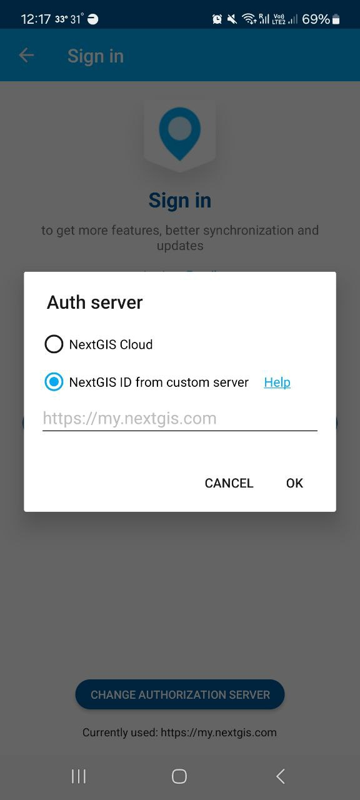

.. sectionauthor:: Roman Gainullov <roman.gainullov@nextgis.com>

.. _ngmobile_auth:

Authorization 
=============

Via my.nextgis.com
-------------------

If you are a "regular" user, here's what you do to sign in:

1. Create an account at https://my.nextgis.com, confirm it.
2. In the app enter your e-mail or username and password set during registration.

Via on-premise (NGIDOP)
-----------------------

If your company has NextGIS Web and NextGIS ID deployed on-premise, you need to change authorization server in the settings.

For authorization in NextGIS Mobile via on-premise, enter the appropriate NextGIS ID address in the authorization settings (Menu -> Settings -> Account -> Sign in -> Change authorization server) (:numref:`ngm_ngidop_en`). Select "NextGIS ID from custom server" and enter the address.

If you're already logged in with my.nextgis.com - log out first, select the correct server, then log in again.

   
   Adding your own authorization server in NextGIS Mobile
