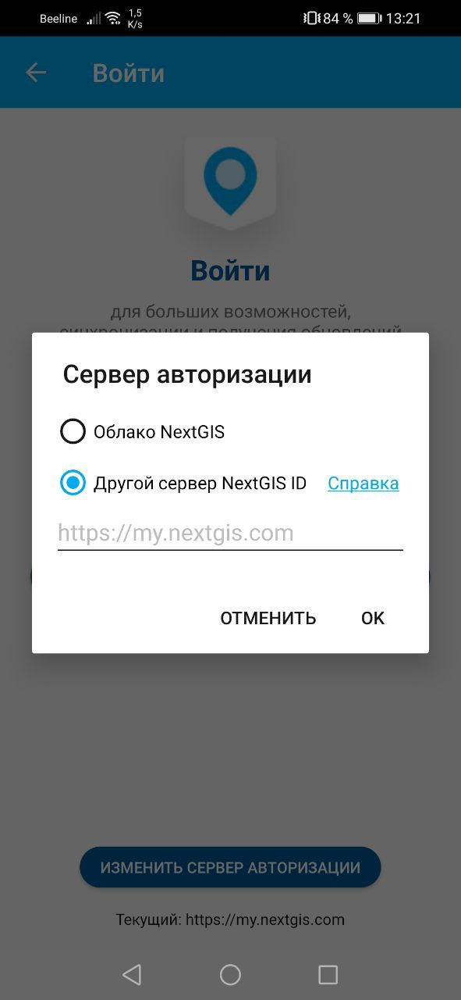

.. sectionauthor:: Роман Гайнуллов <roman.gainullov@nextgis.com>

.. _ngmobile_auth:

Вход и авторизация
==================

Через my.nextgis.com
--------------------
Если вы "обычный" пользователь, то для входа нужно:

1. Зарегистрироваться на https://my.nextgis.com, подтвердить учетную запись
2. Ввести E-mail или имя пользователя и пароль, указанные при регистрации для входа.

Через собственный сервер (NGIDOP)
---------------------------------
Если у вашей организации установлены NextGIS Web и NextGIS ID на своём сервере, то в приложении нужно указать другой сервер авторизации.

Для авторизации в NextGIS Mobile через сервер организации необходимо указать соответствующий адрес NextGIS ID в настройках авторизации (Меню -> Настройки -> Учетная запись -> Войти -> Изменить сервер авторизации) (см. :numref:`ngm_ngidop`). Выберите "Другой сервер NextGIS ID" и введите адрес.

Если вы перед этим уже вошли через my.nextgis.com - необходимо выйти, указать свой сервер и повторить вход.

   
   Добавление собственного сервера авторизации в NextGIS Mobile

После установки сервера авторизации для входа нужно ввести имя и пароль пользователя, созданные для вас администратором.
