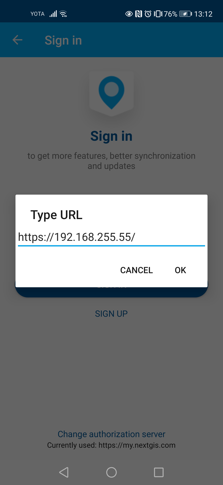

.. sectionauthor:: Roman Gainullov <roman.gainullov@nextgis.com>

.. _ngmobile_auth:

Authorization 
=============

Via on-premise (NGIDOP)
-----------------------

For authorization in NextGIS Mobile via on-premise, specify the appropriate Endpoint in the authorization settings (Menu -> Settings -> Account -> Sign in -> Change authorization server) (:numref:`ngm_ngidop_en`). If you're already logged in with my.nextgis.com - log out first.

   
   Adding your own authorization server in NextGIS Mobile
