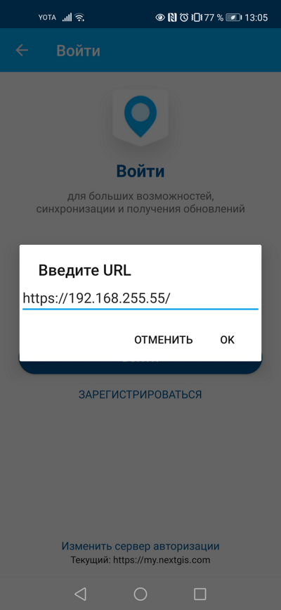

.. sectionauthor:: Роман Гайнуллов <roman.gainullov@nextgis.com>

.. _ngmobile_auth:

Авторизация
===========

Через собственный сервер (NGIDOP)
---------------------------------

Для авторизации в NextGIS Mobile через локальный сервер необходимо указать соответствующий Endpoint в настройках авторизации (Меню -> Настройки -> Учетная запись -> Войти -> Изменить сервер авторизации) (см. :numref:`ngm_ngidop`)

   
   Добавление собственного сервера авторизации в NextGIS Mobile

