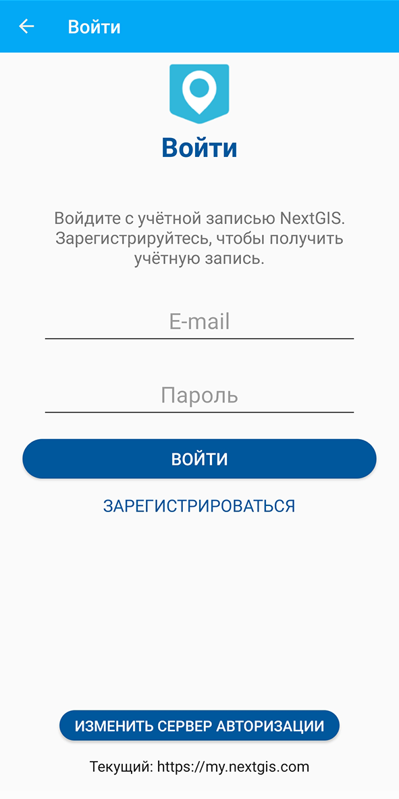
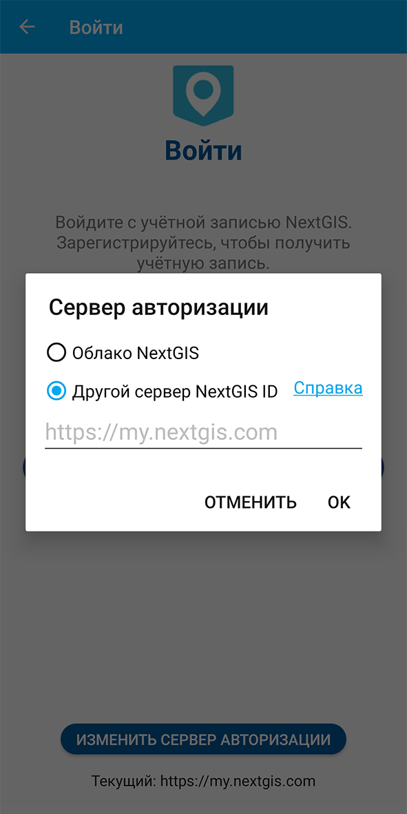

.. _ngmobile_auth:

Вход и авторизация
==================

Для авторизации в приложении используется аккаунт NextGIS ID.

Как создать аккаунт NextGIS ID?

* Если вы "обычный" пользователь, вам нужно `зарегистрироваться на https://my.nextgis.com <https://docs.nextgis.ru/docs_ngcom/source/create.html#nextgis-id>`_, затем `ввести <https://docs.nextgis.ru/docs_ngmobile/source/auth.html#auth-standard>`_ данные своей учётной записи в приложении.

* Доступ к Веб ГИС, развёрнутым на собственном сервере, осуществляется при помощи `NextGIS ID on-premise <https://docs.nextgis.ru/docs_ngid/source/ngidop.html>`_. Пользователи получают от администратора системы логины и пароли для авторизации `в приложении <https://docs.nextgis.ru/docs_ngmobile/source/auth.html#auth-onprem>`_.

.. _auth_standard:

Через NextGIS ID
--------------------

Для входа в приложение введите адрес электронной почты и пароль, указанные при регистрации на my.nextgis.com.

   Экран авторизации

.. _auth_onprem:

Через собственный сервер (NGIDOP)
---------------------------------

Если у вашей организации установлены `NextGIS Web <https://docs.nextgis.ru/docs_ngweb/source/ngw_op.html>`_ и `NextGIS ID <https://docs.nextgis.ru/docs_ngid/source/ngidop.html>`_ на своём сервере, то в приложении нужно указать соответствующий сервер авторизации.

Текущий сервер указан внизу экрана. Для стандартного входа используется https://my.nextgis.com. Чтобы выбрать другой, нажмите **Изменить сервер авторизации**.

   
   Добавление собственного сервера авторизации в NextGIS Mobile

Откроется всплывающее окно. В нём переключитесь на вариант "Другой сервер NextGID ID" и введите адрес сервера авторизации вашей организации. Затем нажмите **ОК**.

Внизу экрана должен теперь отображаться введённый адрес сервера организации.

Для входа введите имя и пароль пользователя, созданные для вас администратором.

.. note:: Если вы перед этим уже авторизовались через NextGIS ID, необходимо выйти, изменить сервер авторизации и войти под другой учётной записью.
