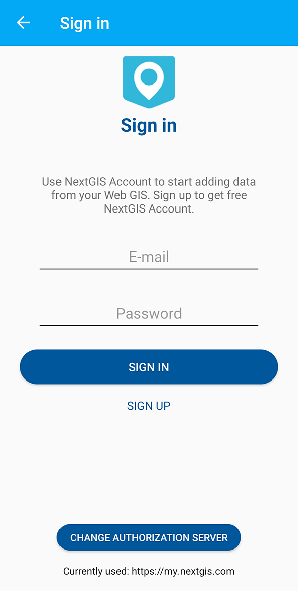
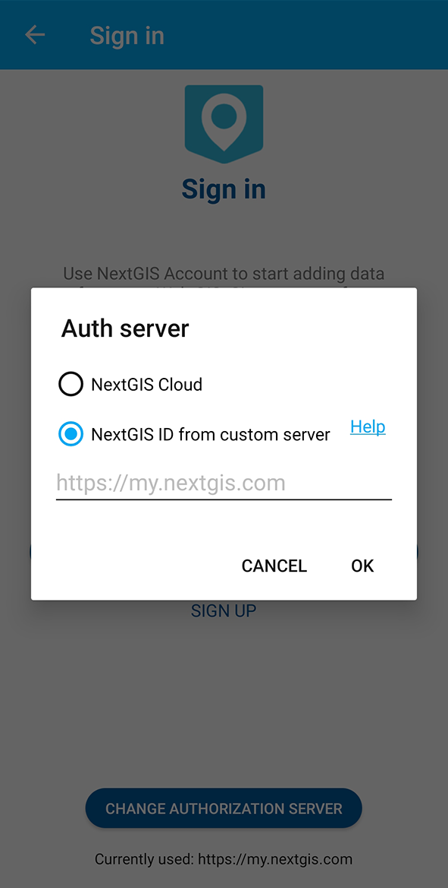

.. _ngmobile_auth:

Authorization 
=============

To log in to the app use your NextGIS ID.

How to create a NextGID ID account?

* If you are a "regular" user, `sign up on https://my.nextgis.com <https://docs.nextgis.com/docs_ngcom/source/create.html#nextgis-id>`_. Then enter the email you used and password set during registration `in the app <https://docs.nextgis.com/docs_ngmobile/source/auth.html#auth-standard>`_.
* To access Web GIS deployed on the company's server you need a login and password combination provided by the system administrator. Before entering them, `set your authorization server <https://docs.nextgis.com/docs_ngmobile/source/auth.html#auth-onprem>`_.

.. _auth_standard:

Via NextGIS ID
-------------------

Enter the app enter your e-mail or username and password set during registration on my.nextgis.com.

   Authorization

.. _auth_onprem:

For on-premise (via NextGIS ID on-premise)
-------------------------------------------

If your company has `NextGIS Web <https://docs.nextgis.com/docs_ngweb/source/ngw_op.html>`_ and `NextGIS ID <https://docs.nextgis.com/docs_ngid/source/ngidop.html>`_ deployed on-premise, you need to change authorization server in the settings.

Current authorization server is displayed at the bottom of the screen. For standard NextGIS ID authentication it's https://my.nextgis.com. To set a different one, click **Change authorization server**.

   
   Adding your own authorization server in NextGIS Mobile

A pop-up window appears. Switch to **NextGIS ID from custom server**, then enter the URL provided by the administrator. Click **OK** to complete.

Now at the bottom of the screen you'll see your company's authorization server.

Enter login and password provided by the administrator to log in to the app.

.. note:: If you're already logged in with cloud NextGIS ID, log out first, select the correct server, then log in again.