Оптимальные настройки NextGIS Mobile/Collector/Tracker
=======================================================

Эти настройки помогут сделать работу с мобильным ПО NextGIS максимально производительной, исключить потерю данных при трекинге и синхронизации. 

Для разных смартфонов процесс настройки и интерфейс может отличаться (а также меняться, например, в зависимости от уровня заряда устройства), но генеральная линия у всех моделей и производителей примерно одинаковая.

Для проверки или изменения настроек зайдите в Настройки, найдите Список приложений и выберите в нём нужное приложение: NextGIS Mobile/Collector/Tracker.

Ниже мы приводим примеры этих настроек для нескольких распространённых моделей сматрфонов. 

.. _permissions_settings:

Какие права / разрешения нужно выдать приложению
---------------------------------------------------

Для корректной работы мобильным приложениям NextGIS требуются следующие **права**:

* Доступ к контактам - для хранения данных учётной записи;
* Доступ к файлам и памяти устройства - для хранения данных и прикрепления вложений;
* Доступ к местоположению - для добавления объектов по GPS и записи треков.

Эти разрешения приложение запросит при установке.

Для **записи треков** также понадобится:

* Разрешение на использование геолокации в фоновом режиме, то есть не только во время использования приложения, а **в любое время**.

Кроме того, запись трека может **прерываться** из-за настроек оптимизации энергопотребления. Чтобы избежать этого:

* Отключите автоматическое управление запуском.

Оптимизация заряда батареи по умолчанию включена. Для эффективной работы приложений в фоновом режиме её нужно принудительно отключать. 

.. important:: Иногда некоторые настройки (например, при обновлении приложения, обновлении ОС и т.д.) возвращаются, и их снова необходимо отключить.

.. _device_examples:

Где это настроить на моём устройстве
-------------------------------------

В общем случае вам нужно зайти в Настройки, перейти к Списку приложений и выбрать там нужное приложение. Здесь приведены примеры настроек для следующих сматрфонов: 

* Huawei
* Honor
* Samsung
* POCO
* Nothing
* Xiaomi

Huawei
~~~~~~~~

Модели: P30

Симптомы: **прерывается запись трека**.

*Settings -> Apps -> Apps -> Mobile/Collector/Tracker -> Power usage details -> Launch settings - Manage automatically*

Выключить (вложенные переключатели оставить включенными)

и

*Settings -> Apps -> App launch -> Mobile/Collector/Tracker*

Выключить (вложенные переключатели оставить включенными)

*Settings -> Apps -> Apps -> Mobile/Collector/Tracker -> Permissions -> Location -> Allow all the time*

Разрешить постоянный доступ к местоположению

Honor
~~~~~~

Модели: 8x

Настройки - Приложения - Приложения - NextGIS Mobile/Collector

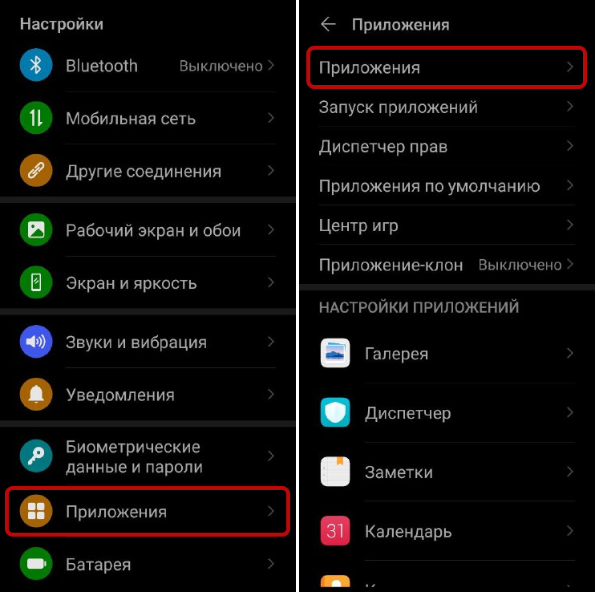

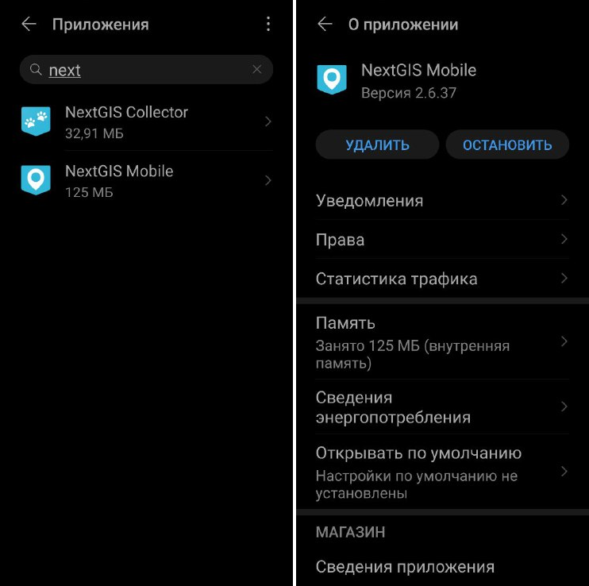

   Здесь нас интересуют два раздела: Права и Сведения энергопотребления

**Права**

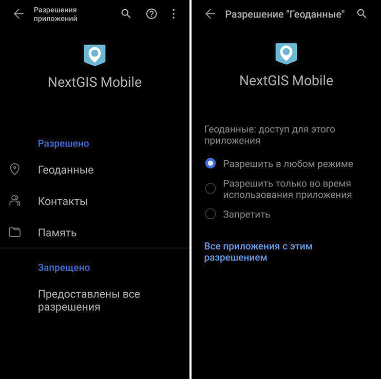

**Оптимизация батареи**

Выключить (вложенные переключатели оставить включенными)

Settings - Apps - Apps - NextGIS Mobile/Collector - Power usage details - App launch -  Manage automatically
Настройки - Приложения - Приложения - NextGIS Mobile/Collector - Сведения энергопотребления - Запуск приложений - Автоматическое управление
 
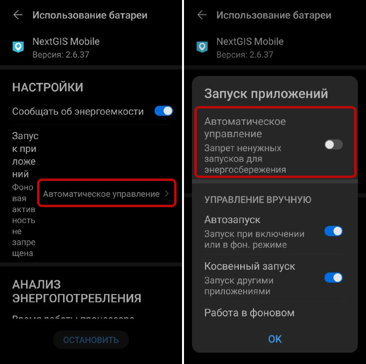

   Отключение автоматического управления энергопотреблением в настройках приложения
  
или

Выключить (вложенные переключатели во всплывающем окне оставить включенными)

Settings - Apps - App launch - NextGIS Mobile/Collector
Настройки - Приложения - Запуск приложений - NextGIS Mobile/Collector - Автоматическое управление

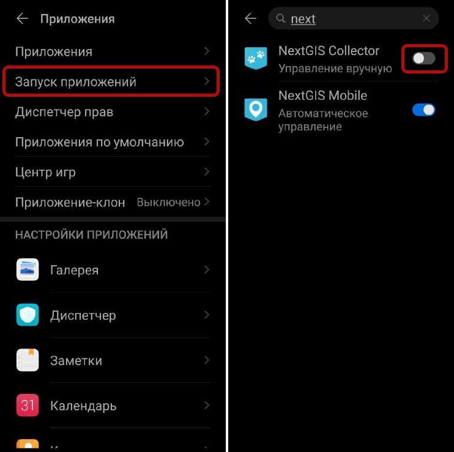

   Отключение автоматического управления энергопотреблением в списке приложений

Samsung
~~~~~~~~

Выполните следующие действия, чтобы приложения не переходили в спящий режим:

* Отключить Перевод неиспользуемых приложений в спящий режим
* Отключить автоматическое отключение неиспользуемых приложений
* Удалите свое приложение из списка спящих приложений
* Отключите фоновые ограничения для вашего приложения

Откройте раздел **Обслуживание устройства** в настройках смартфона

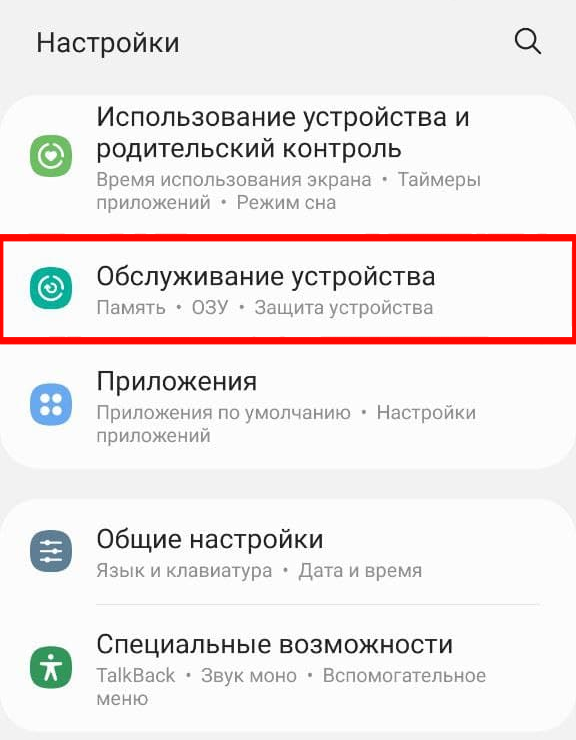

Нажмите на **Батарею**

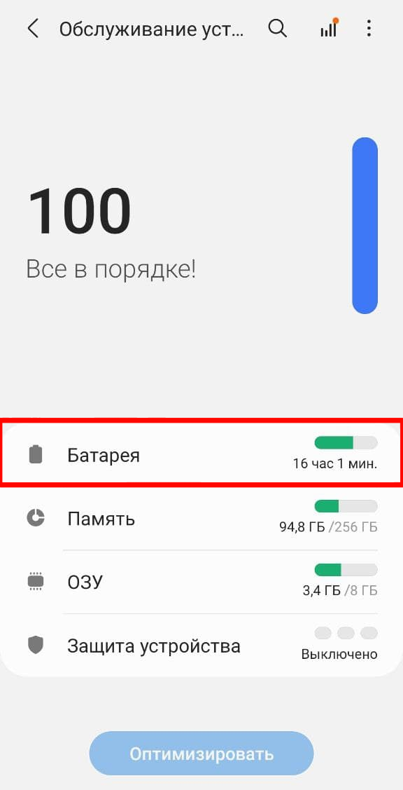

Отключите Режим энергосбережения. Перейдите в **Ограничения в фоновом режиме**.

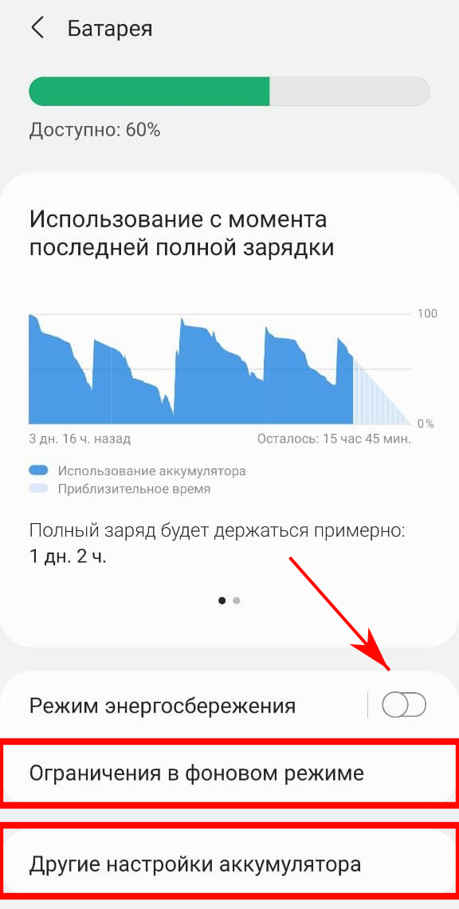

Отключите Перевод в режим сна. Перейдите в раздел **Приложения в режиме сна**.

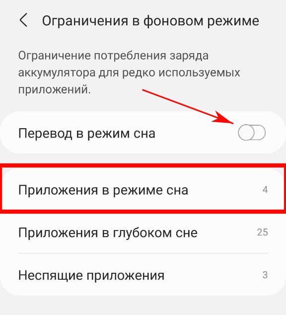

“Разбудите” приложения NextGIS, удалив из списка.

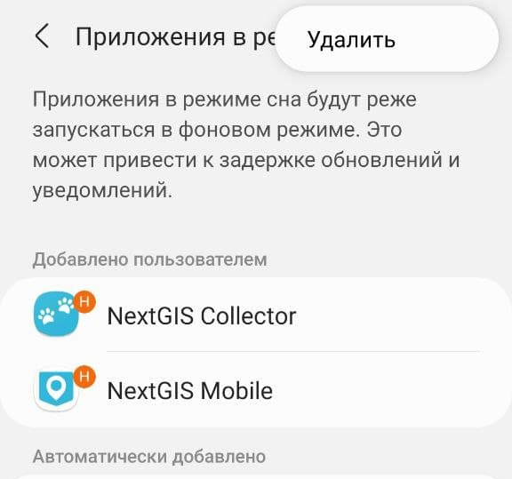

.. warning:: Убедитесь, что выключена функция Перевода в режим сна. В противном случае Samsung вернет ваши приложения в спящий режим через несколько дней (по умолчанию - 3), даже если вы удалили их вручную!

Вернитесь на шаг назад в настройки батареи (:numref:`samsung_battery`) и перейдите в **Другие настройки аккумулятора**. Отключите Адаптивный режим аккумулятора.

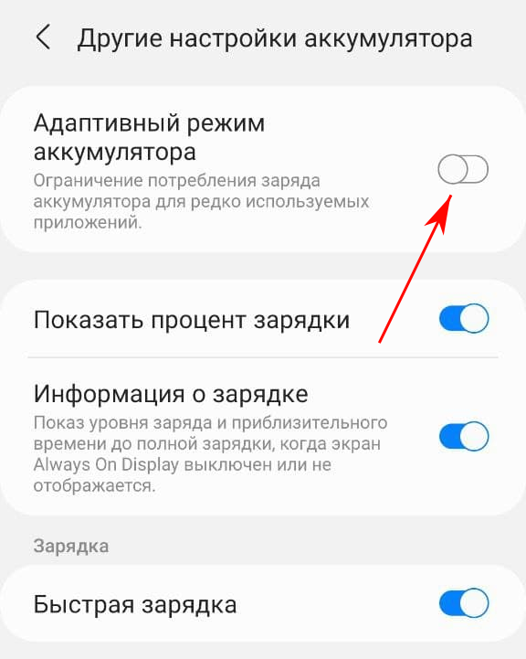

POCO
~~~~~

**Оптимизация батареи**:

Настройки - Приложения - Все приложения - NextGIS Tracker:
Приостановить работу приложения, если оно не используется - выкл

Настройки - Приложения - Все приложения - NextGIS Tracker - Контроль активности - Нет ограничений

Настройки - Батарея - Дополнительные функции - Сценарии:
Режим сна - выкл

**Разрешения и повышение точности геолокации**:

Настройки - Приложения - Все приложения - NextGIS Tracker - Разрешения приложений - Местоположение - Разрешить в любом режиме
Использовать точное местоположение - вкл

Настройки - Местоположение - Сервисы геолокации - Точность геолокации:
Более точное определение местоположения - вкл

Настройки - Местоположение - Сервисы геолокации - Поиск сетей Wi-Fi:
Поиск сетей Wi-Fi - вкл

Nothing
~~~~~~~~~~

**Оптимизация батареи**:

Настройки - Приложения - NextGIS Tracker - Расход заряда батареи для приложений - Без ограничений

Настройки - Батарея:
Оптимизация режима ожидания - выкл

**Разрешения и повышение точности геолокации**:

Настройки - Приложения - NextGIS Tracker - Разрешения - Местоположение - Разрешить в любом режиме:
Точное местоположение - вкл

Настройки - Приложения - NextGIS Tracker - Мобильный интернет и Wi-Fi:
Фоновый режим - вкл

Xiaomi
~~~~~~~

Модель: серия Mi

**Оптимизация батареи**:

Настройки - Приложения и уведомления - NextGIS Tracker - Батарея - Экономия заряда батареи - Все приложения - NextGIS Tracker - Не экономить

**Разрешения и повышение точности геолокации**:

Настройки - Приложения и уведомления - NextGIS Tracker - Разрешения - Местоположение - Разрешить в любом режиме

Настройки - Приложения и уведомления - NextGIS Tracker - Мобильный интернет и Wi-Fi:
Фоновый режим - вкл
