.. sectionauthor:: Дмитрий Барышников <dmitry.baryshnikov@nextgis.ru>

.. _ngmobile_editing:

Редактирование
==============

Если к карте были добавлены один или несколько векторных слоёв, то их можно 
редактировать. При редактировании предоставляются возможности:

1. Добавить новый объект в слой.
2. Удалить объект.
3. Изменить объект.

Существует несколько способов перейти в режим редактирования. 

Первый способ: открыть список слоёв и в меню соответствующего векторного слоя выбрать "Редактировать".

Второй способ: нажать на основную кнопка приложения (большая синяя кнопка в правом 
нижнем углу или основная кнопка приложения (т.н. FAB). При нажатии на кнопку открывается 
меню наиболее часто используемых действий (см. :numref:`ngmobile_edit_menu_pic`).

.. figure:: _static/edit_menu.png
   :name: ngmobile_edit_menu_pic
   :align: center
   :width: 6cm
   
   Меню редактирования.

Меню имеет следующий состав:

1. Добавить линию или полигон обходом.
2. Добавить геометрию.
3. Добавить текущее местоположение.

Третий способ: это долгим нажатием на геометрию на экране вызвать режим выбора 
(см. :numref:`ngmobile_selectmode_pic`) и в нижней панели инструментов активировать 
команду "Редактировать".

Создание объекта
----------------

Для добавления геометрии в векторный слой, необходимо выбрать пункт меню, которому 
соответствует иконка с изображением карандаша (см. :numref:`ngmobile_edit_menu_pic`). 
При этом, вначале открывается диалог выбора слоев (см. :numref:`ngmobile_select_layer_dialogtch_pic`). 
В зависимости от типа геометрии выбранного слоя отображаются соответствующие панели 
инструментов редактора. Таким образом можно добавлять любые типы геометрий 
(точки, линии, полигоны, мультиточки, мультилинии, мультиполигоны).

.. figure:: _static/select_layer_dialogtch.png
   :name: ngmobile_select_layer_dialogtch_pic
   :align: center
   :width: 6cm
   
   Диалог выбора слоя.

Создание точки
^^^^^^^^^^^^^^

Для добавления в слой точки следует выбрать из дерева слоев векторный слой с 
типом геометрии - точка (см. :numref:`ngmobile_select_layer_dialogtch_pic`).
После выбора слоя внизу экрана откроется панель инструментов редактирования. 
Для добавления точки необходимо выбрать на нижней панели инструментов кнопку под 
цифрой 3  (см. :numref:`ngmobile_edit_paneltch_pic`).

.. figure:: _static/ngmobile_edit_point.png
   :name: ngmobile_edit_paneltch_pic
   :align: center
   :width: 8cm
   
   Панель инструментов редактирования точки. 

   Цифрами обозначено: 1 - завершение режима редактирования; 2 - отмена правок; 
   3 - добавить новую точку; 4 - удалить точку; 5 - переместить точку в центр экрана; 
   6 - переместить точку в текущее местоположение; 7 - редактирование атрибутов.

На карте появится новая точка, которая будет создана в центре экрана и подсвечена 
красным цветом, рядом с точкой будет отображена стрелка 
(см. :numref:`ngmobile_creation_of_points_pic`).

.. figure:: _static/creation_of_points.png
   :name: ngmobile_creation_of_points_pic
   :align: center
   :width: 6cm

   Этап создания точки. 

При добавлении новой точки в нижней панели инструментов кнопка 1 изменит 
изображение с "галочки" на "дискету". При нажатии на эту кнопку произойдет 
сохранение созданной точки и откроется форма ввода атрибутов 
новой геометрии (см. :numref:`ngmobile_input_form_attributes_pic`).

.. figure:: _static/input_form_attributes.png
   :name: ngmobile_input_form_attributes_pic
   :align: center
   :width: 6cm
   
   Форма ввода атрибутов геометрии.

Создание линии
^^^^^^^^^^^^^^

Для создания линии следует выбрать из дерева слоев векторный слой с типом 
геометрии - линия (см. :numref:`ngmobile_select_layer_dialogtch_pic`). После 
выбора слоя внизу экрана откроется панель инструментов редактирования. 
Для добавления линии необходимо выбрать на нижней панели инструментов кнопку под 
цифрой 3 (см. :numref:`ngmobile_edit_line1_pic`).

.. figure:: _static/ngmobile_edit_line.png
   :name: ngmobile_edit_line1_pic
   :align: center
   :width: 8cm
   
   Панель инструментов редактирования линии.
   
   Цифрами обозначено: 1 - завершение режима редактирования; 2 - отмена правок; 
   3 - добавить новую линию; 4 - удалить линию; 5 - удалить точку из линии; 
   6 - переместить точку в центр экрана; 7 - переместить точку в текущее местоположение; 
   8 - редактирование атрибутов.

На карте появится новая линия, которая будет создана в центре экрана. 
Одна из точек линии, которую можно перемещать по слою на карте, подсвечена красным 
цветом. Рядом с этой точкой будет отображена стрелка (см. :numref:`ngmobile_creating_lines_pic`).

.. figure:: _static/creating_lines.png
   :name: ngmobile_creating_lines_pic
   :align: center
   :width: 6cm

   Этап создания линии в слое.

При появлении новой линии на карте на нижней панели инструментов кнопка 1 изменит 
изображение с "галочки" на "дискету". При нажатии на эту кнопку произойдет сохранение 
созданной линии и откроется форма ввода атрибутов новой геометрии (см. :numref:`ngmobile_input_form_attributes_pic`)

Создание полигона
^^^^^^^^^^^^^^^^^

Для создания на слое полигона следует выбрать из дерева слоев векторный слой для 
добавления полигональной геометрии (см. :numref:`ngmobile_select_layer_dialogtch_pic`).

Для добавления полигона в векторный слой необходимо в открывшемся окне в режиме 
редактирования полигона выбрать на нижней панели инструментов редактирования полигона 
кнопку под цифрой 3 (см :numref:`ngmobile_edit_polygon1_pic`).

.. figure:: _static/ngmobile_edit_polygon.png
   :name: ngmobile_edit_polygon1_pic
   :align: center
   :width: 8cm
   
   Панель инструментов редактирования полигона.
   
   Цифрами обозначено: 1 - завершение режима редактирования; 2 - отмена правок; 
   3 - добавить новый полигон; 4 - удалить полигон; 5 - удалить точку из полигона; 
   6 - переместить точку в центр экрана; 7 - переместить точку в текущее местоположение; 
   8 - редактирование атрибутов.

На карте появится новая геометрия, полигон, который будет создана в центре экрана. 
Одна из точек полигона, которую можно перемещать по слою на карте, подсвечена красным 
светом, рядом с этой точкой будет отображена стрелка. Выделение любой точки полигона 
позволяет ее перемещать по карте (см. :numref:`ngmobile_creation_landfill_pic`).

.. figure:: _static/creation_landfill.png
   :name: ngmobile_creation_landfill_pic
   :align: center
   :width: 6cm

   Этап создания полигона в слое.     

В результате появление нового полигона на карте на нижней панели инструментов редактирования 
полигона кнопка под цифрой 1 изменит изображение с галочки на дискету. При нажатии на 
кнопку под цифрой 1 с иконкой в виде дискеты сохраняется созданный полигон и открывается 
форма ввода атрибутов новой геометрии. 
Форма ввода атрибутов для нового полигона выглядит следующим образом (см. :numref:`ngmobile_input_form_attributes_pic`).

Создание мультиточки
^^^^^^^^^^^^^^^^^^^^

Для добавления мультиточки в векторный слой необходимо перейти в режим редактирования
мультиточки (иконка с изображением карандаша), выбрать на нижней панели инструментов 
редактирования мультиточки кнопку под цифрой 3. Нижняя панель инструментов редактирования 
мультиточки представлена на :numref:`ngmobile_edit_multipoint_pic`.

.. figure:: _static/ngmobile_edit_multipoint.png
   :name: ngmobile_edit_multipoint_pic
   :align: center
   :width: 8cm
   
   Панель инструментов редактирования мультиточки.
   
   Цифрами обозначено: 1 - завершение режима редактирования; 2 - отмена правок; 
   3 - добавить новую мультиточку; 4 - добавить точку к мультиточке; 5 - удалить 
   мультиточку; 6 - удалить точку из мультиточки; 7 - переместить точку в центр 
   экрана; 8 - переместить точку в текущее местоположение; 9 - редактирование атрибутов.

Для добавления в слой мультиточки следует выбрать из дерева слоев векторный слой для 
добавления точечной геометрии (см. :numref:`ngmobile_select_layer_dialogtch_pic`).

На карте появится новая геометрия, мультиточка, которая будет создана в центре 
экрана и подсвечена красным светом, рядом с точкой будет отображена стрелка (см. :numref:`ngmobile_phase_of_the_multipoint_pic`).

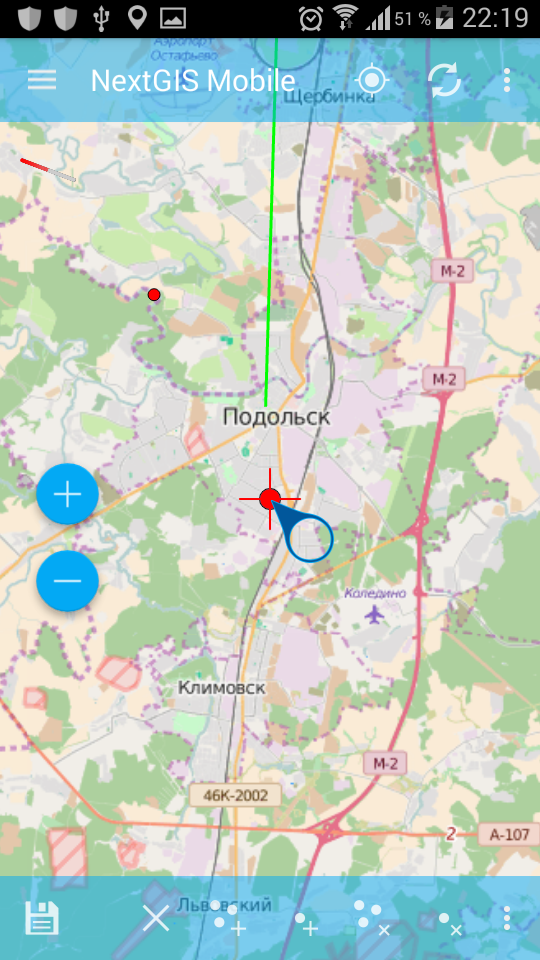

   Этап создания мультиточки в слое. 

При появлении новой мультиточки на карте на нижней панели инструментов редактирования 
мультиточки кнопка под цифрой 1 изменит изображение с галочки на дискету (см. :numref:`ngmobile_toolbar_multi_pic`).

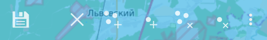
  
   Панель инструментов редактирования на этапе создания и сохранения мультиточки. 

При нажатии на кнопку под цифрой 1 с иконкой в виде дискеты сохраняется созданная 
мультиточка и открывается форма ввода атрибутов новой геометрии (см. :numref:`ngmobile_input_form_attributes_pic`).

Создание мультилинии
^^^^^^^^^^^^^^^^^^^^

Для добавления мультилинии в векторный слой необходимо в открывшемся окне в режиме 
редактирования мультилинии выбрать на нижней панели инструментов редактирования 
мультилинии кнопку под цифрой 3 (см. :numref:`ngmobile_toolbar_multiline_pic`).

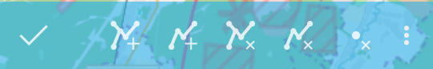
   
   Панель инструментов редактирования мультилинии.
   
   Цифрами обозначено: 1 - завершение режима редактирования; 2 - отмена правок; 
   3 - добавить новую мультилинию; 4 - добавить линию; 5 - удалить мультилинию; 
   6 - удалить линию; 7 - редактирование атрибутов.

Для создания на слое мультилинии следует выбрать из дерева слоев векторный слой для 
добавления линейной геометрии (см. :numref:`ngmobile_select_layer_dialogtch_pic`)

На карте появится новая геометрия, мультилиния, которая будет создана в центре 
экрана. Одна из точек мультилинии, которую можно перемещать по слою на карте, 
подсвечена красным светом, рядом с этой точкой будет отображена стрелка (см. :numref:`ngmobile_creating_multiline_pic`).

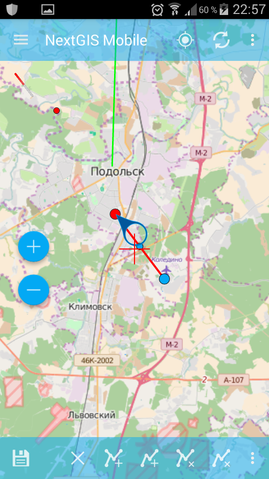

   Этап создания мультилинии в слое.

При появлении новой мультилинии на карте на нижней панели инструментов редактирования 
линии кнопка под цифрой 1 изменит изображение с галочки на дискету (см. :numref:`ngmobile_toolbar_multiline1_pic`).

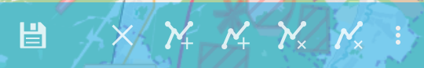

   Панель инструментов редактирования на этапе создания и сохранения мультилинии. 

При нажатии на кнопку под цифрой 1 с иконкой в виде дискеты сохраняется созданная 
мультилиния и открывается форма ввода атрибутов новой геометрии. Форма ввода атрибутов 
для новой мультилинии имеет следующий вид (см. :numref:`ngmobile_input_form_attributes_pic`).

Создание мультиполигона
^^^^^^^^^^^^^^^^^^^^^^^^

Для создания на слое мультиполигона следует выбрать из дерева слоев векторный слой для 
добавления полигональной геометрии (см. :numref:`ngmobile_tree_layers_mpolig_pic`)

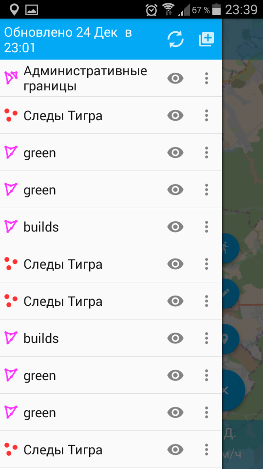

   Диалог выбора слоя.

Для добавления мультиполигона в векторный слой необходимо в открывшемся окне в режиме 
редактирования мультиполигона выбрать на нижней панели инструментов редактирования 
мультиполигона кнопку под цифрой 2 (см :numref:`ngmobile_toolbar_mpolyg_pic`).

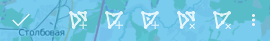
   
   Панель инструментов редактирования мультиполигона.
   
   Цифрами обозначено: 1 - завершение режима редактирования; 2 - добавить новый 
   мультиполигон; 3 - добавить полигон; 4 - добавить внутреннее кольцо в полигон; 5 - удалить мультиполигон; 6 - удалить 
   полигон; 7 - редактирование атрибутов.

На карте появится новая геометрия, мультиполигон, которая будет создана в центре 
экрана. Одна из точек мультиполигона, которую можно перемещать по слою на карте, 
подсвечена красным светом, рядом с этой точкой будет отображена стрелка. Выделение 
любой точки мультиполигона позволяет ее перемещать по карте (см. :numref:`ngmobile_creating_mpolyg_pic`).

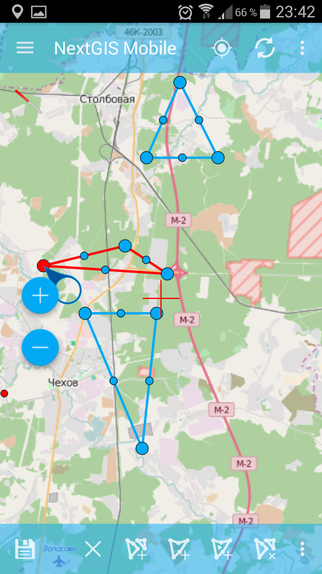

   Этап создания мультиполигона.    

В результате появление нового мультиполигона на карте на нижней панели инструментов 
редактирования мультиполигона кнопка под цифрой 1 изменяет изображение с галочки 
на дискету, а также добавляется кнопка в виде крестика, "Отмена правок", находящаяся 
на нижней панели инструментов редактирования мультиполигона под цифрой 2 (см. :numref:`ngmobile_toolbar_mpolyg1_pic`).

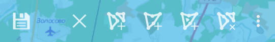

   Панель инструментов редактирования на этапе создания и сохранения мультиполигона.

При нажатии на кнопку под цифрой 1 с иконкой в виде дискеты сохраняется созданный 
мультиполигон и открывается форма ввода атрибутов новой геометрии. 
Форма ввода атрибутов для созданного мультиполигона выглядит следующим образом (см. :numref:`ngmobile_input_form_attributes_pic`).

Добавление текущего местоположения
----------------------------------

Для добавления текущего местоположения в векторный слой, необходимо выбрать 
пункт меню, которому соответствует иконка с изображением пушпина (см. :numref:`ngmobile_edit_menu_pic`).  
При этом, в начале открывается диалог выбора слоя, в котором отображаются только 
точечные и мультиточечные слои (см. :numref:`ngmobile_select_layer_dialog_pic`). 
Таким образом можно добавлять только точки или мультиточки с одной точкой. 

.. figure:: _static/ngmobile_selectlayer.png
   :name: ngmobile_select_layer_dialog_pic
   :align: center
   :width: 6cm
   
   Диалог выбора слоя.

Создание линии или полигона обходом
-----------------------------------

Для добавления линии или полигона обходом необходимо выбрать соответствующий 
пункт меню, которому соответствует иконка, изображенная в виде идущего человека (см. :numref:`ngmobile_edit_menu_pic`). При этом, в начале открывается диалог выбора 
слоя, в котором отображаются только линейные и полигональные слои (см. :numref:`ngmobile_select_layer_dialog_pic`). 
При старте создания линии или полигона обходом открывается нижняя панель инструментов, 
представленная на :numref:`ngmobile_edit_walk_pic1`.

.. figure:: _static/edit_panel_circumvention_tools.png
   :name: ngmobile_edit_walk_pic1
   :align: center
   :width: 6cm
   
   Панель инструментов редактирования обходом.

Далее при накоплении минимального количества точек (для линии - две точки, для 
полигона - три точки) нижняя панель инструментов примет следующий вид :numref:`ngmobile_edit_walk_pic`.

.. figure:: _static/ngmobile_edit_walk.png
   :name: ngmobile_edit_walk_pic
   :align: center
   :width: 6cm
   
   Панель инструментов редактирования обходом.
   
   Цифрами обозначено: 1 - сохранение введенной фигуры; 2 - отмена режима ввода 
   обходом; 3 - настройки ввода обходом.

После завершения обхода при выборе сохранения введенной геометрии (см. :numref:`ngmobile_edit_walk_pic`), 
путем нажатия на иконку с изображением дискеты, открывается форма ввода (стандартная 
или настраиваемая, см. :numref:`ngmobile_attributes_edit_pic`). 

Если отменить сохранение геометрии, путем нажатия на кнопку под цифрой 2 на нижней 
панели инструментов, программа возвращается в режим редактирования выбранного 
полигонального слоя.

Если в ходе обхода вызвать меню настройки, путем нажатия на кнопку под цифрой 3 на 
нижней панели инструментов, то откроется окно настроек, представленное на :numref:`ngmobile_settings_place_pic`. 
Изменения, внесенные в этом окне, влияют не только на ввод обходом, но и на отображение 
текущего местоположения.

.. note::
   При выборе настроек местоположения таким образом (минимальное время обновления 
   2 сек. и более, минимальное расстояние для обновления 10 м и более) 
   операционная система начинает фильтровать выбросы.
   

Изменение геометрии
-------------------

Для того чтобы перейти в режим редактирования имеющейся геометрии, необходимо долго
удерживать палец на геометрии векторного слоя. В результате такого действия окно 
карты переходит в режим выбора действия (см. :numref:`ngmobile_selectmode_pic`). 

.. figure:: _static/ngmobile_selectmode.png
   :name: ngmobile_selectmode_pic
   :align: center
   :height: 11cm
   
   Окно карты в режиме выделения.
   
   Цифрами обозначено: 1 - выделенная геометрия; 2 - просмотр атрибутов; 3 - удаление 
   геометрии; 4 - редактирование геометрии; 5 - завершение режима выделения.

Если открыта информационная панель, то она будет скрыта, и на ее месте будет выведена 
нижняя панель инструментов, которая имеет в своем составе команду "Перейти к редактированию 
выбранной геометрии" (см. :ref:`ngmobile_editing`). Эта команда обозначена иконкой 
в виде карандаша. При нажатии на эту иконку появляется нижняя панель инструментов, 
которая содержит соответствующие имеющейся геометрии кнопки для редактирования этой геометрии.  

Редактирование точки
^^^^^^^^^^^^^^^^^^^^

В режиме редактирования точки открывается нижняя панель инструментов, 
представленная на :numref:`ngmobile_tool_point_edit_panel_pic`.

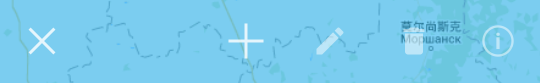
   
   Панель инструментов редактирования точки.
   
   Слева направо иконками обозначено: 1 - завершение режима редактирования; 
   2 - добавить; 3 - изменить выделенное; 4 - удаление; 5 - редактирование атрибутов.
   
Пользователь может выбрать имеющуюся точку в слое (она будет подсвечена красным 
цветом, рядом с точкой будет отображена стрелка) или создать новую (новая точка 
будет создана в центре экрана и подсвечена красным цветом, рядом с точкой будет 
отображена стрелка) см. :numref:`ngmobile_edit_mode_dot_pic`.

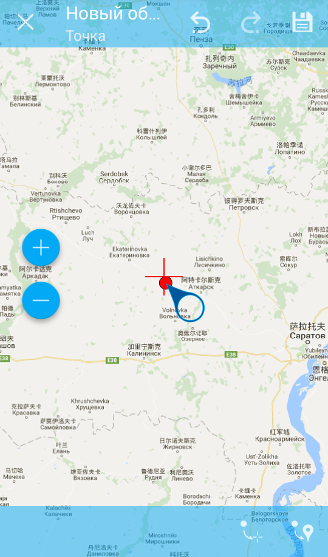

   Окно карты в режиме редактирования. Слева направо в верхней панели инструментов 
   иконками обозначено: 
   1 - завершения режима редактирования;
   2 - отмена действия;
   3 - повтор действия;
   4 - сохранение изменений.
   Слева направо в нижней панели инструментов иконками обозначено: 
   1 - переместить точку в центр экрана; 
   2 - переместить точку в текущее местоположение.
   
Выделенную точку можно смещать, просто потянув ее или потянув указывающую на нее стрелку. 
Кроме того, точку можно сместить в центр экрана (см. :numref:`ngmobile_edit_mode_dot_pic` иконка 1) 
или в текущее местоположение (см. :numref:`ngmobile_edit_mode_dot_pic` иконка 2), 
выбрав соответствующие команды в нижней панели инструментов.

По умолчанию кнопка отмены (см. :numref:`ngmobile_tool_point_edit_panel_pic` иконка 1) 
отображается только после внесения каких либо изменений.
 
Редактирование мультиточки
^^^^^^^^^^^^^^^^^^^^^^^^^^

В режиме редактирования мультиточки открывается нижняя панель инструментов, 
представленная на :numref:`ngmobile_edit_multipoint2_pic`.

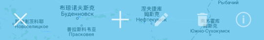
   
   Панель инструментов редактирования мультиточки. Слева направо иконками обозначено: 
   1 - завершение режима редактирования; 2 - добавить; 3 - изменить выделенное; 
   4 - удаление; 5 - редактирование атрибутов.

При редактировании мультиточки выделяются все точки в нее входящие. Текущая точка 
подсвечена красным цветом, рядом с точкой отображена стрелка (см :numref:`ngmobile_creating_multipoint3_pic`)

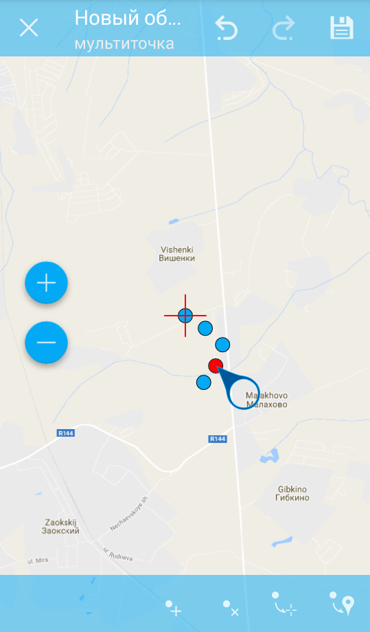

   Окно в режиме редактирования. Слева направо в верхней панели инструментов иконками 
   обозначено: 
   1 - завершения режима редактирования;
   2 - отмена действия;
   3 - повтор действия;
   4 - сохранение изменений.
   Слева направо в нижней панели инструментов иконками обозначено: 
   1 - добавить точку в состав мультиточки;
   2 - удалить точку из состава мультиточки;
   3 - переместить мультиточку в центр экрана; 
   4 - переместить мультиточку в текущее местоположение.

Панель редактирования позволяет удалить все точки из состава мультиточки или 
выбранную точку. Для того, чтобы удалить точку из состава мультиточки, следует активировать 
иконку 2 на нижней панели инструментов. Для этого следует воспользоваться иконкой 1 
на нижней панели инструментов для добавления точки/точек в состав мультиточки. Выбрать 
ту точку, которую необходимо удалить и нажать на иконку 2 на нижней панели инструментов. 

Над выбранной точкой можно выполнять операции:

* удалить точку из состава мультиточки;   
* переместить в центр экрана;
* переместить в текущие координаты.

Кроме того, можно добавить точку к мультиточке (см. :numref:`ngmobile_edit_multipoint_pic` 
п. 4).    

Редактирование линии
^^^^^^^^^^^^^^^^^^^^^

В режиме редактирования линии открывается нижняя панель инструментов, 
представленная на :numref:`ngmobile_edit_line2_pic`.

.. figure:: _static/ngmobile_edit_line2.png
   :name: ngmobile_edit_line2_pic
   :align: center
   :width: 6cm
   
   Панель инструментов редактирования линии. Слева направо иконками обозначено: 
   1 - завершение режима редактирования; 2 - добавить; 3 - изменить выделенное; 
   4 - удаление; 5 - редактирование атрибутов.
   
При редактировании линии выделяются все точки в нее входящие. Текущая точка 
подсвечена красным цветом, рядом с точкой отображена стрелка. Кроме того, между 
точками на линии отмечается центр сегмента линии. При выделении центра сегмента 
линии касанием пальца до экрана устройства, к линии добавляется новая точка и сразу
получает выделение. После добавления точки ее можно перемещать (см. :numref:`ngmobile_edit_mode_l2_pic`). 

.. figure:: _static/ngmobile_edit_mode_l2.png
   :name: ngmobile_edit_mode_l2_pic
   :align: center
   :height: 10cm  

   Окно карты в режиме редактирования. Слева направо в верхней панели инструментов 
   иконками обозначено: 
   1 - завершения режима редактирования;
   2 - отмена действия;
   3 - повтор действия;
   4 - сохранение изменений.
   Слева направо в нижней панели инструментов иконками обозначено: 
   1 - удалить точку из линии;
   2 - переместить точку на линии в центр экрана; 
   3 - переместить точку на линии в текущее местоположение.
   4 - ввод линии обходом;
   5 - дополнить геометрию касанием/свободное рисование. 

Панель редактирования позволяет удалить все точки из состава линии (удалить линию) 
или выбранную точку. Для того, чтобы удалить точку из линии, следует активировать 
иконку 1, удалить точку из линии, на нижней панели инструментов, путем касания маркера 
добавления новой точки (точка по середине линии). Далее нажатием выбираем точку из линии, 
которую необходимо удалить. Эта точка станет подсвечиваться красным цветом, рядом 
с точкой отобразится стрелка. Нажать на иконку 1 в нижней панели инструментов для 
удаления выбранной точки из линии (см. :numref:`ngmobile_selection_point_on_line_pic`). 

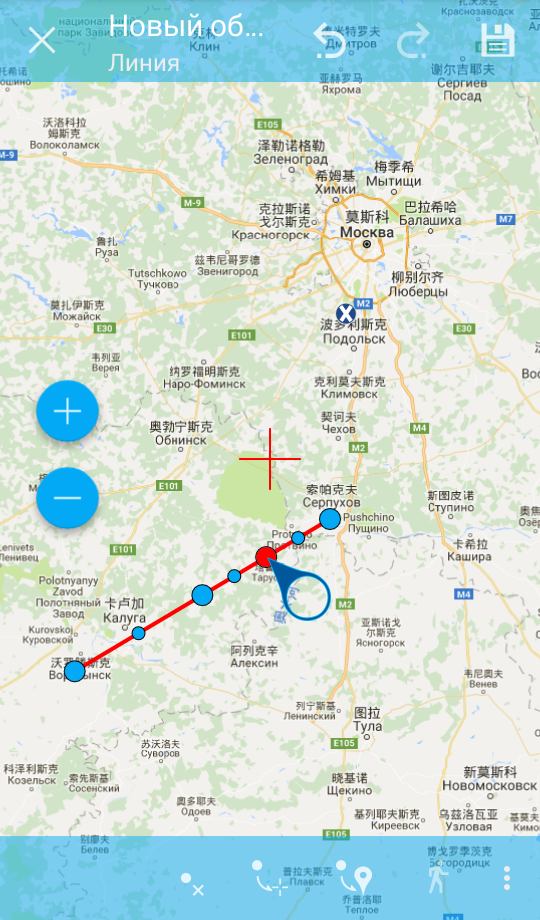

   Выбор точки на геометрии.

.. note::
   Если в линии останется одна точка, то такая линия будет удалена. 

Над выбранной точкой в линии можно выполнять операции:
    
* удалить из состава линии;
* переместить в центр экрана;
* переместить в текущие координаты.

При добавлении новой линии в центре экрана создается линия по умолчанию, которая 
состоит из двух точек. Добавляя точки, можно растягивать линию, менять ее конфигурацию.
Можно внести изменения, дополнив геометрию касанием. Для сохранения внесенных 
изменений в геометрии, следует нажать на галочку в правом углу экрана на нижней 
панели инструментов (см. :numref:`ngmobile_addition_geometry_pic`). 

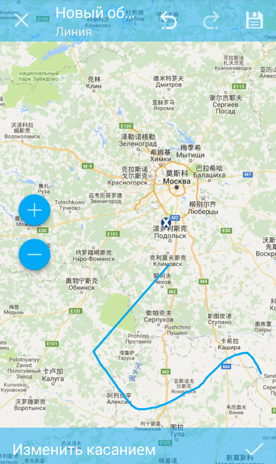

   Дополнение/изменение геометрии касанием.
 

Редактирование мультилинии
^^^^^^^^^^^^^^^^^^^^^^^^^^^

Для того чтобы перейти в режим редактирования имеющейся геометрии, необходимо долго
удерживать палец на геометрии векторного слоя. В результате такого действия окно 
карты переходит в режим выбора действия. В режиме редактирования мультилинии открывается 
нижняя панель инструментов, на которой имеется иконка в виде карандаша  
(см. :numref:`ngmobile_map_window_pic`).

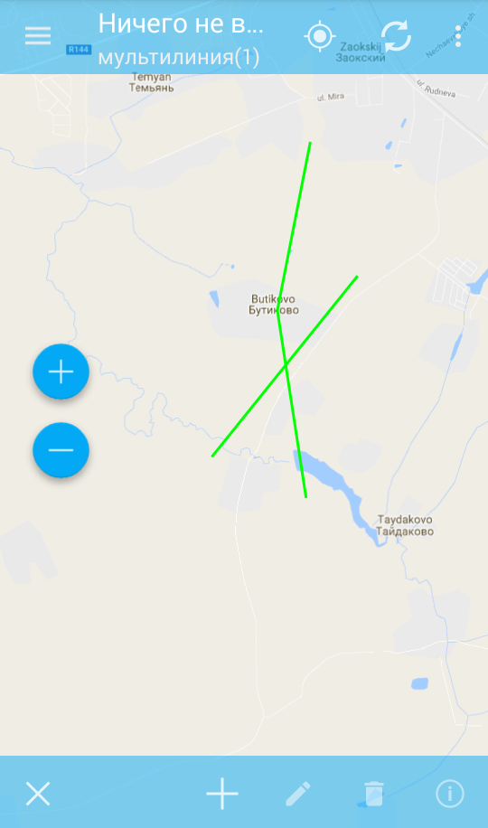

   Окно карты. 

Данная иконка предоставляет возможность перейти к редактированию выбранной на слое 
геометрии (см. :ref:`ngmobile_editing`).

При нажатии на иконку карандаша появляется нижняя панель инструментов. На нижней 
панели инструментов есть соответствующие имеющейся геометрии кнопки для редактирования 
этой геометрии. При редактировании мультилинии выделяются все точки, в нее входящие. 
Текущая точка подсвечена красным цветом, рядом с точкой отображена стрелка. 
Панель редактирования позволяет удалить все точки из состава мультилинии (удалить 
мультилинию) или выбранную точку (см. :numref:`ngmobile_map_window_in_edit_mode_pic`). 

.. figure:: _static/ngmobile_map_window_in_edit_mode.png
   :name: ngmobile_map_window_in_edit_mode_pic
   :align: center
   :height: 11cm
   
   Окно карты в режиме выделения. Слева направо в верхней панели инструментов:
   1 - завершения режима редактирования;
   2 - отмена действия;
   3 - повтор действия;
   4 - сохранение изменений.
   Слева направо в нижней панели инструментов:
   1 - добавление линии;
   2 - удаление линии;
   3 - удаление точки;
   4 - перемещение точки в центр экрана;
   5 - кнопка вызова меню.

При нажатии на кнопку вызова меню на нижней панели инструментов появляются еще варианты
для редактирования геометрии:

   1 - Точка в текущее положение;
   2 - Дополнить геометрию обходом;
   3 - Дополнить геометрию касанием.

Редактирование полигона
^^^^^^^^^^^^^^^^^^^^^^^

В режиме редактирования полигона на верхней и нижней панелях инструментов появляются 
следующие иконки, представленные на :numref:`ngmobile_polygon_editing_pic`.

.. figure:: _static/ngmobile_polygon_editing.png
   :name: ngmobile_polygon_editing_pic
   :align: center
   :width: 8cm
   
   Панели инструментов редактирования полигона.
   
   Цифрами обозначено: на верхней панели инструментов: 
   1 - завершения режима редактирования;
   2 - отмена действия;
   3 - повтор действия;
   4 - сохранение изменений.
   На нижней панели инструментов: 
   1 - добавить новый полигон; 2 - удалить полигон; 3 - удалить точку из полигона; 
   4 - переместить точку в центр экрана; 5 - кнопка вызова меню. 

При нажатии на кнопку вызова меню на нижней панели инструментов появляются еще варианты
для редактирования геометрии:

   1 - Точка в текущее положение;
   2 - Дополнить геометрию обходом;
   3 - Дополнить геометрию касанием.

При редактировании полигона выделяются все точки в него входящие (как внешней 
оболочки, так и каждого внутреннего кольца). Текущая точка подсвечена красным 
цветом, рядом с точкой отображена стрелка. Кроме того, между точками на кольце 
полигона (внешний или внутренние) отмечается центр сегмента линии. При выделении 
центра сегмента линии касанием пальца до экрана устройства, к кольцу добавляется 
новая точка и сразу получает выделение. После добавления точки ее можно перемещать 
:numref:`ngmobile_add_points_to_polygon_pic`.

.. figure:: _static/ngmobile_add_points_to_polygon.png
   :name: ngmobile_add_points_to_polygon_pic
   :align: center
   :width: 8cm
   
   Добавление новых точек в полигон.

Панель редактирования позволяет удалить все точки из состава полигона (удалить 
полигон) или выбранную точку. 

.. note::
   Если в полигоне останется всего две точки, то такой полигон будет удален. 

Над выбранной точкой в кольце полигона можно выполнять операции:
    
* удалить;
* переместить в центр экрана;
* переместить в текущие координаты.   
 
При добавлении полигона в центре экрана создается полигон по умолчанию, который 
состоит из трех точек. Добавляя точки можно растягивать внешнее кольцо полигона, 
менять его конфигурацию.

.. note::
   Поддержки добавления внутренних колец пока не реализовано.

Редактирование мультиполигона
^^^^^^^^^^^^^^^^^^^^^^^^^^^^^^

Для того чтобы перейти в режим редактирования имеющейся геометрии, необходимо долго
удерживать палец на геометрии векторного слоя. В результате такого действия окно 
карты переходит в режим выбора действия (см. :numref:`ngmobile_map_window_selection_mode2_pic`). 

.. figure:: _static/ngmobile_map_window_selection_mode2.png
   :name: ngmobile_map_window_selection_mode2_pic
   :align: center
   :height: 11cm
   
   Окно карты в режиме выделения.

В режиме редактирования мультиполигона открывается нижняя панель инструментов, на 
которой имеется иконка в виде карандаша. Данная иконка предоставляет возможность 
перейти к редактированию выбранной геометрии (см. :ref:`ngmobile_editing`). 
При нажатии на иконку карандаша появляется нижняя панель инструментов, 
которая содержит соответствующие имеющейся геометрии кнопки для редактирования 
этой геометрии (см. :numref:`ngmobile_map_window_in_edit_mode2_pic`). 

.. figure:: _static/ngmobile_map_window_in_edit_mode2.png
   :name: ngmobile_map_window_in_edit_mode2_pic
   :align: center
   :height: 11cm  

   Окно карты в режиме редактирования. Слева направо иконки на верхней панели инструментов:
   1 - завершения режима редактирования;
   2 - отмена действия;
   3 - повтор действия;
   4 - сохранение изменений.
   Слева направо иконки на нижней панели инструметов:
   1 - добавить новый полигон;
   2 - удалить новый полигон;
   3 - добавить внутреннее кольцо в полигон;
   4 - удалить внутреннее кольцо из полигона
   5 - кнопка вызова меню.
    
Панель редактирования позволяет удалить все точки из состава мультиполигона (удалить 
мультиполигон) или выбранную точку (см. :numref:`ngmobile_menu_contents_mp_pic`). 

.. figure:: _static/ngmobile_menu_contents_mp.png
   :name: ngmobile_menu_contents_mp_pic
   :align: center
   :height: 11cm   
   
   Варианты редактирования из состава меню.

Редактирование атрибутов
------------------------

Для редактирования атрибутов слоя следует выбрать необходимый слой, на экране долгим 
нажатием на картинке активировать нижнюю панель инструментов (см. :numref:`ngmobile_action_selection_mode_pic`). 

.. figure:: _static/ngmobile_action_selection_mode.png
   :name: ngmobile_action_selection_mode_pic
   :align: center
   :height: 11cm   
 
   Окно режима выбора действия.
   Слева направо иконки на нижней панели инструментов:
   1 - завершение режима редактирования;
   2 - добавление к выбранной геометрии (новой точки, новой линии и т.д.);
   3 - редактирование выбранной геометрии;
   4 - удаление выбранной части геометрии/ всей геометрии;
   5 - перейти к редактирование атрибутов выбранной геометрии.  

При нажатии на иконку 5 на нижней панели инструментов откроется окно для перехода 
в режим редактирования атрибутов (см. :numref:`ngmobile_editing_attributes_pic`). 

.. figure:: _static/ngmobile_editing_attributes.png
   :name: ngmobile_editing_attributes_pic
   :align: center
   :height: 11cm   

   Окно для перехода в режим редактирования атрибутов.
   Слева направо иконки на нижней панели инструментов:
   1 - завершение режима редактирования;
   2 - перейти в режим редактирования атрибутов выбранного слоя;
   3 - перейти к предыдущей записи в слое;
   4 - перейти к последующей записи в слое.

Для перехода в режим редактирования следует нажать на иконку 2 на нижней панели 
инструментов (см. :numref:`ngmobile_attribute_edit_window_pic`). 

.. figure:: _static/ngmobile_attribute_edit_window.png
   :name: ngmobile_attribute_edit_window_pic
   :align: center
   :height: 11cm   

   Окно в режиме редактирования атрибутов выбранной геометрии.
   Слева направо иконки на верхней панели инструментов:
   1 - возврат к окну для перехода к режиму редактирования атрибутов;
   2 - иконка в виде "галочки" - сохранение внесенных изменений
   3 - кнопка вызова меню Настройки.

Диалог изменения атрибутов представляет собой вертикальный список названий полей, 
а также кнопку с изображением фотоаппарата, которая дает возможность добавить фото 
(сделать новое фото, выбрать имеющееся фото из галереи).

После внесения необходимый изменений в атрибуты выбранной геометрии следует нажать 
иконку в виде "галочки" на верхней панели инструментов для сохранения внесенных изменений.

   
Настраиваемая форма редактирования атрибутов
^^^^^^^^^^^^^^^^^^^^^^^^^^^^^^^^^^^^^^^^^^^^   
   
Если слою сопоставлена настраиваемая форма, то будет открыта именно она. В результате 
внесения изменений и сохранения этих изменений в векторном слое происходит открытие диалога
редактирования атрибутов. Диалог редактирования атрибутов содержит следующие для ввода поля:

* Текст;
* Пробел;
* Текстовое поле;
* Список, Сдвоенный список;
* Флажок;
* Радио-кнопка;
* Пикер даты;
* Фотографии.
 
Поле информации "Текст" служит для внесения дополнительного текстового пояснения 
к информации о созданной геометрии.

Поле "Пробел" необходимо для увеличения интервала между полями (см. :numref:`ngmobile_text_probel_pic`). 

.. figure:: _static/text_probel.png
   :name: ngmobile_text_probel_pic
   :align: center
   :width: 6cm

   Поле "Текст" и "Пробел".

Поле ввода информации "Текстовое поле" - для ввода текста или цифр в зависимости от типа поля (см. :numref:`ngmobile_text_pole_pic`). 

.. figure:: _static/text_pole.png
   :name: ngmobile_text_pole_pic
   :align: center
   :width: 8cm

   Поле ввода "Текстовое поле".

Поле ввода информации "Список", "Сдвоенный список" необходим для хранения и быстрого
выбора одного из значений, входящих в список выбора, например "Список" - регион/субъект/республика/край, 
"Сдвоенный список" - район/округ/административная единица этого региона/субъекта/республики/края (см. :numref:`ngmobile_spisok_pic`). 

.. figure:: _static/spisok.png
   :name: ngmobile_spisok_pic
   :align: center
   :width: 8cm

   Поле ввода "Список"/ "Сдвоенный список".

Поле ввода информации "Флажок" - включает или выключает значение (см. :numref:`ngmobile_flag_pic`). 

.. figure:: _static/flag.png
   :name: ngmobile_flag_pic
   :align: center
   :width: 8cm

   Поле ввода "Флажок".

Поле ввода информации "Радио-кнопка 1", "Радио-кнопка 2" - переключатель, позволяет выбрать 
один элемент из ограниченного набора взаимно исключающих вариантов (см. :numref:`ngmobile_radio_kn_pic`). 

.. figure:: _static/radio_kn.png
   :name: ngmobile_radio_kn_pic
   :align: center
   :width: 8cm

   Поле ввода "Радио-кнопка".

Поле ввода информации "Пикер даты" - элемент управления, используемый для выбора даты, 
время или и того и другого (см. :numref:`ngmobile_date_pic`). 

.. figure:: _static/date.png
   :name: ngmobile_date_pic
   :align: center
   :width: 8cm 

   Поле ввода "Пикер даты".

Поле "Фотографии" необходимо для создания фотографии или загрузки имеющихся фотографий (см. :numref:`ngmobile_photo_pic`). 

.. figure:: _static/photo.png
   :name: ngmobile_photo_pic
   :align: center
   :width: 8cm 
 
   Поле ввода "Фотографии".
 
После заполнения всех необходимых атрибутов необходимо нажать кнопку 
:numref:`ngmobile_attributes_edit_pic` п. 2 для сохранения изменений. При выборе 
кнопки 1 или 3 происходит возврат к окну карты без сохранения атрибутов. Точка 
также не будет добавлена.

