.. sectionauthor:: Дмитрий Барышников <dmitry.baryshnikov@nextgis.ru>

.. _ngmobile_editing:

Редактирование
==============

Если к карте были добавлены один или несколько векторных слоёв, то их можно 
редактировать. При редактировании предоставляются возможности:

* Добавить новый объект в слой.
* Удалить объект.
* Изменить объект.

.. _ngmobile_switch_to_edit:

Переход в режим редактирования
------------------------------

Существует несколько способов перейти в режим редактирования. 

1. Первый способ: нажать на основную кнопка приложения (большая синяя кнопка в правом 
нижнем углу или основная кнопка приложения (т.н. FAB). При нажатии на кнопку открывается 
меню наиболее часто используемых действий (см. :numref:`ngmobile_edit_menu_pic`).

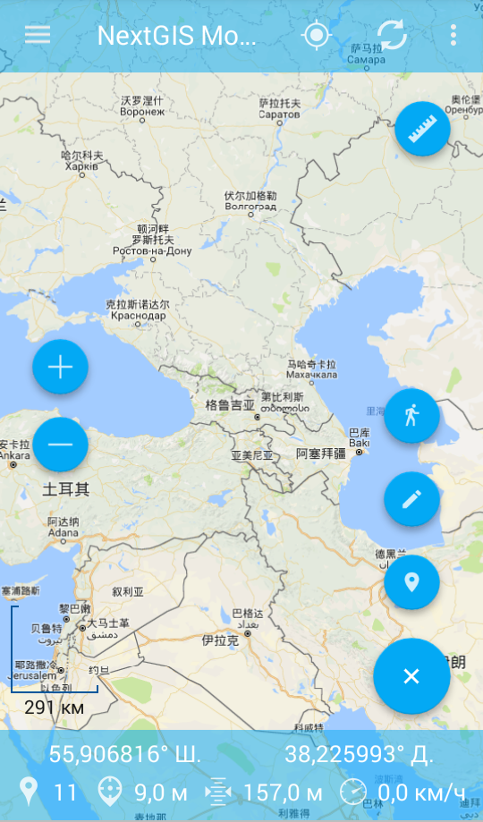
   
   Меню редактирования.
   
    Цифрами указаны: 1 - приблизить; 2 - отдалить; 3 – масштаб; 4 - линейка; 5 - добавить геометрию обходом; 6 - редактировать слои; 7 - добавить текущее местоположение; 8 - закрыть меню редактирования.

Для того чтобы перейти в режим редактирования, необходимо выбрать пункт меню, которому 
соответствует иконка с изображением карандаша (см. :numref:`ngmobile_edit_menu_pic`).

В открывшемся диалоге выбора слоев (см. :numref:`ngmobile_select_layer_dialogtch_pic`) следует выбрать векторный слой для редактирования. В зависимости от типа геометрии выбранного слоя отображаются соответствующие панели 
инструментов редактора. Таким образом можно добавлять любые типы геометрий (точки, линии, полигоны).

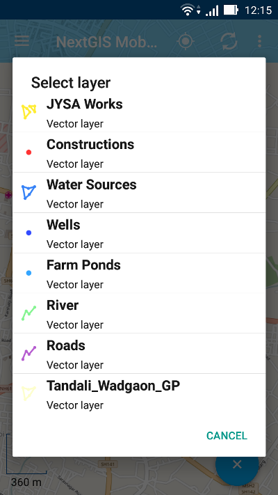
   
   Диалог выбора слоя.

2. Второй способ: долгим нажатием на объект на экране вызвать режим выбора 
(см. :numref:`ngmobile_selectmode_pic`) и в нижней панели инструментов активировать 
команду "Редактировать".

3. Третий способ: в дереве слоев (см. :numref:`ngmobile_main_activity_pic`, п.1) открыть меню соответствующего векторного слоя (см. :numref:`ngmobile_layer_tree_pic`, п. 5). Откроется  панель инструментов (см. :numref:`ngmobile_layer_tree_pic`, п. 6), где следует выбрать пункт "Редактировать".

.. _ngmobile_editing_toolbar:

Панель инструментов редактирования
----------------------------------

После перехода в режим редактирования с помощью любого из способов, описанных в разделе :ref:`ngmobile_switch_to_edit` в нижней части экрана откроется панель инструментов (см. :numref:`ngmobile_editing_toolbar_pic`).

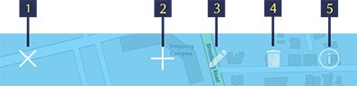
   
   Панель инструментов.
   
   Цифрами обозначены: 1 - завершение режима редактирования; 2 - добавить новый объект; 3 – редактировать объект; 4 - удалить объект; 5 - таблица объектов.

.. note::
   Данный вид панели инструментов редактирования является общим для всех векторных слоев вне зависимости от типа геометрии (точка, линия или полигон).

.. _ngmobile_add_geometry:

Добавление объектов
-------------------

Для создания нового объекта нужно выбрать слой, в которой планируется его добавить. Затем следует перейти в режим редактирования, используя один из методов, описанных в разделе :ref:`ngmobile_switch_to_edit`. 

Когда панель инструментов редактирования откроется, следует нажать на кнопку "Добавить новый объект" (см. :numref:`ngmobile_editing_toolbar_pic`, п.2). 

.. note::
   Тип геометрии нового объекта должен соответствовать типу геометрии слоя, на который планируется его добавить (например, новую точку можно добавить только в векторный слой с геометрией - точка/мультиточка, новую линию - в векторный слой с геометрией - линия/мультилиния, и т.д.).

.. note::
   Для того, чтобы добавить новые объекты с нуля, сначала следует создать пустой слой, как описано в разделе "Создание слоя".

.. _ngmobile_add_point:

Создание точки
^^^^^^^^^^^^^^

1. Для добавления в слой точки следует выбрать из дерева слоев векторный слой с 
типом геометрии - точка/мультиточка (см. :numref:`ngmobile_select_layer_dialogtch_pic`). Затем перейти в режим редактирования с помощью одного из методов, описанных в разделе :ref:`ngmobile_switch_to_edit`.

2. На панели инструментов редактирования необходимо нажать на кнопку "Добавить новый объект" (см. :numref:`ngmobile_editing_toolbar_pic`, п.2). 

3. На карте появится новая точка, которая будет создана в центре экрана и подсвечена 
красным цветом, рядом с точкой будет отображена стрелка. Эту точку можно переместить в любое место на карте, нажав на стрелку и, не отпуская, перетянув ее на новое место. Красный крестик обозначает центр экрана (см. :numref:`ngmobile_creation_of_points_pic`).

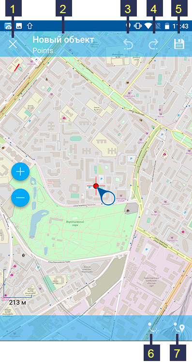

   Добавление точки на слой с геометрией точка.
   
   Цифрами обозначены: 1 - завершение режима редактирования (без сохранения); 2 - название объекта и название слоя; 3 - отменить изменения; 4 - повторить изменения; 5 - установить атрибуты; 8 - переместить точку в центр экрана; 9 - переместить точку в текущее местоположение.
 
4. Для добавления точки в слой с геометрией мультиточки необходимо выполнить пункты 1-2, а затем нажать на кнопку "Добавить точку" (см. :numref:`ngmobile_creation_of_multipoints_pic`, п.6). После этого можно задать положение новой точки, как описано в пункте 3.
    
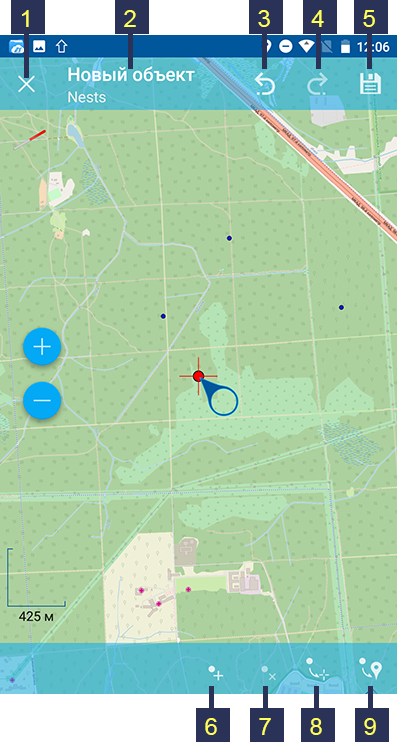

   Добавление точки в слой с геометрией мультиточка.
   
   Цифрами обозначены: 1 - завершение режима редактирования (без сохранения); 2 - название объекта и название слоя; 3 - отменить изменения; 4 - повторить изменения; 5 - установить атрибуты;  6 - добавить точку; 7 - удалить точку; 8 - переместить точку в центр экрана; 9 - переместить точку в текущее местоположение.
    
5. После добавления новой точки можно установить ее атрибуты, нажав на иконку с изображением дискеты (см. п.5 на :numref:`ngmobile_creation_of_points_pic` и :numref:`ngmobile_creation_of_multipoints_pic`). При нажатии на эту кнопку произойдет 
сохранение созданной точки/мультиточки и откроется форма ввода атрибутов новой геометрии  (см. :numref:`ngmobile_input_form_attributes_pic`).

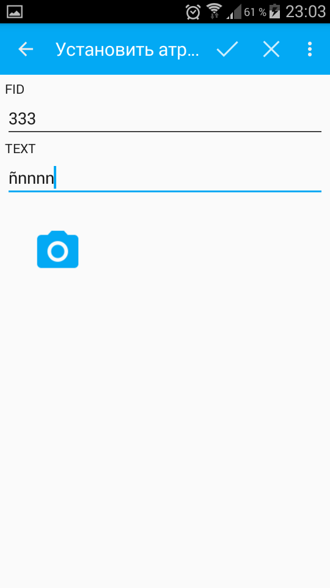
   
   Форма ввода атрибутов геометрии.
   
   Цифрами обозначены: 1 - назад; 2 - применить изменения; 3 - добавить фото.
   
6. После того, как все атрибуты будут установлены, следует нажать на кнопку "Применить изменения" (см. :numref:`ngmobile_input_form_attributes_pic`, п.2), чтобы сохранить атрибуты. Если вместо этого, нажать на кнопку "Назад" (см. :numref:`ngmobile_input_form_attributes_pic`, п.1), приложение предупредит о несохраненных изменениях. К каждому объекту можно прикрепить фотографию, используя кнопку "Добавить фото" в форме ввода атрибутов (см. :numref:`ngmobile_input_form_attributes_pic`, п.3).

.. _ngmobile_add_line:

Создание линии
^^^^^^^^^^^^^^

1. Для создания линии следует выбрать из дерева слоев векторный слой с типом геометрии - линия/мультилиния (см. :numref:`ngmobile_select_layer_dialogtch_pic`). Затем перейти в режим редактирования с помощью одного из методов, описанных в разделе :ref:`ngmobile_switch_to_edit`.

2. На панели инструментов редактирования необходимо нажать на кнопку "Добавить новый объект" (см. :numref:`ngmobile_editing_toolbar_pic`, п.2).

3. На карте появится новая линия, которая будет создана в центре экрана. 
Одна из точек линии, которую можно перемещать по слою на карте, подсвечена красным 
цветом. Рядом с этой точкой будет отображена стрелка (см. :numref:`ngmobile_creating_lines_pic`).

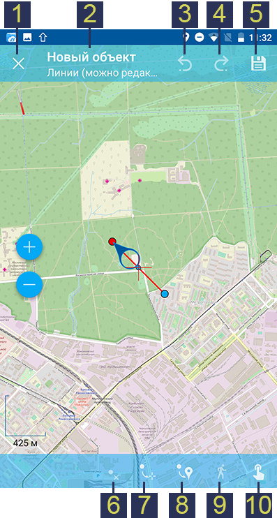

   Добавление линии в слой с геометрией линия.
   
   Цифрами обозначены: 1 - завершение режима редактирования (без сохранения); 2 - название объекта и название слоя; 3 - отменить изменения; 4 - повторить изменения; 5 - установить атрибуты;  6 - удалить точку; 7 - переместить точку в центр экрана; 8 - переместить точку в текущее местоположение; 9 - дополнить геометрию обходом; 10 - изменить касанием.

Точки, принадлежащие линии, можно переместить в любое место на карте, нажав на стрелку возле одной из них и, не отпуская, перетянув ее на новое место. При нажатии на точку в центре линии, автоматически содадутся две новые точки. Таким образом можно добавить любое количество точек и изменить геометрию линии, как угодно, в том числе, можно создать кривую линию.

4. Для добавления линии в слой с геометрией мультилинии необходимо выполнить пункты 1-2, а затем нажать на кнопку "Добавить линию" (см. :numref:`ngmobile_creating_multilines_pic`, п.6). После этого можно задать положение точек для новой линии, как описано в пункте 3.

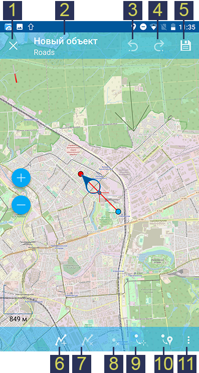

   Добавление линии в слой с геометрией мультилиния.
   
   Цифрами обозначены: 1 - завершение режима редактирования (без сохранения); 2 - название объекта и название слоя; 3 - отменить изменения; 4 - повторить изменения; 5 - установить атрибуты;  6 - добавить линию; 7 - удалить линию; 8 - удалить точку; 9 - переместить точку в центр экрана; 10 - переместить точку в текущее местоположение; 11 - контекстное меню с остальными функциями (дополнить геометрию обходом, дополнить геометрию касанием).

5. После добавления новой линии можно установить ее атрибуты, нажав на иконку с изображением дискеты (см. п.5 на :numref:`ngmobile_creating_lines_pic` и :numref:`ngmobile_creating_multilines_pic`). При нажатии на эту кнопку произойдет 
сохранение созданной линии/мультилинии и откроется форма ввода атрибутов новой геометрии  (см. :numref:`ngmobile_input_form_attributes_pic`).

6. После того, как все атрибуты будут установлены, следует нажать на кнопку "Применить изменения" (см. :numref:`ngmobile_input_form_attributes_pic`, п.2), чтобы сохранить атрибуты. Если вместо этого, нажать на кнопку "Назад" (см. :numref:`ngmobile_input_form_attributes_pic`, п.1), приложение предупредит о несохраненных изменениях. К каждому объекту можно прикрепить фотографию, используя кнопку "Добавить фото" в форме ввода атрибутов (см. :numref:`ngmobile_input_form_attributes_pic`, п.3).

.. _ngmobile_add_polygon:

Создание полигона
^^^^^^^^^^^^^^^^^

1. Для создания полигона следует выбрать из дерева слоев векторный слой с типом геометрии - полигон/мультиполигон (см. :numref:`ngmobile_select_layer_dialogtch_pic`). Затем перейти в режим редактирования с помощью одного из методов, описанных в разделе :ref:`ngmobile_switch_to_edit`.

2. На панели инструментов редактирования необходимо нажать на кнопку "Добавить новый объект" (см. :numref:`ngmobile_editing_toolbar_pic`, п.2).

3. На карте появится новый полигон, который будет создан в центре экрана. 
Одна из точек полигона, которую можно перемещать по слою на карте, подсвечена красным 
светом, рядом с этой точкой будет отображена стрелка. Выделение любой точки полигона 
позволяет ее перемещать по карте (см. :numref:`ngmobile_creation_landfill_pic`).

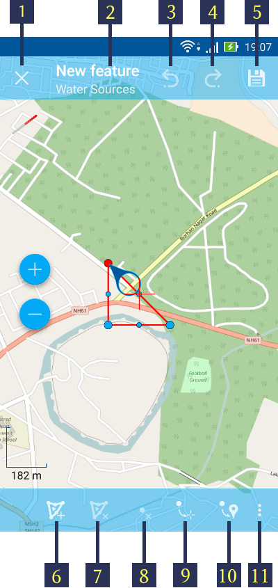

   Добавление полигона в слой с типом геометрии полигон.
   
   Цифрами обозначены: 1 - завершение режима редактирования (без сохранения); 2 - название объекта и название слоя; 3 - отменить изменения; 4 - повторить изменения; 5 - установить атрибуты;  6 - добавить дыру; 7 -удалить дыру; 8 - удалить точку; 9 - переместить точку в центр экрана; 10 - переместить точку в текущее местоположение; 11 - контекстное меню с остальными функциями (дополнить геометрию обходом, дополнить геометрию касанием).

Точки, принадлежащие полигону, можно переместить в любое место на карте, нажав на стрелку возле одной из них и, не отпуская, перетянув ее на новое место. При нажатии на точку в центре линии, автоматически содадутся две новые точки. Таким образом можно добавить любое количество точек и изменить геометрию полигона, как угодно, в том числе, можно создать кривую линию.

В полигоне можно создавать дыры, нажав на кнопку "Добавить дыру" (см. :numref:`ngmobile_creation_landfill_pic`, п.6 или :numref:`ngmobile_creation_multipolygon_pic`, п.8) и отредактировав геометрию дыры так же, как это было описано для геометрии полигона.

.. note::
   Геометрия дыры должна быть расположена ВНУТРИ геометрии полигона, в противном случае изменения не будут сохранены!

4. Для добавления полигона в слой с мультиполигональной геометрией необходимо выполнить пункты 1-2, а затем нажать на кнопку "Добавить полигон" (см. :numref:`ngmobile_creation_multipolygon_pic`, п.6). После этого можно задать положение точек для нового полигона, как описано в пункте 3.

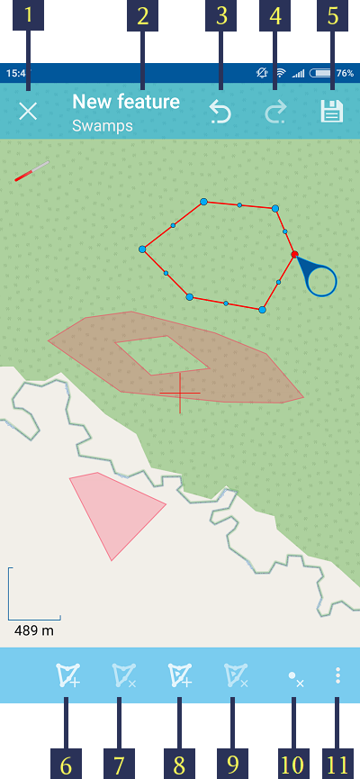

   Добавление полигона в слой с мультиполигональной геометрией.
   
   Цифрами обозначены: 1 - завершение режима редактирования (без сохранения); 2 - название объекта и название слоя; 3 - отменить изменения; 4 - повторить изменения; 5 - установить атрибуты;  6 - добавить полигон; 7 - удалить полигон; 8 - добавить дыру; 9 -удалить дыру; 10 - удалить точку; 11 - контекстное меню с остальными функциями (переместить точку в центр экрана; переместить точку в текущее местоположение; дополнить геометрию обходом, дополнить геометрию касанием).

5. После добавления нового полигона можно установить его атрибуты, нажав на иконку с изображением дискеты (см. п.5 на :numref:`ngmobile_creation_landfill_pic` и :numref:`ngmobile_creation_multipolygon_pic`). При нажатии на эту кнопку произойдет 
сохранение созданной линии/мультилинии и откроется форма ввода атрибутов новой геометрии (см. :numref:`ngmobile_input_form_attributes_pic`).

6. После того, как все атрибуты будут установлены, следует нажать на кнопку "Применить изменения" (см. :numref:`ngmobile_input_form_attributes_pic`, п.2), чтобы сохранить атрибуты. Если вместо этого, нажать на кнопку "Назад" (см. :numref:`ngmobile_input_form_attributes_pic`, п.1), приложение предупредит о несохраненных изменениях. К каждому объекту можно прикрепить фотографию, используя кнопку "Добавить фото" в форме ввода атрибутов (см. :numref:`ngmobile_input_form_attributes_pic`, п.3).

.. _ngmobile_add_location:

Добавление текущего местоположения
----------------------------------

Для добавления текущего местоположения в векторный слой, необходимо нажать кнопку меню основных операций (см. :numref:`ngmobile_main_activity_pic`, п.8) и затем нажать на иконку с изображением пушпина (см. :numref:`ngmobile_edit_menu_pic`, п.7). 
В открывшемся диалоге следует выбрать слой, на который будет добавлено текущее местоположение (отображаются только 
точечные и мультиточечные слои) (см. :numref:`ngmobile_select_layer_dialog_pic`). Если доступен только один точечный/мультиточечный слой, то он будет выбран автоматически.

.. figure:: _static/ngmobile_selectlayer.png
   :name: ngmobile_select_layer_dialog_pic
   :align: center
   :height: 10cm
   
   Диалог выбора слоя.

Текущее местоположение будет добавлено на выбранный слой в виде точки или мультиточки, состоящей из одной точки.

Затем можно добавить атрибуты по методу, описаннному в разделе :ref:`ngmobile_add_point`.

.. note::
   Текущее местоположение можно добавлять только на точечные и мультиточечные слои!

.. _ngmobile_add_track:

Создание линии или полигона обходом
-----------------------------------

Для добавления линии или полигона обходом в векторный слой, необходимо нажать кнопку меню основных операций (см. :numref:`ngmobile_main_activity_pic`, п.8) и затем нажать на иконку с изображением в виде идущего человека (см. :numref:`ngmobile_edit_menu_pic`). В открывшемся диалоге следует выбрать слой, на который будет добавлено текущее местоположение (отображаются только линейные/мультилинейные и полигональные/мультиполигональные слои) (см. :numref:`ngmobile_select_layer_by_walk_dialog_pic`). 

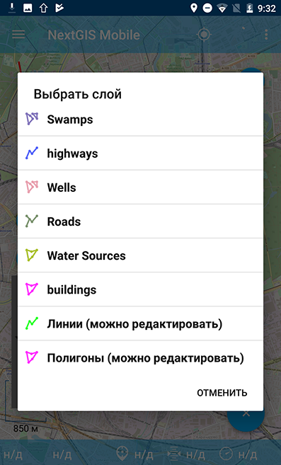
   
   Диалог выбора слоя.
   
Больше информации о добавлении геометрий можно найти в разделе :ref:`ngmobile_edit_vector_tracks`.

.. note::
   Треки можно добавлять только в линейные/мультилинейные или полигональные/мультиполигональные слои!
   
.. _ngmobile_edit_geometry:

Изменение геометрии
-------------------

Для того чтобы редактировать существующий слой, следует выбрать этот векторный слой из дерева слоев и перейти в режим редактирования с помощью любого из трех методов, описанных в разделе :ref:`ngmobile_switch_to_edit`. Геометрия изменит свой цвет на **синий**. Затем необходимо нажать на иконку с изображением карандаша на нижней панели инструментов (см. :numref:`ngmobile_editing_toolbar_pic`, п.3). После этого геометрия изменит свой цвет на **красный**.

.. _ngmobile_edit_point:

Редактирование точки
^^^^^^^^^^^^^^^^^^^^

Для того чтобы начать изменение точки, следует выбрать нужный слой с геометрией точка/мультиточка из дерева слоев и перейти в режим редактирования, далее необходимо выбрать точку, нажав на нее. Она изменит свой цвет на синий. Затем следует нажать на иконку с изображением карандаша на нижней панели инструментов (см. :numref:`ngmobile_editing_toolbar_pic`, п.3). Выбранная точка будет подсвечена красным цветом, рядом с точкой будет отображена стрелка.

Для того чтобы изменить положение точки, следует зажать стрелку и перетянуть на новое место. Кроме того, точку можно переместить в центр экрана (см. :numref:`ngmobile_editing_of_points_pic`, п.6) или в текущее местоположение (см. :numref:`ngmobile_editing_of_points_pic`, п.7), выбрав соответствующие команды на нижней панели инструментов.

Можно отменить редактирование в любой момент времени без сохранения изменений, выбрав соответствующую команду (см. :numref:`ngmobile_editing_of_points_pic`, п.1). Система предупредит об этом.

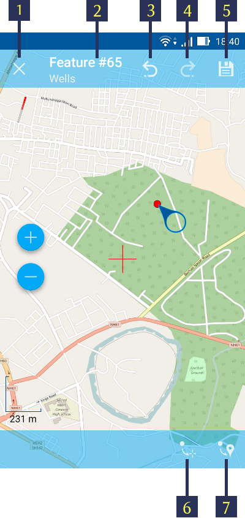
   
   Редактирование точки.
   
   Цифрами обозначены: 1 - завершение режима редактирования (без сохранения); 2 - название объекта и название слоя; 3 - отменить изменения; 4 - повторить изменения; 5 -  установить атрибуты; 8 - переместить точку в центр экрана; 9 - переместить точку в текущее местоположение.
    
При редактировании мультиточки выделяются все точки в нее входящие. Текущая точка 
подсвечена красным цветом, рядом с точкой отображена стрелка (см. :numref:`ngmobile_creating_multipoint3_pic`)

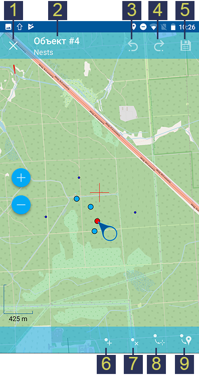

   Редактирование мультиточки.
   
   Цифрами обозначены: 1 - завершение режима редактирования (без сохранения); 2 - название объекта и название слоя; 3 - отменить изменения; 4 - повторить изменения; 5 - установить атрибуты;  6 - добавить точку; 7 - удалить точку; 8 - переместить точку в центр экрана; 9 - переместить точку в текущее местоположение.
   
Панель редактирования позволяет удалить выбранную точку (см. :numref:`ngmobile_creating_multipoint3_pic`, п.7), переместить ее в любое новое положение, потянув за стрелку возле нее, в центр экрана (см. :numref:`ngmobile_creating_multipoint3_pic`, п.8) или в текущее местоположение (см. :numref:`ngmobile_creating_multipoint3_pic`, п.9). Кроме того, можно добавить новую точку к мультиточке (см. :numref:`ngmobile_creating_multipoint3_pic`, п.6).    

.. _ngmobile_edit_line:

Редактирование линии
^^^^^^^^^^^^^^^^^^^^^

Для того чтобы начать изменение линии, следует выбрать нужный слой с геометрией линия/мультилиния из дерева слоев и перейти в режим редактирования, далее необходимо выбрать линию, нажав на нее. Она изменит свой цвет на синий. Затем следует нажать на иконку с изображением карандаша на нижней панели инструментов (см. :numref:`ngmobile_editing_toolbar_pic`, п.3). Выбранная линия изменит свой цвет на красный, все точки, входящие в эту линию будут подсвечены синим цветом. Выбранная точка линии будет подсвечена красным, рядом с ней будет отображена стрелка. Центр сегмента линии между точками также будет обозначен. При нажатии на центр сегмента линии к нему будут добавлены еще две новые точки. 

Выбранную точку можно переместить на любое другое место. Ее также можно переместить в центр экрана (см. :numref:`ngmobile_editing_lines_pic`, п.7) или в текущее местоположение (см. :numref:`ngmobile_editing_lines_pic`, п.8), выбрав соответствующие команды на нижней панели инструментов.

Можно удалить ненужную точку, выделив ее и выбрав команду удалить на нижней панели инструментов (см. :numref:`ngmobile_editing_lines_pic`, п.6).

Редактированием точек, входящих в линию, можно получить даже кривую линию, соответствующую гегорафической форме объекта.

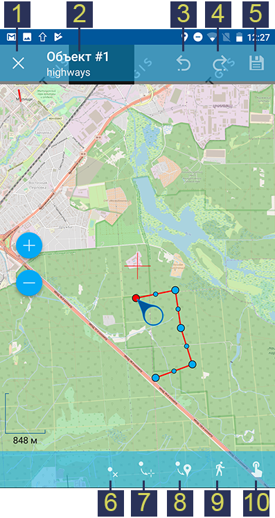
   
   Редактирование линии.
   
   Цифрами обозначены: 1 - завершение режима редактирования (без сохранения); 2 - название объекта и название слоя; 3 - отменить изменения; 4 - повторить изменения; 5 - установить атрибуты;  6 - удалить точку; 7 - переместить точку в центр экрана; 8 - переместить точку в текущее местоположение; 9 - дополнить геометрию обходом; 10 - изменить касанием.
   
.. note::
   Если в линии останется одна точка, то такая линия будет удалена. 

При редактировании мультилинии выделяются все точки в нее входящие. Текущая точка 
подсвечена красным цветом, рядом с точкой отображена стрелка (см. :numref:`ngmobile_edit_multilines_pic`)

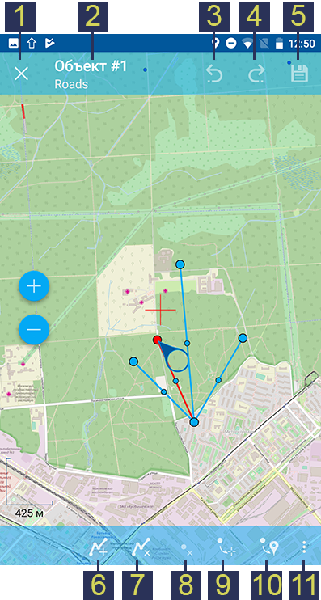

   Редактирование мультилинии.
   
   Цифрами обозначены: 1 - завершение режима редактирования (без сохранения); 2 - название объекта и название слоя; 3 - отменить изменения; 4 - повторить изменения; 5 - установить атрибуты;  6 - добавить линию; 7 - удалить линию; 8 - удалить точку; 9 - переместить точку в центр экрана; 10 - переместить точку в текущее местоположение; 11 - контекстное меню с остальными функциями (дополнить геометрию обходом, дополнить геометрию касанием).
   
Панель редактирования позволяет удалить выбранную точку или линию (см. :numref:`ngmobile_edit_multilines_pic`, п.7 и п.8), переместить точку в любое новое положение, потянув за стрелку возле нее, в центр экрана (см. :numref:`ngmobile_edit_multilines_pic`, п.9) или в текущее местоположение (см. :numref:`ngmobile_edit_multilines_pic`, п.10). Кроме того, можно добавить новую линию к мультилинии (см. :numref:`ngmobile_edit_multilines_pic`, п.6).

.. _ngmobile_edit_polygon:

Редактирование полигона
^^^^^^^^^^^^^^^^^^^^^^^

В режиме редактирования полигона на верхней и нижней панелях инструментов появляются 
следующие иконки, представленные на :numref:`ngmobile_polygon_editing_pic`.

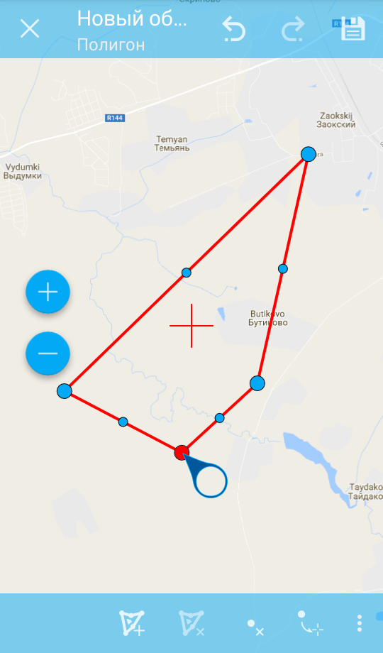
   
   Панели инструментов редактирования полигона.
   
   Цифрами обозначено: на верхней панели инструментов: 
   1 - завершения режима редактирования;
   2 - отмена действия;
   3 - повтор действия;
   4 - сохранение изменений.
   На нижней панели инструментов: 
   1 - добавить новый полигон; 2 - удалить полигон; 3 - удалить точку из полигона; 
   4 - переместить точку в центр экрана; 5 - кнопка вызова меню. 

При нажатии на кнопку вызова меню на нижней панели инструментов появляются еще варианты
для редактирования геометрии:

   1 - Точка в текущее положение;
   2 - Дополнить геометрию обходом;
   3 - Дополнить геометрию касанием.

При редактировании полигона выделяются все точки в него входящие (как внешней 
оболочки, так и каждого внутреннего кольца). Текущая точка подсвечена красным 
цветом, рядом с точкой отображена стрелка. Кроме того, между точками на кольце 
полигона (внешний или внутренние) отмечается центр сегмента линии. При выделении 
центра сегмента линии касанием пальца до экрана устройства, к кольцу добавляется 
новая точка и сразу получает выделение. После добавления точки ее можно перемещать 
:numref:`ngmobile_add_points_to_polygon_pic`.

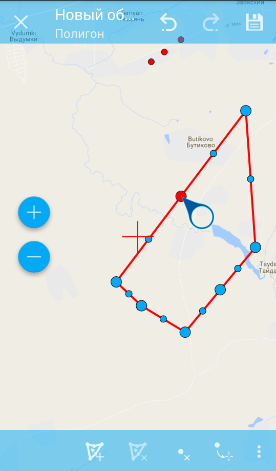
   
   Добавление новых точек в полигон.

Панель редактирования позволяет удалить все точки из состава полигона (удалить 
полигон) или выбранную точку. 

.. note::
   Если в полигоне останется всего две точки, то такой полигон будет удален. 

Над выбранной точкой в кольце полигона можно выполнять операции:
    
* удалить;
* переместить в центр экрана;
* переместить в текущие координаты.   
 
При добавлении полигона в центре экрана создается полигон по умолчанию, который 
состоит из трех точек. Добавляя точки можно растягивать внешнее кольцо полигона, 
менять его конфигурацию.

.. note::
   Поддержки добавления внутренних колец пока не реализовано.

Редактирование мультиполигона
^^^^^^^^^^^^^^^^^^^^^^^^^^^^^^

Для того чтобы перейти в режим редактирования имеющейся геометрии, необходимо долго
удерживать палец на геометрии векторного слоя. В результате такого действия окно 
карты переходит в режим выбора действия (см. :numref:`ngmobile_map_window_selection_mode2_pic`). 

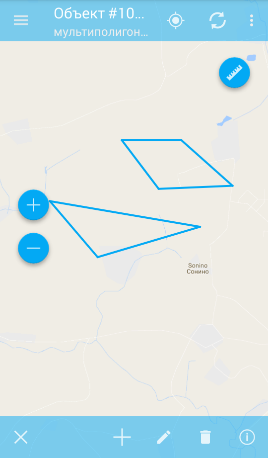
   
   Окно карты в режиме выделения.

В режиме редактирования мультиполигона открывается нижняя панель инструментов, на 
которой имеется иконка в виде карандаша. Данная иконка предоставляет возможность 
перейти к редактированию выбранной геометрии (см. :ref:`ngmobile_editing`). 
При нажатии на иконку карандаша появляется нижняя панель инструментов, 
которая содержит соответствующие имеющейся геометрии кнопки для редактирования 
этой геометрии (см. :numref:`ngmobile_map_window_in_edit_mode2_pic`). 

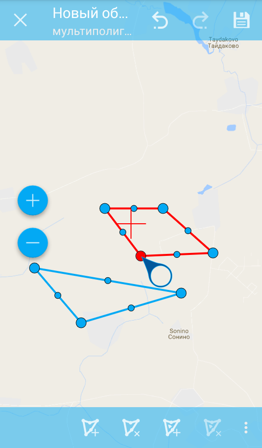

   Окно карты в режиме редактирования. Слева направо иконки на верхней панели инструментов:
   1 - завершения режима редактирования;
   2 - отмена действия;
   3 - повтор действия;
   4 - сохранение изменений.
   Слева направо иконки на нижней панели инструментов:
   1 - добавить новый полигон;
   2 - удалить новый полигон;
   3 - добавить внутреннее кольцо в полигон;
   4 - удалить внутреннее кольцо из полигона
   5 - кнопка вызова меню.
    
Панель редактирования позволяет удалить все точки из состава мультиполигона (удалить 
мультиполигон) или выбранную точку (см. :numref:`ngmobile_menu_contents_mp_pic`). 

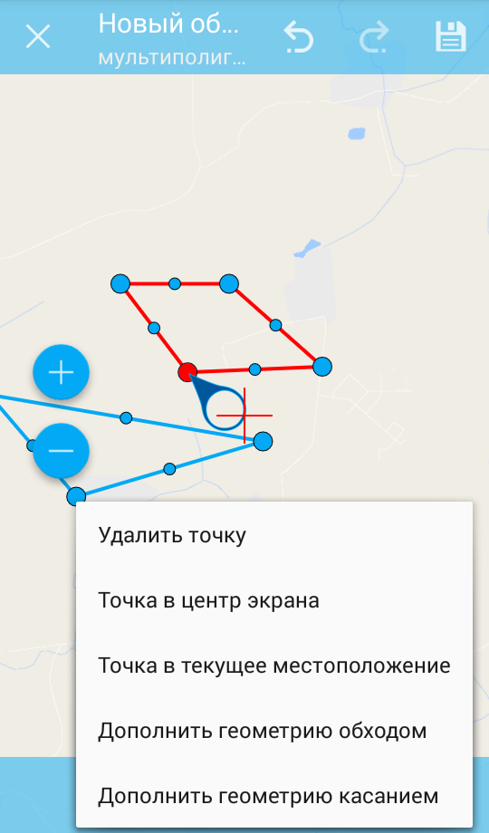
   
   Варианты редактирования из состава меню.

Редактирование атрибутов
------------------------

Для редактирования атрибутов слоя следует выбрать необходимый слой, на экране долгим 
нажатием на картинке активировать нижнюю панель инструментов (см. :numref:`ngmobile_action_selection_mode_pic`). 

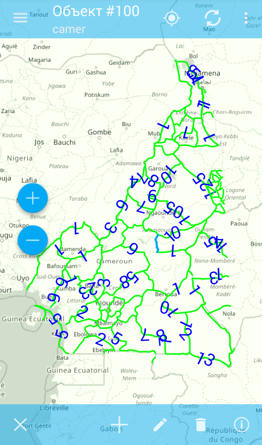
 
   Окно режима выбора действия.
   Слева направо иконки на нижней панели инструментов:
   1 - завершение режима редактирования;
   2 - добавление к выбранной геометрии (новой точки, новой линии и т.д.);
   3 - редактирование выбранной геометрии;
   4 - удаление выбранной части геометрии/ всей геометрии;
   5 - перейти к редактирование атрибутов выбранной геометрии.  

При нажатии на иконку 5 на нижней панели инструментов откроется окно для перехода 
в режим редактирования атрибутов (см. :numref:`ngmobile_editing_attributes_pic`). 

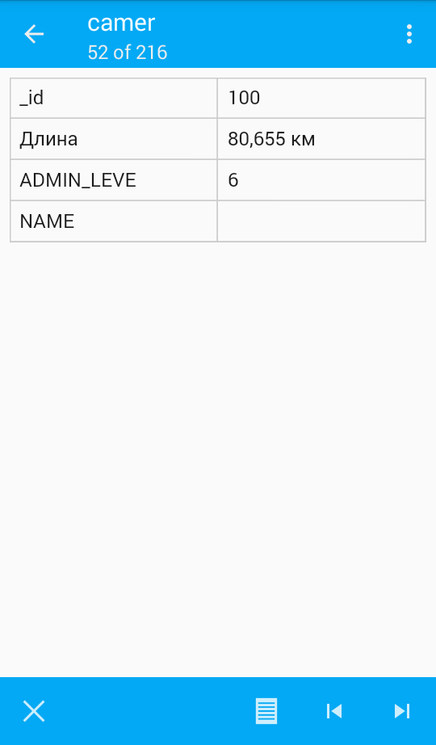

   Окно для перехода в режим редактирования атрибутов.
   Слева направо иконки на нижней панели инструментов:
   1 - завершение режима редактирования;
   2 - перейти в режим редактирования атрибутов выбранного слоя;
   3 - перейти к предыдущей записи в слое;
   4 - перейти к последующей записи в слое.

Для перехода в режим редактирования следует нажать на иконку 2 на нижней панели 
инструментов (см. :numref:`ngmobile_attribute_edit_window_pic`). 

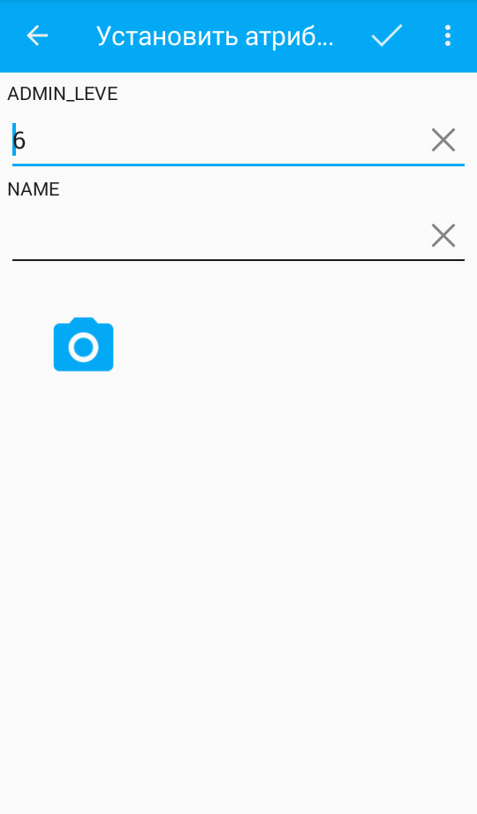

   Окно в режиме редактирования атрибутов выбранной геометрии.
   Слева направо иконки на верхней панели инструментов:
   1 - возврат к окну для перехода к режиму редактирования атрибутов;
   2 - иконка в виде "галочки" - сохранение внесенных изменений
   3 - кнопка вызова меню Настройки.

Диалог изменения атрибутов представляет собой вертикальный список названий полей, 
а также кнопку с изображением фотоаппарата, которая дает возможность добавить фото 
(сделать новое фото, выбрать имеющееся фото из галереи).

После внесения необходимый изменений в атрибуты выбранной геометрии следует нажать 
иконку в виде "галочки" на верхней панели инструментов для сохранения внесенных изменений.

 
Настраиваемая форма редактирования атрибутов
^^^^^^^^^^^^^^^^^^^^^^^^^^^^^^^^^^^^^^^^^^^^   
   
Если слою сопоставлена настраиваемая форма, то будет открыта именно она. В результате 
внесения изменений и сохранения этих изменений в векторном слое происходит открытие диалога
редактирования атрибутов. Диалог редактирования атрибутов содержит следующие для ввода поля:

* Текст;
* Пробел;
* Текстовое поле;
* Список, Сдвоенный список;
* Флажок;
* Радио-кнопка;
* Пикер даты;
* Фотографии.
 
Поле информации "Текст" служит для внесения дополнительного текстового пояснения 
к информации о созданной геометрии.

Поле "Пробел" необходимо для увеличения интервала между полями (см. :numref:`ngmobile_text_probel_pic`). 

   Поле "Текст" и "Пробел".

Поле ввода информации "Текстовое поле" - для ввода текста или цифр в зависимости от типа поля (см. :numref:`ngmobile_text_pole_pic`). 

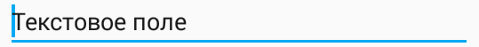

   Поле ввода "Текстовое поле".

Поле ввода информации "Список", "Сдвоенный список" необходим для хранения и быстрого
выбора одного из значений, входящих в список выбора, например "Список" - регион/субъект/республика/край, 
"Сдвоенный список" - район/округ/административная единица этого региона/субъекта/республики/края (см. :numref:`ngmobile_spisok_pic`). 

.. figure:: _static/spisok.png
   :name: ngmobile_spisok_pic
   :align: center
   :width: 6cm

   Поле ввода "Список"/ "Сдвоенный список".

Поле ввода информации "Флажок" - включает или выключает значение (см. :numref:`ngmobile_flag_pic`). 

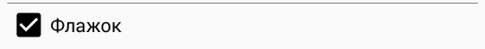

   Поле ввода "Флажок".

Поле ввода информации "Радио-кнопка 1", "Радио-кнопка 2" - переключатель, позволяет выбрать 
один элемент из ограниченного набора взаимно исключающих вариантов (см. :numref:`ngmobile_radio_kn_pic`). 

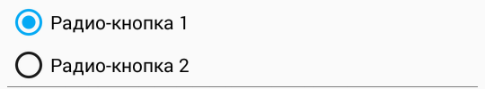

   Поле ввода "Радио-кнопка".

Поле ввода информации "Пикер даты" - элемент управления, используемый для выбора даты, 
время или и того и другого (см. :numref:`ngmobile_date_pic`). 

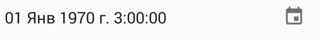

   Поле ввода "Пикер даты".

Поле "Фотографии" необходимо для создания фотографии или загрузки имеющихся фотографий (см. :numref:`ngmobile_photo_pic`). 

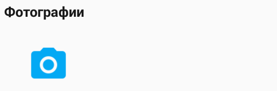
 
   Поле ввода "Фотографии".
 
После заполнения всех необходимых атрибутов необходимо нажать кнопку 2
(см. :numref:`ngmobile_attribute_edit_window_pic`) для сохранения изменений. 
При выборе кнопки 1 или 3 происходит возврат к окну карты без сохранения атрибутов. 
Точка также не будет добавлена.

