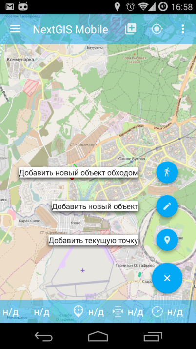
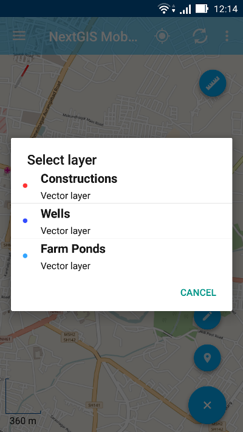
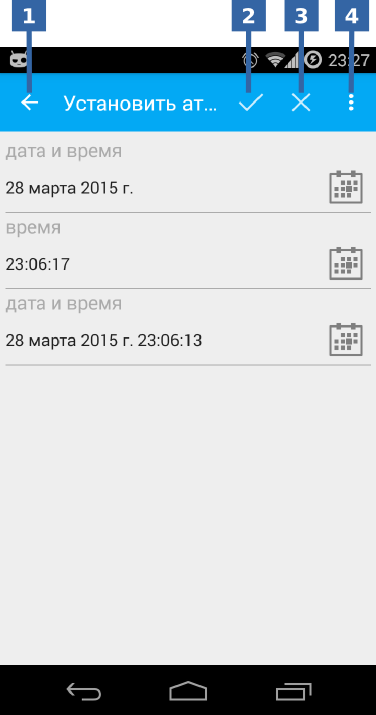
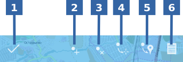
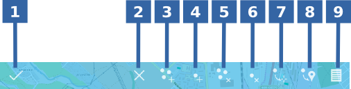
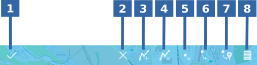
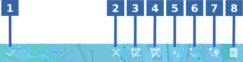
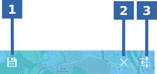

.. sectionauthor:: Дмитрий Барышников <dmitry.baryshnikov@nextgis.ru>

.. _editing:

Редактирование
==============

Если к карте были добавлены один или несколько векторных слоев, то их можно редактировать. При редактировании предоставляются возможности:

* добавить новую запись в слой;
* удалить запись из слоя;
* изменить запись в слое.

Существует несколько способов попасть в режим редактирования. Первый способ - это основная кнопка программы (большая синяя кнопка в правом нижнем углу). При нажатии на кнопку открывается меню наиболее часто используемых действий (см. :numref:`fab_pic`).

   
   Меню редактирования.

Меню имеет следующий состав:

* добавить линию или полигон обходом;
* добавить геометрию;
* добавить текущее местоположение.

В горизонтальном положении меню открывается горизонтально и не отображает подписей пунктов.

Второй способ - это долгим нажатием на геометрию на экране вызвать режим выбора (см. :numref:`selectmode_pic`) и в нижней панели инструментов активировать команду "редактировать".

Добавление текущего местоположения
----------------------------------

Для добавления текущего местоположения в векторный слой, необходимо выбрать соответствующий пункт меню (см. :numref:`fab_pic`). Таким образом можно добавлять только точки или мультиточки с одной точкой. При этом, вначале открывается диалог выбора слоя в котором отображаются только точечные и мультиточенчые слои (см. :numref:`select_layer_dialog_pic`). 

   
   Диалог выбора слоя.
   

После выбора слоя открывается форма редактирования атрибутов (см. :numref:`attributes_edit_pic`). 

   
   Окно редактирования атрибутов.
   
   Цифрами обозначено: 1 - возврат к предыдущему экрану; 2 - сохранение изменений; 3 - отмена изменений; 4 - меню дополнительных операций.

.. note::
   В диалоге выбора слоя отображаются только видимые слои. Сам диалог отображается только если слоев несколько. Если подходящий слой один то сразу открывается форма редактирования атрибутов.
   
Если слою сопоставлена настраиваемая форма, то будет открыта именно она.

После заполнения всех необходимых атрибутов необходимо нажать кнопку :numref:`attributes_edit_pic` п. 2 для сохранения изменений. При выборе кнопки 1 или 3 происходит возврат к окну карты без сохранения атрибутов. Точка также не будет добавлена.

Добавление геометрии
--------------------

Для добавления геометрии в векторный слой, необходимо выбрать соответствующий пункт меню (см. :numref:`fab_pic`). Таким образом можно добавлять любые типы геометрий (точки, линии, полигоны, мультиточки, мультилинии, мультиполигоны). При этом, вначале открывается диалог выбора слоя (см. :numref:`select_layer_dialog_pic`). В зависимости от выбранного слоя отображается соответствующее тулбар редактора.

Редактирование точки
^^^^^^^^^^^^^^^^^^^^

В режиме редактирования точки открывается нижняя панель инструментов, представленная на :numref:`edit_point_pic`.

   
   Панель инструментов редактирования точки.
   
   Цифрами обозначено: 1 - завершение режима редактирования; 2 - отмена правок; 3 - добавить новую точку; 4 - удалить точку; 5 - переместить точку в центр экрана; 6 - переместить точку в текущее местоположение; 7 - редактирование атрибутов.
   
Пользователь может выбрать имеющуюся точку в слое (она будет подсвечена красным цветом, рядом с точкой будет отображена стрелка) или создать новую (новая точка будет создана в центре экрана и подсвечена красным светом, рядом с точкой будет отображена стрелка). Далее выделенную точку можно смещать просто потянув ее или потянув указывающую на нее стрелку. Кроме того, точку можно сместить в центр экрана (см. :numref:`edit_point_pic` п. 5) или в текущее местоположение (см. :numref:`edit_point_pic` п. 6), выбрав соответствующие команды в нижней панели инструментов. 

По-умолчанию кнопка отмены (см. :numref:`edit_point_pic` п. 2) не отображается.
     
При внесении изменений в слой кнопка 1 (см. :numref:`edit_point_pic`) изменяет свой значок (значок дискеты), а кнопка отмены появляется в панели. При нажатии на кнопку 1 происходит сохранение измененной геометрии или создание новой геометрии и открытии диалога изменений атрибутов (см. :numref:`attributes_edit_pic`). При нажатии кнопки 2 происходит отмена ранее сделанных правок. 

.. note::

   Если диалог редактирования атрибутов закрыть без применений изменений (без выбора п. 2 :numref:`attributes_edit_pic`), то запись будет все равно создана или изменена, но будет содержать только новую (измененную) геометрию. Атрибуты будут установлены в значения по-умолчанию для случая создания новой записи или останутся неизменными для случая редактирования имеющейся. 

Для отмены сделанных правок служит кнопка 2 (см. :numref:`edit_point_pic` п. 2). Правку отменить можно только до нажатия кнопки сохранить (иконка в виде дискеты).

Для редактирования новой записи необходимо либо сохранить или отменить правки. При редактировании записи, если выбрать кнопку создания новой геометрии, то текущая геометрия будет заменена на новую.

Редактирование мультиточки
^^^^^^^^^^^^^^^^^^^^^^^^^^

В режиме редактирования мультиточки открывается нижняя панель инструментов, представленная на :numref:`edit_multipoint_pic`.

   
   Панель инструментов редактирования мультиточки.
   
   Цифрами обозначено: 1 - завершение режима редактирования; 2 - отмена правок; 3 - добавить новую мультиточку; 4 - добавить точку к мультиточку; 5 - удалить мультиточку; 6 - удалить точку из мультиточки; 7 - переместить точку в центр экрана; 8 - переместить точку в текущее местоположение; 9 - редактирование атрибутов.
   
При редактировании мультиточки выделяются все точки в нее входящие. Текущая точка подсвечена красным светом, рядом с точкой отображена стрелка. 

Панель редактирования позволяет удалить все точки из состава мультиточки или выбранную точку. Над выбранной точкой можно выполнять операции:
    
* удалить;
* переместить в центр экрана;
* переместить в текущие координаты.
 
Кроме того, можно добавить точку к мультиточке (см. :numref:`edit_multipoint_pic` п. 4).    

Редактирование линии
^^^^^^^^^^^^^^^^^^^^

В режиме редактирования линии открывается нижняя панель инструментов, представленная на :numref:`edit_line_pic`.

   
   Панель инструментов редактирования линии.
   
   Цифрами обозначено: 1 - завершение режима редактирования; 2 - отмена правок; 3 - добавить новую линию; 4 - удалить линию; 5 - удалить точку из линии; 6 - переместить точку в центр экрана; 7 - переместить точку в текущее местоположение; 8 - редактирование атрибутов.
   
При редактировании линии выделяются все точки в нее входящие. Текущая точка подсвечена красным светом, рядом с точкой отображена стрелка. Кроме того, между точками на линии отмечается центр сегмента линии. При выделении центра тапом по нему пальцем, к линии добавляется новая точка и сразу получает выделение. После добавления точки ее можно перемещать.

Панель редактирования позволяет удалить все точки из состава линии (удалить линию) или выбранную точку. 

.. note::
   Если в линии останется одна точка, то такая линия будет удалена. 

Над выбранной точкой в линии можно выполнять операции:
    
* удалить;
* переместить в центр экрана;
* переместить в текущие координаты.

При добавлении новой линии в центре экрана создается линия по-умолчанию, которая состоит из двух точек. Добавляя точки можно растягивать линию, менять ее конфигурацию. 
 
Редактирование полигона
^^^^^^^^^^^^^^^^^^^^^^^

В режиме редактирования полигона открывается нижняя панель инструментов, представленная на :numref:`edit_polygon_pic`.

   
   Панель инструментов редактирования полигона.
   
   Цифрами обозначено: 1 - завершение режима редактирования; 2 - отмена правок; 3 - добавить новый полигон; 4 - удалить полигон; 5 - удалить точку из полигона; 6 - переместить точку в центр экрана; 7 - переместить точку в текущее местоположение; 8 - редактирование атрибутов.
   
При редактировании полигона выделяются все точки в него входящие (как внешней оболочки, так и каждого внутреннего кольца). Текущая точка подсвечена красным светом, рядом с точкой отображена стрелка. Кроме того, между точками на кольце полигона (внешний или внутренние) отмечается центр сегмента линии. При выделении центра тапом по нему пальцем, к кольцу добавляется новая точка и сразу получает выделение. После добавления точки ее можно перемещать.

Панель редактирования позволяет удалить все точки из состава полигона (удалить полигон) или выбранную точку. 

.. note::
   Если в полигоне останется всего две точки, то такой полигон будет удален. 

Над выбранной точкой в кольце полигона можно выполнять операции:
    
* удалить;
* переместить в центр экрана;
* переместить в текущие координаты.   
 
При добавлении полигона в центре экрана создается полигон по-умолчанию, который состоит из трех точек. Добавляя точки можно растягивать внешнее кольцо полигона, менять его конфигурацию.

.. note::
   Поддержки добавления внутренних колец пока не реализовано.

Добавление линии или полигона обходом
-------------------------------------

Для добавления линии или полигона обходом необходимо выбрать соответствующий пункт из меню наиболее часто используемых действий (см. :numref:`fab_pic`). При этом, вначале открывается диалог выбора слоя в котором отображаются только линейные и полигональные слои (см. :numref:`select_layer_dialog_pic`). Далее открывается нижняя панель инструментов, представленная на :numref:`edit_walk_pic`.

   
   Панель инструментов редактирования обходом.
   
   Цифрами обозначено: 1 - сохранение введенной фигуры; 2 - отмена режима ввода обходом; 3 - настройки ввода обходом.

После завершения обхода при выборе сохранения введенной геометрии (см. :numref:`edit_walk_pic` п. 1) открывается форма ввода (стандартная или настраиваемая, см. :numref:`attributes_edit_pic`). Если отменить сохранение геометрии, программа возвращается в режим редактирования выбранного полигонального слоя.

Если в ходе обхода вызвать меню настройки, то откроется окно настроек представленное на :numref:`settings_place_pic`. Изменения внесенные в этом окне влияют не только на ввод обходом, но и на отображение текущего местоположения.

.. note::
   При выборе настроек местоположения таким образом (минимальное время обновления 5 сек. и более, минимальное расстояние для обновления 25 м и более) операционная система начинает фильтровать выбросы.

