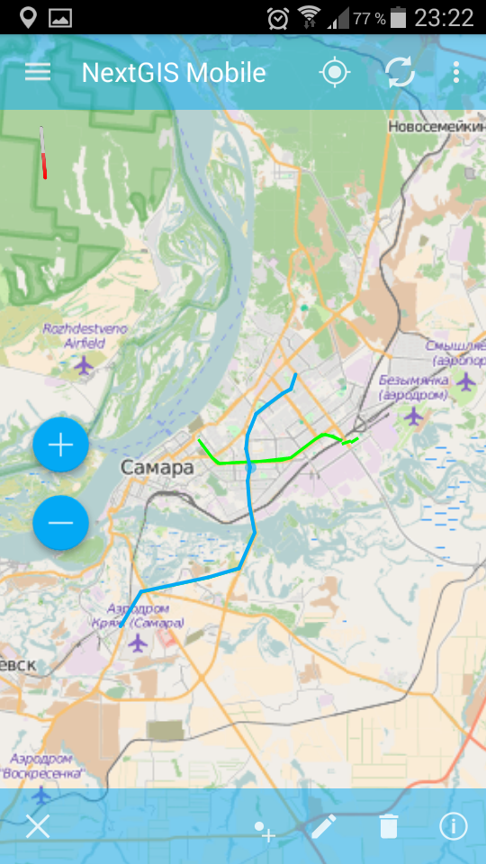
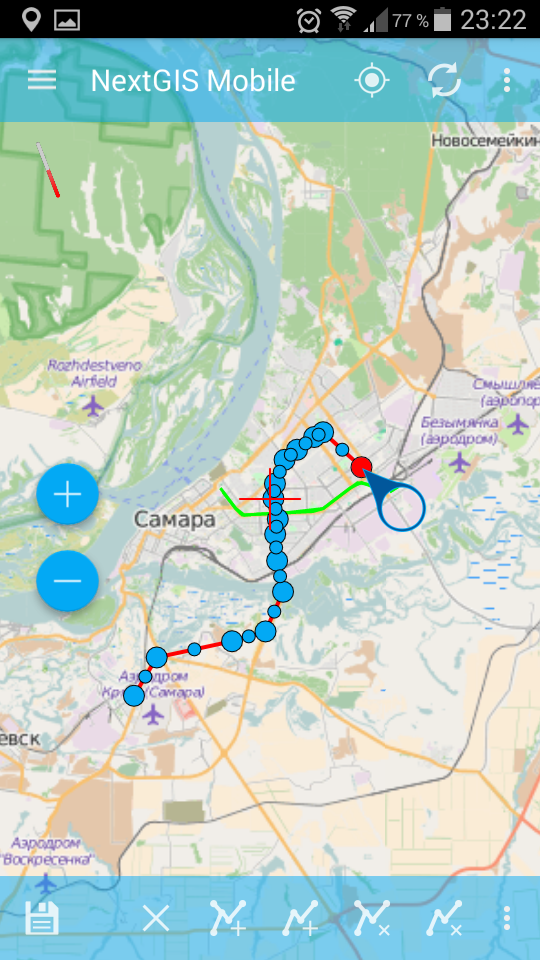
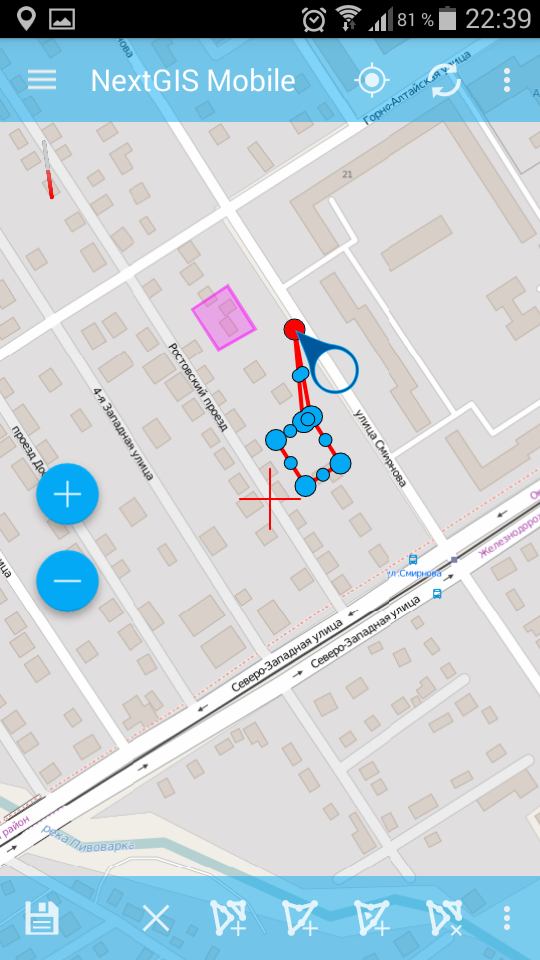

.. sectionauthor:: Dmitry Baryshnikov <dmitry.baryshnikov@nextgis.ru>

.. _ngmobile_editing:

Editing layers
=================

NextGIS Mobile allows you to edit vector layers added to the map. While editing, you can:

* add new features;
* delete features;
* edit features.

There are several ways to start editing. 
The first way is Main actions button (the big blue button in the right bottom corner of map screen (FAB)). Pressing Main actions button opens a menu of most common actions (see :numref:`ngmobile_edit_menu_pic`).

.. figure:: _static/edit_menu.png
   :name: ngmobile_edit_menu_pic
   :align: center
   :width: 6cm
   
   Common actions menu.

Using this menu you can:

* add a line or polygon by tracking;
* add geometry;
* add current location.

The second way to start editing is to long-press the geometry to switch map screen into Selection mode (see :numref:`ngmobile_selectmode_pic`) and then press "Edit" button in the Bottom toolbar.

Adding features
-----------------

To add feature to a vector layer press Main actions button, and then press a pencil icon (see :numref:`ngmobile_edit_menu_pic`). Select a layer you'd like to edit in an opened dialog (see :numref:`ngmobile_select_layer_dialogtch_pic`). 

.. figure:: _static/select_layer_dialogtch.png
   :name: ngmobile_select_layer_dialogtch_pic
   :align: center
   :width: 6cm
   
   Select layer dialog.

After you select a layer, map screen switches into Edit Layer mode. Displayed editing tools depend on the geometry of a selected layer. You can create any type of geometry (points, lines, polygons, multipoints, multilines, multipolygons).

Adding a point
^^^^^^^^^^^^^^^^

To add a point to an existing layer first select a vector layer with point geometry (see :numref:`ngmobile_select_layer_dialogtch_pic`). Then press icon 3 in Bottom toolbar (see :numref:`ngmobile_edit_paneltch_pic`).

.. figure:: _static/ngmobile_edit_point.png
   :name: ngmobile_edit_paneltch_pic
   :align: center
   :width: 8cm
   
   Point editing toolbar.

   The numbers indicate: 1 - Quit Edit mode; 2 - Cancel editing; 3 - Add new point; 4 - Delete point; 5 - Move point to the center of screen; 6 - Move point to current location; 7 - Edit attributes.

New point will appear in the center of the screen highlighted in red, together with arrow icon (see :numref:`ngmobile_creation_of_points_pic`).

.. figure:: _static/creation_of_points.png
   :name: ngmobile_creation_of_points_pic
   :align: center
   :width: 6cm

   Creating a point.

After new point is added, icon 1 in Bottom toolbar will change from "tick" to "floppy". Pressing floppy icon will save a new point and open Attributes editing form (see :numref:`ngmobile_input_form_attributes_pic`).

.. figure:: _static/input_form_attributes.png
   :name: ngmobile_input_form_attributes_pic
   :align: center
   :width: 6cm
   
   Attributes editing form.

Adding a line
^^^^^^^^^^^^^^^

To add a line to an existing layer first select a vector layer with line geometry (see :numref:`ngmobile_select_layer_dialogtch_pic`). Then press icon 3 in Bottom toolbar (see :numref:`ngmobile_edit_line1_pic`).

.. figure:: _static/ngmobile_edit_line.png
   :name: ngmobile_edit_line1_pic
   :align: center
   :width: 8cm
   
   Line editing toolbar.

   The numbers indicate: 1 - Quit Edit mode; 2 - Cancel editing; 3 - Add new line; 4 - Delete line; 5 - Delete vertex;  6 - Move vertex to the center of screen; 7 - Move vertex to current location; 8 - Edit attributes.

New line will appear in the center of the screen, with one of its vertexes highlighted in red and with arrow icon (see :numref:`ngmobile_creating_lines_pic`).

.. figure:: _static/creating_lines.png
   :name: ngmobile_creating_lines_pic
   :align: center
   :width: 6cm

   Creating a line.

After new line is added, icon 1 in Bottom toolbar will change from "tick" to "floppy". Pressing floppy icon will save a new line and open Attributes editing form (see :numref:`ngmobile_input_form_attributes_pic`)

Adding a polygon
^^^^^^^^^^^^^^^^^^

To add a polygon to an existing layer first select a vector layer with polygon geometry (see :numref:`ngmobile_select_layer_dialogtch_pic`). Then press icon 3 in Bottom toolbar (see :numref:`ngmobile_edit_polygon1_pic`).

.. figure:: _static/ngmobile_edit_polygon.png
   :name: ngmobile_edit_polygon1_pic
   :align: center
   :width: 8cm
   
   Polygon editing toolbar.

The numbers indicate: 1 - Quit Edit mode; 2 - Cancel editing; 3 - Add new polygon; 4 - Delete polygon; 5 - Delete vertex; 6 - Move vertex to the center of screen; 7 - Move vertex to current location; 8 - Edit attributes.

New polygon will appear in the center of the screen, with one of its vertexes highlighted in red and with arrow icon (see :numref:`ngmobile_creation_landfill_pic`).

.. figure:: _static/creation_landfill.png
   :name: ngmobile_creation_landfill_pic
   :align: center
   :width: 6cm

   Creating a polygon.

After new polygon is added, icon 1 in Bottom toolbar will change from "tick" to "floppy". Pressing floppy icon will save a new polygon and open Attributes editing form (see :numref:`ngmobile_input_form_attributes_pic`).

Adding a multipoint
^^^^^^^^^^^^^^^^^^^^^

To add a multipoint to an existing layer first select a vector layer with multipoint geometry (see :numref:`ngmobile_select_layer_dialogtch_pic`). Then press icon 3 in Bottom toolbar (see :numref:`ngmobile_edit_multipoint_pic`).

.. figure:: _static/ngmobile_edit_multipoint.png
   :name: ngmobile_edit_multipoint_pic
   :align: center
   :width: 8cm
   
   Multipoint editing toolbar.

   The numbers indicate: 1 - Quit Edit mode; 2 - Cancel editing; 3 - Add new multipoint; 4 - Add point to multipoint; 5 – Delete multipoint; 6 - Delete point from multipoint; 7 - Move point to the center of screen; 8 - Move point to current location; 9 - Edit attributes.

New multipoint will appear in the center of the screen, with one of its points highlighted in red and with arrow icon (see :numref:`ngmobile_phase_of_the_multipoint_pic`).

.. figure:: _static/phase_of_the_multipoint.png
   :name: ngmobile_phase_of_the_multipoint_pic
   :align: center
   :width: 6cm

   Creating a multipoint.

After new multipoint is added, icon 1 in Bottom toolbar will change from "tick" to "floppy" (see :numref:`ngmobile_toolbar_multi_pic`).

.. figure:: _static/toolbar_multi.png
   :name: ngmobile_toolbar_multi_pic
   :align: center
   :width: 6cm
  
   Multipoint editing and saving toolbar.
 
Pressing floppy icon will save a new multipoint and open Attributes editing form (see :numref:`ngmobile_input_form_attributes_pic`).

Adding a multiline
^^^^^^^^^^^^^^^^^^^^

To add a multiline to an existing layer first select a vector layer with multiline geometry (see :numref:`ngmobile_select_layer_dialogtch_pic`). Then press icon 2 in Bottom toolbar (see :numref:`ngmobile_toolbar_multiline_pic`).

.. figure:: _static/toolbar_multiline.png
   :name: ngmobile_toolbar_multiline_pic
   :align: center
   :width: 6cm
   
   Multiline editing toolbar.

   The numbers indicate: 1 - Quit Edit mode; 2 - Add new multiline; 3 - Add new line; 4 - Delete multiline; 5 - Delete line; 6 - Move vertex to the center of screen; 7 - Contextual menu.

New multiline will appear in the center of the screen, with one of its vertexes highlighted in red and with arrow icon (see :numref:`ngmobile_creating_multiline_pic`).

.. figure:: _static/creating_multiline.png
   :name: ngmobile_creating_multiline_pic
   :align: center
   :width: 6cm

   Creating a multiline.

After new multiline is added, icon 1 in Bottom toolbar will change from "tick" to "floppy" (see :numref:`ngmobile_toolbar_multiline1_pic`).

.. figure:: _static/toolbar_multiline1.png
   :name: ngmobile_toolbar_multiline1_pic
   :align: center
   :width: 6cm

   Multiline editing and saving toolbar.

Pressing floppy icon will save a new multiline and open Attributes editing form (see :numref:`ngmobile_input_form_attributes_pic`).

Adding a multipolygon
^^^^^^^^^^^^^^^^^^^^^^^^

To add a multipolygon to an existing layer first select a vector layer with multipolygon geometry (see :numref:`ngmobile_tree_layers_mpolig_pic`)

.. figure:: _static/tree_layers_mpolig.png
   :name: ngmobile_tree_layers_mpolig_pic
   :align: center
   :width: 6cm

   Select layer dialog.

Then press icon 2 in Bottom toolbar (see :numref:`ngmobile_toolbar_mpolyg_pic`).

.. figure:: _static/toolbar_mpolyg.png
   :name: ngmobile_toolbar_mpolyg_pic
   :align: center
   :width: 6cm

   Multipolygon editing toolbar.

The numbers indicate: 1 - Quit Edit mode; 2 - Add new multipolygon; 3 - Add polygon; 4- ?; 5 - Delete multipolygon; 6 - Delete polygon; 7 - Contextual menu.

New multipolygon will appear in the center of the screen, with one of its vertexes highlighted in red and with arrow icon (see :numref:`ngmobile_creating_mpolyg_pic`).

.. figure:: _static/creating_mpolyg.png
   :name: ngmobile_creating_mpolyg_pic
   :align: center
   :width: 6cm

   Creating a multipolygon.

After new multipolygon is added, icon 1 in Bottom toolbar will change from "tick" to "floppy" (see :numref:`ngmobile_toolbar_mpolyg1_pic`).

.. figure:: _static/toolbar_mpolyg1.png
   :name: ngmobile_toolbar_mpolyg1_pic
   :align: center
   :width: 6cm

   Multipolygon editing and saving toolbar.

Pressing floppy icon will save a new multipolygon and open Attributes editing form (see :numref:`ngmobile_input_form_attributes_pic`).

Adding current location 
--------------------------

To add current location to a vector layer press Main actions button, and then press a pushpin icon (see :numref:`ngmobile_edit_menu_pic`). Select a layer you'd like to add current location to in an opened dialog (only point and multipoint geometry layers will be displayed) (see :numref:`ngmobile_select_layer_dialog_pic`). If there is only one points/multipoints layer available, it will be selected automatically. 

.. figure:: _static/ngmobile_selectlayer.png
   :name: ngmobile_select_layer_dialog_pic
   :align: center
   :width: 6cm
   
   Select layer dialog.

Current location will be added to selected layer as a new point or a new multipoint consisting of 1 point. 

Adding line or polygon by tracking
-------------------------------------

To add line or polygon by tracking to a vector layer press Main actions button, and then press a walking man icon (see :numref:`ngmobile_edit_menu_pic`). Select a layer you'd like to add current location to in an opened dialog (only line and polygon geometry layers will be displayed) (see :numref:`ngmobile_select_layer_dialog_pic`). After you select a layer, map screen switches into Edit Tracking mode (see :numref:`ngmobile_edit_walk_pic1`).

.. figure:: _static/edit_panel_circumvention_tools.png
   :name: ngmobile_edit_walk_pic1
   :align: center
   :width: 6cm
   
   Edit Tracking toolbar.

After accumulation of a minimum number of points (for line - 2 points, for polygon - 3 points) Bottom toolbar will transform.

.. figure:: _static/ngmobile_edit_walk.png
   :name: ngmobile_edit_walk_pic
   :align: center
   :width: 6cm

   Edit Tracking toolbar.

   The numbers indicate:  1 - Save a geometry; 2 - Quit Edit Tracking mode; 3 - Location settings.

Pressing floppy icon will save a new geometry (line or polygon) and open default or custom Attributes editing form (see :numref:`ngmobile_attributes_edit_pic`). 

Pressing Cancel icon will stop Edit Tracking mode and switch the app to Edit Layer mode.

Pressing Settings icon while tracking will open location settings (:numref:`ngmobile_settings_place_pic`). These settings affect not only the tracking accuracy but also accuracy of current location.

.. note::
   If you set value of minimum update time at 2 sec or more and value of minimum update distance at 10 m or more, the operating system will start to smooth the track (remove outliers).

Editing a geometry
------------------

Hold for a long time your finger on the geometry of vector layer to go to the edit mode of existing geometry. In a result of this action the map window switches into the action selection mode (see :numref:`ngmobile_selectmode_pic`). 

.. figure:: _static/ngmobile_selectmode.png
   :name: ngmobile_selectmode_pic
   :align: center
   :height: 11cm
   
   Window of map in selection mode.

   The numbers indicate: 1 - selected geometry; 2 - attribute view; 3 - geometry delete; 4 - geometry edit; 5 - completion of selection mode.

If information bar is opened it is hidden and instead of it, bottom toolbox is displayed, which is composed of the command "Go to edit of selected geometry" (see :ref:`ngmobile_editing`). This command is designated as a pencil icon. If you press it the bottom toolbox with relevant to existing geometry, buttons for edit this geometry appear.

Editing a point
^^^^^^^^^^^^^^^

In the mode of edit points bottom toolbox is opened :numref:`ngmobile_edit_point_pic`.

.. figure:: _static/ngmobile_edit_point.png
   :name: ngmobile_edit_point_pic
   :align: center
   :width: 8cm
   
   Toolbox of edit points.

   The numbers indicate: 1 - finish edit mode; 2 - cancellation of edits; 3 - add new point; 4 - delete point; 5 - move point to the center of screen; 6 - move point to the current location; 8 - edit attributes. 

User can select a point existing in the layer (it will be highlighted by red and have arrow near) or create the new one (new point will be created in the center of screen, will be highlighted by red and have arrow near).

Next, the selected point can be shifted just by pulling it out or pulling arrow pointing on it. Furthermore, the point can be shifted to the screen center (see :numref:`ngmobile_edit_point_pic` p. 5) or in the current location (see :numref:`ngmobile_edit_point_pic` p. 6), by choosing appropriate commands at the bottom toolbox.

By default, the cancel button (see :numref:`ngmobile_edit_point_pic` p. 2) is shown  only after some edits.

Editing a multipoint
^^^^^^^^^^^^^^^^^^^^

In the mode of multipoint edit the bottom toolbox opens
:numref:`ngmobile_edit_multipoint1_pic`.

.. figure:: _static/ngmobile_edit_multipoint.png
   :name: ngmobile_edit_multipoint1_pic
   :align: center
   :width: 8cm
   
   Toolbox of multipoint edit.

   The numbers indicate: 1 - finish edit mode; 2 - cancellation of edits; 3 - add new multipoint; 4 - add point to multipoint; 5 - delete multipoint; 6 - delete point from multipoint; 7 - move point to the center of screen; 8 - move point to the current location; 9 - edit attributes.

While multipoint edit all included points are selected. Current point is highlighted by red color and have arrow near.

Edit bar allows to delete all points from multipoint or selected point. You can do following operations with selected point:

* delete;
* move to the center of screen;
* move to the current location.

You can also add a point to multipoint (see :numref:`ngmobile_edit_multipoint_pic` 
p. 4).

Editing a line
^^^^^^^^^^^^^^

In the mode of line edit the bottom toolbox will open :numref:`ngmobile_edit_line_pic`.

.. figure:: _static/ngmobile_edit_line.png
   :name: ngmobile_edit_line_pic
   :align: center
   :width: 8cm
   
   Toolbox of line edit.

   The numbers indicate: 1 - finish edit mode; 2 - cancellation of edits; 3 - add new line; 4 - delete line; 5 - move point to the center of screen; 6 - move point to the current location; 8 - edit attributes.

All vertices in the line are allocated while editing. Current vertex is highlighted by red color and have arrow near. Furthermore, center of line segment between  vertices is indicated. While selecting the center of segment by finger, new vertex addes to the line and immediately becomes selected. You can move vertex after it has been added.

Edit toolbar allows to delete all vertices from line (delete line) or selected vertex.

.. note::
   If only one vertex will remain in the line, this line will be deleted.

There are following operations available for selected vertex in line:

* delete;
* move to the center of screen;
* move to the current location.

When you add a new line in the center of the screen the new line is creating by default. It consists of two points. By adding a point you can stretch the line to change its configuration.

Editing a multiline
^^^^^^^^^^^^^^^^^^^

To enter the edit mode of existing geometry you need to keep your finger on the vector layer geometries for a long time. As a result, window of map is switching to action selection mode (see :numref:`ngmobile_window_mode_selection_ml_pic`). 

   
   Window of map in the selection mode.

In the multiline edit mode the bottom toolbox become opened, there the icon with pencil is placed. This icon allows to start edit of selected geometry on the layer (see :ref:`ngmobile_editing`). By pressing on the pencil icon bottom toolbox appears. There you can find buttons appropriated to the available geometry for its editing. In a process of multiline edit all vertices belonged to the multiline are selected. Current vertex is highlighted by red and have an arrow near (see :numref:`ngmobile_Map_window_edit_mode_ml_pic`). 

   Map window in the edit mode.

Edit toolbox allows to delete all vertices from multiline (delete multiline) or selected point.

Editing a polygon
^^^^^^^^^^^^^^^^^

In the polygon edit mode bottom toolbox become opened :numref:`ngmobile_edit_polygon_pic`.

.. figure:: _static/ngmobile_edit_polygon.png
   :name: ngmobile_edit_polygon_pic
   :align: center
   :width: 8cm
   
   Toolbox of polygon edit.

   The numbers indicate: 1 - finish edit mode; 2 - cancellation of edits; 3 - add new polygon; 4 - delete polygon; 5 - delete vertex from polygon; 6 - move vertex to the center of screen; 7 - move vertex to current location; 8 - edit attributes.

During the multiline edit all vertices belonged to the multiline are selected (both the outer contour, and the each inner ring). Current vertex is highlighted by red and have an arrow near. In addition, between the vertices on the ring of the polygon (external or internal) center of line segment become marked. When you select the center of line segment by finger the new vertex is added to the ring and immediately become selected. You can move vertex after it has been added.

Edit toolbox allows to delete all vertices from polygon (delete polygon) or selected vertex.

.. note::
   If only two vertices will remain in the polygon - polygon will be deleted.

There are following operations are available for selected vertex in the ring of polygon:

* delete;
* move to the center of screen;
* move into the current location.

When you add the polygon, in the center of screen there will be created the polygon which consists of three vertices.

.. note::
   An addition of the inner rings is not supported yet.

Editing a Multipolygon
^^^^^^^^^^^^^^^^^^^^^^

To enter the edit mode of existing geometry you need to keep your finger on the vector layer geometries for a long time. As a result, window of map is switching to action selection mode (see :numref:`ngmobile_window_mode_selection_ml_pic`).

   
   Window map in the selection mode.

In the multipolygon edit mode the bottom toolbox opens, where the icon with pencil is placed. This icon allows to start edit of selected geometry on the layer (see :ref:`ngmobile_editing`). By pressing on the pencil icon bottom toolbox appears. There you can find buttons appropriated to the available geometry for its editing. (see :numref:`ngmobile_edit_mode_pic`). 

   Map window in edit mode.

Edit toolbar allows to delete all vertices from multipolygon (delete multipolygon) or selected vertex.

Editing attributes
--------------------

When changes are made in the layer button 1 on the edit bar (see :numref:`ngmobile_edit_point_pic`) changes from "tick" to "floppy" and the cancel button appears in the toolbar.

Editing attributes using standard form
^^^^^^^^^^^^^^^^^^^^^^^^^^^^^^^^^^^^^^

After pressing button 1 the dialog of attributes edit will open (see :numref:`ngmobile_attributes_edit_pic`). Button 2 is a cancel of edits.

.. note::
   If you close dialog of attributes edit without applying changes (button 2 :numref:`ngmobile_attributes_edit_pic`) nothing saves (any adding or edits of geometry, any attributes).

Press button 2 to cancel edits (see :numref:`ngmobile_edit_point_pic` p. 2). Edit can be canceled only before pressing the "Save" button in the dialog of attributes edit which opens after pressing button with "floppy" icon.

Save or cancel edits to edit the new record. The current geometry will be overwritten during editing of record If you select the new geometry create button.

If you activate the button 7 when geometry is selected (see :numref:`ngmobile_edit_point_pic` p. 7), the dialog of attributes edit of this geometry opens (see :numref:`ngmobile_attributes_edit_pic`). Dialog of attributes edit is a vertical list of field names and controls for each type of attributes:

* text field - for text and digits
* date picker - for date and time

After selection of layer the form of attributes edit will be open (see :numref:`ngmobile_attributes_edit_pic`). 

.. figure:: _static/ngmobile_edit_attributes.png
   :name: ngmobile_attributes_edit_pic
   :align: center
   :width: 6cm
   
   Window of attributes edit.

   The numbers indicate: 1 - return to previous menu; 2 - save edits; 3 - cancel edits; 4 - additional operations menu.

.. note::
   In the dialog of layer selection only visible layers are shown. The dialog is shown only if there are few layers. If a suitable layer is only one, attributes edit form opens instantly.

Editing attributes using custom form
^^^^^^^^^^^^^^^^^^^^^^^^^^^^^^^^^^^^

If the layer is compared customizable form, this form will be open. In the result of made changes and saving this changes in the vector layer a dialog form of attributes edit will open. Dialog of attributes edit has the following entry fields:

* Text;
* Space;
* Text field;
* List; Tandem list;
* Checkbox;
* Radio button;
* Date Picker;
* Photo.

The "Text" information field serves to make additional textual explanation to information about created geometry.

The "Space" field is required for increasing of interval between the fields (see :numref:`ngmobile_text_probel_pic`).

.. figure:: _static/text_probel.png
   :name: ngmobile_text_probel_pic
   :align: center
   :width: 8cm

   "Text" and "Space" fields.

The "Text field" information input field is necessary to enter text or figures, depending on the field type (see :numref:`ngmobile_text_pole_pic`). 

.. figure:: _static/text_pole.png
   :name: ngmobile_text_pole_pic
   :align: center
   :width: 8cm

   "Text field" entry field.

The "List" and "Tandem list" information entry fields are necessary for storing and fast selection of one of the values included to the selection list, for example, "List" - region/subject/the republic/territory, "Tandem list" - district/area/administrative unit in the region/subject/the republic/territory (see :numref:`ngmobile_spisok_pic`). 

.. figure:: _static/spisok.png
   :name: ngmobile_spisok_pic
   :align: center
   :width: 8cm

   The "List" / "Tandem list" entry fields.

The "Checkbox" information entry field turns on or off a value (see :numref:`ngmobile_flag_pic`). 

.. figure:: _static/flag.png
   :name: ngmobile_flag_pic
   :align: center
   :width: 8cm

   The "Checkbox" entry field.

Entry field "Radio-button 1", "Radio-button 2" is a switcher which allows to select one element from a limited set of mutually exclusive options (see :numref:`ngmobile_radio_kn_pic`). 

.. figure:: _static/radio_kn.png
   :name: ngmobile_radio_kn_pic
   :align: center
   :width: 8cm

   "Radio-button" entry field.

The "Date picker" information entry field is an element which is used to select a date, time or both of them (see :numref:`ngmobile_date_pic`). 

.. figure:: _static/date.png
   :name: ngmobile_date_pic
   :align: center
   :width: 8cm 

   "Date picker" entry form.

The "Photo" field is necessary for creation of photo or load existing photos (see :numref:`ngmobile_photo_pic`). 

.. figure:: _static/photo.png
   :name: ngmobile_photo_pic
   :align: center
   :width: 8cm 
 
   The "Photo" entry form.

After filling of all necessary attributes for saving edits press the button :numref:`ngmobile_attributes_edit_pic` p. 2. Pressing the buttons 1 or 3 returns to the window of map without saving. Point will not be added.

