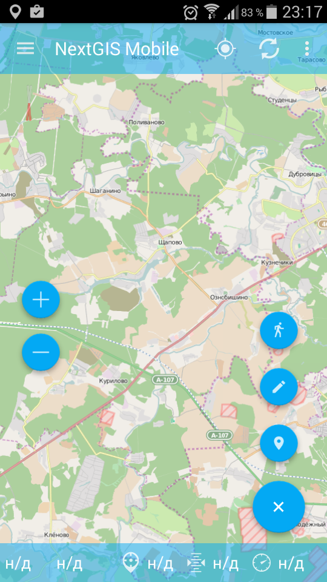
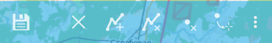
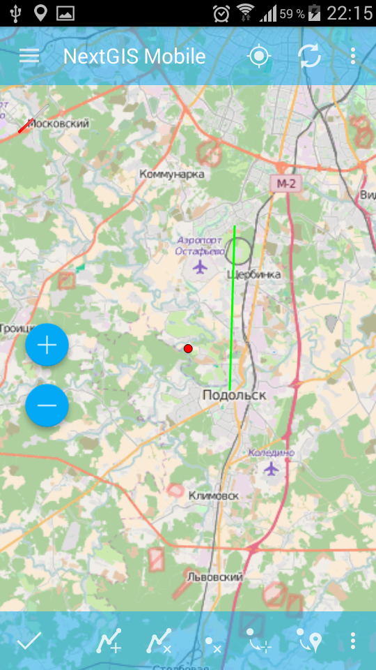
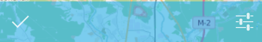

.. sectionauthor:: Дмитрий Барышников <dmitry.baryshnikov@nextgis.ru>

.. _ngmobile_editing:

Описание интерфейса редактирования
==================================

Если к карте были добавлены один или несколько векторных слоев, то их можно 
редактировать. При редактировании предоставляются возможности:

* добавить новую запись в слой;
* удалить запись из слоя;
* изменить запись в слое.

Существует несколько способов попасть в режим редактирования. Первый способ - 
это основная кнопка программы (большая синяя кнопка в правом нижнем углу или 
основная кнопка приложения (FAB). При нажатии на кнопку открывается меню наиболее 
часто используемых действий (см. :numref:`ngmobile_edit_menu_pic`).

   
   Меню редактирования.

Меню имеет следующий состав:

* добавить линию или полигон обходом;
* добавить геометрию;
* добавить текущее местоположение.

Второй способ - это долгим нажатием на геометрию на экране вызвать режим выбора 
(см. :numref:`ngmobile_selectmode_pic`) и в нижней панели инструментов активировать 
команду "редактировать".

Создание записи
================

Для добавления геометрии в векторный слой, необходимо выбрать пункт меню, которому 
соответствует иконка с изображением карандаша (см. :numref:`ngmobile_edit_menu_pic`). 
При этом, вначале открывается диалог выбора слоев (см. :numref:`ngmobile_select_layer_dialog_pic`). 
В зависимости от типа геомерии выбранного слоя отображается соответствующие панели 
инструментов редактора. Таким образом можно добавлять любые типы геометрий 
(точки, линии, полигоны, мультиточки, мультилинии, мультиполигоны).
Для добавления в слой точки следует выбрать из дерева слоев векторный слой для 
добавления точечной геометрии (см. :numref:`ngmobile_select_layer_dialogtch_pic`).

.. figure:: _static/select_layer_dialogtch.png
   :name: ngmobile_select_layer_dialogtch_pic
   :align: center
   :height: 10cm
   
   Диалог выбора слоя.

Для добавления точки в векторный слой необходимо в открывшемся окне в режиме редактирования
точки выбрать на нижней панели инструментов редактирования точки кнопку под цифрой 3 (см. :numref:`ngmobile_edit_paneltch_pic`).

.. figure:: _static/ngmobile_edit_point.png
   :name: ngmobile_edit_paneltch_pic
   :align: center
   :scale: 50%
   
   Панель инструментов редактирования точки. 

Цифрами обозначено: 1 - завершение режима редактирования; 2 - отмена правок; 
3 - добавить новую точку; 4 - удалить точку; 5 - переместить точку в центр экрана; 
6 - переместить точку в текущее местоположение; 7 - редактирование атрибутов.

На карте появится новая геометрия, новая точка, которая будет создана в центре 
экрана и подсвечена красным светом, рядом с точкой будет отображена стрелка (см. :numref:`ngmobile_creation_of_points_pic`).

.. figure:: _static/creation_of_points.png
   :name: ngmobile_creation_of_points_pic
   :align: center
   :height: 10cm

   Этап создания точки на слое. 

При появлении новой точки на карте на нижней панели инструментов редактирования 
точки кнопка под цифрой 1 изменит изображение с галочки на дискету. При нажатии на 
кнопку под цифрой 1 с иконкой в виде дискеты сохраняется созданная точка и открывается 
форма ввода атрибутов новой геометрии (см. :numref:`ngmobile_input_form_attributes_pic`).

.. figure:: _static/input_form_attributes.png
   :name: ngmobile_input_form_attributes_pic
   :align: center
   :height: 10cm
   
   Форма ввода атрибутов геометрии.

Добавление текущего местоположения
-----------------------------------

Для добавления текущего местоположения в векторный слой, необходимо выбрать 
пункт меню, которому соответствует иконка с изображением пушпина (см. :numref:`ngmobile_edit_menu_pic`).  
При этом, в начале открывается диалог выбора слоя, в котором отображаются только 
точечные и мультиточечные слои (см. :numref:`ngmobile_select_layer_dialog_pic`). 
Таким образом можно добавлять только точки или мультиточки с одной точкой. 

.. figure:: _static/ngmobile_selectlayer.png
   :name: ngmobile_select_layer_dialog_pic
   :align: center
   :height: 10cm
   
   Диалог выбора слоя.

Создание линии
----------------

Для создания на слое линии следует выбрать из дерева слоев векторный слой для 
добавления линейной геометрии (см. :numref:`ngmobile_select_layer_dialogtch_pic`).

Для добавления линии в векторный слой необходимо в открывшемся окне в режиме редактирования
линии выбрать на нижней панели инструментов редактирования линии кнопку под цифрой 3 (см. :numref:`ngmobile_edit_line1_pic`).

.. figure:: _static/ngmobile_edit_line.png
   :name: ngmobile_edit_line1_pic
   :align: center
   :scale: 50%
   
   Панель инструментов редактирования линии.
   
Цифрами обозначено: 1 - завершение режима редактирования; 2 - отмена правок; 
3 - добавить новую линию; 4 - удалить линию; 5 - удалить точку из линии; 
6 - переместить точку в центр экрана; 7 - переместить точку в текущее местоположение; 
8 - редактирование атрибутов.

На карте появится новая геометрия, линия, которая будет создана в центре экрана. 
Одна из точек линии, которую можно перемещать по слою на карте, подсвечена красным светом, 
рядом с этой точкой будет отображена стрелка (см. :numref:`ngmobile_creating_lines_pic`).

.. figure:: _static/creating_lines.png
   :name: ngmobile_creating_lines_pic
   :align: center
   :height: 10cm

   Этап создания линии на слое.

При появлении новой линии на карте на нижней панели инструментов редактирования 
линии кнопка под цифрой 1 изменит изображение с галочки на дискету. При нажатии на 
кнопку под цифрой 1 с иконкой в виде дискеты сохраняется созданная линия и открывается 
форма ввода атрибутов новой геометрии (см. :numref:`ngmobile_lower_toolbar_lines_pic`)

   Панель инструментов для редактирования линии     

Форма ввода атрибутов для новой линии открывается после нажатия на кнопку с изображением 
дискеты и выглядит следующим образом(см. :numref:`ngmobile_input_form_attributes_pic`).

Созданная линия в векторном слое на карте отобразится следующим образом (см. :numref:`ngmobile_new_line_pic`).

   
   Созданная линия 

Создание полигона
------------------

Для создания на слое полигона следует выбрать из дерева слоев векторный слой для 
добавления полигональной геометрии (см. :numref:`ngmobile_select_layer_dialogtch_pic`).

Для добавления полигона в векторный слой необходимо в открывшемся окне в режиме 
редактирования полигона выбрать на нижней панели инструментов редактирования полигона 
кнопку под цифрой 3 (см :numref:`ngmobile_edit_polygon1_pic`).

.. figure:: _static/ngmobile_edit_polygon.png
   :name: ngmobile_edit_polygon1_pic
   :align: center
   :scale: 55 %
   
   Панель инструментов редактирования полигона.
   
Цифрами обозначено: 1 - завершение режима редактирования; 2 - отмена правок; 
3 - добавить новый полигон; 4 - удалить полигон; 5 - удалить точку из полигона; 
6 - переместить точку в центр экрана; 7 - переместить точку в текущее местоположение; 
8 - редактирование атрибутов.

На карте появится новая геометрия, полигон, который будет создана в центре экрана. 
Одна из точек полигона, которую можно перемещать по слою на карте, подсвечена красным 
светом, рядом с этой точкой будет отображена стрелка. Выделение любой точки полигона 
позволяет ее перемещать по карте (см. :numref:`ngmobile_creation_landfill_pic`).

.. figure:: _static/creation_landfill.png
   :name: ngmobile_creation_landfill_pic
   :align: center
   :scale: 50%

   Этап создания полигона на слое.     

В результате появление нового полигона на карте на нижней панели инструментов редактирования 
полигона кнопка под цифрой 1 изменит изображение с галочки на дискету. При нажатии на 
кнопку под цифрой 1 с иконкой в виде дискеты сохраняется созданный полигон и открывается 
форма ввода атрибутов новой геометрии 
Форма ввода атрибутов для нового полигона открывается после нажатия на кнопку с изображением 
дискеты и выглядит следующим образом (см. :numref:`ngmobile_input_form_attributes_pic`).

Создание линии или полигона обходом
-----------------------------------

Для добавления линии или полигона обходом необходимо выбрать соответствующий 
пункт меню, которому соответствует иконка, изображенная в виде идущего человека (см. :numref:`ngmobile_edit_menu_pic`). При этом, в начале открывается диалог выбора 
слоя, в котором отображаются только линейные и полигональные слои (см. :numref:`ngmobile_select_layer_dialog_pic`). 
При старте создания линии или полигона обходом открывается нижняя панель инструментов, 
представленная на :numref:`ngmobile_edit_walk_pic1`.

   
   Панель инструментов редактирования обходом.

Далее при накоплении минимального количества точек (для линии - две точки, для 
полигона - три точки) нижняя панель инструментов примет следующий вид :numref:`ngmobile_edit_walk_pic`.

.. figure:: _static/ngmobile_edit_walk.png
   :name: ngmobile_edit_walk_pic
   :align: center
   :width: 5cm
   
   Панель инструментов редактирования обходом.
   
   Цифрами обозначено: 1 - сохранение введенной фигуры; 2 - отмена режима ввода 
   обходом; 3 - настройки ввода обходом.

После завершения обхода при выборе сохранения введенной геометрии (см. :numref:`ngmobile_edit_walk_pic`), 
путем нажатия на иконку с изображением дискеты, открывается форма ввода (стандартная 
или настраиваемая, см. :numref:`ngmobile_attributes_edit_pic`). 

Если отменить сохранение геометрии, путем нажатия на кнопку под цифрой 2 на нижней 
панели инструментов, программа возвращается в режим редактирования выбранного полигонального слоя.

Если в ходе обхода вызвать меню настройки, путем нажатия на кнопку под цифрой 3 на 
нижней панели инструментов, то откроется окно настроек, представленное на :numref:`ngmobile_settings_place_pic`. 
Изменения, внесенные в этом окне, влияют не только на ввод обходом, но и на отображение 
текущего местоположения.

.. note::
   При выборе настроек местоположения таким образом (минимальное время обновления 
   2 сек. и более, минимальное расстояние для обновления 10 м и более) 
   операционная система начинает фильтровать выбросы.

Изменение геометрии
-----------------------------

Редактирование точки
^^^^^^^^^^^^^^^^^^^^

В режиме редактирования точки открывается нижняя панель инструментов, представленная на :numref:`ngmobile_edit_point_pic`.

.. figure:: _static/ngmobile_edit_point.png
   :name: ngmobile_edit_point_pic
   :align: center
   :scale: 55 %
   
   Панель инструментов редактирования точки.
   
   Цифрами обозначено: 1 - завершение режима редактирования; 2 - отмена правок; 
   3 - добавить новую точку; 4 - удалить точку; 5 - переместить точку в центр 
   экрана; 6 - переместить точку в текущее местоположение; 7 - редактирование 
   атрибутов.
   
Пользователь может выбрать имеющуюся точку в слое (она будет подсвечена красным 
цветом, рядом с точкой будет отображена стрелка) или создать новую (новая точка 
будет создана в центре экрана и подсвечена красным светом, рядом с точкой будет 
отображена стрелка). Далее выделенную точку можно смещать, просто потянув ее или 
потянув указывающую на нее стрелку. Кроме того, точку можно сместить в центр 
экрана (см. :numref:`ngmobile_edit_point_pic` п. 5) или в текущее местоположение (см. 
:numref:`ngmobile_edit_point_pic` п. 6), выбрав соответствующие команды в нижней 
панели инструментов.

По умолчанию кнопка отмены (см. :numref:`ngmobile_edit_point_pic` п. 2) не отображается.
 
Редактирование мультиточки
^^^^^^^^^^^^^^^^^^^^^^^^^^

В режиме редактирования мультиточки открывается нижняя панель инструментов, 
представленная на :numref:`ngmobile_edit_multipoint_pic`.

.. figure:: _static/ngmobile_edit_multipoint.png
   :name: ngmobile_edit_multipoint_pic
   :align: center
   :scale: 55 %
   
   Панель инструментов редактирования мультиточки.
   
   Цифрами обозначено: 1 - завершение режима редактирования; 2 - отмена правок; 
   3 - добавить новую мультиточку; 4 - добавить точку к мультиточке; 5 - удалить 
   мультиточку; 6 - удалить точку из мультиточки; 7 - переместить точку в центр 
   экрана; 8 - переместить точку в текущее местоположение; 9 - редактирование 
   атрибутов.
   
При редактировании мультиточки выделяются все точки в нее входящие. Текущая точка 
подсвечена красным светом, рядом с точкой отображена стрелка. 

Панель редактирования позволяет удалить все точки из состава мультиточки или 
выбранную точку. Над выбранной точкой можно выполнять операции:
    
* удалить;
* переместить в центр экрана;
* переместить в текущие координаты.
 
Кроме того, можно добавить точку к мультиточке (см. :numref:`ngmobile_edit_multipoint_pic` 
п. 4).    

Редактирование линии
^^^^^^^^^^^^^^^^^^^^

В режиме редактирования линии открывается нижняя панель инструментов, 
представленная на :numref:`ngmobile_edit_line_pic`.

.. figure:: _static/ngmobile_edit_line.png
   :name: ngmobile_edit_line_pic
   :align: center
   :scale: 55 %
   
   Панель инструментов редактирования линии.
   
   Цифрами обозначено: 1 - завершение режима редактирования; 2 - отмена правок; 
   3 - добавить новую линию; 4 - удалить линию; 5 - удалить точку из линии; 6 - 
   переместить точку в центр экрана; 7 - переместить точку в текущее 
   местоположение; 8 - редактирование атрибутов.
   
При редактировании линии выделяются все точки в нее входящие. Текущая точка 
подсвечена красным светом, рядом с точкой отображена стрелка. Кроме того, между 
точками на линии отмечается центр сегмента линии. При выделении центра сегмента 
линии касанием пальца до экрана устройства, к линии добавляется новая точка и сразу
получает выделение. После добавления точки ее можно перемещать.

Панель редактирования позволяет удалить все точки из состава линии (удалить 
линию) или выбранную точку. 

.. note::
   Если в линии останется одна точка, то такая линия будет удалена. 

Над выбранной точкой в линии можно выполнять операции:
    
* удалить;
* переместить в центр экрана;
* переместить в текущие координаты.

При добавлении новой линии в центре экрана создается линия по умолчанию, которая 
состоит из двух точек. Добавляя точки, можно растягивать линию, менять ее конфигурацию. 
 
Редактирование полигона
^^^^^^^^^^^^^^^^^^^^^^^

В режиме редактирования полигона открывается нижняя панель инструментов, 
представленная на :numref:`ngmobile_edit_polygon_pic`.

.. figure:: _static/ngmobile_edit_polygon.png
   :name: ngmobile_edit_polygon_pic
   :align: center
   :scale: 55 %
   
   Панель инструментов редактирования полигона.
   
   Цифрами обозначено: 1 - завершение режима редактирования; 2 - отмена правок; 
   3 - добавить новый полигон; 4 - удалить полигон; 5 - удалить точку из полигона; 
   6 - переместить точку в центр экрана; 7 - переместить точку в текущее 
   местоположение; 8 - редактирование атрибутов.
   
При редактировании полигона выделяются все точки в него входящие (как внешней 
оболочки, так и каждого внутреннего кольца). Текущая точка подсвечена красным 
цветом, рядом с точкой отображена стрелка. Кроме того, между точками на кольце 
полигона (внешний или внутренние) отмечается центр сегмента линии. При выделении 
центра сегмента линии касанием пальца до экрана устройства, к кольцу добавляется 
новая точка и сразу получает выделение. После добавления точки ее можно перемещать.

Панель редактирования позволяет удалить все точки из состава полигона (удалить 
полигон) или выбранную точку. 

.. note::
   Если в полигоне останется всего две точки, то такой полигон будет удален. 

Над выбранной точкой в кольце полигона можно выполнять операции:
    
* удалить;
* переместить в центр экрана;
* переместить в текущие координаты.   
 
При добавлении полигона в центре экрана создается полигон по умолчанию, который 
состоит из трех точек. Добавляя точки можно растягивать внешнее кольцо полигона, 
менять его конфигурацию.

.. note::
   Поддержки добавления внутренних колец пока не реализовано.

Изменение атрибутов
-------------------------------   
 
При внесении изменений в слой кнопка 1 (см. :numref:`ngmobile_edit_point_pic`) изменяет 
свой значок (со значка в виде галочки на значок в виде дискеты), а кнопка отмены 
появляется на панели инструментов. При нажатии на кнопку 1 происходит открытие диалога 
изменений атрибутов (см. :numref:`ngmobile_attributes_edit_pic`). При нажатии кнопки 2 
происходит отмена ранее сделанных правок. 

.. note::

   Если диалог редактирования атрибутов закрыть без применений изменений (без 
   выбора п. 2 :numref:`ngmobile_attributes_edit_pic`), то ничего не будет сохранено 
   (ни добавление или изменение геометрии, ни атрибуты). 

Для отмены сделанных правок служит кнопка 2 (см. :numref:`ngmobile_edit_point_pic` п. 2). 
Правку можно отменить только до нажатия кнопки "Сохранить" в диалоге изменения 
атрибутов, который открывается после нажатия на кнопку с иконкой в виде дискеты.

Для редактирования новой записи необходимо либо сохранить или отменить правки. 
При редактировании записи, если выбрать кнопку создания новой геометрии, то 
текущая геометрия будет заменена на новую.

При выбранной геометрии, если активировать кнопку 7 (см. :numref:`ngmobile_edit_point_pic` 
п. 7), то откроется диалог изменения атрибутов данной геометрии (см. 
:numref:`ngmobile_attributes_edit_pic`). Диалог изменения атрибутов представляет собой 
вертикальный список названий полей, а также контролов для каждого типа атрибутов:
    
* текстовое поле - для текста и цифр
* пикер даты - для даты и времени 

После выбора слоя открывается форма редактирования атрибутов (см. 
:numref:`ngmobile_attributes_edit_pic`). 

.. figure:: _static/ngmobile_edit_attributes.png
   :name: ngmobile_attributes_edit_pic
   :align: center
   :height: 11cm
   
   Окно редактирования атрибутов.
   
   Цифрами обозначено: 1 - возврат к предыдущему экрану; 2 - сохранение изменений; 
   3 - отмена изменений; 4 - меню дополнительных операций.

.. note::
   В диалоге выбора слоя отображаются только видимые слои. Сам диалог 
   отображается только если слоев несколько. Если подходящий слой один, то сразу 
   открывается форма редактирования атрибутов.
   
Если слою сопоставлена настраиваемая форма, то будет открыта именно она.

После заполнения всех необходимых атрибутов необходимо нажать кнопку 
:numref:`ngmobile_attributes_edit_pic` п. 2 для сохранения изменений. При выборе 
кнопки 1 или 3 происходит возврат к окну карты без сохранения атрибутов. Точка 
также не будет добавлена.

