.. _ngmobile_editing:

Редактирование слоев
=====================

Если к карте были добавлены один или несколько векторных слоёв, то их можно 
редактировать:

* `добавить новый объект <https://docs.nextgis.ru/docs_ngmobile/source/editing.html#ngmobile-add-geometry>`_ в слой;
* `удалить объект <https://docs.nextgis.ru/docs_ngmobile/source/editing.html#ngmobile-editing-toolbar-pic>`_;
* изменить объект:

  * `скорректировать геометрию <https://docs.nextgis.ru/docs_ngmobile/source/editing.html#ngmobile-edit-geometry>`_;
  * `изменить значения атрибутов <https://docs.nextgis.ru/docs_ngmobile/source/editing.html#ngmobile-edit-attributes>`_.

Если у слоя в Веб ГИС есть дочерний ресурс `формы <https://docs.nextgis.ru/docs_ngweb/source/collector.html#collector-create-form>`_, то при добавлении в NextGIS Mobile эта форма будет использоваться для ввода и редактирования атрибутов.

.. _ngmobile_switch_to_edit:

Переход в режим редактирования
------------------------------

Перейти в режим редактирования можно несколькими способами: 

1. **Долгое нажатие** на объект на экране активирует режим редактирования слоя, в котором содержится этот объект. 

Если в выбранном месте находится несколько объектов, например, полигон и точка, то появится список, в котором следует выбрать нужный слой.

Короткое нажатие также вызовет панель инструментов, но из неё можно будет только открыть информацию об объекте.

2. В Дереве слоев вызовите **меню векторного слоя** и выберите пункт "Редактировать".

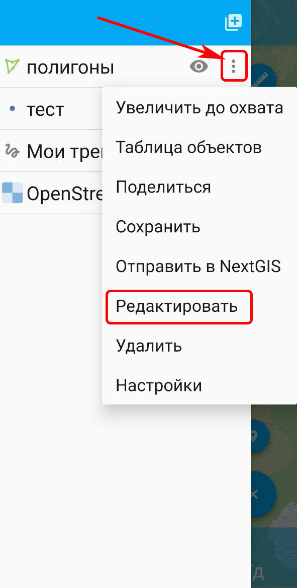
   
   Контекстное меню слоя

3. Нажатие на **большую синюю кнопку** в правом нижнем углу открывает меню основных операций.

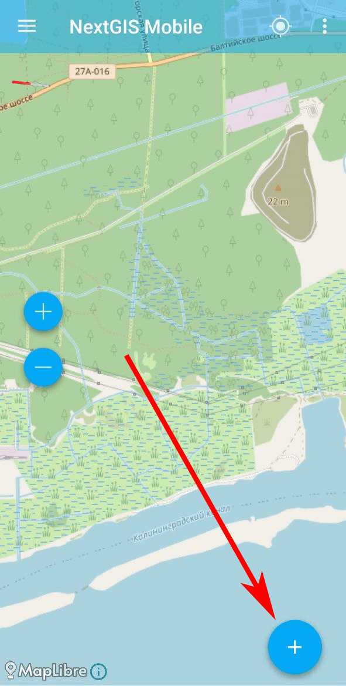

   Вызов меню основных операций

Для того чтобы перейти в режим редактирования, выберите пункт |ic_edit|.

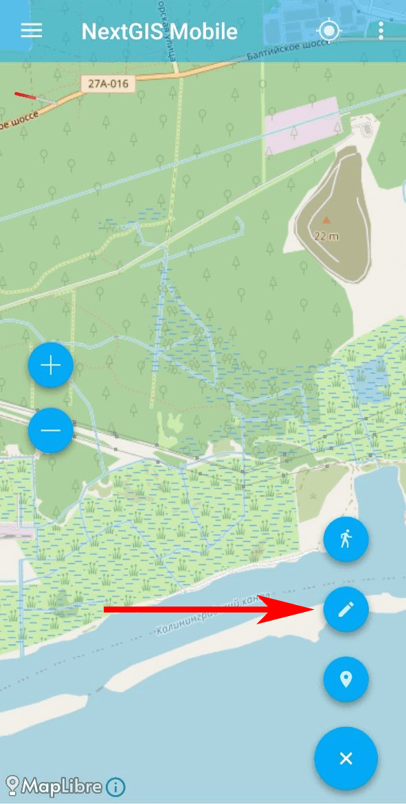

   Переход к редактированию из меню основных операций

В открывшемся диалоге выберите нужный векторный слой. 

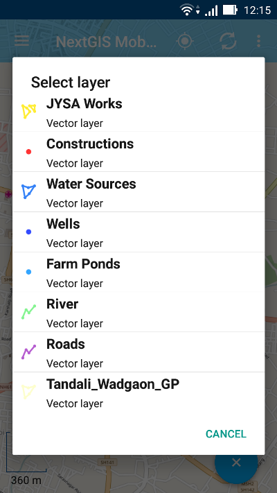
   
   Диалог выбора слоя

.. _ngmobile_editing_toolbar:

Панель инструментов редактирования
----------------------------------

После того, как вы `активировали режим редактирования <https://docs.nextgis.ru/docs_ngmobile/source/editing.html#ngmobile-switch-to-edit>`_, в нижней части экрана откроется Панель инструментов редактирования, она одинаковая для векторных слоёв с любой геометрией.

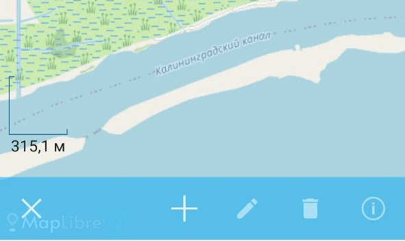
   
   Панель инструментов редактирования

С помощью инструментов этой панели можно:

* |ic_cancel| выйти из режима редактирования; 
* |ic_add_feature| `добавить новый объект <https://docs.nextgis.ru/docs_ngmobile/source/editing.html#ngmobile-add-geometry>`_; 
* |ic_edit| `редактировать геометрию объекта <https://docs.nextgis.ru/docs_ngmobile/source/editing.html#ngmobile-edit-geometry>`_; 
* |ic_delete| удалить объект; 
* |ic_info| просмотреть атрибуты объекта и `перейти к их редактированию <https://docs.nextgis.ru/docs_ngmobile/source/editing.html#ngmobile-edit-attributes>`_.

При переходе к редактированию геометрии в панели будут доступны инструменты для геометрии соответствующего типа:

* `точки/мультиточки <https://docs.nextgis.ru/docs_ngmobile/source/editing.html#ngmobile-edit-point>`_;
* `линии/мультилинии <https://docs.nextgis.ru/docs_ngmobile/source/editing.html#ngmobile-edit-line>`_;
* `полигона/мультиполигона <https://docs.nextgis.ru/docs_ngmobile/source/editing.html#ngmobile-edit-polygon>`_.

.. _ngmobile_add_geometry:

Добавление объектов
-------------------

`Активируйте режим редактирования <https://docs.nextgis.ru/docs_ngmobile/source/editing.html#ngmobile-switch-to-edit>`_ из контекстного меню слоя или через большую синюю кнопку в правом нижнем углу, см.  :ref:`ngmobile_switch_to_edit`. 

В панели инструментов редактирования нажмите кнопку |ic_add_feature|.

Процесс создания геометрий несколько отличается в зависимости от типа геометрии слоя (подробнее описываются ниже):

* `точка <https://docs.nextgis.ru/docs_ngmobile/source/editing.html#ngmobile-add-point>`_
* `линия <https://docs.nextgis.ru/docs_ngmobile/source/editing.html#ngmobile-add-line>`_
* `полигон <https://docs.nextgis.ru/docs_ngmobile/source/editing.html#ngmobile-add-polygon>`_

После ввода геометрии нажмите иконку дискеты. Откроется экран ввода атрибутов.

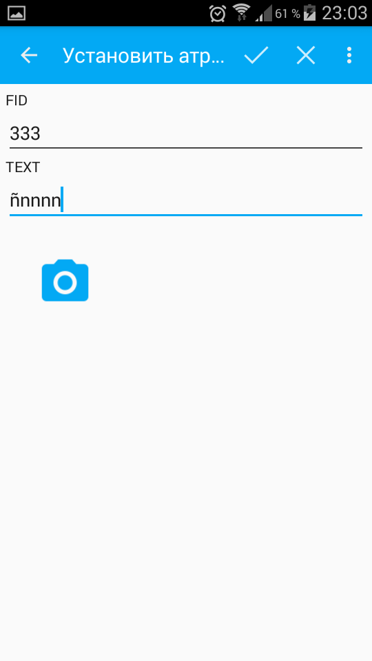
   
   Форма ввода атрибутов объекта.
   
   Цифрами обозначены: 1 - назад; 2 - применить изменения; 3 - добавить фото.
   
К каждому объекту можно прикрепить фотографии, используя кнопку "Добавить фото" |ic_photo|.

Заполните нужные поля, нажмите на галочку |ic_tick|, чтобы завершить создание объекта.

Ниже подробнее описывается создание геометрий разного типа.

.. _ngmobile_add_point:

Создание точки
^^^^^^^^^^^^^^

Выберите векторный слой с точечным/мультиточечным типом геометрии. `Перейдите в режим редактирования <https://docs.nextgis.ru/docs_ngmobile/source/editing.html#ngmobile-switch-to-edit>`_ из контекстного меню слоя или через большую синюю кнопку в правом нижнем углу.

На панели инструментов редактирования нажмите кнопку "Добавить новый объект" |ic_add_feature|.

В центре экрана появится новая точка, которая будет подсвечена красным цветом, рядом с точкой будет отображена стрелка |ic_action_anchor|. 

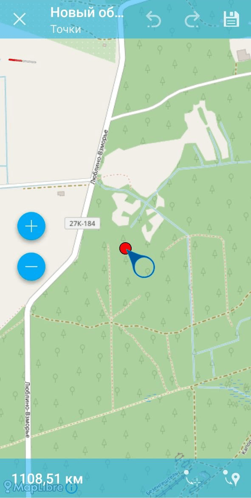

   Добавление точки в точечный слой

Чтобы переместить точку, зажмите стрелку |ic_action_anchor| и перетащите на нужное место. 

Доступны следующие кнопки, в верхней панели:

* |ic_cancel| выход из режима редактирования (без сохранения); 
* |ic_undo| отменить изменения; 
* |ic_redo| повторить/вернуть изменения; 
* |ic_save| сохранить изменения геометрии и перейти к редактированию атрибутов объекта; 

В нижней панели: 

* |ic_move_to_center| переместить точку в центр экрана; 
* |ic_move_to_loc| переместить точку в текущее местоположение.

Для добавления объекта из нескольких точек в слой с **мультиточечной геометрией** после добавления первой точки нажмите "Добавить точку" |ic_add_point|. Новую точку также можно перемещать при помощи стрелки-курсора |ic_action_anchor|.
    
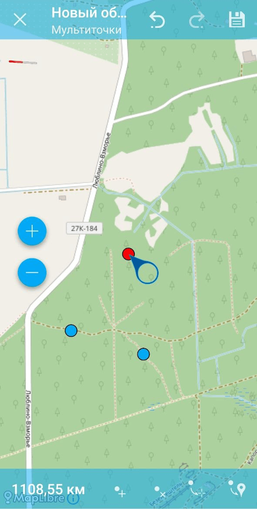

   Добавление точки в мультиточечный слой.
   
Дополнительные инструменты при создании мультиточки:

  * |ic_add_point| добавить точку к мультиточке;
  * |ic_delete_point| удалить точку из мультиточки.
    
После того, как точка установлена в нужное место, нажмите |ic_save|. Созданная геометрия будет сохранена и откроется `форма ввода атрибутов объекта <https://docs.nextgis.ru/docs_ngmobile/source/editing.html#ngmobile-input-form-attributes-pic>`_. 

После того как все атрибуты будут заданы, нажмите "Применить изменения" |ic_tick|, чтобы сохранить атрибуты.

.. _ngmobile_add_line:

Создание линии
^^^^^^^^^^^^^^

Выберите векторный слой с линейным типом геометрии. `Перейдите в режим редактирования <https://docs.nextgis.ru/docs_ngmobile/source/editing.html#ngmobile-switch-to-edit>`_ из контекстного меню слоя или через большую синюю кнопку в правом нижнем углу.

На панели инструментов редактирования нажмите кнопку "Добавить новый объект" |ic_add_feature|.

В центре экрана появится новая линия. Одна из вершин линии будет выделена - рядом с этой вершиной будет отображена стрелка |ic_action_anchor|. Вершины линии можно переместить в любое место на карте, перетаскивая стрелку. 

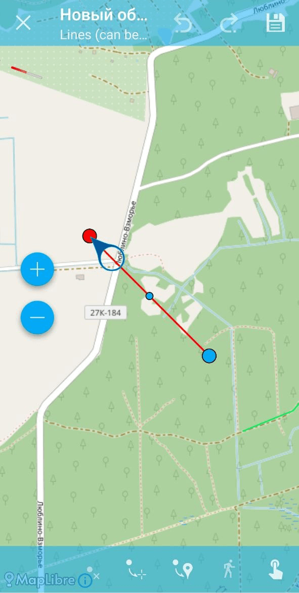

   Добавление линии

Доступны следующие кнопки, в верхней панели:

* |ic_cancel| выход из режима редактирования (без сохранения); 
* |ic_undo| отменить изменения; 
* |ic_redo| повторить/вернуть изменения; 
* |ic_save| сохранить изменения геометрии и перейти к редактированию атрибутов объекта; 

В нижней панели: 

* |ic_delete_point| удалить вершину;
* |ic_move_to_center| переместить вершину в центр экрана; 
* |ic_move_to_loc| переместить вершину в текущее местоположение;
* |ic_walk| дополнить геометрию обходом;
* |ic_touch| дополнить геометрию касанием.

Чтобы **добавить новую вершину**, нажмите на точку в середине сегмента и вытяните её в сторону.

Таким образом можно добавить любое количество вершин и изменить геометрию линии, в том числе можно создать ломаную или плавную кривую линию.

Для добавления объекта из нескольких линий в слой с **мультилинейной** геометрией после добавленя первой линии нажмите "Добавить линию" |ic_add_line|. После этого можно задать положение вершин новой линии.

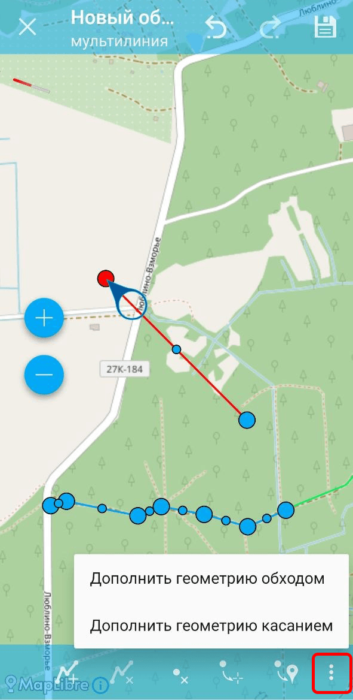

   Добавление линии в мультилинейный слой
   
Для мультилинии в меню доступны доступны следующие дополнительные кнопки:

* |ic_add_line| добавить линию;
* |ic_delete_line| удалить линию.

Добавление геометрии обходом и касанием может не помещаться на экран, в таком случае нажмите на три точки, чтобы увидеть скрытые опции.

После добавления новой линии нажмите |ic_save|. Созданная геометрия будет сохранена и откроется `форма ввода атрибутов объекта <https://docs.nextgis.ru/docs_ngmobile/source/editing.html#ngmobile-input-form-attributes-pic>`_.

Заполните поля формы и нажмите "Применить изменения" |ic_tick|, чтобы сохранить атрибуты.

.. _ngmobile_add_polygon:

Создание полигона
^^^^^^^^^^^^^^^^^

Выберите векторный слой с полигональным/мультиполигональным типом геометрии. `Перейдите в режим редактирования <https://docs.nextgis.ru/docs_ngmobile/source/editing.html#ngmobile-switch-to-edit>`_ из контекстного меню слоя или через большую синюю кнопку в правом нижнем углу.

На панели инструментов редактирования нажмите кнопку "Добавить новый объект" |ic_add_feature|.

В центре экрана появится новый полигон - треугольник. Одна из вершин полигона будет выделена, рядом с этой вершиной будет отображена стрелка |ic_action_anchor|. Чтобы **переместить вершину** полигона выберите её, затем перетащите стрелку на нужное место. 

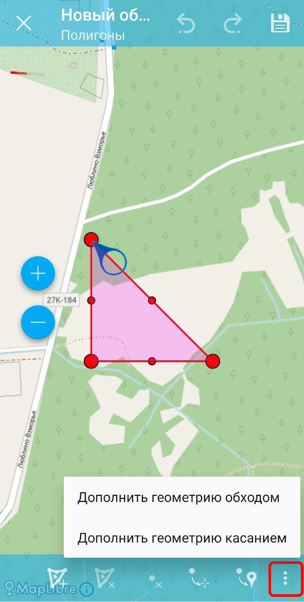

   Добавление полигона

Доступны следующие кнопки, в верхней панели:

* |ic_cancel| выход из режима редактирования (без сохранения); 
* |ic_undo| отменить изменения; 
* |ic_redo| повторить/вернуть изменения; 
* |ic_save| сохранить изменения геометрии и перейти к редактированию атрибутов объекта; 

В нижней панели: 

* |ic_hole| добавить внутреннее кольцо;
* |ic_delete_hole| удалить внутреннее кольцо;
* |ic_delete_point| удалить вершину;
* |ic_move_to_center| переместить вершину в центр экрана; 
* |ic_move_to_loc| переместить вершину в текущее местоположение;

Нажав на три точки, можно открыть меню с остальными функциями, не поместившимися в панель:

* |ic_walk| дополнить геометрию обходом;
* |ic_touch| дополнить геометрию касанием.

Чтобы **добавить вершину**, нажмите на точку в середине ребра полигона.
Таким образом можно добавить любое количество вершин и изменить геометрию полигона как угодно.

Чтобы вырезать в полигоне **внутреннее кольцо**, нажмите на кнопку "Добавить внутреннее кольцо" |ic_hole|. Геометрия кольца изменяется так же, как сам полигон.

.. note::
   Геометрия кольца должна быть расположена ВНУТРИ геометрии полигона, в противном случае изменения не будут сохранены!

Для добавления объекта из нескольких полигонов в **мультиполигональный** слой создайте первый полигон, затем нажмите кнопку "Добавить полигон" |ic_add_polygon|. После этого можно задать геометрию нового полигона.

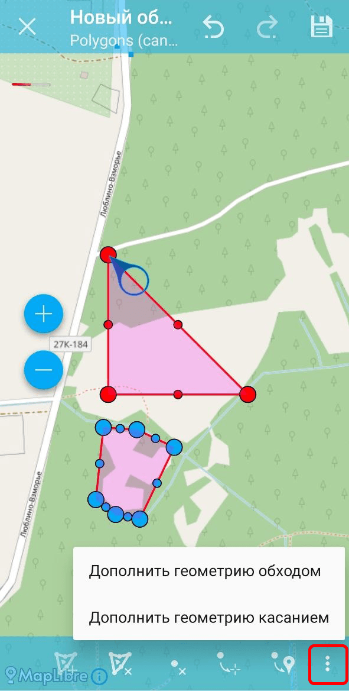

   Добавление полигона в мультиполигональный слой

Для мультиполигонов доступны дополнительные кнопки:

* |ic_add_polygon| добавить полигон;
* |ic_delete_polygon| удалить полигон.

После добавления нового полигона нажмите |ic_save|. Созданная геометрия будет сохранена и откроется `форма ввода атрибутов объекта <https://docs.nextgis.ru/docs_ngmobile/source/editing.html#ngmobile-input-form-attributes-pic>`_.

Заполните поля формы и нажмите "Применить изменения" |ic_tick|, чтобы сохранить атрибуты.

.. _ngmobile_add_location:

Добавление текущего местоположения
----------------------------------

Точку текущего местоположения можно добавить в векторный слой **с точечной или мультиточечной геометрией**.

Нажмите большую сниюю кнопку в нижнем углу и выберите на иконку с изображением пушпина |ic_place|. 

В открывшемся диалоге выберите векторный слой. Если доступен только один точечный/мультиточечный слой, то он будет выбран автоматически.

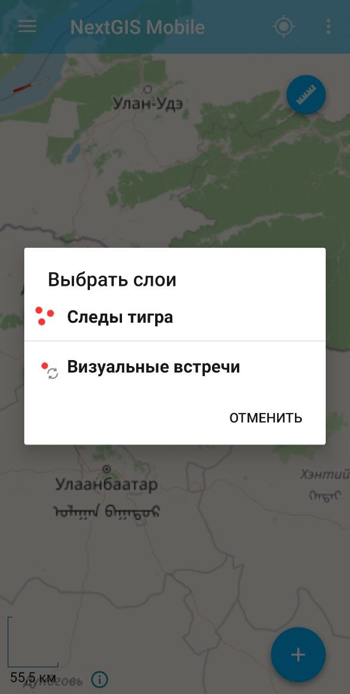
   
   Диалог выбора слоя для добавления текущего местоположения.

Текущее местоположение будет добавлено в выбранный слой в виде нового точечного объекта. Отроется `форма ввода атрибутов объекта <https://docs.nextgis.ru/docs_ngmobile/source/editing.html#ngmobile-input-form-attributes-pic>`_.

Заполните поля формы и нажмите "Применить изменения" |ic_tick|, чтобы сохранить атрибуты.

.. _ngmobile_add_track:

Создание линии или полигона обходом
-----------------------------------

В линейный или полигональный слой можно добавить геометрию обходом - то есть записав траекторию своего перемещения на местности.

Нажмите большую синюю кнопку в нижнем углу и выберите иконку с изображением в виде идущего человека |ic_walk|.

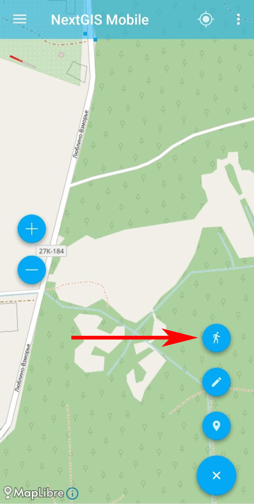

   Выбор способ создания объекта обходом

В открывшемся диалоге выберите слой.

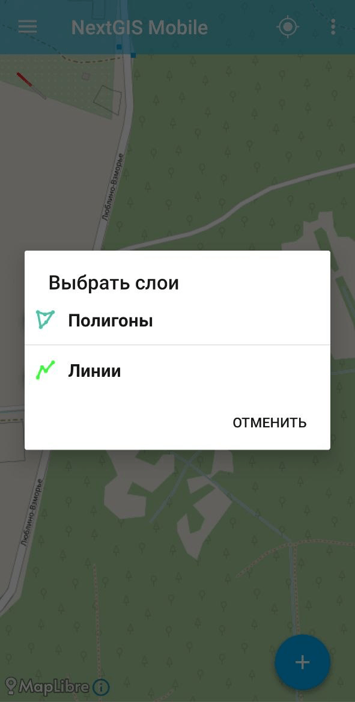
   
   Диалог выбора слоя для добавления геометрии обходом.
   
Этот слой откроется в режиме Записи обходом (см. :numref:`ngmobile_new_gpx_vector_1`), и NextGIS Mobile начнет запись новой геометрии в векторный слой.

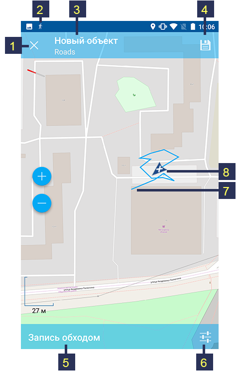

   Добавление геометрии обходом.
   
   Цифрами обозначено: 1 - остановить запись трека (без сохранения); 2 - иконка статуса; 3 - ID объекта и название слоя; 4 - сохранить объект; 5 - статус "Запись обходом"; 6 - переход в настройки местоположения; 7 - стартовая точка; 8 - текущее местоположение устройства.

Если вы уже находитесь в режиме редактирования слоя, можно также начать запись трека обходом, нажав на кнопку "Дополнить геометрию обходом".

.. note:: Если вы видите, что точность добавленной геометрии не достаточна, можно перейти в настройки местоположения NextGIS Mobile (см. :numref:`ngmobile_settings_place_pic`) прямо с экрана "Запись обходом" (см. :numref:`ngmobile_new_gpx_vector_1`, п.6).

По окончании записи трека следует нажать на кнопку |ic_save| **Сохранить объект**. 

Откроется форма ввода атрибутов.

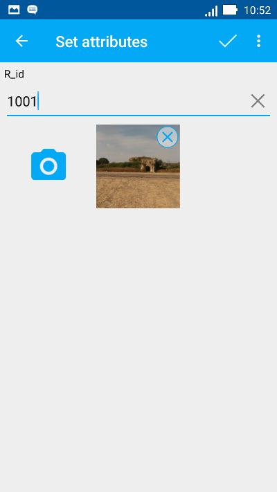

   Форма редактирования атрибутов 
   
Нажмите |ic_tick| "Применить изменения", чтобы завершить добавление объекта.

   
.. _ngmobile_edit_geometry:

Изменение геометрии
-------------------

Долгое нажатие на объект активирует режим редактирования. Выделенный объект изменит свой цвет на **синий** и появится панель инструментов редактирования. Нажмите на иконку |ic_edit|.  После этого объект изменит свой цвет на **красный**, рядом с объектом будет отображена стрелка |ic_action_anchor|.

.. _ngmobile_edit_point:

Редактирование точки и мультиточки
^^^^^^^^^^^^^^^^^^^^^^^^^^^^^^^^^^^

Активировать режим редактирования можно долгим нажатием на нужный объект (см. также `другие способы <https://docs.nextgis.ru/docs_ngmobile/source/editing.html#ngmobile-switch-to-edit>`_). При редактировании **мультиточки** выделяются все входящие в нее точки. Редактируемая в данный момент точка подсвечена красным цветом, рядом с точкой отображена стрелка |ic_action_anchor|.

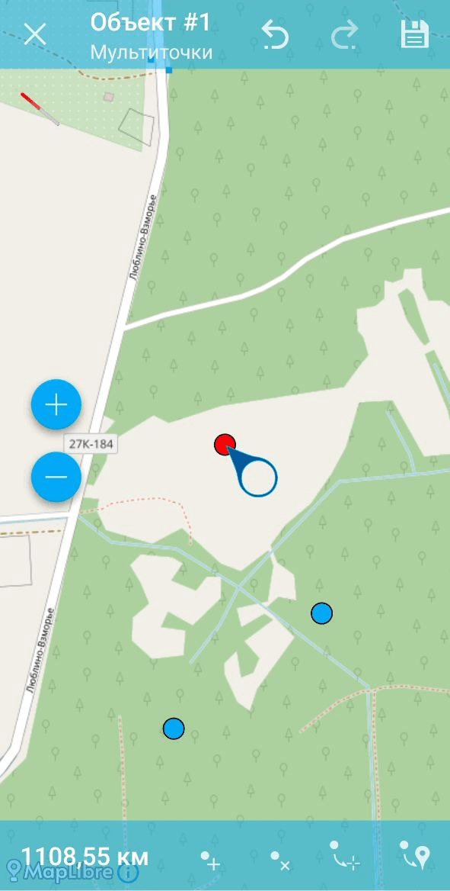

   Редактирование мультиточки

Выбранную точку можно переместить:

* зажав стрелку |ic_action_anchor| и перетащив её на новое место;
* |ic_move_to_center| переместить точку в центр экрана; 
* |ic_move_to_loc| переместить точку в своё текущее местоположение.

Для мультиточек также доступны дополнительные операции:

* |ic_add_point| добавить новую точку к **мультиточке**, 
* |ic_delete_point| удалить выбранную точку из **мультиточки**.

Можно отменить редактирование в любой момент времени без сохранения изменений, нажав |ic_cancel|.

Чтобы завершить редактирование геометрии и сохранить изменения, нажмите |ic_save|.

.. _ngmobile_edit_line:

Редактирование линии и мультилинии
^^^^^^^^^^^^^^^^^^^^^^^^^^^^^^^^^^^

Долгое нажатие на объект активирует панель редактирования. Нажмите на иконку |ic_edit|. 

После этого объект изменит свой цвет на **красный**, рядом с одной из вершин объекта будет отображена стрелка. 

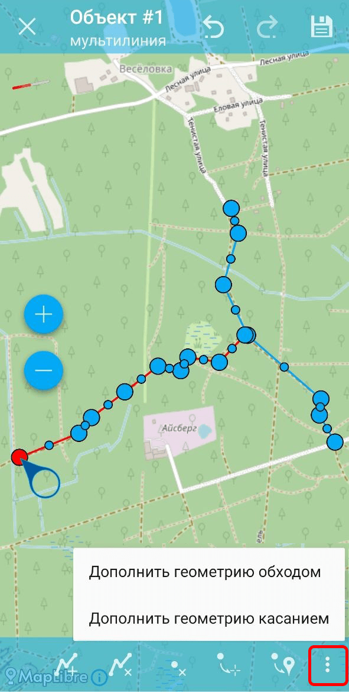

   Редактирование мультилинии

При редактировании **мультилинии** выделяются все входящие в нее линии. Редактируемая в данный момент линия и одна из ее вершин подсвечены красным цветом, рядом с вершиной отображена стрелка |ic_action_anchor|.

Выбранную вершину линии можно переместить:

* зажав стрелку |ic_action_anchor| и перетащив её на новое место;
* |ic_move_to_center| в центр экрана; 
* |ic_move_to_loc| в своё текущее местоположение.

Также можно:

* добавить вершину, выбрав маленькую точку в середине сегмента и перетащив её на нужное место.
* |ic_delete_point| удалить выделенную вершину;
* |ic_add_line| добавить новую линию к **мультилинии**;
* |ic_delete_line| удалить выбранную линию из **мультилинии**;
* дополнить геометрию обходом;
* дополнить геометрию касанием.

.. note::
   Если в линии останется только одна вершина, то такая линия будет удалена. 

Можно отменить редактирование в любой момент времени без сохранения изменений, нажав |ic_cancel|.
   
Чтобы завершить редактирование геометрии и сохранить изменения, нажмите |ic_save|.

.. _ngmobile_edit_polygon:

Редактирование полигона и мультиполигона
^^^^^^^^^^^^^^^^^^^^^^^^^^^^^^^^^^^^^^^^^

Долгое нажатие на объект активирует панель редактирования. Нажмите на иконку |ic_edit|. После этого объект изменит свой цвет на **красный**, рядом с одной из вершин объекта будет отображена стрелка |ic_action_anchor|. При редактировании **мультиполигона** выделяются все входящие в него вершины. Редактируемый в данный момент полигон и одна из его вершин подсвечены красным цветом, рядом с вершиной отображена стрелка.

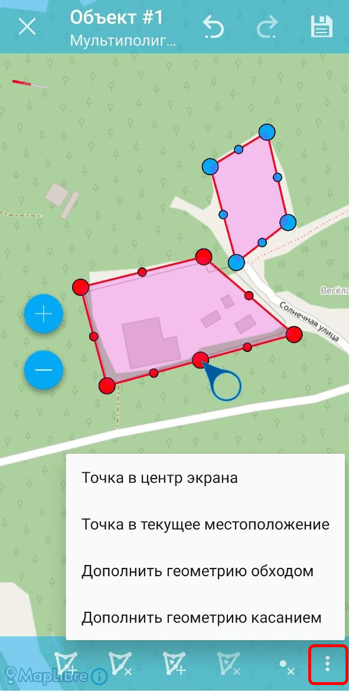

   Редактирование мультиполигона. Опции, не помещающиеся в нижнюю панель, доступны в меню. Нажмите на три точки в правой части панели, чтобы открыть его.

Выбранную вершину можно переместить:

* зажав стрелку |ic_action_anchor| и перетащив её на новое место;
* |ic_move_to_center| в центр экрана; 
* |ic_move_to_loc| в своё текущее местоположение.

В полигоне можно:

* добавить вершину, выбрав маленькую точку в середине сегмента и перетащив её на нужное место;
* |ic_delete_point| удалить выделенную вершину;
* |ic_hole| добавить внутреннее кольцо (геометрия кольца редактируется так же, как геометрия полигона);
* |ic_add_polygon| добавить новый полигон к **мультиполигону**, 
* |ic_delete_polygon| удалить выбранный полигон из **мультиполигона**;
* дополнить геометрию обходом;
* дополнить геометрию касанием.

.. note::

  * Геометрия кольца должна быть расположена ВНУТРИ геометрии полигона, в противном случае изменения не будут сохранены!
  * Если в полигоне останется всего две вершины, то такой полигон будет удален. 

Можно отменить редактирование в любой момент времени без сохранения изменений, нажав |ic_cancel|.
   
Чтобы завершить редактирование геометрии и сохранить изменения, нажмите |ic_save|.

.. _ngmobile_edit_attributes:

Редактирование атрибутов
------------------------

Активируйте режим редактирования для нужного слоя. Например, долгое нажатие на объект откроет панель редактирования. 

После того, как откроется панель редактирования, выделите объект (если он ещё не выделен) и нажмите "Просмотреть атрибуты объекта" |ic_info|, после чего откроется экран просмотра атрибутов объекта. Чтобы перейти к редактированию, нажмите |ic_attributes|.

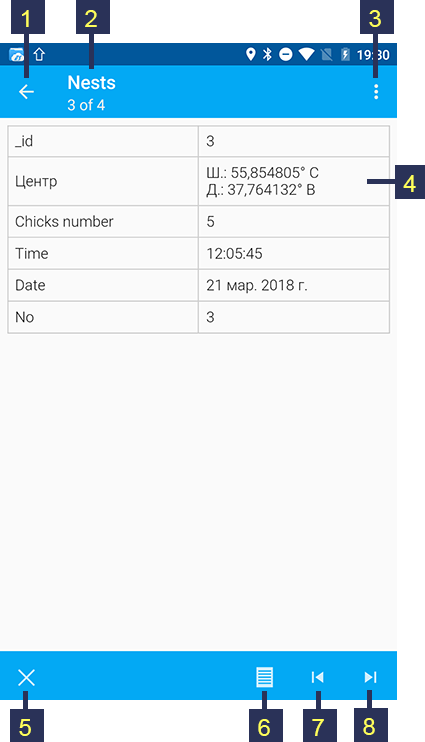

   Экран просмотра атрибутов.
   
   Цифрами обозначены: 1 - вернуться на предыдущий экран; 2 - название слоя и порядковый номер объекта; 3 - настройки; 4 - поля атрибутов; 5 - закрыть экран просмотра атрибутов; 6 - установить атрибуты; 7 - перейти к предыдущему объекту в слое; 8 - перейти к следующему объекту в слое.

NextGIS Mobile показывает следующие поля атрибутов по умолчанию (см. :numref:`ngmobile_editing_attributes_pic`, п.4):
   
  * Для слоев с точечной/мультиточечной геометрией: местоположение каждой точки (широта/долгота).
  * Для слоев с линейной/мультилинейной геометрией: длина каждой линии (в метрах).
  * Для слоев с полигональной/мультиполигональной геометрией: длина периметра (в метрах) и площадь каждого полигона (в квадратных метрах).

Есть две формы редактирования атрибутов:

* по умолчанию доступна `стандартная <https://docs.nextgis.ru/docs_ngmobile/source/editing.html#ngmobile-edit-attributes-standart>`_
* может быть добавлена `пользовательская <https://docs.nextgis.ru/docs_ngmobile/source/editing.html#ngmobile-edit-attributes-ngfp>`_

.. _ngmobile_edit_attributes_standart:

Стандартная форма редактирования атрибутов
^^^^^^^^^^^^^^^^^^^^^^^^^^^^^^^^^^^^^^^^^^

На экране просмотра атрибутов нажмите |ic_attributes|, чтобы перейти к их изменению.

Если к слою не добавлена пользовательская форма, откроется стандартная форма ввода атрибутов. Она содержит все поля слоя, над каждым из которых укзано его название.

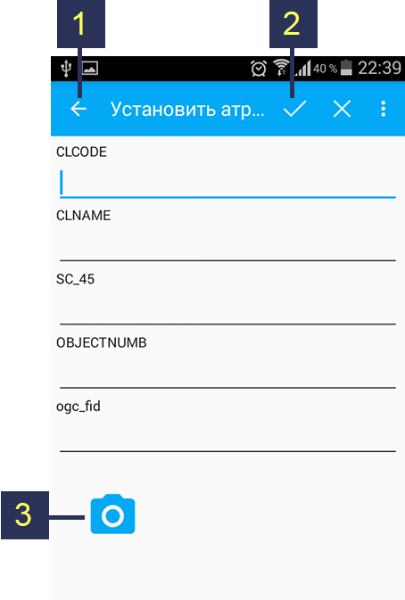
    
   Стандартная форма редактирования атрибутов слоя
   
   Цифрами обозначены: 1 - кнопка "Назад", 2 - кнопка "Применить изменения", 3 - кнопка "Добавить фото".

После того как все атрибуты будут установлены, необходимо нажать кнопку "Применить изменения" |ic_tick|, чтобы сохранить изменения. 

Кнопка |ic_photo| позволяет добавлять к каждому объекту графические файлы (например, фотографии) из локального хранилища или сделать новые фотографии и добавить их.

.. _ngmobile_edit_attributes_ngfp:

Пользовательская форма редактирования атрибутов
^^^^^^^^^^^^^^^^^^^^^^^^^^^^^^^^^^^^^^^^^^^^^^^^
   
Если к слою добавлена `пользовательская форма <https://docs.nextgis.ru/docs_ngweb/source/collector.html#collector-create-form>`_, то для редактирования атрибутов будет использоваться именно она. Пример такой формы приведен ниже: 

.. figure:: _static/non-standard_form.png
   :name: ngmobile_custom_form_pic_1
   :align: center
   :width: 10cm
 
   Пользовательская форма редактирования атрибутов слоя.
   
    Цифрами указаны: 1 - вернуться на предыдущий экран; 2 - применить изменения; 3 - настройки; 4 - текстовое поле для ввода текста и цифр; 5 - выпадающий список; 6 - время и дата; 7 - радио-кнопки.

Пользовательская форма редактирования атрибутов может содержать следующие для ввода поля:

* Текстовое поле - для ввода текста или цифр, в зависимости от типа самого поля;
* Список, Сдвоенный список - выбор из выпадающего меню. Сдвоенный список позволяет сначала выбрать крупную категорию, а затем внутри неё - более мелкую, например, город + район города;
* Флажок;
* Радио-кнопка - выбор одного из возможных вариантов;
* Дата - выбор даты в календаре;
* Фотография - позволяет создать новую фотографию или загрузить изображение с устройства.

После заполнения всех необходимых атрибутов необходимо нажать на кнопку "Применить изменения" |ic_tick| для сохранения изменений. 

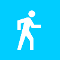

