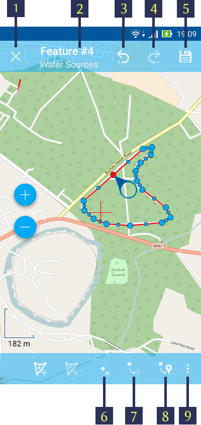
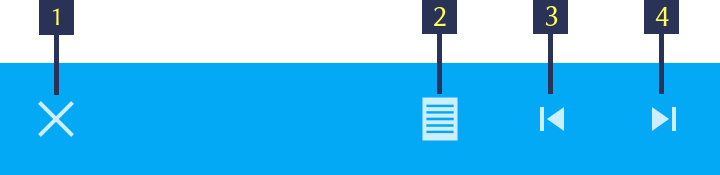
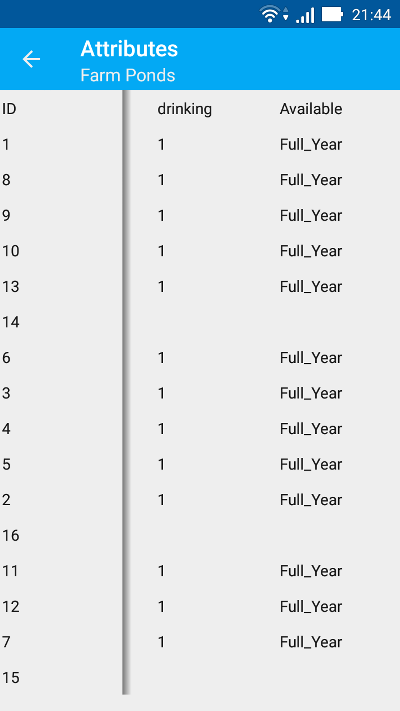
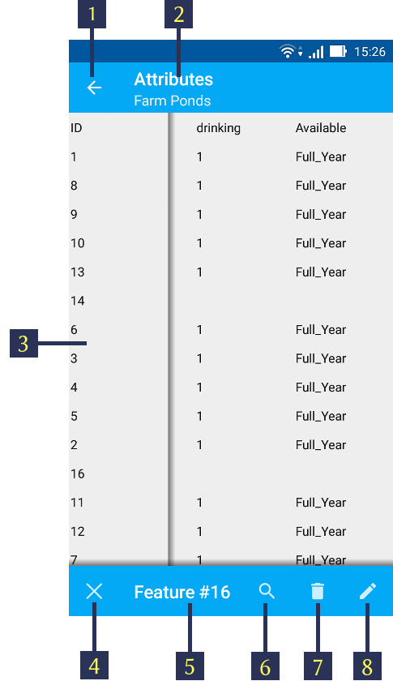

.. sectionauthor:: Dmitry Baryshnikov <dmitry.baryshnikov@nextgis.ru>

.. _ngmobile_editing:

Editing layers
=================

NextGIS Mobile allows you to edit vector layers added to the map. While editing, you can:

* add new features;
* delete features;
* edit features.

Switching to Edit mode
^^^^^^^^^^^^^^^^^^^^^^^

There are several ways to start edit mode.

1. The first way is Main actions button (the big blue button in the right bottom corner of map screen). Pressing Main actions button opens a menu of most common actions (see :numref:`ngmobile_common_action_menu_pic`).

.. figure:: _static/ngmobile_mainscreen_2.png
   :name: ngmobile_common_action_menu_pic
   :align: center
   :height: 11cm
   
   Common actions menu.   
   
   The numbers indicate: 1 - Zoom in; 2 - Zoom out; 3 – Scale ruler; 4 - Measure button; 5 - Geometry by tracking; 6 - Edit layers; 7 - Add current location; 8 - Close action menu.

You need to tap the pencil button (item 6 in :numref:`ngmobile_common_action_menu_pic`) to go to edit mode.

2. The second way to start editing is to long-press the geometry. This will open an Editing Toolbar at the bottom. There you need to tap the "Edit" button to switch on to edit mode (item 3 in ).

3. In the third way, tap on "Layers tree menu" (item 1 in :numref:`ngmobile_main_activity_pic_1`). Then tap on the context menu button next to the layer name (item 5 in :numref:`ngmobile_layer_tree_pic`). This will pop up the context menu itms as shown in item 6 in :numref:`ngmobile_layer_tree_pic`. There you need to select "Edit".

The Editing Toolbar
^^^^^^^^^^^^^^^^^^^^

After switching to edit mode from any of the above, an Editing Toolbar is opened at the bottom of the map screen. (see :numref:`ngmobile_editing_toolbar_pic`)

.. figure:: _static/toolbar_edit_layer.png
   :name: ngmobile_editing_toolbar_pic
   :align: center
   :width: 10cm
   
   Editing Toolbar.
   
   The numbers indicate: 1 - Quit edit mode; 2 - Add new feature; 3 – Edit feature; 4 - Delete feature; 5 - Atributes info.
   
.. note::
   This editing toolbar is common for all type of layers, viz, point, line or polygon.

Adding features
-----------------

If you select the first method To add feature to a vector layer by pressing Main actions button, press a pencil icon (see item 6 in :numref:`ngmobile_common_action_menu_pic`). Tap on a layer name, you'd like to edit in an opened dialog (see :numref:`ngmobile_select_layer_dialogtch_pic`). 

.. figure:: _static/select_layer_dialogtch.png
   :name: ngmobile_select_layer_dialogtch_pic
   :align: center
   :height: 10cm
   
   Select layer dialog.

After you select a layer, map screen switches into Edit mode. It displays an editing toolbar at the bottom of the map screen, as shown in :numref:`ngmobile_editing_toolbar_pic`. You can create any type of geometry (points, lines or polygons).

Adding a point
^^^^^^^^^^^^^^^^

To add a point to an existing layer first select a point vector layer from any of the 3 methods mentioned above. Then tap on the + icon in Bottom toolbar (item 2 in :numref:`ngmobile_editing_toolbar_pic`).

New point will appear in the center of the screen highlighted in red, together with arrow icon. You can move this point any where on the map screen by simply holding the circular handle. The red cross hair marker is left behind at the center of the map screen.(see :numref:`ngmobile_creation_of_points_pic`).

.. figure:: _static/creation_of_points.png
   :name: ngmobile_creation_of_points_pic
   :align: center
   :height: 10cm

   Creating a point.
   
   The numbers indicate: 1 - Close editing (without saving); 2 - Feature Id & name of the Layer; 3 - Undo changes; 4 - Redo changes; 5 - Set attributes; 6 - Move point to the Red Crossover (Center); 7 - Move point to the current location.

After new point is added geometrically, you need to set its attributes by tapping on the "floppy" button (item 5 in :numref:`ngmobile_creation_of_points_pic`). Pressing floppy icon will save a new point and open Attributes editing form (see :numref:`ngmobile_input_form_attributes_pic`).

.. figure:: _static/input_form_attributes.png
   :name: ngmobile_input_form_attributes_pic
   :align: center
   :height: 10cm
   
   Standard attributes editing form.
   
   The numbers indicate: 1 - Back to previous screen; 2 - Apply changes; 3 - Camera
   
Once all the attributes are filled, tap on the Tick icon on the right top corner (item 2 in :numref:`ngmobile_input_form_attributes_pic`) to save the attributes. If you tap on the back button on the left top corner (item 1 in :numref:`ngmobile_input_form_attributes_pic`), the system will warn you of any unsaved changes. The Camera icon at the bottom (item 3 in :numref:`ngmobile_input_form_attributes_pic`) facilitates you to open any photograph from the local storage or take a new photograph of the geographic object just digitized.

Adding a line
^^^^^^^^^^^^^^^

To add a line to an existing layer first select a line vector layer from any of the 3 methods mentioned above. Then tap on the + icon in Bottom toolbar (item 2 in :numref:`ngmobile_editing_toolbar_pic`).

New line will appear in the center of the screen, with one of its vertices highlighted in red and with arrow icon (see :numref:`ngmobile_creating_lines_pic`).

.. figure:: _static/creating_lines.png
   :name: ngmobile_creating_lines_pic
   :align: center
   :height: 10cm

   Creating a line.
   
   The numbers indicate: 1 - Close editing (without saving); 2 - Feature Id & name of the Layer; 3 - Undo changes; 4 - Redo changes; 5 - Set attributes; 6  - Delete vertex; 7 - Move point to the Red Crossover (Center); 8 - Move point to the current location; 9 - Start tracking mode.
   
You can move the vertices any where on the map screen by holding their handle. If you tap on the middle vertex, it will create  two extra vertices automatically. Again in their turn you can move & create as many vertices till your purpose is served. In this way you can even get a smooth curve as per the geographic shape.

After new line is added geometrically, you need to set its attributes by tapping on the "floppy" button (item 5 in :numref:`ngmobile_creating_lines_pic`). Pressing floppy icon will save a new line and open Attributes editing form as shown in :numref:`ngmobile_input_form_attributes_pic` above.   

Once all the attributes are filled, tap on the Tick icon on the right top corner (item 2 in :numref:`ngmobile_input_form_attributes_pic`) to save the attributes. If you tap on the back button on the left top corner (item 1 in :numref:`ngmobile_input_form_attributes_pic`), the system will warn you of any unsaved changes. The Camera icon at the bottom (item 3 in :numref:`ngmobile_input_form_attributes_pic`) facilitates you to open any photograph from the local storage or take a new photograph of the geographic object just digitized.

Adding a polygon
^^^^^^^^^^^^^^^^^^

To add a line to an existing layer first select a line vector layer from any of the 3 methods mentioned above. Then tap on the + icon in Bottom toolbar (item 2 in :numref:`ngmobile_editing_toolbar_pic`).

New polygon will appear in the center of the screen, with one of its vertices highlighted in red and with arrow icon (see :numref:`ngmobile_creation_landfill_pic`).

.. figure:: _static/creation_landfill.png
   :name: ngmobile_creation_landfill_pic
   :align: center
   :height: 10cm

   Creating a polygon.
   
   The numbers indicate: 1 - Close editing (without saving); 2 - Feature Id & name of the Layer; 3 - Undo changes; 4 - Redo changes; 5 - Set attributes; 6  - Delete vertex; 7 - Move point to the Red Crossover (Center); 8 - Move point to the current location; 9 - Start tracking mode.
   
   The left 2 buttons are for multi polygon editing, an advanced topic not covered here.

After new polygon is added geometrically, you need to set its attributes by tapping on the "floppy" button (item 5 in :numref:`ngmobile_creation_landfill_pic`). Pressing floppy icon will save a new polygon and open Attributes editing form as shown in :numref:`ngmobile_input_form_attributes_pic` above.   

Once all the attributes are filled, tap on the Tick icon on the right top corner (item 2 in :numref:`ngmobile_input_form_attributes_pic`) to save the attributes. If you tap on the back button on the left top corner (item 1 in :numref:`ngmobile_input_form_attributes_pic`), the system will warn you of any unsaved changes. The Camera icon at the bottom (item 3 in :numref:`ngmobile_input_form_attributes_pic`) facilitates you to open any photograph from the local storage or take a new photograph of the geographic object just digitized.

Adding current location 
--------------------------

To add current location to a vector layer press Main actions button, and then press a pushpin icon (item 7 in  :numref:`ngmobile_common_action_menu_pic`). In an opened dialog select a layer you'd like to add current location to (only point geometry layers will be displayed) (see :numref:`ngmobile_select_layer_dialog_pic`). If there is only one points layer available, it will be selected automatically. 

.. figure:: _static/ngmobile_selectlayer.png
   :name: ngmobile_select_layer_dialog_pic
   :align: center
   :height: 10cm
   
   Select layer dialog.

Current location will be added to selected layer as a new point consisting of 1 point.

Further actions are same as in "Adding a point"

Adding line or polygon by tracking
-------------------------------------

To add line or polygon by tracking to a vector layer press Main actions button, and then press a walking man icon (item 5 in  :numref:`ngmobile_common_action_menu_pic`). In an opened dialog select a layer you'd like to add current location to (only line and polygon geometry layers will be displayed) (see :numref:`ngmobile_select_layer_dialog_pic`). After you select a layer, map screen switches into Edit Tracking mode (see :numref:`ngmobile_edit_walk_pic1`).

.. figure:: _static/edit_panel_circumvention_tools.png
   :name: ngmobile_edit_walk_pic1
   :align: center
   :width: 6cm
   
   Edit Tracking toolbar.

After accumulation of a minimum number of points (for line - 2 points, for polygon - 3 points) Bottom toolbar will transform.

.. figure:: _static/ngmobile_edit_walk.png
   :name: ngmobile_edit_walk_pic
   :align: center
   :width: 6cm

   Edit Tracking toolbar.

   The numbers indicate:  1 - Save a geometry; 2 - Quit Edit Tracking mode; 3 - Location settings.

Pressing floppy icon will save a new geometry (line or polygon) and open default or custom Attributes editing form (see :numref:`ngmobile_attributes_edit_pic`). 

Pressing Cancel icon will stop Edit Tracking mode and switch the app to Edit mode.

Pressing Settings icon while tracking will open location settings (:numref:`ngmobile_settings_place_pic`). These settings affect not only the tracking accuracy but also accuracy of current location.

.. note::
   If you set value of minimum update time at 2 sec or more and value of minimum update distance at 10 m or more, the operating system will start to smooth the track (remove outliers).

Editing a geometry
-------------------

To edit an existing layer first select that vector layer from any of the 3 methods mentioned above and enter the editing mode. The feature will turn its colour to **Blue**. Then tap on the pencil icon in Bottom toolbar (item 3 in :numref:`ngmobile_editing_toolbar_pic`). The feature will turn its colour to **Red** in edit mode.

Editing a point
^^^^^^^^^^^^^^^^

To start editing a point it should be first selected by pressing on it. It will change its colour to blue. Then tap on the pencil icon in Bottom toolbar (item 3 in :numref:`ngmobile_editing_toolbar_pic`). The selected point feature will be highlighted in red and have an arrow pointing at it.

To change location of a selected point simply pull it or arrow pointing at it to a desired place. Also a point can be moved using buttons from Bottom toolbar - to the center of the screen shown as Red Crosshair marker (item 6 in :numref:`ngmobile_creation_of_points_pic`) or to the current device location (see item 7 in :numref:`ngmobile_creation_of_points_pic`).

You can cancel editing at any point of time, without saving changes, by close editing button. (see item 1 in :numref:`ngmobile_creation_of_points_pic`). The system will warn you about this.

In the end you can have your geofeatures digitized as shown below. See :numref:`ngmobile_editing_of_points_pic`.

   
   Editing point
   
   The numbers from 1 to 7 explains the same as shown in :numref:`ngmobile_creation_of_points_pic` above.

Editing a line
^^^^^^^^^^^^^^

To start editing a line it should be first selected by pressing on it. It will change its colour to blue. Then tap on the pencil icon in Bottom toolbar (item 3 in :numref:`ngmobile_editing_toolbar_pic`). The line will change its colour to red and will show all its vertices. Current vertex is highlighted in red and has an arrow pointing at it. The center of line segment between vertices is also indicated. Pressing the center of line segment leads to two new vertex being added to the line. 

New vertex can be moved or otherwise edited right after it has been added. Also a vertex can be moved using buttons from Bottom toolbar - to the center of the screen shown as Red Crosshair marker (item 7 in :numref:`ngmobile_creating_lines_pic`) or to the current device location (see item 8 in :numref:`ngmobile_creating_lines_pic`).

You can delete the unrequired vertex by highlighting it and tapping delete vertex (see item 6 in :numref:`ngmobile_creating_lines_pic`)

In this way you can even get a smooth curve as per the geographic shape.

In the end you can have your geofeatures digitized as shown below. See :numref:`ngmobile_editing_lines_pic`.

.. figure:: _static/editing_lines.png
   :name: ngmobile_editing_lines_pic
   :align: center
   :height: 10cm
   
   Editing line
   
   The numbers from 1 to 7 explains the same as shown in :numref:`ngmobile_creating_lines_pic` above.

.. note::
   If only one vertex remains in a line this line is deleted automatically.

Editing a polygon
^^^^^^^^^^^^^^^^^

To start editing a polygon it should be first selected by pressing on it. It will change its colour to blue. Then tap on the pencil icon in Bottom toolbar (item 3 in :numref:`ngmobile_editing_toolbar_pic`). The polygon will change its colour to red and will show all its vertices. Current vertex is highlighted in red and has an arrow pointing at it. The center of line segment between vertices is also indicated. Pressing the center of line segment leads to two new vertex being added to the line. 

New vertex can be moved or otherwise edited right after it has been added. Also a vertex can be moved using buttons from Bottom toolbar - to the center of the screen shown as Red Crosshair marker (item 7 in :numref:`ngmobile_creation_landfill_pic`) or to the current device location (see item 8 in :numref:`ngmobile_creation_landfill_pic`).

You can delete the unrequired vertex by highlighting it and tapping delete vertex (see item 6 in :numref:`ngmobile_creation_landfill_pic`)

In the end you can have your geofeatures digitized as shown below. See :numref:`ngmobile_editing_polygon_pic`.

   
   Editing polygon
   
   The numbers from 1 to 7 explains the same as shown in :numref:`ngmobile_creation_landfill_pic` above.

Editing attributes
--------------------

After layer is in edit mode as explained before, an editing toolbar, as shown in :numref:`ngmobile_editing_toolbar_pic`, appears in the bottom of the map screen. You need to tap on "Attribute info" (see item 5 in :numref:`ngmobile_editing_toolbar_pic`). This will open Attribute info panel as shown in :numref:`ngmobile_attributes_info_pic` below.

.. figure:: _static/ngmobile_attributes_info.png
   :name: ngmobile_attributes_info_pic
   :align: center
   :height: 10cm
   
   Attribute info
   
   The numbers indicate: 1 - Back to previous screen; 2 - Layer name & feature count; 3 - Settings; 4 - Attribute fields; 5 - Close attribute info panel; 6 - Set attributes; 7 - Previous record; 8 - Next record.

Editing attributes using standard form
^^^^^^^^^^^^^^^^^^^^^^^^^^^^^^^^^^^^^^^

You need to tap on "Set attributes" button (see item 6 in :numref:`ngmobile_attributes_info_pic`). This opens a standard attribute editing form as shown in :numref:`ngmobile_input_form_attributes_pic`. Once all the attributes are filled, tap on the Tick icon on the right top corner (item 2 in :numref:`ngmobile_input_form_attributes_pic`) to save the attributes. If you tap on the back button on the left top corner (item 1 in :numref:`ngmobile_input_form_attributes_pic`), the system will warn you of any unsaved changes. The Camera icon at the bottom (item 3 in :numref:`ngmobile_input_form_attributes_pic`) facilitates you to open any photograph from the local storage or take a new photograph of the geographic object under intervention.

The Attributes toolbar
^^^^^^^^^^^^^^^^^^^^^^^

The Attributes toolbar is common for all the geometric features, viz. point, line or polygon, as shown below in :numref:`ngmobile_editing_attributes_toolbar_pic`   

   
   Attributes Toolbar.
   
   The numbers indicate: 1 - Close attributes info; 2 - Set attributes; 3 - Previous record; 4 - Next record.
   
.. note::
   This Attribute Toolbar is common for all type of layers, viz, point, line or polygon
   
Alternate method
^^^^^^^^^^^^^^^^^

Tap on "Layers tree menu" (item 1 in :numref:`ngmobile_main_activity_pic_1`). Then tap on the context menu button next to the layer name (item 5 in :numref:`ngmobile_layer_tree_pic`). This will pop up the context menu itms as shown in item 6 in :numref:`ngmobile_layer_tree_pic`. There you need to select "Attributes". Attribute table for that layer opens as shown in :numref:`ngmobile_attribute_table_pic` below.

   
   Attributes Table.

Here you can tap on any record (row) in the table. Attribute table toolbar appears at the bottom of the screen. This facilitates a few actions for that record with corresponding ID as shown below in :numref:`ngmobile_attribute_table_toolbar_pic`.

   
   Attributes table toolbar.
   
   The numbers indicate: 1 - Close attribute table; 2 - Layer name; 3 - Attribute table;  4 - Close toolbar; 5 - selected feature ID; 6 - Show this feature on map screen; 7 - Delete feature; 8 - Open attribute editing form.
   
.. note::
   If you tap on "Delete" button (see item 7 in :numref:`ngmobile_attribute_table_toolbar_pic`), the system deletes the feature momentarily although providing **undo** menu, live for 5 seconds. If undo action is not selected, the feature gets deleted permanently.   

Editing attributes using custom form
^^^^^^^^^^^^^^^^^^^^^^^^^^^^^^^^^^^^^

If the layer includes customized attributes form (layer created with a ngfp file), instead of standard one (see :numref:`ngmobile_input_form_attributes_pic`), the following form as shown below in :numref:`ngmobile_custom_form_pic`  will be used in Edit attributes dialog. 

.. figure:: _static/custom_form.png
   :name: ngmobile_custom_form_pic
   :align: center
   :height: 10cm
   
   Custom attributes editing form.
   
  The numbers indicate: 1 - Back to previous screen; 2 - Apply changes; 3 - Settings; 4 - Text or Integer; 5 - Dropdown list; 6 - Date & Datetime; 7 - Radio buttons. 

Customized attributes form may contain the following entry fields:

* Text;
* Space;
* Text field;
* List; Tandem list;
* Checkbox;
* Radio button;
* Date Picker;
* Photo.

"Text" field is used to provide additional information about created geometry.
"Text field" can be used to add text or integers, depending on the field type (see item 4 in :numref:`ngmobile_custom_form_pic`). 

"List" and "Tandem list" fields are used to store and select values included in custom lists, for example, "List" - region/republic/territory, "Tandem list" - district/area in region/republic/territory (see item 5 in :numref:`ngmobile_custom_form_pic`). 

"Radio button" field allows to select one element from a list of mutually exclusive options (see item 7 in :numref:`ngmobile_custom_form_pic`). 

"Date picker" field allows to select date, time or both of them (see item 6 in :numref:`ngmobile_custom_form_pic`). 

After filling in all required attributes press Tick button (item 2 in :numref:`ngmobile_custom_form_pic`) to save edits. Pressing buttons 1 or 5 will return you to Map screen. The system will warn you about any unsaved changes.
