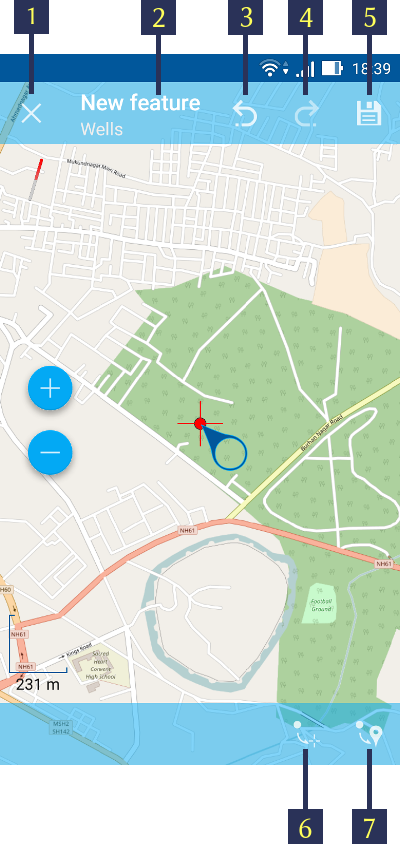
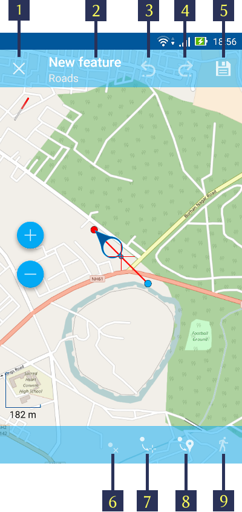
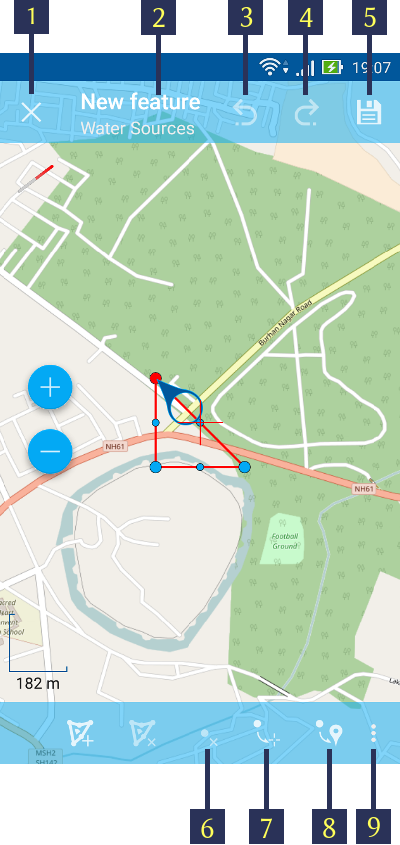

.. sectionauthor:: Дмитрий Барышников <dmitry.baryshnikov@nextgis.ru>

.. _ngmobile_editing:

Редактирование слоев
=====================

Если к карте были добавлены один или несколько векторных слоёв, то их можно 
редактировать. При редактировании предоставляются возможности:

* добавить новый объект в слой;
* удалить объект;
* изменить объект.

.. _ngmobile_switch_to_edit:

Переход в режим редактирования
------------------------------

Существует несколько способов перейти в режим редактирования. 

1. Первый способ: нажать на основную кнопку приложения (большая синяя кнопка в правом нижнем углу, т.н. FAB). При нажатии на кнопку открывается меню основных операций (см. :numref:`ngmobile_edit_menu_pic`).

.. figure:: _static/ngmobile_edit_menu.png
   :name: ngmobile_edit_menu_pic
   :align: center
   :height: 10cm
   
   Меню основных операций.
   
   Цифрами указаны: 1 - приблизить; 2 - отдалить; 3 – масштаб; 4 - линейка; 5 - добавить геометрию обходом; 6 - редактировать слои; 7 - добавить текущее местоположение; 8 - закрыть меню основных операций.

Для того чтобы перейти в режим редактирования, необходимо выбрать пункт меню "Редактировать слои", которому соответствует иконка с изображением карандаша (см. :numref:`ngmobile_edit_menu_pic`, п. 6).

В открывшемся диалоге выбора слоев (см. :numref:`ngmobile_select_layer_dialogtch_pic`) следует выбрать векторный слой, который вы планируете редактировать. 

.. figure:: _static/select_layer_dialogtch.png
   :name: ngmobile_select_layer_dialogtch_pic
   :align: center
   :height: 10cm
   
   Диалог выбора слоя.

2. Второй способ: долгим нажатием на объект на экране активировать режим редактирования слоя, в котором содержится данный объект.

3. Третий способ: в Дереве слоев (см. :numref:`ngmobile_main_activity_pic`, п. 1) нажать кнопку вызова контекстного меню соответствующего векторного слоя (см. :numref:`ngmobile_layer_tree_pic`, п. 5). В открывшемся контекстном меню (см. :numref:`ngmobile_layer_tree_pic`, п. 6) следует выбрать пункт "Редактировать".

.. _ngmobile_editing_toolbar:

Панель инструментов редактирования
----------------------------------

После перехода в режим редактирования с помощью любого из способов, описанных в разделе :ref:`ngmobile_switch_to_edit` в нижней части экрана откроется Панель инструментов редактирования (см. :numref:`ngmobile_editing_toolbar_pic`).

.. figure:: _static/toolbar_edit_layer.png
   :name: ngmobile_editing_toolbar_pic
   :align: center
   :width: 10cm
   
   Панель инструментов редактирования.
   
   Цифрами обозначены: 1 - завершение режима редактирования; 2 - добавить новый объект; 3 – редактировать объект; 4 - удалить объект; 5 - просмотреть атрибуты объекта.

.. note::
   Данный вид Панели инструментов редактирования является общим для всех векторных слоев вне зависимости от типа геометрии (точка, линия или полигон).

.. _ngmobile_add_geometry:

Добавление объектов
-------------------

Для создания нового объекта нужно выбрать слой, в которой планируется его добавить. Затем следует перейти в режим редактирования, используя один из методов, описанных в разделе :ref:`ngmobile_switch_to_edit`. 

Когда панель инструментов редактирования откроется, следует нажать на кнопку "Добавить новый объект" (см. :numref:`ngmobile_editing_toolbar_pic`, п.2). 

.. note::
   Тип геометрии нового объекта должен соответствовать типу геометрии слоя, в который планируется его добавить (например, новую точку можно добавить только в точечный/мультиточечный векторный слой, новую линию - в линейный/мультилинейный векторный слой, и т.д.).

.. note::
   Для того чтобы добавить новые объекты с нуля, сначала следует создать пустой слой, как описано в разделе :ref:`ngmobile_create_vector`.

.. _ngmobile_add_point:

Создание точки
^^^^^^^^^^^^^^

1. Для добавления в слой точки следует выбрать из дерева слоев векторный слой с точечным/мультиточечным типом геометрии (см. :numref:`ngmobile_select_layer_dialogtch_pic`). Затем перейти в режим редактирования с помощью одного из методов, описанных в разделе :ref:`ngmobile_switch_to_edit`.

2. На панели инструментов редактирования необходимо нажать на кнопку "Добавить новый объект" (см. :numref:`ngmobile_editing_toolbar_pic`, п.2). 

3. На карте появится новая точка, которая будет создана в центре экрана и подсвечена красным цветом, рядом с точкой будет отображена стрелка. Эту точку можно переместить в любое место на карте, нажав на стрелку и, не отпуская, перетянув ее на новое место. Красный крестик обозначает центр экрана (см. :numref:`ngmobile_creation_of_points_pic`).

   Добавление точки в точечный слой.
   
   Цифрами обозначены: 1 - завершение режима редактирования (без сохранения); 2 - название объекта и название слоя; 3 - отменить изменения; 4 - повторить изменения; 5 - сохранить изменения и перейти к редактированию атрибутов объекта; 6 - переместить точку в центр экрана; 7 - переместить точку в текущее местоположение.
 
4. Для добавления точки в слой с мультиточечной геометрией необходимо выполнить пункты 1-2, а затем нажать на кнопку "Добавить точку" (см. :numref:`ngmobile_creation_of_multipoints_pic`, п.6). После этого можно задать положение новой точки, как описано в пункте 3.
    
.. figure:: _static/creation_of_multipoints.png
   :name: ngmobile_creation_of_multipoints_pic
   :align: center
   :height: 10cm

   Добавление точки в мультиточечный слой.
   
   Цифрами обозначены: 1 - завершение режима редактирования (без сохранения); 2 - название объекта и название слоя; 3 - отменить изменения; 4 - повторить изменения; 5 - сохранить изменения и перейти к редактированию атрибутов объекта;  6 - добавить точку; 7 - удалить точку; 8 - переместить точку в центр экрана; 9 - переместить точку в текущее местоположение.
    
5. После добавления новой точки можно установить ее атрибуты, нажав на иконку с изображением дискеты (п.5 на :numref:`ngmobile_creation_of_points_pic` и :numref:`ngmobile_creation_of_multipoints_pic`). При нажатии на эту кнопку произойдет 
сохранение созданной геометрии и откроется форма ввода атрибутов объекта  (см. :numref:`ngmobile_input_form_attributes_pic`).

.. figure:: _static/input_form_attributes.png
   :name: ngmobile_input_form_attributes_pic
   :align: center
   :height: 10cm
   
   Форма ввода атрибутов объекта.
   
   Цифрами обозначены: 1 - назад; 2 - применить изменения; 3 - добавить фото.
   
6. После того как все атрибуты будут заданы, следует нажать на кнопку "Применить изменения" (см. :numref:`ngmobile_input_form_attributes_pic`, п.2), чтобы сохранить атрибуты. Если вместо этого нажать на кнопку "Назад" (см. :numref:`ngmobile_input_form_attributes_pic`, п.1), приложение предупредит о несохраненных изменениях. К каждому объекту можно прикрепить фотографию, используя кнопку "Добавить фото" (см. :numref:`ngmobile_input_form_attributes_pic`, п.3).

.. _ngmobile_add_line:

Создание линии
^^^^^^^^^^^^^^

1. Для создания линии следует выбрать из дерева слоев векторный слой с линейным/мультилинейным типом геометрии (см. :numref:`ngmobile_select_layer_dialogtch_pic`). Затем перейти в режим редактирования с помощью одного из методов, описанных в разделе :ref:`ngmobile_switch_to_edit`.

2. На панели инструментов редактирования необходимо нажать на кнопку "Добавить новый объект" (см. :numref:`ngmobile_editing_toolbar_pic`, п.2).

3. На карте появится новая линия, которая будет создана в центре экрана. Одна из вершин линии будет подсвечена красным цветом, рядом с этой вершиной будет отображена стрелка (см. :numref:`ngmobile_creating_lines_pic`).

   Добавление линии в линейный слой.
   
   Цифрами обозначены: 1 - завершение режима редактирования (без сохранения); 2 - название объекта и название слоя; 3 - отменить изменения; 4 - повторить изменения; 5 - сохранить изменения и перейти к редактированию атрибутов объекта;  6 - удалить вершину; 7 - переместить вершину в центр экрана; 8 - переместить вершину в текущее местоположение; 9 - дополнить геометрию обходом; 10 - дополнить геометрию касанием.

Вершины, принадлежащие линии, можно переместить в любое место на карте, нажав на стрелку возле одной из них и, не отпуская, перетянув ее на новое место. При нажатии на вершину в центре линии, автоматически содадутся две новые вершины. Таким образом можно добавить любое количество вершин и изменить геометрию линии, в том числе можно создать ломаную или плавную кривую линию.

4. Для добавления линии в слой с мультилинейной геометрией необходимо выполнить пункты 1-2, а затем нажать на кнопку "Добавить линию" (см. :numref:`ngmobile_creating_multilines_pic`, п.6). После этого можно задать положение вершин новой линии, как описано в пункте 3.

.. figure:: _static/creating_multilines.png
   :name: ngmobile_creating_multilines_pic
   :align: center
   :height: 10cm

   Добавление линии в мультилинейный слой.
   
   Цифрами обозначены: 1 - завершение режима редактирования (без сохранения); 2 - название объекта и название слоя; 3 - отменить изменения; 4 - повторить изменения; 5 - сохранить изменения и перейти к редактированию атрибутов объекта;  6 - добавить линию; 7 - удалить линию; 8 - удалить вершину; 9 - переместить вершину в центр экрана; 10 - переместить вершину в текущее местоположение; 11 - контекстное меню с остальными функциями (дополнить геометрию обходом, дополнить геометрию касанием).

5. После добавления новой линии можно установить ее атрибуты, нажав на иконку с изображением дискеты (п.5 на :numref:`ngmobile_creating_lines_pic` и :numref:`ngmobile_creating_multilines_pic`). При нажатии на эту кнопку произойдет 
сохранение созданной геометрии и откроется форма ввода атрибутов объекта (см. :numref:`ngmobile_input_form_attributes_pic`).

6. После того как все атрибуты будут заданы, следует нажать на кнопку "Применить изменения" (см. :numref:`ngmobile_input_form_attributes_pic`, п.2), чтобы сохранить атрибуты. Если вместо этого нажать на кнопку "Назад" (см. :numref:`ngmobile_input_form_attributes_pic`, п.1), приложение предупредит о несохраненных изменениях. К каждому объекту можно прикрепить фотографию, используя кнопку "Добавить фото" (см. :numref:`ngmobile_input_form_attributes_pic`, п.3).

.. _ngmobile_add_polygon:

Создание полигона
^^^^^^^^^^^^^^^^^

1. Для создания полигона следует выбрать из дерева слоев векторный слой с полигональным/мультиполигональным типом геометрии (см. :numref:`ngmobile_select_layer_dialogtch_pic`). Затем перейти в режим редактирования с помощью одного из методов, описанных в разделе :ref:`ngmobile_switch_to_edit`.

2. На панели инструментов редактирования необходимо нажать на кнопку "Добавить новый объект" (см. :numref:`ngmobile_editing_toolbar_pic`, п.2).

3. На карте появится новый полигон, который будет создан в центре экрана. Одна из вершин полигона будет подсвечена красным цветом, рядом с этой вершиной будет отображена стрелка (см. :numref:`ngmobile_creation_landfill_pic`).

   Добавление полигона в полигональный слой.
   
   Цифрами обозначены: 1 - завершение режима редактирования (без сохранения); 2 - название объекта и название слоя; 3 - отменить изменения; 4 - повторить изменения; 5 - сохранить изменения и перейти к редактированию атрибутов объекта;  6 - добавить внутреннее кольцо; 7 -удалить внутреннее кольцо; 8 - удалить вершину; 9 - переместить вершину в центр экрана; 10 - переместить вершину в текущее местоположение; 11 - контекстное меню с остальными функциями (дополнить геометрию обходом, дополнить геометрию касанием).

Вершины, принадлежащие полигону, можно переместить в любое место на карте, нажав на стрелку возле одной из них и, не отпуская, перетянув ее на новое место. При нажатии на вершину в центре ребра полигона, автоматически содадутся две новые вершины. Таким образом можно добавить любое количество вершин и изменить геометрию полигона как угодно.

В полигоне можно создавать внутреннее кольцо, нажав на кнопку "Добавить внутреннее кольцо" (см. :numref:`ngmobile_creation_landfill_pic`, п.6 или :numref:`ngmobile_creation_multipolygon_pic`, п.8) и отредактировав геометрию кольца так же, как это было описано для геометрии полигона.

.. note::
   Геометрия кольца должна быть расположена ВНУТРИ геометрии полигона, в противном случае изменения не будут сохранены!

4. Для добавления полигона в мультиполигональный слой необходимо выполнить пункты 1-2, а затем нажать на кнопку "Добавить полигон" (см. :numref:`ngmobile_creation_multipolygon_pic`, п.6). После этого можно задать геометрию нового полигона, как описано в пункте 3.

.. figure:: _static/creation_multipolygon.png
   :name: ngmobile_creation_multipolygon_pic
   :align: center
   :height: 10cm

   Добавление полигона в мультиполигональный слой.
   
   Цифрами обозначены: 1 - завершение режима редактирования (без сохранения); 2 - название объекта и название слоя; 3 - отменить изменения; 4 - повторить изменения; 5 - сохранить изменения и перейти к редактированию атрибутов объекта;  6 - добавить полигон; 7 - удалить полигон; 8 - добавить внутреннее кольцо; 9 -удалить внутреннее кольцо; 10 - удалить вершину; 11 - контекстное меню с остальными функциями (переместить вершину в центр экрана; переместить вершину в текущее местоположение; дополнить геометрию обходом, дополнить геометрию касанием).

5. После добавления нового полигона можно установить его атрибуты, нажав на иконку с изображением дискеты (см. п.5 на :numref:`ngmobile_creation_landfill_pic` и :numref:`ngmobile_creation_multipolygon_pic`). При нажатии на эту кнопку произойдет 
сохранение созданной геометрии и откроется форма ввода атрибутов объекта (см. :numref:`ngmobile_input_form_attributes_pic`).

6. После того как все атрибуты будут заданы, следует нажать на кнопку "Применить изменения" (см. :numref:`ngmobile_input_form_attributes_pic`, п.2), чтобы сохранить атрибуты. Если вместо этого нажать на кнопку "Назад" (см. :numref:`ngmobile_input_form_attributes_pic`, п.1), приложение предупредит о несохраненных изменениях. К каждому объекту можно прикрепить фотографию, используя кнопку "Добавить фото" (см. :numref:`ngmobile_input_form_attributes_pic`, п.3).

.. _ngmobile_add_location:

Добавление текущего местоположения
----------------------------------

Для добавления текущего местоположения в векторный слой, необходимо нажать кнопку меню основных операций (см. :numref:`ngmobile_main_activity_pic`, п.8) и затем нажать на иконку с изображением пушпина (см. :numref:`ngmobile_edit_menu_pic`, п.7). 
В открывшемся диалоге следует выбрать слой, в который необходимо добавить текущее местоположение (отображаются только 
точечные и мультиточечные слои) (см. :numref:`ngmobile_select_layer_dialog_pic`). Если доступен только один точечный/мультиточечный слой, то он будет выбран автоматически.

.. figure:: _static/ngmobile_selectlayer.png
   :name: ngmobile_select_layer_dialog_pic
   :align: center
   :height: 10cm
   
   Диалог выбора слоя для добавления текущего местоположения.

Текущее местоположение будет добавлено в выбранный слой в виде нового точечного объекта (при добавлении в точечный слой) или мультиточечного объекта, состоящего из одной точки (при добавлении в мультиточечный слой).

После создания нового объекта можно задать его атрибуты, как описано в п. 5 и 6 раздела :ref:`ngmobile_add_point`.

.. note::
   Текущее местоположение можно добавлять только в точечные и мультиточечные слои!

.. _ngmobile_add_track:

Создание линии или полигона обходом
-----------------------------------

Для добавления линии или полигона обходом в векторный слой необходимо нажать кнопку меню основных операций (см. :numref:`ngmobile_main_activity_pic`, п.8) и затем нажать на иконку с изображением в виде идущего человека (см. :numref:`ngmobile_edit_menu_pic`, п. 5). В открывшемся диалоге следует выбрать слой, в который необходимо добавить геометрию обходом (отображаются только линейные/мультилинейные и полигональные/мультиполигональные слои) (см. :numref:`ngmobile_select_layer_by_walk_dialog_pic`). 

.. figure:: _static/ngmobile_selectlayer_by_walk.png
   :name: ngmobile_select_layer_by_walk_dialog_pic
   :align: center
   :height: 10cm
   
   Диалог выбора слоя для добавления геометрии обходом.
   
Больше информации о добавлении геометрий обходом можно найти в разделе :ref:`ngmobile_edit_vector_tracks`.

.. note::
   Треки можно добавлять только в линейные/мультилинейные или полигональные/мультиполигональные слои!
   
.. _ngmobile_edit_geometry:

Изменение геометрии
-------------------

.. _ngmobile_edit_point:

Редактирование точки и мультиточки
^^^^^^^^^^^^^^^^^^^^^^^^^^^^^^^^^^^

Для того чтобы начать редактировать геометрию точки, следует перейти в режим редактирования слоя с помощью любого из трех методов, описанных в разделе :ref:`ngmobile_switch_to_edit`. Далее необходимо выделить точку путем нажатия на нее (если это не было сделано ранее). Выделенный объект изменит свой цвет на **синий**. Затем необходимо нажать на иконку с изображением карандаша на нижней панели инструментов (см. :numref:`ngmobile_editing_toolbar_pic`, п.3). После этого объект изменит свой цвет на **красный**, рядом с объектом будет отображена стрелка.

Для того чтобы изменить положение точки, следует зажать стрелку и перетянуть ее на новое место. Кроме того, точку можно переместить в центр экрана (см. :numref:`ngmobile_editing_of_points_pic`, п.6) или в текущее местоположение (см. :numref:`ngmobile_editing_of_points_pic`, п.7) с помощью соответствующих команд на нижней панели инструментов.

Можно отменить редактирование в любой момент времени без сохранения изменений, выбрав соответствующую команду (см. :numref:`ngmobile_editing_of_points_pic`, п.1). 

.. figure:: _static/editing_of_points.png
   :name: ngmobile_editing_of_points_pic
   :align: center
   :height: 10cm
   
   Редактирование точки.
   
   Цифрами обозначены: 1 - завершение режима редактирования (без сохранения); 2 - название объекта и название слоя; 3 - отменить изменения; 4 - повторить изменения; 5 -  сохранить изменения и перейти к редактированию атрибутов объекта; 6 - переместить точку в центр экрана; 7 - переместить точку в текущее местоположение.
    
При редактировании мультиточки выделяются все входящие в нее точки. Редактируемая в данный момент точка подсвечена красным цветом, рядом с точкой отображена стрелка (см. :numref:`ngmobile_creating_multipoint3_pic`)

.. figure:: _static/ngmobile_edit_multipoint_new_rus.png
   :name: ngmobile_creating_multipoint3_pic
   :align: center
   :height: 10cm

   Редактирование мультиточки.
   
   Цифрами обозначены: 1 - завершение режима редактирования (без сохранения); 2 - название объекта и название слоя; 3 - отменить изменения; 4 - повторить изменения; 5 - сохранить изменения и перейти к редактированию атрибутов объекта;  6 - добавить точку; 7 - удалить точку; 8 - переместить точку в центр экрана; 9 - переместить точку в текущее местоположение.
   
Панель редактирования позволяет добавить новую точку к мультиточке (см. :numref:`ngmobile_creating_multipoint3_pic`, п.6), удалить выбранную точку из мультиточки (см. :numref:`ngmobile_creating_multipoint3_pic`, п.7), переместить выбранную точку в любое новое положение, потянув за стрелку возле нее, или в центр экрана (см. :numref:`ngmobile_creating_multipoint3_pic`, п.8), или в текущее местоположение (см. :numref:`ngmobile_creating_multipoint3_pic`, п.9). 

.. _ngmobile_edit_line:

Редактирование линии и мультилинии
^^^^^^^^^^^^^^^^^^^^^^^^^^^^^^^^^^^

Для того чтобы начать редактировать геометрию линии, следует перейти в режим редактирования слоя с помощью любого из трех методов, описанных в разделе :ref:`ngmobile_switch_to_edit`. Далее необходимо выделить линию путем нажатия на нее (если это не было сделано ранее). Выделенный объект изменит свой цвет на **синий**. Затем необходимо нажать на иконку с изображением карандаша на нижней панели инструментов (см. :numref:`ngmobile_editing_toolbar_pic`, п.3). После этого объект изменит свой цвет на **красный**, рядом с одной из вершин объекта будет отображена стрелка. 

Для того чтобы изменить положение выбранной вершины линии, следует зажать стрелку и перетянуть ее на новое место. Кроме того, вершину можно переместить в центр экрана (см. :numref:`ngmobile_editing_lines_pic`, п.7) или в текущее местоположение (см. :numref:`ngmobile_editing_lines_pic`, п.8) с помощью соответствующих команд на нижней панели инструментов.

Также можно удалить выделенную вершину с помощью команды "Удалить" (см. :numref:`ngmobile_editing_lines_pic`, п.6).

Изменяя положение вершин линии, можно получить кривую или ломаную линию, соответствующую географической форме объекта.

.. figure:: _static/editing_lines.png
   :name: ngmobile_editing_lines_pic
   :align: center
   :height: 10cm
   
   Редактирование линии.
   
   Цифрами обозначены: 1 - завершение режима редактирования (без сохранения); 2 - название объекта и название слоя; 3 - отменить изменения; 4 - повторить изменения; 5 - сохранить изменения и перейти к редактированию атрибутов объекта; 6 - удалить вершину; 7 - переместить вершину в центр экрана; 8 - переместить вершину в текущее местоположение; 9 - дополнить геометрию обходом; 10 - дополнить геометрию касанием.
   
.. note::
   Если в линии останется одна вершина, то такая линия будет удалена. 

При редактировании мультилинии выделяются все входящие в нее линии. Редактируемая в данный момент линия и одна из ее вершин подсвечены красным цветом, рядом с вершиной отображена стрелка (см. :numref:`ngmobile_edit_multilines_pic`)

.. figure:: _static/editing_multilines.png
   :name: ngmobile_edit_multilines_pic
   :align: center
   :height: 10cm

   Редактирование мультилинии.
   
   Цифрами обозначены: 1 - завершение режима редактирования (без сохранения); 2 - название объекта и название слоя; 3 - отменить изменения; 4 - повторить изменения; 5 - сохранить изменения и перейти к редактированию атрибутов объекта;  6 - добавить линию; 7 - удалить линию; 8 - удалить вершину; 9 - переместить вершину в центр экрана; 10 - переместить вершину в текущее местоположение; 11 - контекстное меню с остальными функциями (дополнить геометрию обходом, дополнить геометрию касанием).
   
Панель редактирования позволяет добавить новую линию к мультилинии (см. :numref:`ngmobile_edit_multilines_pic`, п.6), удалить выбранную вершину или линию (см. :numref:`ngmobile_edit_multilines_pic`, п.7 и п.8), переместить вершину в любое новое положение, потянув за стрелку возле нее, или в центр экрана (см. :numref:`ngmobile_edit_multilines_pic`, п.9), или в текущее местоположение (см. :numref:`ngmobile_edit_multilines_pic`, п.10).

.. _ngmobile_edit_polygon:

Редактирование полигона и мультиполигона
^^^^^^^^^^^^^^^^^^^^^^^^^^^^^^^^^^^^^^^^^

Для того чтобы начать редактировать геометрию полигона, следует перейти в режим редактирования слоя с помощью любого из трех методов, описанных в разделе :ref:`ngmobile_switch_to_edit`. Далее необходимо выделить полигон путем нажатия на него (если это не было сделано ранее). Выделенный объект изменит свой цвет на **синий**. Затем необходимо нажать на иконку с изображением карандаша на нижней панели инструментов (см. :numref:`ngmobile_editing_toolbar_pic`, п.3). После этого объект изменит свой цвет на **красный**, рядом с одной из вершин объекта будет отображена стрелка. 

Для того чтобы изменить положение выбранной вершины полигона, следует зажать стрелку и перетянуть ее на новое место. Кроме того, вершину можно переместить в центр экрана  (см. :numref:`ngmobile_polygon_editing_pic`, п.7) или в текущее местоположение (см. :numref:`ngmobile_polygon_editing_pic`, п.8).

В полигоне можно создавать внутренние кольца, нажав на кнопку "Добавить внутреннее кольцо" (см. :numref:`ngmobile_polygon_editing_pic`, п.6) и отредактировав геометрию кольца так же, как это было описано для геометрии полигона.

.. note::
   Геометрия кольца должна быть расположена ВНУТРИ геометрии полигона, в противном случае изменения не будут сохранены!
   
Также можно удалить выделенную вершину с помощью команды "Удалить" (см. :numref:`ngmobile_polygon_editing_pic`, п.6).

.. note::
   Если в полигоне останется всего две вершины, то такой полигон будет удален. 
   
.. figure:: _static/ngmobile_polygon_editing.png
   :name: ngmobile_polygon_editing_pic
   :align: center
   :height: 10cm
   
   Редактирование полигона.
   
   Цифрами обозначены: 1 - завершение режима редактирования (без сохранения); 2 - название объекта и название слоя; 3 - отменить изменения; 4 - повторить изменения; 5 - сохранить изменения и перейти к редактированию атрибутов объекта;  6 - добавить внутреннее кольцо; 7 - удалить внутреннее кольцо; 8 - удалить вершину; 9 - переместить вершину в центр экрана; 10 - переместить вершину в текущее местоположение; 11 - контекстное меню с остальными функциями (дополнить геометрию обходом, дополнить геометрию касанием).

При редактировании мультиполигона выделяются все входящие в него вершины. Редактируемый в данный момент полигон и одна из его вершин подсвечены красным цветом, рядом с вершиной отображена стрелка (см. :numref:`ngmobile_edit_multipolygon_pic`).

.. figure:: _static/editing_multipolygon.png
   :name: ngmobile_edit_multipolygon_pic
   :align: center
   :height: 10cm

   Редактирование мультиполигона.
   
   Цифрами обозначены: 1 - завершение режима редактирования (без сохранения); 2 - название объекта и название слоя; 3 - отменить изменения; 4 - повторить изменения; 5 - сохранить изменения и перейти к редактированию атрибутов объекта;  6 - добавить полигон; 7 - удалить полигон; 8 - добавить внутреннее кольцо; 9 - удалить внутреннее кольцо; 10 - удалить вершину; 11 - контекстное меню с остальными функциями (переместить вершину в центр экрана; переместить вершину в текущее местоположение; дополнить геометрию обходом, дополнить геометрию касанием).
   
Панель редактирования позволяет добавить новый полигон к мультиполигону (см. :numref:`ngmobile_edit_multipolygon_pic`, п.6), добавить/удалить внутреннее кольцо (см. :numref:`ngmobile_edit_multipolygon_pic`, п.8 и п.9), удалить выбранную вершину или полигон (см. :numref:`ngmobile_edit_multipolygon_pic`, п.7 и п.10), переместить вершину в любое новое положение, потянув за стрелку возле нее, или в центр экрана (см. :numref:`ngmobile_edit_multipolygon_pic`, п.11), или в текущее местоположение (см. :numref:`ngmobile_edit_multipolygon_pic`, п.11). 

.. _ngmobile_edit_attributes:

Редактирование атрибутов
------------------------

Для редактирования атрибутов слоя следует выбрать необходимый слой и перейти в режим редактирования с помощью любого из трех методов, описанных в разделе :ref:`ngmobile_switch_to_edit`. 

После того, как откроется панель редактирования, следует нажать кнопку "Редактирование атрибутов" (см. :numref:`ngmobile_editing_toolbar_pic`, п.5), после чего откроется режим редактирования атрибутов (см. :numref:`ngmobile_editing_attributes_pic`). 

.. figure:: _static/ngmobile_editing_attributes_new.png
   :name: ngmobile_editing_attributes_pic
   :align: center
   :height: 10cm   

   Режим редактирования атрибутов.
   
   Цифрами обозначены: 1 - вернуться на предыдущий экран; 2 - название слоя и порядковый номер объекта; 3 - настройки; 4 - поля атрибутов; 5 - закрыть режим редактирования атрибутов; 6 - установить атрибуты; 7 - перейти к предыдущей записи в слое; 8 - перейти к следующей записи в слое.
   
.. note::
   NextGIS Mobile показывает следующие поля атрибутов по умлчанию (см. :numref:`ngmobile_editing_attributes_pic`, п.4):
   
   * Для слоев с геометрией точка/мультиточка: местоположение каждой точки (широта/долгота).
   * Для слоев с геометрией линия/мультилиния: длина каждой линии (в метрах).
   * Для слоев с геометрией полигон/мультиполигон: длина периметра (в метрах) и площадь каждого полигона (в квадратных метрах).

.. _ngmobile_edit_attributes_standart:

Стандартная форма редактирования атрибутов
^^^^^^^^^^^^^^^^^^^^^^^^^^^^^^^^^^^^^^^^^^

Для того, чтобы редактировать атрибуты с использованием стандартной формы, следует нажать на кнопку "Установить атрибуты" (см. :numref:`ngmobile_editing_attributes_pic`, п.6).

Откроется стандартная форма редактирования атрибутов (см. :numref:`ngmobile_input_form_attributes_pic`). 

После того, как все атрибуты будут установлены, необходимо нажать на иконку в виде галочки в верхнем правом углу (см. :numref:`ngmobile_input_form_attributes_pic`, п.2), чтобы сохранить изменения. 

.. note::
   Если вместо этого нажать на кнопку "Назад" (см. :numref:`ngmobile_input_form_attributes_pic`, п.1), система предупредит о том, что изменения не будут сохранены. 

Кнопка "Добавить фото" внизу стандартной формы редактирования атрибутов (см. :numref:`ngmobile_input_form_attributes_pic`, п.3) позволяет добавлять к каждому объекту графические файлы (например, фотографии) из локального хранилища или сделать новые фотографии и добавить их.

.. _ngmobile_edit_attributes_ngfp:

Пользовательская форма редактирования атрибутов
^^^^^^^^^^^^^^^^^^^^^^^^^^^^^^^^^^^^^^^^^^^^   
   
Если слой был создан с помощью :ref:`пользовательской формы (NGFP) <ngmobile_import_ngfp>`, то для редактирования атрибутов будет использоваться именно она. Пример такой формы приведен ниже на :numref:`ngmobile_custom_form_pic_1`: 

.. figure:: _static/non-standard_form.png
   :name: ngmobile_custom_form_pic_1
   :align: center
   :height: 10cm
 
   Пользовательская форма редактирования атрибутов слоя.
   
    Цифрами указаны: 1 - назад на предыдущий экран; 2 - применить изменения; 3 - настройки; 4 - текстовое поле для ввода текста и цифр; 5 - выпадющий список; 6 - время и дата; 7 - флаги.

Пользовательская форма редактирования атрибутов может содержать следующие для ввода поля:

* Текст;
* Пробел;
* Текстовое поле;
* Список, Сдвоенный список;
* Флажок;
* Радио-кнопка;
* Пикер даты;
* Фотографии.
 
Поле ввода информации "Текст" служит для внесения дополнительного текстового пояснения 
к информации о созданной геометрии.

Поле "Пробел" необходимо для увеличения интервала между полями.

Поле ввода информации "Текстовое поле" используют для ввода текста или цифр в зависимости от типа поля (см. :numref:`ngmobile_custom_form_pic_1`, п.4).

Поле ввода информации "Список", "Сдвоенный список" необходим для хранения и быстрого
выбора одного из значений, входящих в список выбора, например "Список" - регион/субъект/республика/край, 
"Сдвоенный список" - район/округ/административная единица этого региона/субъекта/республики/края (см. :numref:`ngmobile_custom_form_pic_1`, п.5). 

Поле ввода информации "Флажок" включает или выключает значение.

Поле ввода информации "Пикер даты" - элемент управления, используемый для выбора даты, 
время или и того и другого (см. :numref:`ngmobile_custom_form_pic_1`, п.6). 

Поле ввода информации "Радио-кнопка" - переключатель, который позволяет выбрать 
один элемент из ограниченного набора взаимно исключающих вариантов (см. :numref:`ngmobile_custom_form_pic_1`, п.7). 

Поле "Фотографии" необходимо для создания фотографии или загрузки имеющихся фотографий. 

После заполнения всех необходимых атрибутов необходимо нажать на иконку с галочкой в верхнем правом углу экрана
(см. :numref:`ngmobile_custom_form_pic_1`, п.2) для сохранения изменений. 

.. note::
   При нажатии кнопки "Назад" в верхнем левом углу экрана (см. :numref:`ngmobile_custom_form_pic_1`, п.1), система предупредит о том, что изменения не будут сохранены.
