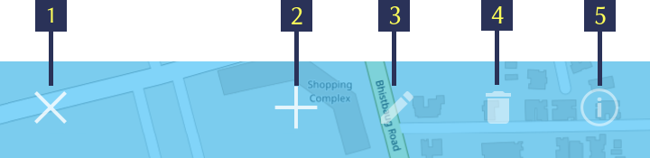
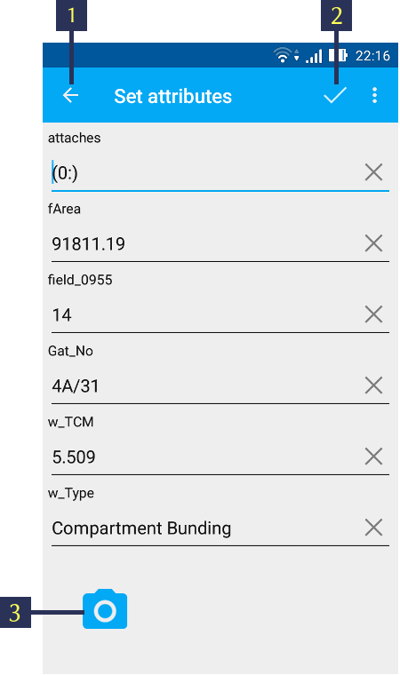
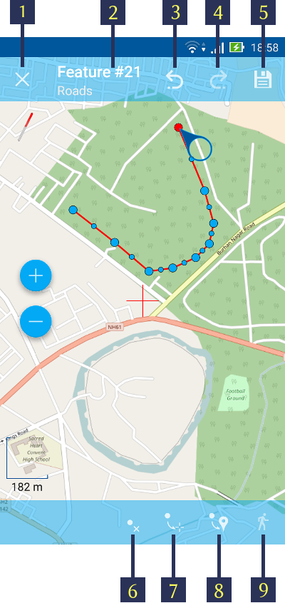
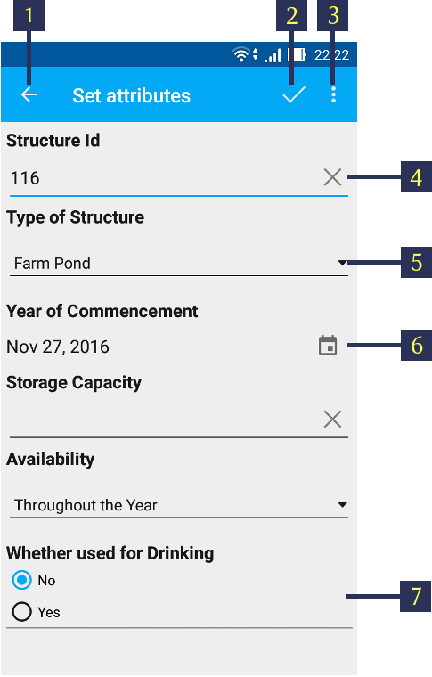

.. sectionauthor:: Dmitry Baryshnikov <dmitry.baryshnikov@nextgis.ru>, Abhay Kulkarni <praxisnfp@gmail.com>

.. _ngmobile_editing:

Editing layers
===============

NextGIS Mobile allows you to edit vector layers added to the map. While editing, you can:

* add new features;
* delete features;
* edit features.

.. _ngmobile_switch_to_edit:

Switching to Edit mode
-----------------------

There are several ways to switch to Edit mode.

1. The first way is Main actions button (the big blue button in the right bottom corner of map screen). Pressing Main actions button opens a menu of most common actions (see :numref:`ngmobile_common_action_menu_pic`).

   
   Common actions menu.   
   
   The numbers indicate: 1 - Zoom in; 2 - Zoom out; 3 – Scale ruler; 4 - Measure button; 5 - Add geometry by walk; 6 - Edit layers; 7 - Add current location; 8 - Close Common actions menu.

You need to tap the pencil button (item 6 in :numref:`ngmobile_common_action_menu_pic`) to switch to Edit mode.

Then select a vector layer you want to edit in an opened dialog (see :numref:`ngmobile_select_layer_dialogtch_pic`). 

.. figure:: _static/select_layer_dialogtch.png
   :name: ngmobile_select_layer_dialogtch_pic
   :align: center
   :height: 10cm
   
   Select layer dialog.

2. The second way to switch to Edit mode is to long-press the geometry you want to edit. 

3. The third way is to open Layers tree panel (item 1 in :numref:`ngmobile_main_activity_pic_1`) and tap on Layer contextual menu icon next to the vector layer name (item 5 in :numref:`ngmobile_layer_tree_pic`). This will open the contextual menu items (item 6 in :numref:`ngmobile_layer_tree_pic`). There you need to select "Edit".

The Editing Toolbar
--------------------

After switching to Edit mode using any of the methods described in :ref:`ngmobile_switch_to_edit` section Editing Toolbar is opened at the bottom of the map screen (see :numref:`ngmobile_editing_toolbar_pic`).

   
   Editing Toolbar.
   
   The numbers indicate: 1 - Quit Edit mode; 2 - Add new feature; 3 – Edit feature; 4 - Delete feature; 5 - Attributes info.
   
.. note::
   This editing toolbar is common for all vector layers irrespective of the type of geometry they contain (point, line or polygon).

.. _ngmobile_add_geometry:

Adding features
----------------

To create a new feature first select a layer you want to add this feature to. Then switch to Edit mode using any of the methods described in :ref:`ngmobile_switch_to_edit` section. 

After Editing Toolbar is opened tap "Add new feature" button (item 2 in :numref:`ngmobile_editing_toolbar_pic`). 

.. note::
   Type of geometry of a new feature should correspond to the type of geometry of the layer you want to add this feature to (e.g. you can only add a new point to a point/multipoint vector layer, a new line - to a line/multiline vector layer, etc.).

.. note::
   If you want to start adding new features from scratch first you have to create an empty layer as described in :ref:`ngmobile_create_vector` section.

.. _ngmobile_add_point:

Adding a point
^^^^^^^^^^^^^^^

1. To create a new point first select a point/miltipoint vector layer you want to add this feature to. Then switch to Edit mode using any of the methods described in :ref:`ngmobile_switch_to_edit` section. 

2. Tap "Add new feature" button in Editing Toolbar (item 2 in :numref:`ngmobile_editing_toolbar_pic`). 

3. In a point layer a new point will appear in the center of the screen highlighted in red. You can move this point anywhere on the map simply by dragging the circular handle attached to it. The red crosshair marker indicates the center of Map screen.(see :numref:`ngmobile_creation_of_points_pic`).

.. figure:: _static/creation_of_points.png
   :name: ngmobile_creation_of_points_pic
   :align: center
   :height: 10cm

   Adding a point to Point layer.
   
   The numbers indicate: 1 - Quit (without saving); 2 - Feature ID & Name of the Layer; 3 - Undo changes; 4 - Redo changes; 5 - Set attributes; 6 - Move point to the center of Map screen; 7 - Move point to the current location.

4. In a multipoint layer tap "Add point" (item 6 in :numref:`ngmobile_creation_of_multipoints_pic`) and follow the steps described above.

.. figure:: _static/creation_of_multipoints.png
   :name: ngmobile_creation_of_multipoints_pic
   :align: center
   :height: 10cm

   Adding a point to Multipoint layer.
   
   The numbers indicate: 1 - Quit (without saving); 2 - Feature ID & Name of the Layer; 3 - Undo changes; 4 - Redo changes; 5 - Set attributes; 6 - Add point; 7 - Delete point; 8 - Move point to the center of Map screen; 9 - Move point to the current location.

5. After a geometry of new point is added you may set its attributes by tapping on the "floppy" button (item 5 in :numref:`ngmobile_creation_of_points_pic` and :numref:`ngmobile_creation_of_multipoints_pic`). Pressing floppy icon will save a new point and open Attributes editing form (see :numref:`ngmobile_input_form_attributes_pic`).

   
   Attributes editing form.
   
   The numbers indicate: 1 - Back to previous screen; 2 - Apply changes; 3 - Add photo.
   
5. When all the attributes are set tap "Apply changes" button (item 2 in :numref:`ngmobile_input_form_attributes_pic`) to save the attributes. If you tap "Back" button instead (item 1 in :numref:`ngmobile_input_form_attributes_pic`) the app will warn you of any unsaved changes. You can also attach photos to each feature using "Add photo" button in Attributes editing form (item 3 in :numref:`ngmobile_input_form_attributes_pic`).

.. _ngmobile_add_line:

Adding a line
^^^^^^^^^^^^^

1. To create a new point first select a linestring/multilinestring vector layer you want to add this feature to. Then switch to Edit mode using any of the methods described in :ref:`ngmobile_switch_to_edit` section. 

2. Tap "Add new feature" button in Editing Toolbar (item 2 in :numref:`ngmobile_editing_toolbar_pic`).  

3. In a linestring layer a new line will appear in the center of the screen, with one of its vertices highlighted in red (see :numref:`ngmobile_creating_lines_pic`).

.. figure:: _static/creating_lines.png
   :name: ngmobile_creating_lines_pic
   :align: center
   :height: 10cm

   Adding a line to Linestring layer.
   
   The numbers indicate: 1 - Quit (without saving); 2 - Feature ID & name of the Layer; 3 - Undo changes; 4 - Redo changes; 5 - Set attributes; 6  - Delete vertex; 7 - Move vertex to the center of Map screen; 8 - Move vertex to the current location; 9 - Append geometry by walk.
   
You can move the vertices anywhere on the map simply by dragging the circular handle attached to the selected vertex. If you tap on the vertex in the middle of the line, two new vertices will be created automatically. This way you can add as many vertices as you need and shape the line geometry any way you like, including smooth curves.

4. In a multilinestring layer tap "Add line" (item 6 in :numref:`ngmobile_creating_multilines_pic`) and follow the steps described above.

.. figure:: _static/creating_multilines.png
   :name: ngmobile_creating_multilines_pic
   :align: center
   :height: 10cm

   Adding a line to Multilinestring layer.
   
   The numbers indicate: 1 - Quit (without saving); 2 - Feature ID & name of the Layer; 3 - Undo changes; 4 - Redo changes; 5 - Set attributes; 6 - Add line; 7 - Delete line; 8 - Delete vertex; 9 - Move vertex to the center of Map screen; 10 - Move vertex to the current location; 11 - Append geometry by walk.

5. After a geometry of new line is added you may set its attributes by tapping on the "floppy" button (item 5 in :numref:`ngmobile_creating_lines_pic` and :numref:`ngmobile_creating_multilines_pic`). Pressing floppy icon will save a new line and open Attributes editing form (see :numref:`ngmobile_input_form_attributes_pic`).   

6. When all the attributes are set tap "Apply changes" button (item 2 in :numref:`ngmobile_input_form_attributes_pic`) to save the attributes. If you tap "Back" button instead (item 1 in :numref:`ngmobile_input_form_attributes_pic`) the app will warn you of any unsaved changes. You can also attach photos to each feature using "Add photo" button in Attributes editing form (item 3 in :numref:`ngmobile_input_form_attributes_pic`).

.. _ngmobile_add_polygon:

Adding a polygon
^^^^^^^^^^^^^^^^^^

1. To create a new polygon first select a polygon/multipolygon vector layer you want to add this feature to. Then switch to Edit mode using any of the methods described in :ref:`ngmobile_switch_to_edit` section. 

2. Tap "Add new feature" button in Editing Toolbar (item 2 in :numref:`ngmobile_editing_toolbar_pic`).  

3. In a polygon layer a new polygon will appear in the center of the screen, with one of its vertices highlighted in red (see :numref:`ngmobile_creation_landfill_pic`).

.. figure:: _static/creation_landfill.png
   :name: ngmobile_creation_landfill_pic
   :align: center
   :height: 10cm

   Adding a polygon to Polygon layer.
   
   The numbers indicate: 1 - Quit (without saving); 2 - Feature ID & name of the Layer; 3 - Undo changes; 4 - Redo changes; 5 - Set attributes; 6 - Add hole; 7 - Delete hole; 8 - Delete vertex; 9 - Move vertex to the center of Map screen, 10 - Move vertex to the current location, 11 - Append geometry by walk.

You can move the vertices anywhere on the map simply by dragging the circular handle attached to the selected vertex. If you tap on the vertex in the middle of the line, two new vertices will be created automatically. This way you can add as many vertices as you need and shape the polygon geometry any way you like, including smooth curves.

You can also create holes in polygons by tapping button "Add hole" (item 6 in :numref:`ngmobile_creation_landfill_pic` or item 8 in :numref:`ngmobile_creation_multipolygon_pic`) and creating a hole geometry the same way you create polygon geometry.

.. note::
   Hole geometry must be located INSIDE a polygon geometry otherwise the changes won't be saved!

4. In a multilipolygon layer tap "Add polygon" (item 6 in :numref:`ngmobile_creation_multipolygon_pic`) and follow the steps described above.

.. figure:: _static/creation_multipolygon.png
   :name: ngmobile_creation_multipolygon_pic
   :align: center
   :height: 10cm

   Adding a polygon to Multipolygon layer.
   
   The numbers indicate: 1 - Quit (without saving); 2 - Feature ID & name of the Layer; 3 - Undo changes; 4 - Redo changes; 5 - Set attributes; 6 - Add polygon; 7 - Delete polygon; 8 - Add hole; 9 - Delete hole; 10 - Delete vertex; 11 - Contextual menu with the rest of commands (Move vertex to the center of Map screen, Move vertex to the current location, Append geometry by walk)

5. After a geometry of new polygon is added you may set its attributes by tapping on the "floppy" button (item 5 in :numref:`ngmobile_creation_landfill_pic` and :numref:`ngmobile_creation_multipolygon_pic`). Pressing floppy icon will save a new line and open Attributes editing form (see :numref:`ngmobile_input_form_attributes_pic`).   

6. When all the attributes are set tap "Apply changes" button (item 2 in :numref:`ngmobile_input_form_attributes_pic`) to save the attributes. If you tap "Back" button instead (item 1 in :numref:`ngmobile_input_form_attributes_pic`) the app will warn you of any unsaved changes. You can also attach photos to each feature using "Add photo" button in Attributes editing form (item 3 in :numref:`ngmobile_input_form_attributes_pic`).

.. _ngmobile_add_location:

Adding current location 
-----------------------

To add current location to a vector layer press Main actions button, and then press a pushpin icon (item 7 in  :numref:`ngmobile_common_action_menu_pic`). In an opened dialog select a layer you'd like to add current location to (only point/multipoint geometry will be displayed) (see :numref:`ngmobile_select_layer_dialog_pic`). If there is only one point/multipoint layer available, it will be selected automatically. 

.. figure:: _static/ngmobile_selectlayer.png
   :name: ngmobile_select_layer_dialog_pic
   :align: center
   :height: 10cm
   
   Select layer dialog.

Current location will be added to selected layer as a new point or a new multipoint consisting of 1 point.

You can then add attributes as described in :ref:`ngmobile_add_point` section.

.. note::
   You can add current location to Point and Multipoint layers only!

.. _ngmobile_add_track:

Adding line or polygon by walk
----------------------------------

To add line or polygon by walk to a vector layer press Main actions button, and then press a walking man icon (item 5 in  :numref:`ngmobile_common_action_menu_pic`). In an opened dialog select a layer you'd like to add a new feature to (only linestring/multilinestring and polygon/multipolygon layers will be displayed) (see :numref:`ngmobile_select_layer_dialog_pic`). 

Find more information about adding geometries in :ref:`ngmobile_edit_vector_tracks` section.

.. note::
   You can add tracks to either Linestring/Multilinestring or Polygon/Multipolygon layers.
   
.. _ngmobile_edit_geometry:

Editing a geometry
-------------------

To edit an existing layer first select that vector layer from any of the 3 methods mentioned above and enter the editing mode. The feature will turn its colour to **Blue**. Then tap on the pencil icon in Bottom toolbar (item 3 in :numref:`ngmobile_editing_toolbar_pic`). The feature will turn its colour to **Red** in edit mode.

.. _ngmobile_edit_point:

Editing a point
^^^^^^^^^^^^^^^^

To start editing a point it should be first selected by pressing on it. It will change its colour to blue. Then tap on the pencil icon in Bottom toolbar (item 3 in :numref:`ngmobile_editing_toolbar_pic`). The selected point feature will be highlighted in red and have an arrow pointing at it.

To change location of a selected point simply pull it or arrow pointing at it to a desired place. Also a point can be moved using buttons from Bottom toolbar - to the center of the screen shown as Red Crosshair marker (item 6 in :numref:`ngmobile_editing_of_points_pic`) or to the current device location (see item 7 in :numref:`ngmobile_editing_of_points_pic`).

You can cancel editing at any point of time, without saving changes, by close editing button. (see item 1 in :numref:`ngmobile_editing_of_points_pic`). The system will warn you about this.

In the end you can have your geofeatures digitized as shown below. See :numref:`ngmobile_editing_of_points_pic`.

.. figure:: _static/editing_of_points.png
   :name: ngmobile_editing_of_points_pic
   :align: center
   :height: 10cm
   
   Editing point
   
   The numbers indicate: 1 - Close editing (without saving); 2 - Feature ID & name of the Layer; 3 - Undo changes; 4 - Redo changes; 5 - Set attributes; 6 - Move point to the Red Crossover (Center); 7 - Move point to the current location.

.. _ngmobile_edit_line:

Editing a line
^^^^^^^^^^^^^^

To start editing a line it should be first selected by pressing on it. It will change its colour to blue. Then tap on the pencil icon in Bottom toolbar (item 3 in :numref:`ngmobile_editing_toolbar_pic`). The line will change its colour to red and will show all its vertices. Current vertex is highlighted in red and has an arrow pointing at it. The center of line segment between vertices is also indicated. Pressing the center of line segment leads to two new vertex being added to the line. 

New vertex can be moved or otherwise edited right after it has been added. Also a vertex can be moved using buttons from Bottom toolbar - to the center of the screen shown as Red Crosshair marker (item 7 in :numref:`ngmobile_editing_lines_pic`) or to the current device location (see item 8 in :numref:`ngmobile_editing_lines_pic`).

You can delete the unrequired vertex by highlighting it and tapping delete vertex (see item 6 in :numref:`ngmobile_editing_lines_pic`)

In this way you can even get a smooth curve as per the geographic shape.

In the end you can have your geofeatures digitized as shown below. See :numref:`ngmobile_editing_lines_pic`.

   
   Editing line
   
   The numbers indicate: 1 - Close editing (without saving); 2 - Feature ID & name of the Layer; 3 - Undo changes; 4 - Redo changes; 5 - Set attributes; 6  - Delete vertex; 7 - Move point to the Red Crossover (Center); 8 - Move point to the current location; 9 - Edit by walk.

.. note::
   If only one vertex remains in a line this line is deleted automatically.

.. _ngmobile_edit_polygon:

Editing a polygon
^^^^^^^^^^^^^^^^^

To start editing a polygon it should be first selected by pressing on it. It will change its colour to blue. Then tap on the pencil icon in Bottom toolbar (item 3 in :numref:`ngmobile_editing_toolbar_pic`). The polygon will change its colour to red and will show all its vertices. Current vertex is highlighted in red and has an arrow pointing at it. The center of line segment between vertices is also indicated. Pressing the center of line segment leads to two new vertex being added to the line. 

New vertex can be moved or otherwise edited right after it has been added. Also a vertex can be moved using buttons from Bottom toolbar - to the center of the screen shown as Red Crosshair marker (item 7 in :numref:`ngmobile_editing_polygon_pic`) or to the current device location (see item 8 in :numref:`ngmobile_editing_polygon_pic`).

You can delete the unrequired vertex by highlighting it and tapping "Delete vertex" button (see item 6 in :numref:`ngmobile_editing_polygon_pic`).

.. figure:: _static/editing_polygon.png
   :name: ngmobile_editing_polygon_pic
   :align: center
   :height: 10cm
   
   Editing polygon
   
   The numbers indicate: 1 - Close editing (without saving); 2 - Feature ID & name of the Layer; 3 - Undo changes; 4 - Redo changes; 5 - Set attributes; 6  - Delete vertex; 7 - Move point to the Red Crossover (Center); 8 - Move point to the current location; 9 - Append geometry by walk.

.. _ngmobile_edit_attributes:

Editing attributes
--------------------

To start editing attributes first select a layer you want to edit attributes in. Then switch to Edit mode using any of the methods described in :ref:`ngmobile_switch_to_edit` section. 

After Editing Toolbar is opened tap "Attributes info" button (item 5 in :numref:`ngmobile_editing_toolbar_pic`). This will open Attributes Info panel as shown in :numref:`ngmobile_attributes_info_pic` below.

   
   Attributes Info panel
   
   The numbers indicate: 1 - Back to previous screen; 2 - Layer name & feature count; 3 - Settings; 4 - Attribute fields; 5 - Close Attributes Info panel; 6 - Set attributes; 7 - Previous record; 8 - Next record.
   
.. note::
   NextGIS Mobile shows the following attribute fields by default  (see item 4 in :numref:`ngmobile_attributes_info_pic`),
   
   * For Point layers: each point's location (in Latitude/Longitude).
   * For Line layers: length of each line feature (in meters).
   * For Polygon layer: length of each polygon feature's perimeter (in meters) & area of each polygon feature (in square meters).

Editing attributes using standard form
^^^^^^^^^^^^^^^^^^^^^^^^^^^^^^^^^^^^^^^

To start editing attributes using standard form first tap on "Set attributes" button (see item 6 in :numref:`ngmobile_attributes_info_pic`). 

This opens a standard Attributes editing form as shown in :numref:`ngmobile_input_form_attributes_pic`. 

After all the attributes are set tap "Tick" icon in the top right corner (item 2 in :numref:`ngmobile_input_form_attributes_pic`) to save the edits. 

.. note::
   If you tap the back button in the top left corner (item 1 in :numref:`ngmobile_input_form_attributes_pic`) instead, the system will warn you about unsaved changes. 

The Camera icon at the bottom of a standard Attributes editing form (item 3 in :numref:`ngmobile_input_form_attributes_pic`) allows to add image files (e.g. photos) to each feature from the local storage or take new photos.

.. _ngmobile_edit_attributes_ngfp:

Editing attributes using custom form
^^^^^^^^^^^^^^^^^^^^^^^^^^^^^^^^^^^^^

If the layer was :ref:`created from a custom form (NGFP) <ngmobile_import_ngfp>` the custom Attributes editing form will be used for editing. An example of such custom form is shown below in :numref:`ngmobile_custom_form_pic_1` 

 
   Custom Attributes editing form.
   
   The numbers indicate: 1 - Back to previous screen; 2 - Apply changes; 3 - Settings; 4 - Text or Integer field; 5 - Dropdown list; 6 - Date & Datetime; 7 - Radio buttons. 

Custom Attributes editing forms may contain the following entry fields:

* Text;
* Space;
* Text field;
* List; Tandem list;
* Checkbox;
* Radio button;
* Date Picker;
* Photo.

"Text" field is used to provide additional information about geometry feature.

"Text field" can be used to add text or integers, depending on the field type (see item 4 in :numref:`ngmobile_custom_form_pic_1`). 

"List" and "Tandem list" fields are used to store and select values included in custom lists, for example, "List" - region/republic/territory, "Tandem list" - district/area in region/republic/territory (see item 5 in :numref:`ngmobile_custom_form_pic_1`). 

"Date picker" field allows to select date, time or both of them (see item 6 in :numref:`ngmobile_custom_form_pic_1`). 

"Radio button" field allows to select one element from a list of mutually exclusive options (see item 7 in :numref:`ngmobile_custom_form_pic_1`). 

After all the attributes are set tap "Tick" icon in the top right corner (item 2 in :numref:`ngmobile_custom_form_pic_1`) to save the edits. 

.. note::
   If you tap the back button in the top left corner (item 1 in :numref:`ngmobile_custom_form_pic_1`) instead, the system will warn you about unsaved changes. 