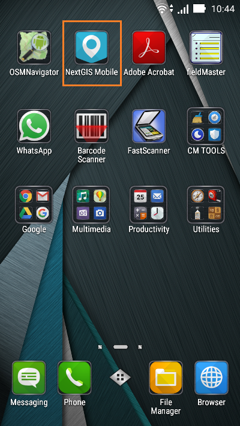

.. sectionauthor:: Дмитрий Барышников <dmitry.baryshnikov@nextgis.ru>

.. _ngmob_install:

Установка
==========

Программа может устанавливается на устройство следующими способами:

* при помощи пакетного файла nextgismobile.apk;
* через магазин приложений (`Google play <https://play.google.com/store>`_).

Для установки из пакетного файла необходимо в настройках устройства разрешить установку программ из неизвестных источников («настройки/безопасность/неизвестные источники»). После установки программы возможность установки из неизвестных источников можно деактивировать.

Для установки из магазина приложений необходимо запустить приложение Play маркет и в строке поиска ввести "NextGIS Mobile". Далее установить найденное приложение на устройство.

Для запуска программы используется ярлык, автоматически создаваемый при ее установке (см. :numref:`launch_shortcut_pic`). 

   Ярлыки приложений.
   
   Красным прямоугольником выделен ярлык NextGIS Mobile.
