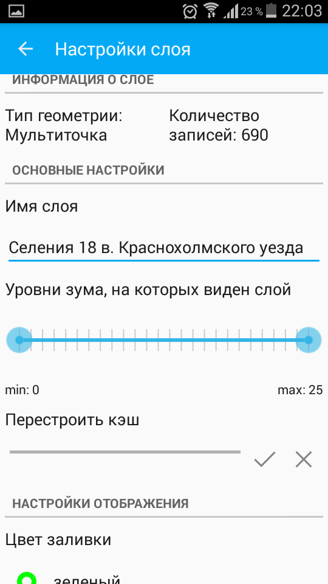

.. sectionauthor::  Наталья Барышникова <Nshelekhova@gmail.com>

.. _ngmobile_layer_settings:

Описание настроек слоев (вектр/растр) NextGIS Mobile
====================================================

.. versionadded:: 2.2

В пользовательском интерфейсе программы имеется выезжающая панель дерева слоев, 
которая отображает состав карты в виде набора слоев, выполняет навигацию по карте 
(увеличение, уменьшение, перемещение), создает и модифицирует растровые и 
векторные слои, а также модицифирует данные этих слоев при помощи настраивемых форм ввода.
Дополнительные операции над слоями вынесены в отдельное меню слоя. Дерево слоев 
представлено на рисунке :numref:`layer_tree_pic`.
Контекстное меню слоя зависит от его типа. Для векторного слоя меню имеет следующий состав (см. :numref:`ngmobile_raster_layer_menu_pic`):

1. Увеличить до охвата
2. Поделиться
3. Удалить
4. Настройки

.. figure:: _static/raster_layer_menu.png
   :name: ngmobile_raster_layer_menu_pic
   :align: center
   :height: 10cm

   Окно меню для векторного слоя

Окно меню настроек векторного слоя
-----------------------------
Окно настроек для модификации векторного слоя имеет следующий вид  (см. :numref:`ngmobile_preferenсes_window_vector_layer_pic`):

   
   Окно меню настроек для векторного слоя

