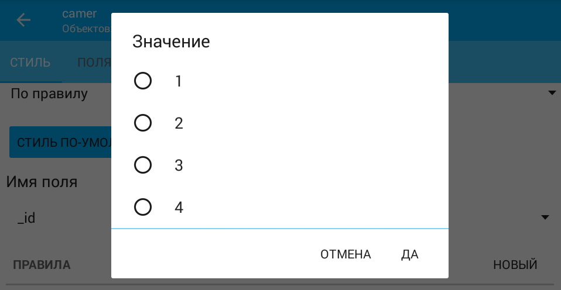
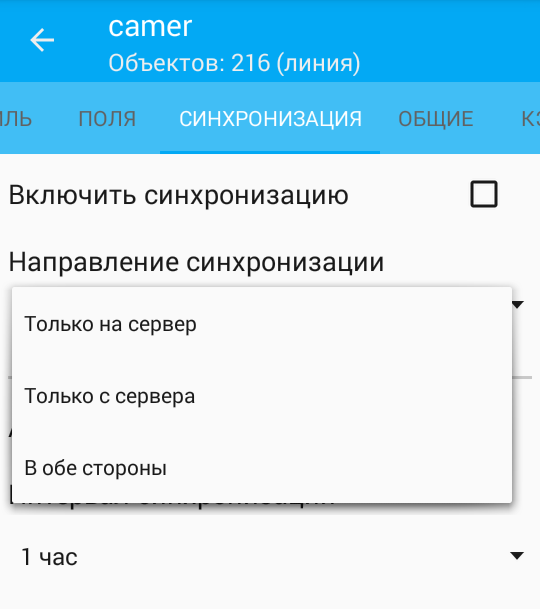
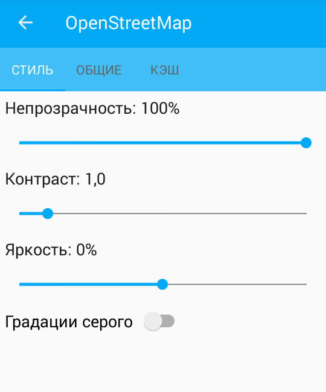
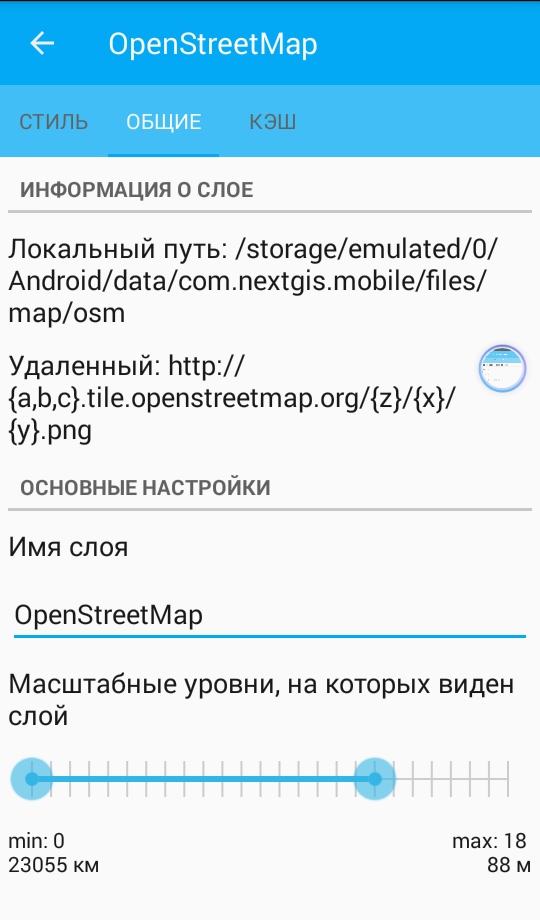

.. sectionauthor::  Наталья Барышникова <Nshelekhova@gmail.com>

.. _ngmobile_layer_settings:

Описание настроек слоев NextGIS Mobile
====================================================

.. versionadded:: 2.2

Карта представляет собой набор растровых и векторных слоев. Порядок и видимость
слоев настраивается при помощи дерева слоев.
В пользовательском интерфейсе программы имеется выезжающая панель дерева слоев,
которая отображает состав карты в виде набора слоев, позволяет менять порядок
отображения слоев, а также включать и выключать их видимость.
Дополнительные операции над слоями вынесены в отдельное меню слоя. Дерево слоев
представлено на рисунке :numref:`ngmobile_layerstree_of_WebGIS_pic`.

Меню слоя зависит от его типа.
Для векторного слоя меню имеет следующий состав (см. :numref:`ngmobile_layers_tree_menu_pic`):

1. Увеличить до охвата.
2. Таблица объектов.
3. Поделиться.
4. Редактировать.
5. Удалить.
6. Настройки.

.. figure:: _static/ngmobile_layers_tree_menu.png
   :name: ngmobile_layers_tree_menu_pic
   :align: center
   :height: 10cm

   Меню для векторного слоя.

Окно настроек векторного слоя
-----------------------------------
При выборе пункта "Настройки" в меню слоя открывается окно настроек векторного слоя.
Окно настроек для модификации векторного слоя имеет следующие вкладки настроек свойств 
слоя (см. :numref:`ngmobile_preferences_window_vector_layer2_pic`):

1. Стиль.
2. Поля.
3. Синхронизация.
4. Общие.
5. Кэш.

.. figure:: _static/ngmobile_preferences_window_vector_layer2.png
   :name: ngmobile_preferences_window_vector_layer2_pic
   :align: center
   :height: 7cm

   Меню настроек для векторного слоя.

В окне настроек слоя имеются следующие блоки настроек:

1. Стиль (Отрисовка, Цвет заливки, Цвет обводки, Толщина, Тип).
2. Поля.
3. Синхронизация (Включить/Выключить синхронизацию, Направление синхронизации, Автоматическая
   синхронизация, Интервал синхронизации).
4. Общие (Информация о слое, Основные настройки)
5. Кэш (Перестроить кэш).

Первый блок настроек - Стиль - содержит следующую информацию:

1. Данные этого блока настроек редактируются, также допускается возможность отмены
   всех внесенных изменений.
2. Отрисовка слоя может осуществляться Обычно и По правилу (см. :numref:`ngmobile_rendering_pic`):

.. figure:: _static/ngmobile_rendering.png
   :name: ngmobile_rendering_pic
   :align: center
   :height: 9cm

   Отрисовка По правилу.

Значения атрибутов слоя - _id, admin_leve, name - могут быть выбраны при необхоимости
из имеющегося списка значений (см. :numref:`ngmobile_choice_field_value_attribute_pic`):

   Выбор значения атрибутов слоя.

3. Цвет заливки -  это инструмент, который позволяет заполнить цветом (залить, закрасить)
   выбранный объект, часть изображения или слой. Допускает возможность редактирования
   цвета отображения слоя, а также возможность отмены внесенных изменений.

4. Цвет обводки - это инструмент, который позволяет обвести границы нужного объекта.
   Допускает возможность редактирования цвета границы слоя, а также возможность отмены
   внесенных изменений.

5. Толщина - изменяемый параметр. Толщину обводки можно задать в зависимости от
   изображения, возможно отменить внесенные изменения. Линия обводки может быть:

   - Сплошная.
   - Пунктир.
   - Сплошная по границам.

6. Окно Текст с возможностью проставления отметки и Переключатель кнопки Поля. В
   активном состоянии, при проставленной отметке в окошке Текст и включенном переключателе
   кнопки Поля, активируют возможность вывода на экран необходимого текста одного
   из атрибутов поля (см. :numref:`ngmobile_buttons_text_and_fields_pic`):

.. figure:: _static/ngmobile_buttons_text_and_fields.png
   :name: ngmobile_buttons_text_and_fields_pic
   :align: center
   :height: 10cm

   Активное состояние окна Текст и переключателя Поля.

Второй блок настроек - Поля - содержит следующую информацию и предлагает на выбор
следующие атрибуты слоя:

1. _id - Целочисленное.
2. ADMIN_LEVE - Строка.
3. NAME - Строка.

Третий блок настроек - Синхронизация - предлагает следующие возможности:

1. Включить и отключить синхронизацию путем проставления метки/галочки
   в пустом окошке с правой стороны экрана.
2. Выбрать направление синхронизации (см. :numref:`ngmobile_synchronization_direction_pic`):

   Выбор направления синхронизации.

3. Включить/отключить автоматическую синхронизацию путем проставления метки/галочки
   в пустом окошке с правой стороны экрана.

4. Задать интервал синхронизации при включенной автоматической синхронизации от 5
   минут до нескольких часов.

Четвертый блок настроек - Общие - содержит следующую информацию о слое:

1. Информация о слое:

   - Локальный путь.
   - Удаленный путь.

2. Основные настройки допускают реактирование параметров слоя:

   - имени слоя,
   - масштабных уровней/уровня зума, на котором виден слой.

Пятый блок настроек - Кэш - содержит кнопку для перестроения кэша для оптимизации
процессов создания слоя с возможностью сохранения и отмены внесенных изменений.

Окно настроек растрового слоя
-----------------------------------

Контекстное меню растрового слоя имеет следующий состав (см. :numref:`ngmobile_raster_layer_menu_pic`):

1. Загрузить тайлы.
2. Удалить.
3. Настройки.

.. figure:: _static/raster_layer_menu.png
   :name: ngmobile_raster_layer_menu_pic
   :align: center
   :height: 10cm

   Меню растрового слоя.

Окно настроек растрового слоя
----------------------------------

Окно настроек для модификации растрового слоя имеет следующие вкладки настроек свойств слоя:

1. Стиль.
2. Общие.
3. Кэш.

Окно настроек для растрового слоя имеет следующий вид  (см. :numref:`ngmobile_settings_window_for_a_raster_layer_pic`):

   Окно настроек для растрового слоя.

В окне настроек слоя имеются следующие блоки настроек:

1. Первый блок - Стиль - содержит информацию о настройках изображения слоя. Допускается
редактирование параметров слоя в данном блоке:

   - Непрозрачность. Степень общей непрозрачности слоя определяет, насколько сильно
     он скрывает или отображает содержимое нижележащего слоя. Слой со степенью
     непрозрачности 1 % является практически прозрачным. Совершенно непрозрачный слой
     имеет степень непрозрачности 100 %.

   - Контраст. Контрастность слоя может быть изменена для придания выразительности изображению.

   - Яркость. Яркость слоя может быть изменена для придания яркости изображению.

   - Градации серого (цветовой режим изображений, значения яркости серой шкалы выражена
     в процентах, при этом 0 % представляет белый цвет (отсутствие чёрного пигмента на
     белом фоне), 100 % — черный цвет).

2. Второй блок - Общие - содержит информацию о слое. Допускается редактирование
параметров слоя в данном блоке:

   - Информация о слое (Локальный путь, Удаленный путь).
   - Основные настройки (Имя слоя, Масштабные уровни/Уровень зума, на которых виден
     слой (см. :numref:`ngmobile_general_settings_pic`):

   Окно настроек Общие.

3. Третий блок - Кэш - содержит кнопку для удаления кэша (см. :numref:`ngmobile_cache_settings_pic`):

.. figure:: _static/ngmobile_cache_settings.png
   :name: ngmobile_cache_settings_pic
   :align: center
   :height: 5cm

   Окно настройки Кеша.

В выпадающем списке Размера кеша тайлов TMS имеются следующие варианты:

- Без кэша.
- 1 экран.
- 2 экрана (рекомендовано).
- 3 экрана.

.. note::

   Чем больше размер кэша, тем быстрее происходит отрисовка карты, особенно при сдвиге
   карты. Но при этом кэш занимает много места в памяти мобильного устройства, что
   может проявляться в виде ошибок приложения.
