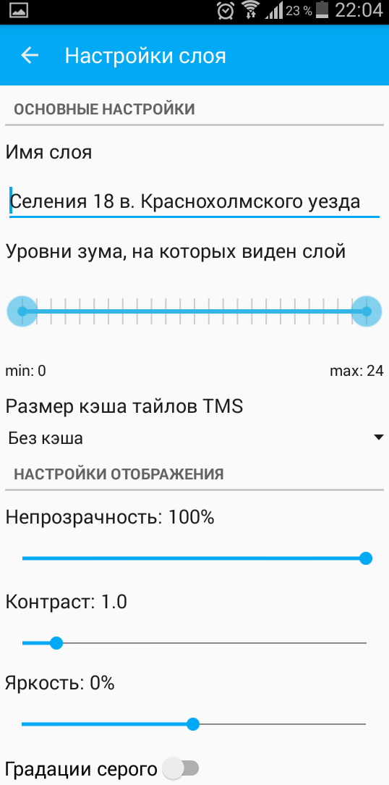

.. sectionauthor::  Наталья Барышникова Nshelekhova@gmail.com

.. _ngmobile_layer_settings:

Description of layers settings NextGIS Mobile
=============================================

.. versionadded:: 2.2

Map is a set of raster and vector layers. Order and visibility of layers are configured by layers tree. There is a sliding panel of layers tree in a user’s interface where composition of the map is displayed as a set of layers. It allows to change the order of layers and enables or disables their visibility.
Additional operations with layers you can see in a separate layer menu. Layers tree is shown on a picture :numref:`ngmobile_layer_tree_pic`.
Layers menu depends on its type.
Menu for the vector type has a following composition (СЃРј. :numref:`ngmobile_vector_layer_menu_pic`):

1. Zoom to  extent
2. Share
3. Delete
4. Settings

.. figure:: _static/vector_layer_menu.png
   :name: ngmobile_vector_layer_menu_pic
   :align: center
   :height: 10cm

   Vector layer menu.

Window of vector layer settings
-------------------------------
A window of vector layer settings opens if you select "Settings" from the layer menu. Window of settings for vector layer modification has the following view (see :numref:`ngmobile_preferenСЃes_window_vector_layer_pic`):

.. figure:: _static/preferences_window_vector_layer.png
   :name: ngmobile_preferenСЃes_window_vector_layer_pic
   :align: center
   :height: 10cm
   
   Vector layer settings.

There are following setting blocks in the settings window:

1. Layer info (geometry type; feature count).
2. Main settings (layer name, zoom levels, rebuild cache).
3. Display settings (fill color).

The first settings block has information about layer. The data in this block can not be edited.
The second settings block "Main settings" allows to edit layer configuration.

1. Layer name.
2. Zoom levels to show the layer.
3. To rebuild СЃache button for optimize the processes of a layer creating with the ability to save and cancel changes.

The third setting block has information about settings of layers addition and has an option to edit color of layer display, plus an option to cancel edits. 

Context menu of raster layer has the following composition (see :numref:`ngmobile_raster_layer_menu_pic`):

1. Load tiles
2. Delete
3. Settings

.. figure:: _static/raster_layer_menu.png
   :name: ngmobile_raster_layer_menu_pic
   :align: center
   :height: 10cm
   
   Raster layer menu.

Raster layers settings window
-----------------------------
Raster layers settings window has a following look (see :numref:`ngmobile_settings_menu_raster_layer_pic`):

   Raster layers settings window.

There are following setting blocks in the settings window:

1. Main settings (layer name, zoom levels to show layer, TMS in-memory cache size).
2. Display settings (opacity, contrast, brightness, greyscale).

The first block contains information about layer. Edits of properties are allowed for this block.

1. Layer’s name.
2. Zoom levels to show layer.
3. To rebuild СЃache button for optimize the processes of a layer creating with the ability to save and cancel changes.

In the second settings block "Display settings" editing is also allowed.

1. Opacity. The value of layer opacity determines how intensive it hides or displays the contents of the underlying layer. Layer with 1% opacity is substantially transparent. Completely opaque layer has an opacity of 100%.
2. Contrast. Contrast of the layer can be changed to spice up the image.
3. Brightness. Brightness of layer can be changed to make image darker or lighter.
4. Greyscale (the color image mode value of grayscale brightness values expressed in percent. 0% is a white color (the absence of black pigment on a white background), 100% is a black color).
