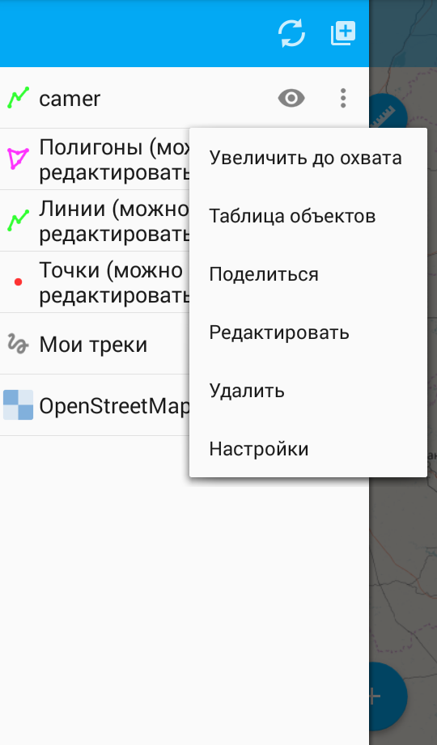
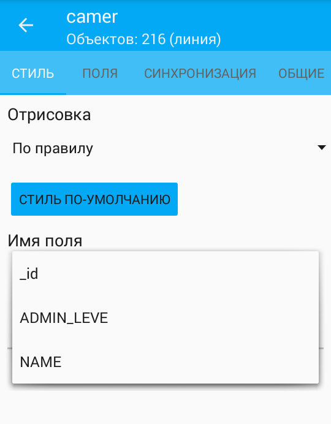

.. sectionauthor::  Наталья Барышникова <Nshelekhova@gmail.com>

.. _ngmobile_layer_settings:

Описание настроек слоев NextGIS Mobile
====================================================

.. versionadded:: 2.2

Карта представляет собой набор растровых и векторных слоев. Порядок и видимость 
слоев настраивается при помощи дерева слоев.
В пользовательском интерфейсе программы имеется выезжающая панель дерева слоев, 
которая отображает состав карты в виде набора слоев, позволяет менять порядок 
отображения слоев, а также включать и выключать их видимость.
Дополнительные операции над слоями вынесены в отдельное меню слоя. Дерево слоев 
представлено на рисунке :numref:`ngmobile_layerstree_of_WebGIS_pic`.
   
Меню слоя зависит от его типа. 
Для векторного слоя меню имеет следующий состав (см. :numref:`ngmobile_layers_tree_menu_pic`):

1. Увеличить до охвата.
2. Таблица объектов.
3. Поделиться.
4. Редактировать.
5. Удалить.
6. Настройки.

   Меню для векторного слоя.

Окно настроек векторного слоя
-----------------------------------
При выборе пункта "Настройки" в меню слоя открывается окно настроек векторного слоя.
Окно настроек для модификации векторного слоя имеет следующие вкладки настроек свойств слоя(см. :numref:`ngmobile_preferenсes_window_vector_layer1_pic`):

1. Стиль.
2. Поля.
3. Синхронизация.
4. Общие.
5. Кэш.

.. figure:: _static/ngmobile_preferenсes_window_vector_layer1.png
   :name: ngmobile_preferenсes_window_vector_layer1_pic
   :align: center
   :height: 8cm
   
   Меню настроек для векторного слоя.

В окне настроек слоя имеются следующие блоки настроек:

1. Стиль (Отрисовка, Цвет заливки, Цвет обводки, Толщина, Тип).
2. Поля. 
3. Синхронизация (Включить/Выключить синхронизацию, Направление синхронизации, Автоматическая 
   синхронизация, Интервал синхронизации).
4. Общие (Информация о слое, Основные настройки)
5. Кэш (Перестроить кэш).

Первый блок настроек - Стиль - содержит следующую информацию:

1. Данные этого блока редактируются.
2. Отрисовка слоя может осуществляться обычно и по правилу (см. :numref:`ngmobile_rendering_pic`):

   Отрисовка По правилу.

Второй блок настроек "Основные настройки слоя" допускает реактирование параметров слоя.

1. Имя слоя.
 
2. Уровень зума, на котором виден слой.

3. Кпопка для перестроения кэша для оптимизации процессов создания слоя с возможностью 
   сохранения и отмены внесенных изменений.

Третий блок настроек содержит информацию о настройках отображения слоя и допускает 
возможность редактирования цвета отображения слоя, а также возможность отмены внесенных изменений.  

Контекстное меню растрового слоя имеет следующий состав (см. :numref:`ngmobile_raster_layer_menu_pic`):

1. Загрузить тайлы.
2. Удалить.
3. Настройки.

.. figure:: _static/raster_layer_menu.png
   :name: ngmobile_raster_layer_menu_pic
   :align: center
   :height: 10cm
   
   Меню растрового слоя. 

Окно настроек растрового слоя
----------------------------------
Окно настроек для растрового слоя имеет следующий вид  (см. :numref:`ngmobile_settings_menu_raster_layer_pic`):

.. figure:: _static/settings_menu_raster_layer.png
   :name: ngmobile_settings_menu_raster_layer_pic
   :align: center
   :height: 10cm

   Окно настроек для растрового слоя.

В окне настроек слоя имеются следующие блоки настроек:

1. Основные настройки (имя слоя, уровни зума, на которых виден слой, размер кэша 
   тайлов TMS).
2. Настройки изображения (непрозрачность, контраст, яркость, градации серого).

Первый блок содержит информацию о слое. Допускается редактирование параметров 
слоя в данном блоке.

1. Имя слоя.
2. Уровень зума, на котором виден слой.
3. Кнопка для перестроения кэша для оптимизации процессов создания слоя с возможностью 
   сохранения и отмены внесенных изменений.

Во втором блоке настроек "Настройки изображения" также допускается редактирование 
параметров слоя: 

1. Непрозрачность. Степень общей непрозрачности слоя определяет, насколько сильно 
   он скрывает или отображает содержимое нижележащего слоя. Слой со степенью 
   непрозрачности 1 % является практически прозрачным. Совершенно непрозрачный слой
   имеет степень непрозрачности 100 %.
2. Контрастность. Контрастность слоя может быть изменена для придания выразительности изображению.
3. Яркость. Яркость слоя может быть изменена для придания яркости изображению.
4. Градации серого (цветовой режим изображений, значения яркости серой шкалы выражена 
   в процентах, при этом 0 % представляет белый цвет (отсутствие чёрного пигмента на белом фоне), 
   100 % — черный цвет).

