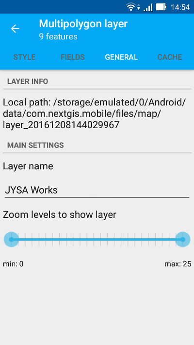
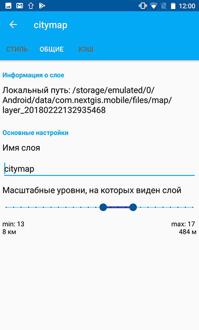
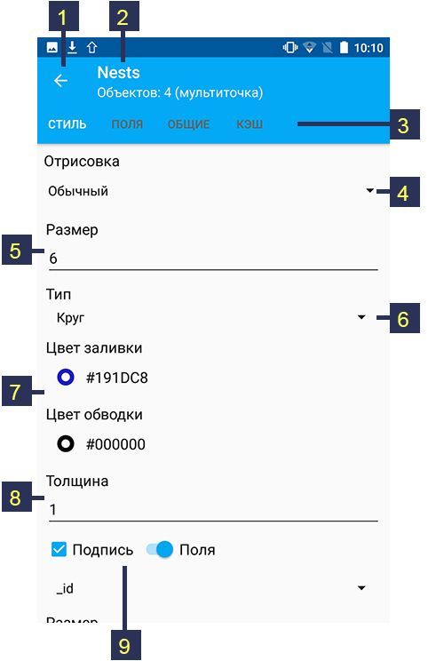
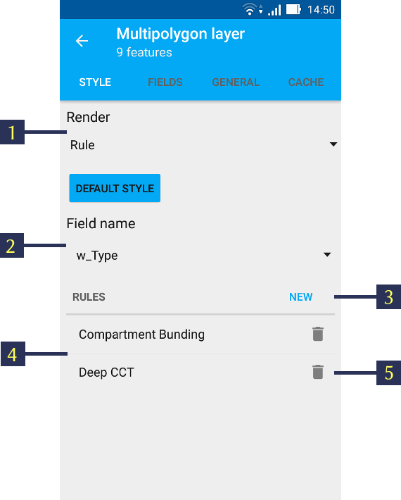
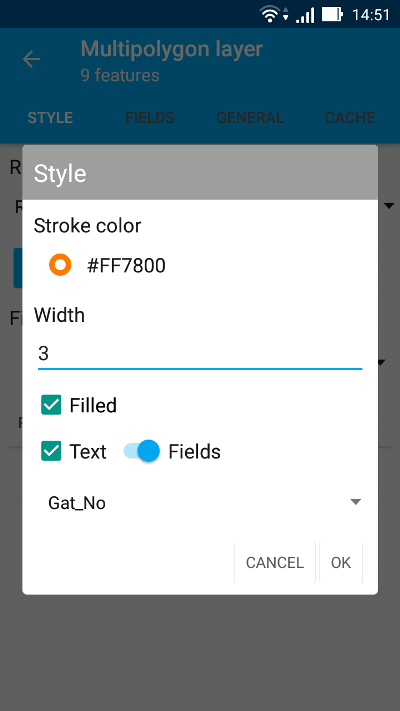
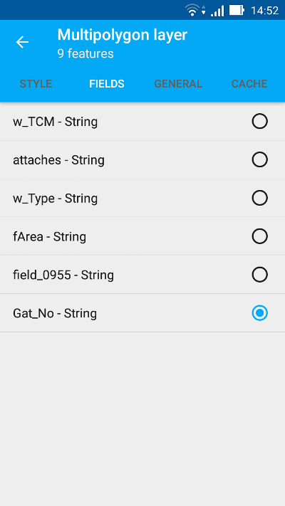

.. _ngmobile_layer_settings:

Настройки слоев
===============

Карта представляет собой набор растровых и векторных слоев. Панель дерева слоев отражает содержимое карты и позволяет контролировать видимость и порядок слоев.

Для переключения видимости слоя следует нажать на кнопку |ic_eye|.

Настройки слоя можно открыть из `контекстного меню <https://docs.nextgis.ru/docs_ngmobile/source/main.html#ngmob-layer-menu>`_.

В настройках есть следующие вкладки:

* `Общие <https://docs.nextgis.ru/docs_ngmobile/source/layer_settings.html#ngmobile-tab-general-settings>`_ - для всех типов слоёв;
* `Стиль <https://docs.nextgis.ru/docs_ngmobile/source/layer_settings.html#ngmobile-style-settings>`_ - для векторных слоёв;
* `Кэш <https://docs.nextgis.ru/docs_ngmobile/source/layer_settings.html#ngmobile-cache-settings>`_ - для векторных слоёв, здесь можно перестроить кэш.

.. _ngmobile_tab_general_settings:

Общие настройки
---------------

Блок настроек "Общие" показывает такую информацию о слое:

* Локальный путь - где файл лежит на устройстве и как точно называется.
* Имя слоя - можно настроить имя, под которым слой отображается на карте.
* Масштабные уровни, на которых слой виден на карте. По умолчанию стоит полный диапазон - от 0 до 25 уровня зума. Можно настроить видимость слоя только на определенных масштабных уровнях.

   
   Блок настроек векторного слоя "Общие"

   
   Блок настроек растрового слоя "Общие"

.. _ngmobile_vector_layer_settings:
.. _ngmobile_style_settings:

Настройки стиля векторного слоя
-------------------------------

При выборе пункта "Настройки" в контекстном меню слоя открывается окно настроек векторного слоя. 

   
   Настройки стиля точечного векторного слоя (стиль обычной отрисовки).
   
   Цифрами обозначено: 1 - назад; 2 - тип слоя и число объектов; 3 - блоки настроек слоя; 4 - тип отрисовки; 5 - размер объекта; 6 - тип объекта; 7 - цветовая палитра; 8 - толщина обводки; 9 - настройки подписей.
   
Настройки стиля векторного слоя зависят от выбранного типа отрисовки - `обычной <https://docs.nextgis.ru/docs_ngmobile/source/layer_settings.html#ngmobile-simple-rendering>`_ или `по правилу <https://docs.nextgis.ru/docs_ngmobile/source/layer_settings.html#ngmobile-rule-rendering>`_.

.. _ngmobile_simple_rendering:

Обычная отрисовка
~~~~~~~~~~~~~~~~~

На :numref:`ngmobile_style_vector_pic` показаны настройки обычной отрисовки. При выборе данного типа отрисовки все объекты слоя будут иметь одинаковую форму, цвет, размер и т.д.

Например, для слоев с точечной/мультиточечной геометрией в меню "Тип" (см. :numref:`ngmobile_style_vector_pic`, п.6) можно выбрать следующие типы форм для объектов:

* Точка 
* Круг 
* Ромб 
* Крест 
* Треугольник
* Квадрат
* Круг 2
* Крест в квадрате

Также можно установить размер точки (см. :numref:`ngmobile_style_vector_pic`, п.5), цвет заливки и обводки (см. :numref:`ngmobile_style_vector_pic`, п.7) и толщину обводки (см. :numref:`ngmobile_style_vector_pic`, п.8).

Для слоев с линейной/мультилинейной геометрией можно задать тип линии (сплошная, пунктир или сплошная по границам), а также цвет заливки и обводки и толщину обводки.

Для слоев с полигональной/мультиполигональной геометрией можно выбрать цвет и толщину обводки, а также выбрать/отменить опцию заливки полигона (если напротив пункта заливка поставить флажок, полигон будет залит полупрозрачным цветом).

Для слоев с любой геометрией также можно выбрать опцию показа подписей каждого объекта на карте. Для этого необходимо поставить флажок напротив пункта "Подпись" и ввести текст подписи или активировать переключатель "Поля" и выбрать поле атрибутов, которое будет использовано для подписи объектов на карте (см. :numref:`ngmobile_style_vector_pic`, п.9).

.. _ngmobile_rule_rendering:

Отрисовка по правилу
~~~~~~~~~~~~~~~~~~~~

Можно выбрать отрисовку по правилу для векторного слоя и задать разные типы форм, цвета, размера и т.д. для объектов слоя в зависимости от их атрибутов.

Для этого следует выбрать отрисовку по правилу, что приведет к открытию других настроек стиля (см. :numref:`ngmobile_style_vector_rulebased_pic`).

   
   Настройки стиля векторного слоя (стиль отрисовки по правилу).
   
   Цифрами обозначено: 1 - тип отрисовки; 2 - выбор поля атрибутов; 3 - ранее созданные правила; 4 - кнопка "Создать новое правило"; 5 - кнопка "Удалить правило".
   
Для начала следует выбрать поле атрибутов, по значению которого будут созданы правила (см. :numref:`ngmobile_style_vector_rulebased_pic`, п.2). 

Затем необходимо нажать на кнопку "Создать новое правило" (см. :numref:`ngmobile_style_vector_rulebased_pic`, п.4), что приведет к открытию списка уникальных значений поля атрибутов, выбранного ранее. Следует выбрать значение и нажать "ОК", чтобы открыть диалог настроек стиля (см. :numref:`ngmobile_style_vector_rulebased_item_pic`).

   
   Диалог настроек стиля с отрисовкой по правилу.
   
В данном диалоге можно выбрать и применить те же настройки, которые были описаны выше в разделе :ref:`ngmobile_simple_rendering` (настройки стиля с отрисовкой по правилу также зависят от типа векторного слоя). Когда все настройки будут заданы, следует нажать "OK". 

Так можно создать стили с отрисовкой по правилу для каждого значения выбранного поля атрибутов.

.. _ngmobile_fields_settings:

Поля
----

В данном блоке настроек можно выбрать поле атрибутов, которое будет использоваться как ID объекта при редактировании.

   
   Блок настроек векторного слоя "Поля".

.. warning::
   Выбранное поле не будет использовано для подписей на карте, подробнее о настройках подписей в разделе :ref:`ngmobile_style_settings`.

.. _ngmobile_cache_settings:

Настройки кэша
--------------

Используя блок настроек "Кэш", можно выполнить перестроение кэша для оптимизации
процессов создания слоя с возможностью сохранения и отмены внесенных изменений.

.. seealso:: Посмотрите, как настроить кэш растрового слоя, в видео:

.. raw:: html

   <iframe width="560" height="315" src="https://rutube.ru/play/embed/93d74bd3bf13314d6a40d37fe1a62060/" frameBorder="0" allow="clipboard-write; autoplay" webkitAllowFullScreen mozallowfullscreen allowFullScreen></iframe>

Посмотреть видео на `youtube <https://youtu.be/9g4GrdlkaRI>`_, `rutube <https://rutube.ru/video/93d74bd3bf13314d6a40d37fe1a62060/>`_.
