.. _ngmobile_layer_settings:

Layer settings
===============

The map is a set of raster and vector layers. |ic_layer_tree| Layer tree panel lists the map content and controls layer visibility and order.

To toggle layer visibility, click the eye icon |ic_eye|.

Layer settings can be opened from the `layer menu <https://docs.nextgis.ru/docs_ngmobile/source/main.html#ngmob-layer-menu>`_ (icon |ic_menu_grey|).

The settings have the following tabs:

* General - for all layer types;
* Style - for vector layers;
* Cache - for vector layers, you can rebuild the cache here.

.. _ngmobile_tab_general_settings:

General settings
----------------

The "General" settings tab shows the following information about the layer:

* Local path - where the file is located on the device and its exact name.
* Layer name - you can customize the name under which the layer is displayed on the map.
* Zoom levels at which the layer is visible on the map. By default, the full range is set - from 0 to 25. You can limit the layer visibility by a specific zoom level range.

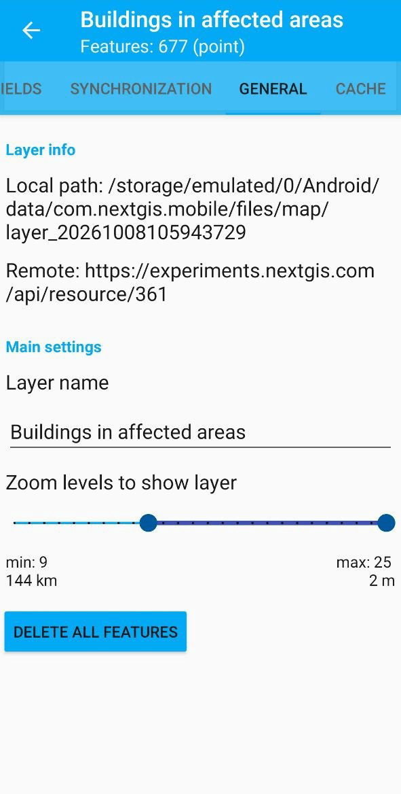
   
   General settings for a vector layer

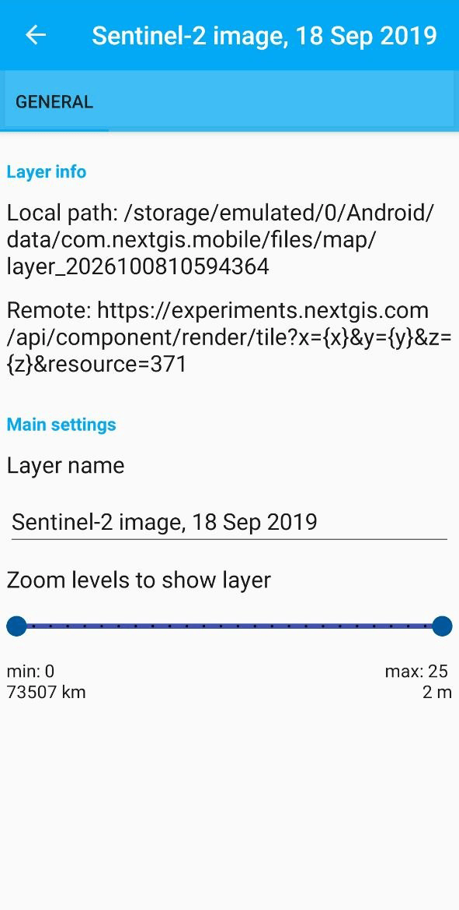
   
   General settings for a raster layer

.. _ngmobile_vector_layer_settings:
.. _ngmobile_style_settings:

Vector Layer Style Settings
-------------------------------

.. admonition:: How to open

   |ic_layer_tree| Layer Tree  ‣ |ic_menu_grey| Layer Menu  ‣ Settings  ‣ Style

The available style settings for the vector layer depend on its geometry type and the selected **rendering** type - `simple <https://docs.nextgis.com/docs_ngmobile/source/layer_settings.html#ngmobile-simple-rendering>`_ or `rule-based <https://docs.nextgis.com/docs_ngmobile/source/layer_settings.html#ngmobile-rule-rendering>`_.

.. _ngmobile_simple_rendering:

Standard rendering
~~~~~~~~~~~~~~~~~~

In standard rendering, all features of the layer have the same color, size, shape (for point features) etc.

For a layer with any geometry, you can configure:

* Fill color;
* Stroke color;
* Stroke thickness;
* Labels.

There are also settings specific to specific types of geometry: 

For example, for layers with |ic_type_multipoint| **point/multipoint** geometry, you can set the marker size.

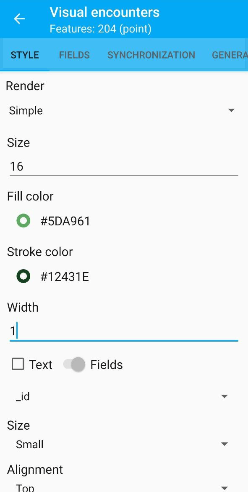
   
   Style settings for a point layer

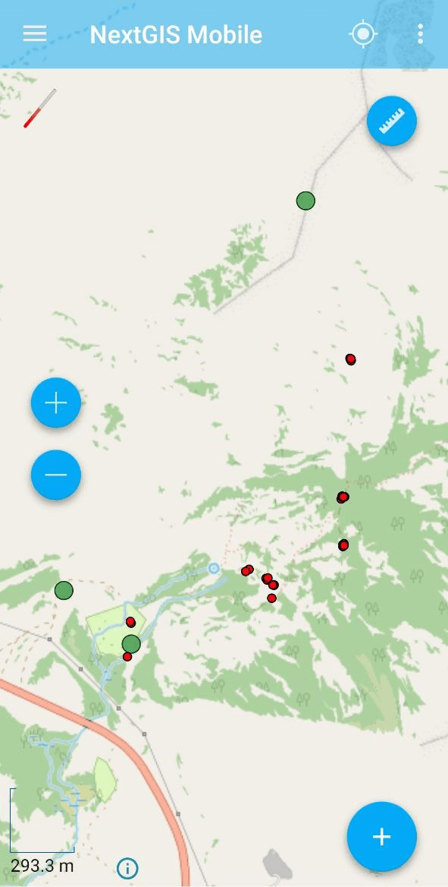

   Two point layers with different marker sizes

For layers with |ic_type_line| **linestring/multilinestring** geometry, you can specify the line type:

* solid - only the fill color is applied;
* dashed line - only fill color is applied;
* edge - both fill color and stroke color are applied.

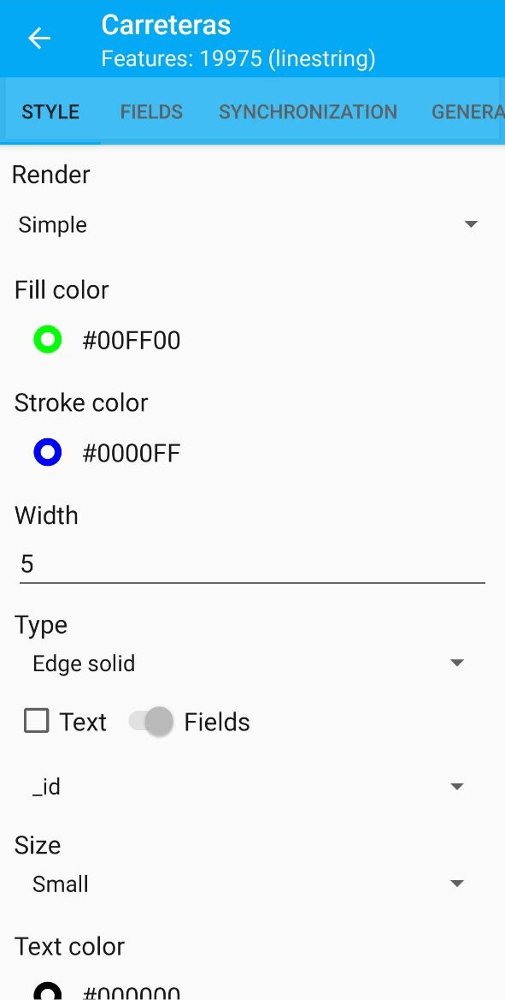

   Style settings for a linestring layer

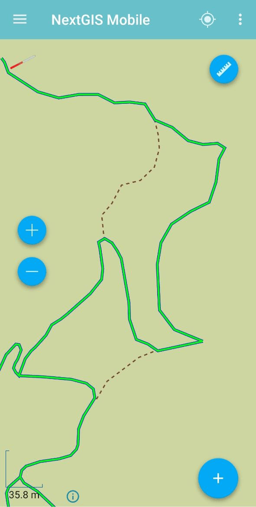

   Linear layers with different line types: "dashed" and "edge"

For layers with |ic_type_polygon| **polygon/multipolygon** geometry, you can enable or disable the fill. Polygon fill, when enabled, is semi-transparent.

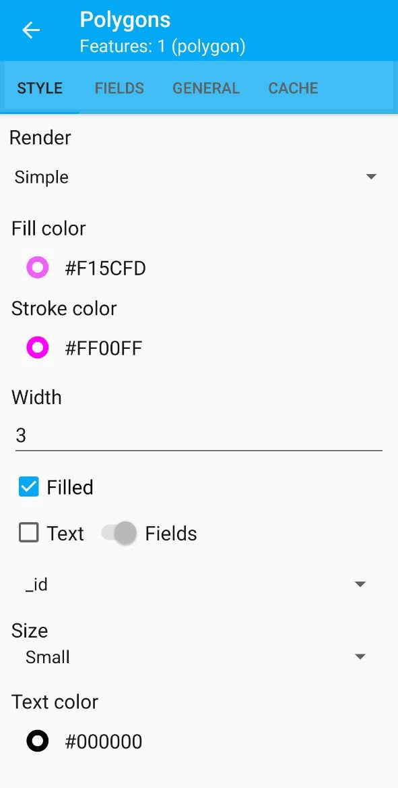

   Style settings for a polygon layer

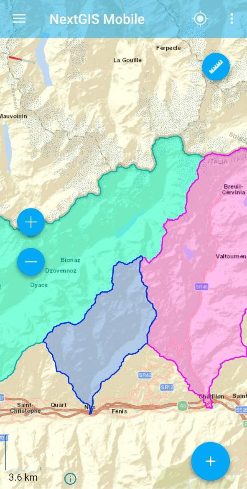

   Polygonal layers with and without fill

.. _ngmob_labels:

Labels
~~~~~~~~

For any geometry, you can also display the feature labels. 

Go to layer menu |ic_menu_grey| ‣ Settings. On the Style tab, check the box next to **Labels**.

There are two options:

* Individual labels for each feature, the value is taken from the selected field.
* The same label for all features - just enter the text in the field.

The field used for labels on the map may not be the same as the field used as the `feature identifier <https://docs.nextgis.com/docs_ngmobile/source/layer_settings.html#ngmobile-fields-settings>`.

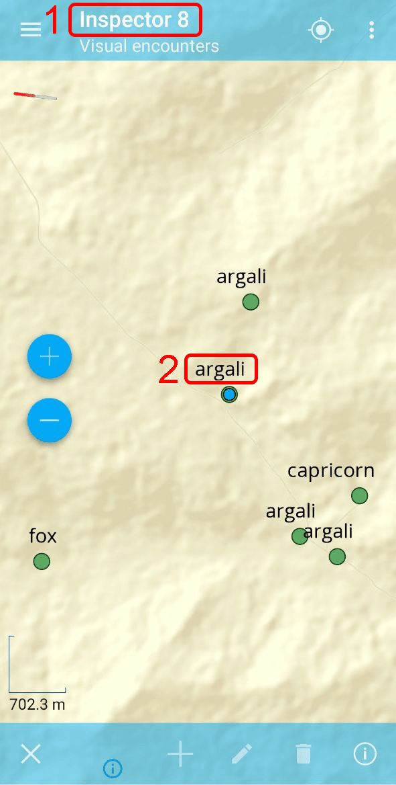

   1 - identifier of the selected feature and layer name, 2 - feature label on the map

.. _ngmobile_rule_rendering:

Rule-based style
~~~~~~~~~~~~~~~~~~~~

You can set different colors, sizes, etc. for layer features depending on the attribute values.

To do this, in the Render field select **Rule-based**. The style settings window changes:

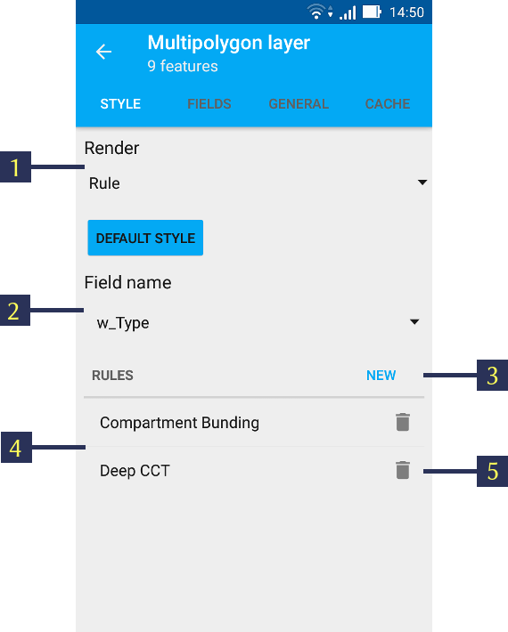
   
   Vector layer style settings (rule-based rendering).
   
   The numbers indicate: 1 - rendering type; 2 - selected attribute field; 3 - previously created rules; 4 - "Create New Rule" button; 5 - "Delete Rule" button.
   
First, select the field that is going to be the base of your styling rules. 

Then click **New**. A list of unique values for the previously selected attribute field will open. Select the value for which you want to create a rule. Next, configure the style for features with this value.

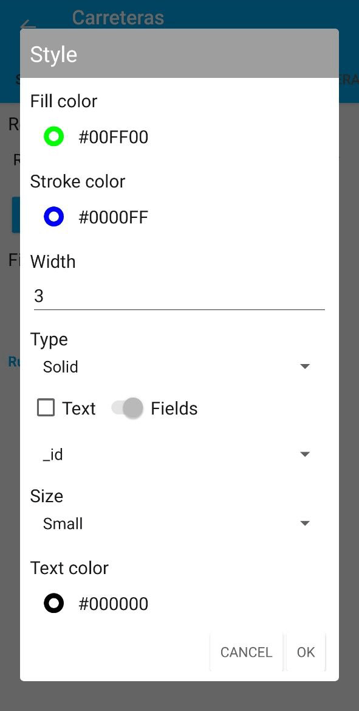
   
   Style settings dialog with rule-based rendering
   
The parameters are standard, see section :ref:`ngmobile_simple_rendering`. When the style is set, tap **OK**. 

This way, you can create styling rules for each value of the selected attribute field. If no specific rule is set for a value, the default style option is applied. Tap **Default style** to configure it.

.. _ngmobile_fields_settings:

Fields
------

.. admonition:: How to open

   |ic_layer_tree| Layer Tree ‣ |ic_menu_grey| Layer Menu ‣ Settings ‣ Fields

In this settings block, you can select the attribute field that will be used as the feature ID when you select or edit the feature.

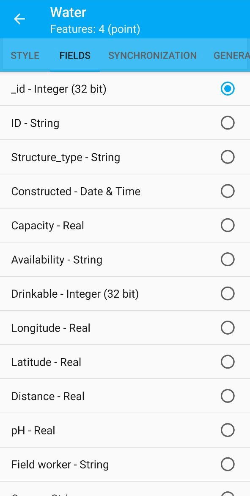
   
   Vector layer settings: Fields

.. warning::
   The selected field will not be used for map labels. Labels can be configured on the style tab :ref:`ngmobile_style_settings`.

.. _ngmobile_cache_settings:

.. |ic_eye| image:: _static/ic_eye.png
   :width: 6mm
   :alt: eye

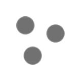

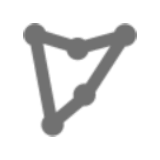

.. |ic_layer_tree| image:: _static/ic_layer_tree.png
   :width: 6mm
   :alt: three lines

.. |ic_menu_grey| image:: _static/ic_menu_grey.png
   :width: 3mm
   :alt: tree grey dots

