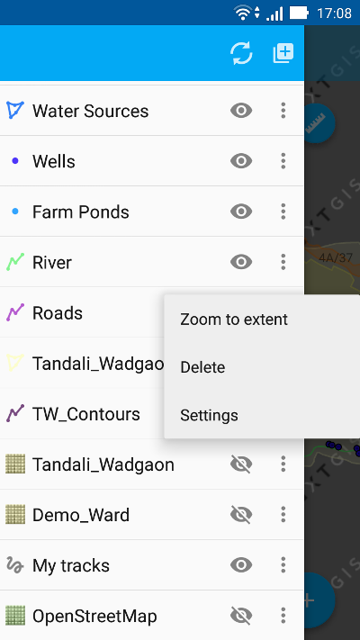

.. sectionauthor::  Наталья Барышникова <Nshelekhova@gmail.com>

.. _ngmobile_layer_settings:

Описание настроек слоев (вектр/растр) NextGIS Mobile
====================================================

.. versionadded:: 2.2

Карта представляет собой набор растровых и векторных слоев. Порядок и видимость 
слоев настраивается при помощи дерева слоев.
В пользовательском интерфейсе программы имеется выезжающая панель дерева слоев, 
которая отображает состав карты в виде набора слоев, выполняет навигацию по карте 
(увеличение, уменьшение, перемещение), создает и модифицирует растровые и 
векторные слои, а также модицифирует данные этих слоев при помощи настраивемых форм ввода.
Дополнительные операции над слоями вынесены в отдельное меню слоя. Дерево слоев 
представлено на рисунке :numref:`layer_tree_pic`.
Контекстное меню слоя зависит от его типа. Для векторного слоя меню имеет следующий состав (см. :numref:`ngmobile_vector_layer_menu_pic`):

1. Увеличить до охвата
2. Поделиться
3. Удалить
4. Настройки

.. figure:: _static/vector_layer_menu.png
   :name: ngmobile_vector_layer_menu_pic
   :align: center
   :height: 10cm

   Окно меню для векторного слоя

Окно меню настроек векторного слоя
-----------------------------
Окно настроек для модификации векторного слоя имеет следующий вид  (см. :numref:`ngmobile_preferenсes_window_vector_layer_pic`):

.. figure:: _static/preferences_window_vector_layer.png
   :name: ngmobile_preferenсes_window_vector_layer_pic
   :align: center
   :height: 10cm
   
   Окно меню настроек для векторного слоя

В окне настроек слоя имеются следующие блоки настроек:

1. Информация о слое (тип геометрии, количество записей)
2. Основные настройки (имя слоя, уровни зума, перестроить кэш)
3. Настройки отображения (цвет заливки)

Первый блок настроек содержит информацию о слое. Данные этого блока не редактируются.
Второй блок настроек "Основные настройки слоя" допускает реактирование параметров слоя:

1. изменение/выбор нового имени слоя в случае необходимости,
 
2. возможность выбрать уровни зума, на которых виден слой, изменение текущего уровня 
   для каждого слоя

3. возможность перестроить кэш для оптимизации процессов создания слоя с возможностью 
   сохранения и отмены внесенных изменений.

Третий блок настроек содержит информацию о настройках отображения слоя и допускает 
возможность редактирования цвета отображения слоя, а также возможность отмены внесенных изменений.  

Контекстное меню растрового слоя меню имеет следующий состав (см. :numref:`ngmobile_raster_layer_menu_pic`):

1. Загрузить тайлы
2. Удалить
3. Настройки

   
   Окно меню для растрового слоя 

Окно меню настроек растрового слоя
----------------------------------
Окно настроек для модификации векторного слоя имеет следующий вид  (см. :numref:`ngmobile_preferenсes_window_vector_layer_pic`):
