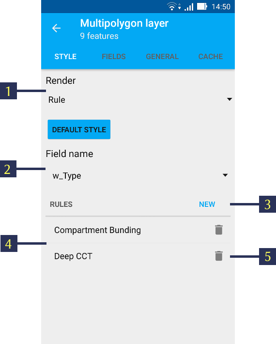

.. sectionauthor::  Наталья Барышникова Nshelekhova@gmail.com

.. _ngmobile_layer_settings:

Layer settings
===============

Map is a set of raster and vector layers. Layers tree panel is designed to display the content of a map and to control visibility and hierarchy of map layers. 

To change the hierarchy of map layers long-press the layer which is to be moved up or down. Layers tree panel will switch to Edit mode. Keep pressing and move the selected layer to its new position.

For turning layer visibility on/off tap on Layer visibility button (item 3 in :numref:`ngmobile_layer_tree_pic`).

Additional operations with layers are available from a separate layer contextual menu (item 5 in :numref:`ngmobile_layer_tree_pic`).

For example, contextual menu for a vector layer includes following items:

1. Zoom to extent
2. Attributes
3. Share
4. Edit
5. Delete
6. Settings

.. note::
   Contextual menu depends both on layer type and geodata source. Raster layers have different contextual menus than Vector layers. Raster layers created from tile cache have different contextual menus than raster layers created from external geoservices.

.. _ngmobile_vector_layer_settings:

Vector layer settings
---------------------

Style settings
^^^^^^^^^^^^^^^

Open layer contextual menu and tap on "Settings". Vector layer style settings will open as shown in :numref:`ngmobile_style_vector_pic` below. 

.. figure:: _static/style_vector.png
   :name: ngmobile_style_vector_pic
   :align: center
   :height: 10cm
   
   Vector point layer style settings (simple render style).
   
   The numbers indicate: 1 - Go back; 2 - Layer type & Feature count; 3 - Layer Settings tabs; 4 - Render type; 5 - Feature size; 6 - Feature type; 7 - Color palette; 8 - Stroke width; 9 - Label settings.
   
Vector layer style settings depend on the selected Render type - Simple or Rule (item 4 in :numref:`ngmobile_style_vector_pic`).

Simple rendering
~~~~~~~~~~~~~~~~~

:numref:`ngmobile_style_vector_pic` shows Simple Render style settings. If you select this Render type, all the features in the layer will have the same shape, color, size, etc.

For example, for a point/multipoint layer you can select features shape by using "Type" menu (see item 6 in :numref:`ngmobile_style_vector_pic`) using the following options:
* Circle 
* Diamond 
* Cross 
* Triangle 
* Box
* Edit circle
* Crossed box

You can also set point size (see item 5 in :numref:`ngmobile_style_vector_pic`), fill and stroke color (see item 7 in :numref:`ngmobile_style_vector_pic`) and stroke width (see item 8 in :numref:`ngmobile_style_vector_pic`).

In linestring/multilinestring layers you can select line type (solid, dash or edge solid), as well as fill and stroke color and stroke width.

In polygon/multipolygon layers you can select stroke color and width. Also you can select to display polygons as filled or empty (the semi-opaque stroke color will be applied if "Filled" is selected).

For any vector layer you can also choose to show Labels for each feature on a map. To do this tick "Text" checkbox and either enter the label text yourself or select the attribute field which will be used to label features on a map (item 9 in :numref:`ngmobile_style_vector_pic`).

Rule-based rendering
~~~~~~~~~~~~~~~~~~~~~~

You can also use the advanced styling option for your vector layer, and set different shapes, colors, sizes, etc. for layer features based on their attribute values.

For advanced styling of vector layer select "Rule" in the Render. It will open different style settings as shown in  :numref:`ngmobile_style_vector_rulebased_pic` below.

   
   Vector layer style settings (rule-based render style).
   
   The numbers indicate: 1 - Render type; 2 - Field selection; 3 - "Create new rule" button; 4 - Previously created rules; 5 - "Delete rule" button.
   
To adjust rule-based style settings first select the attribute field - its values will be used to create rules (see item 2 in :numref:`ngmobile_style_vector_rulebased_pic`). 

Then tap on "Create new rule" button (item 3 in :numref:`ngmobile_style_vector_rulebased_pic`). It will open a list of all the unique values from the attribute field you have selected earlier. Select the value and tap "OK" to open Style settings dialogue as shown below in  :numref:`ngmobile_style_vector_rulebased_item_pic`.

.. figure:: _static/style_vector_rulebased_item.png
   :name: ngmobile_style_vector_rulebased_item_pic
   :align: center
   :height: 10cm
   
   Rule-based style settings dialogue.
   
Here you can select and apply the same style settings as described above in Simple rendering (rule-based style settings are also dependant on vector layer type). Select "OK" when finished. 

In this way you can create rule-based render styles for every value in the selected attribute field.

Fields settings
^^^^^^^^^^^^^^^^

You can select which attribute field will be used to provide Feature ID for Edit screens, etc. 
To do this tap on "FIELDS" tab (see item 3 in :numref:`ngmobile_style_vector_pic`) and select one of the fields as shown in :numref:`ngmobile_style_select_field_pic`

   
   "FIELDS" layer settings tab.

.. warning::
   The selected field will not be used for rendering features labels on the map. For label settings see "Style settings" above.
   
General settings
^^^^^^^^^^^^^^^^^^

"GENERAL" settings tab shows such information about vector layer as its local path, layer name & zoom levels to show on the map (it is possible to display the layer within certain zoom levels only). See :numref:`ngmobile_style_vector_general_pic` below.

   
   "GENERAL" layer settings tab.

Using this tab you can change layer name and zoom levels to show.

Cache settings
^^^^^^^^^^^^^^^^

Using "CACHE" settings tab you can execute "Rebuild cache" command to optimize the layer creation process with the ability to save and cancel changes.

.. _ngmobile_raster_layer_settings:

Raster layer settings
----------------------

Context menu of raster layer has the following composition (see :numref:`ngmobile_raster_layer_menu_pic`):

1. Zoom to extent
2. Delete
3. Settings

.. figure:: _static/raster_layer_menu.png
   :name: ngmobile_raster_layer_menu_pic
   :align: center
   :height: 10cm
   
   Raster layer menu.

Tap on "Settings" to open raster layer settings. It will open up the raster layer settings panel as shown in :numref:`ngmobile_style_raster_pic` below.

.. figure:: _static/style_raster.png
   :name: ngmobile_style_raster_pic
   :align: center
   :height: 10cm

   Raster layers settings.
   
You can set the values for

1. Opacity. The value of layer opacity determines how intensive it hides or displays the contents of the underlying layer. Layer with 1% opacity is substantially transparent. Completely opaque layer has an opacity of 100%.
2. Contrast. Contrast of the layer can be changed to spice up the image.
3. Brightness. Brightness of layer can be changed to make image darker or lighter.
4. Greyscale (the color image mode value of grayscale brightness values expressed in percent. 0% is a white color (the absence of black pigment on a white background), 100% is a black color).

The "GENERAL" menu shows information about layer as its path, name & allowed zoom levels to show. It is possible to show the layer within certain zoom levels only. For rest all other zoom levels it will be invisible on the map screen. See :numref:`ngmobile_style_raster_general_pic` below.

.. figure:: _static/style_raster_general.png
   :name: ngmobile_style_raster_general_pic
   :align: center
   :height: 10cm
   
   Raster General menu.

The "Rebuild cache" item in "CACHE" menu is used to optimize the processes of a layer creating with the ability to save and cancel changes.
