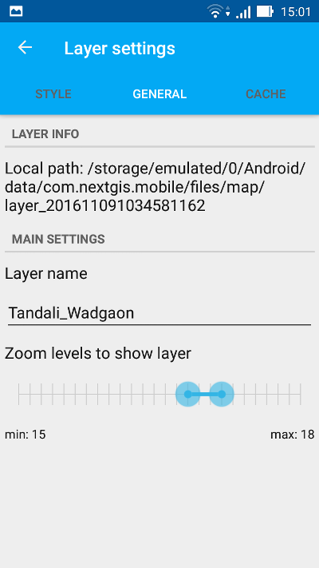

.. sectionauthor::  Наталья Барышникова <Nshelekhova@gmail.com>

.. _ngmobile_layer_settings:

Настройки слоев
===============

Карта представляет собой набор растровых и векторных слоев. Панель дерева слоев отражает содержимое карты и позволяет контролировать видимость и иерархию слоев.

Для того, чтобы изменить иерархию слоев, следует зажать слой, который требуется переместить. При этом панель дерева слоев переключится в режим редактирования. Продолжая зажимать слой, необходимо переместить его в новое положение.

Для переключения видимости слоя следует нажать на кнопку переключения видимости слоя (см. :numref:`ngmobile_layer_tree_pic`, п.3).

Дополнительные операции над слоями вынесены в отдельное контекстное меню слоя (см. :numref:`ngmobile_layer_tree_pic`, п.5).

Для векторного слоя меню имеет следующий состав:

1. Увеличить до охвата
2. Таблица объектов
3. Поделиться
4. Отправить в NextGIS
5. Редактировать
6. Удалить
7. Настройки

.. note::
   Контекстное меню зависит от типа слоя и источника геоданных. Контекстное меню растрового слоя отличается от контекстного меню векторного слоя. Контекстное меню растровых слоев, созданных из тайлового кэша, отличается от меню растровых слоев, созданных из внешних геосервисов.

.. _ngmobile_vector_layer_settings:

Настройки векторного слоя
-----------------------------

.. _ngmobile_style_settings:

Настройки стиля
^^^^^^^^^^^^^^^

При выборе пункта "Настройки" в контекстном меню слоя открывается окно настроек векторного слоя (см. :numref:`ngmobile_style_vector_pic`). 

.. figure:: _static/style_vector.png
   :name: ngmobile_style_vector_pic
   :align: center
   :height: 10cm
   
   Настройки стиля векторного слоя с геометрией точка (стиль обычной отрисовки).
   
   Цифрами обозначено: 1 - назад; 2 - тип слоя и число объектов; 3 - блоки настроек слоя; 4 - тип отрисовки; 5 - размер объекта; 6 - тип объекта; 7 - цветовая палитра; 8 - толщина обводки; 9 - настройки подписей.
   
Настройки стиля векторного слоя зависят от выбранного типа отрисовки - обычной или по правилу (см. :numref:`ngmobile_style_vector_pic`, п.4).

.. _ngmobile_simple_rendering:

Обычная отрисовка
~~~~~~~~~~~~~~~~~

На :numref:`ngmobile_style_vector_pic` показаны настройки обычной отрисовки. При выборе данного типа отрисовки все объекты слоя будут иметь одинаковую форму, цвет, размер и т.д.

Например, для слоев с геометрией точка/мультиточка в меню "Тип" (см. :numref:`ngmobile_style_vector_pic`, п.6) можно выбрать следующие типы форм для объектов:

* Точка 
* Круг 
* Ромб 
* Крест 
* Треугольник
* Квадрат
* Круг 2
* Крест в квадрате

Также можно установить размер точки (см. :numref:`ngmobile_style_vector_pic`, п.5), цвет заливки и обводки (см. :numref:`ngmobile_style_vector_pic`, п.7) и толщину обводки (см. :numref:`ngmobile_style_vector_pic`, п.8).

Для слоев с геометрией линия/мультилиния можно задать тип линии (сплошная, пунктир или сплошная по границам), а также цвет заливки и обводки и толщину обводки.

Для слоев с геометрией полигон/мультиполигон можно выбрать цвет и толщину обводки, а также можно задать, будет ли выполняться заливка полигона или нет (если напротив пункта заливка поставить флажок, полигон будет залит полупрозрачным цветом).

Для слоев с любой геометрией также можно выбрать опцию показа подписей каждого объекта на карте. Для этого необходимо поставить флажок напротив пункта "Подпись" и ввести текст подписи или активировать переключатель "Поля" и выбрать поле атрибутов, которое будет использовано для подписи объектов на карте (см. :numref:`ngmobile_style_vector_pic`, п.9).

.. _ngmobile_rule_rendering:

Отрисовка по правилу
~~~~~~~~~~~~~~~~~~~~

Можно выбрать отрисовку по правилу для векторного слоя и задать разные типы форм, цвета, размера и т.д. для объектов слоя в зависимости от их атрибутов.

Для этого следует выбрать отрисовку по правилу, что приведет к открытию других настроек стиля (см. :numref:`ngmobile_style_vector_rulebased_pic`).

.. figure:: _static/style_vector_rulebased.png
   :name: ngmobile_style_vector_rulebased_pic
   :align: center
   :height: 10cm
   
   Настройки стиля векторного слоя (стиль отрисовки по правилу).
   
   Цифрами обозначено: 1 - тип отрисовки; 2 - выбор поля атрибутов; 3 - "Создать новое правило" кнопка; 4 - ранее созданные правила; 5 - "Удалить правило" кнопка.
   
Для начала следует выбрать поле атрибутов, по значению которого будут созданы правила (см. :numref:`ngmobile_style_vector_rulebased_pic`, п.2). 

Затем необходимо нажать на кнопку "Создать новое правило" (см. :numref:`ngmobile_style_vector_rulebased_pic`, п.3), что приведет к открытию списка уникальных значений поля атрибутов, выбранного ранее. Следует выбрать значение и нажать "ОК", чтобы открыть диалог настроек стиля (см. :numref:`ngmobile_style_vector_rulebased_item_pic`).

   
   Диалог настроек стиля с отрисовкой по правилу.
   
В данном диалоге можно выбрать и применить те же настройки, которые были описаны выше в разделе :ref:`ngmobile_simple_rendering` (настройки стиля с отрисовкой по правилу также зависят от типа векторного слоя). Когда настройки будут завершены, следует нажать "OK". 

Так можно создать стили с отрисовкой по правилу для каждого значения выбранного поля атрибутов.

.. _ngmobile_fields_settings:

Настройки полей
^^^^^^^^^^^^^^^

В данном блоке настроек можно выбрать поле атрибутов, которое будет использоваться для отображения ID объекта при редактировании и т.д.
Следует выбрать блок настроек "Поля" (см. :numref:`ngmobile_style_vector_pic`, п.3) и выбрать одно из полей, как показано на :numref:`ngmobile_style_select_field_pic`.

.. figure:: _static/style_select_field.png
   :name: ngmobile_style_select_field_pic
   :align: center
   :height: 10cm
   
   Блок настроек векторного слоя "Поля".

.. warning::
   Выбранное поле не будет использовано для подписей на карте, подробнее о настройках подписей в разделе :ref:`ngmobile_style_settings`.

.. _ngmobile_tab_general_settings:

Общие настройки
^^^^^^^^^^^^^^^

Блок настроек "Общие" показывает информацию о векторном слое, такую как его локальный путь, имя слоя и масштабные уровни, на которых слой виден на карте (можно настроить видимость слоя только на определенных масштабных уровнях) (см. :numref:`ngmobile_style_vector_general_pic`).

.. figure:: _static/style_vector_general.png
   :name: ngmobile_style_vector_general_pic
   :align: center
   :height: 10cm
   
   Блок настроек векторного слоя "Общие".

В этом блоке настроек можно изменить имя слоя и масштабные уровни, на которых слой будет виден на карте.

.. _ngmobile_cache_settings:

Настройки кэша
^^^^^^^^^^^^^^

Используя блок настроек "Кэш", можно выполнить перестроение кэша для оптимизации
процессов создания слоя с возможностью сохранения и отмены внесенных изменений.

.. _ngmobile_raster_layer_settings:

Настройки растрового слоя
-------------------------

Контекстное меню растрового слоя имеет следующий состав (см. :numref:`ngmobile_raster_layer_menu_pic`):

1. Увеличить до охвата
2. Удалить
3. Настройки

.. figure:: _static/raster_layer_menu.png
   :name: ngmobile_raster_layer_menu_pic
   :align: center
   :height: 10cm

   Контекстное меню растрового слоя.

.. note::
   Контекстное меню растрового слоя, созданного из внешнего геосервиса, будет содержать опцию "Загрузить тайлы" вместо "Увеличить до обхвата". Подробнее это описано в разделе :ref:`ngmobile_tile_cache`.

.. _ngmobile_raster_style_settings:

Настройки стиля
^^^^^^^^^^^^^^^

При нажатии на кнопку "Настройки" в контекстном меню слоя откроются настройки растрового слоя (см. :numref:`ngmobile_style_raster_pic`).

.. figure:: _static/style_raster.png
   :name: ngmobile_style_raster_pic
   :align: center
   :height: 10cm

   Настройки растрового слоя.
   
Здесь можно настроить значения для:

1. **непрозрачности.** Степень общей непрозрачности слоя определяет, насколько сильно
     он скрывает или отображает содержимое нижележащего слоя. Слой со степенью
     непрозрачности 1 % является практически прозрачным. Совершенно непрозрачный слой
     имеет степень непрозрачности 100 %.
2. **контраста.** 
3. **яркости.**

Можно также активировать переключатель "Градации серого", чтобы слой отражался в оттенках серого вместо исходных цветов.

.. _ngmobile_raster_general_settings:

Общие настройки
^^^^^^^^^^^^^^^

Блок настроек "Общие" показывает информацию о векторном слое, такую как его локальный путь, имя слоя и масштабные уровни, на которых слой виден на карте (можно настроить видимость слоя только на определенных масштабных уровнях) (см. :numref:`ngmobile_style_raster_general_pic`).

   
   Блок настроек растрового слоя "Общие".

В этом блоке настроек можно изменить имя слоя и масштабные уровни, на которых слой будет виден на карте.

.. _ngmobile_raster_cache_settings:

Настройки кэша
^^^^^^^^^^^^^^

В блоке настроек "Кэш" можно настроить для растрового слоя размер кэша тайлов TMS:

* Без кэша
* 1 экран
* 2 экрана (рекомендовано)
* 3 экрана

В данном блоке настроек можно также очистить кэш для данного слоя.
