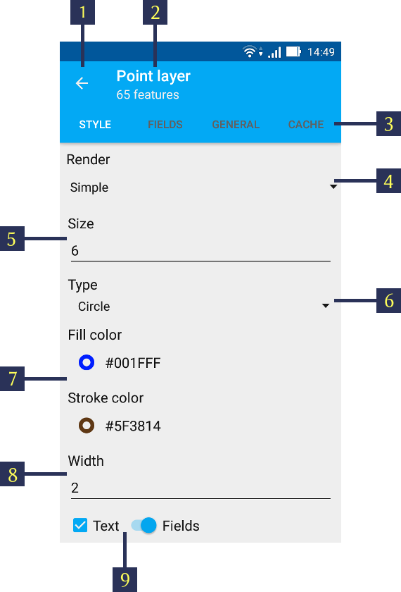

.. sectionauthor::  Наталья Барышникова Nshelekhova@gmail.com

.. _ngmobile_layer_settings:

Description of layers settings NextGIS Mobile
=============================================

Map is a set of raster and vector layers. Order and visibility of layers are configured in layers tree. There is a sliding panel of layers tree in a user’s interface where composition of the map is displayed as a set of layers. It allows to change the order of layers and enables or disables their visibility.

You can perform further operations with the layers by tapping layer context menu (item 5 in :numref:`ngmobile_layer_tree_pic`).
It will pop up a list of menues as shown in item 6 in :numref:`ngmobile_layer_tree_pic`.

Menu for the vector type has a following composition (:numref:`ngmobile_vector_layer_menu_pic`):

1. Zoom to  extent
2. Attributes
3. Share
4. Edit
5. Delete
6. Settings

.. note::
   Layers menu depends on its type. Raster layer has different context menues than that of a Vector layer.

.. _ngmobile_vector_layer_settings:

Vector layer settings
---------------------

Tap on "Settings" from the layer menu to configure it. A panel opens as shown in :numref:`ngmobile_style_vector_pic` below. 

   
   Vector layer settings.
   
   The numbers indicate: 1 - Close settings panel; 2 - Type of layer & features count; 3 - Layer settings menu; 4 - Select Render (Simple or Rule); 5 - Size of feature; 6 - Feature type; 7 - Colour palette; 8 - Stroke width; 9 - Label text.
   
Above :numref:`ngmobile_style_vector_pic` shows a Simple Render. In this Render type all the features have same colour which can be set through "Fill color" (see item 7 in :numref:`ngmobile_style_vector_pic`). It also facilitates the border colour setting through "Stroke color" (see item 7 in :numref:`ngmobile_style_vector_pic`). The sizes of both of these can be changed by typing appropriate size in "Size" & "Width" respectivelly (see items 5 & 8 in :numref:`ngmobile_style_vector_pic`). 

You can even select shape of the object by selecting "Type" (see item 6 in :numref:`ngmobile_style_vector_pic`). You can select from 1. Circle 2. Diamond 3. Cross 4. Triangle 5. Box

You can also show or hide one more important style feature, Lable text. You can make it appear by selecting "Text" and e;ect the field to appear as shown in item 9 in :numref:`ngmobile_style_vector_pic`.

For advanced styling of vector layer select "Rule" in the Render. It will open another list of menus as shown in  :numref:`ngmobile_style_vector_rulebased_pic` below.

.. figure:: _static/style_vector_rulebased.png
   :name: ngmobile_style_vector_rulebased_pic
   :align: center
   :height: 10cm
   
   Rule based vector style.
   
   The numbers indicate: 1 - Rule Render; 2 - Field name selection; 3 - New render rule; 4 - Selected fields; 5 - Delete rule.
   
select the field from available fields list to render as rule (see item 2 in :numref:`ngmobile_style_vector_rulebased_pic`). Then tap on "NEW" (see item 3 in :numref:`ngmobile_style_vector_rulebased_pic`). It will pop up a panel showing all the unique values from that selected field. Select the value one by one & tap on its name to open the styling panel as shown below in  :numref:`ngmobile_style_vector_rulebased_item_pic`

.. figure:: _static/style_vector_rulebased_item.png
   :name: ngmobile_style_vector_rulebased_item_pic
   :align: center
   :height: 10cm
   
   Rule based field item.
   
Here you can select the Stroke colour & size of the feature as well as the label text to show based on the attribute field. Select "OK" when finished. Thus you can configure all the values within that field and render them on map screen.

To select which field to render as Label, tap on the "FIELDS" menu and select one of the field as shown in :numref:`ngmobile_style_select_field_pic`

.. figure:: _static/style_select_field.png
   :name: ngmobile_style_select_field_pic
   :align: center
   :height: 10cm
   
   Select field for Label.
   
The "GENERAL" menu shows information about layer as its path, name & allowed zoom levels to show. It is possible to show the layer within certain zoom levels only. For rest all other it will be invisible from the map screen. See :numref:`ngmobile_style_vector_general_pic` below.

.. figure:: _static/style_vector_general.png
   :name: ngmobile_style_vector_general_pic
   :align: center
   :height: 10cm
   
   Style vector General menu.

The "Rebuild cache" item in "CACHE" menu is used to optimize the processes of a layer creating with the ability to save and cancel changes.

.. _ngmobile_raster_layer_settings:

Raster layers settings
----------------------

Context menu of raster layer has the following composition (see :numref:`ngmobile_raster_layer_menu_pic`):

1. Zoom to extent
2. Delete
3. Settings

.. figure:: _static/raster_layer_menu.png
   :name: ngmobile_raster_layer_menu_pic
   :align: center
   :height: 10cm
   
   Raster layer menu.

Tap on "Settings" to open raster layer settings. It will open up the raster layer settings panel as shown in :numref:`ngmobile_style_raster_pic` below.

.. figure:: _static/style_raster.png
   :name: ngmobile_style_raster_pic
   :align: center
   :height: 10cm

   Raster layers settings.
   
You can set the values for

1. Opacity. The value of layer opacity determines how intensive it hides or displays the contents of the underlying layer. Layer with 1% opacity is substantially transparent. Completely opaque layer has an opacity of 100%.
2. Contrast. Contrast of the layer can be changed to spice up the image.
3. Brightness. Brightness of layer can be changed to make image darker or lighter.
4. Greyscale (the color image mode value of grayscale brightness values expressed in percent. 0% is a white color (the absence of black pigment on a white background), 100% is a black color).

The "GENERAL" menu shows information about layer as its path, name & allowed zoom levels to show. It is possible to show the layer within certain zoom levels only. For rest all other it will be invisible from the map screen. See :numref:`ngmobile_style_vector_general_pic` below.

.. figure:: _static/style_vector_general.png
   :name: ngmobile_style_vector_general_pic
   :align: center
   :height: 10cm
   
   Raster General menu.

The "Rebuild cache" item in "CACHE" menu is used to optimize the processes of a layer creating with the ability to save and cancel changes.
