.. sectionauthor:: Дмитрий Барышников <dmitry.baryshnikov@nextgis.ru>

.. _ngmobile_load_geodata:

Добавление слоев
=================

В программе имеется возможность загрузки локальных данных с облачных хранилищ и 
с хранилища мобильного устройства, а также возможность создавать пустой векторный слой.
Существуют следующие типы хранения локальных данных: 

* :term:`GeoJSON`;
* тайловый кэш XYZ/TMS в ZIP-архиве;
* тайловый кэш в формате *.ngrc;
* настраиваемые формы в формате *.ngfp. 

.. _ngmobile_create_vector:

Создание слоя
--------------

.. versionadded:: 2.3

Для того, чтобы создать пустой векторный слой, необходимо выполнить 
следующую последовательность шагов:

1. На панели инструментов дерева слоев (:numref:`ngmobile_main_activity_pic`, п.1) нажать на кнопку "Добавить геоданные" (:numref:`ngmobile_layer_tree_pic`, п.4), далее выбрать пункт меню «Создать слой» (см. :numref:`ngmobile_the_menu_button_new_layer_pic`) 

.. figure:: _static/ngmobile_the_menu_button_Add_data.png
   :name: ngmobile_the_menu_button_new_layer_pic
   :align: center
   :height: 10cm
 
   Меню кнопки "Добавить геоданные".

2. В открывшемся окне необходимо заполнить поля стандартной формы атрибутов для создаваемого
векторного слоя (см. :numref:`ngmobile_input_form_attributes_new_layer_pic`) 

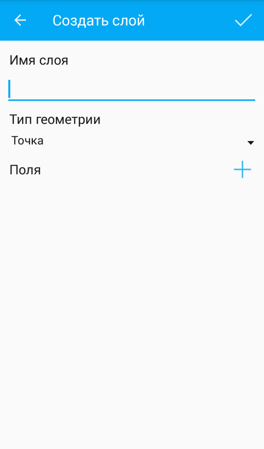
   
   Форма ввода атрибутов нового векторного слоя. 

При создании векторного слоя нужно указать следующие параметры:

1. Имя слоя - название слоя, которое будет отображаться в дереве слоев.
2. Тип геометрии - выбор геометрии (точка, линия, полигон, мультиточка, мультилиния, мультиполигон).
3. Поля - список полей, содержащий добавляемые поля, которые можно добавлять, изменять и удалять.

Можно добавить к новому векторному сколько угодно полей. Для этого нужно нажать на кнопку "+" рядом с кнопкой "Поля". При этом откроется  диалог создания нового поля (см. :numref:`ngmobile_dialogue_create_new_field_pic`) 

.. figure:: _static/dialogue_create_new_field_new.png
   :name: ngmobile_dialogue_create_new_field_pic
   :align: center
   :height: 10cm

   Диалог создания нового поля.

Открывшийся диалог содержит следующие для заполнения поля:

1. Имя поля - название поля. 

.. note:: 
   Имя поля может быть введено только на английском языке (буквы и цифры!) 
   и без пробелов. Также не должно совпадать со служебными словами SQL.

2. Тип поля - выбор типа поля (строка, целочисленное, вещественное, дата и время,
   дата, время) 

.. _ngmobile_import_vector:

GeoJSON
-------

NextGIS Mobile позволяет создать векторный слой путем импорта существующего файла GeoJSON. Для этого необходимо выполнить 
следующую последовательность шагов:

1. На панели инструментов дерева слоев (:numref:`ngmobile_main_activity_pic`, п.1) нажать на кнопку "Добавить геоданные" (:numref:`ngmobile_layer_tree_pic`, п.4). В открывшемся диалоге выбрать пункт меню "Открыть локальный" (см. :numref:`ngmobile_the_menu_button_new_layer_pic`).

2. В открывшемся окне выбора сохраненных файлов на диске мобильного устройства 
   выбрать необходимый для загрузки файл формата GeoJSON (см. :numref:`ngmobile_saved_files_on_the_drive_unit_pic`) (он имеет расширение .geojson; он также может находиться внутри архива с расширением .geojson.zip, при этом файл должен быть в корне, а не в подпапках этого архива): 

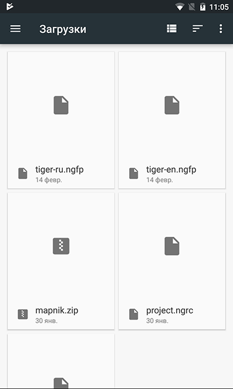
   
   Окно с сохраненными файлами на диске мобильного устройства. 

3. После выбора файла откроется диалог настройки параметров создаваемого слоя, в 
   котором можно задать имя слоя (см. :numref:`ngmobile_layer_settings_geo_pic`): 

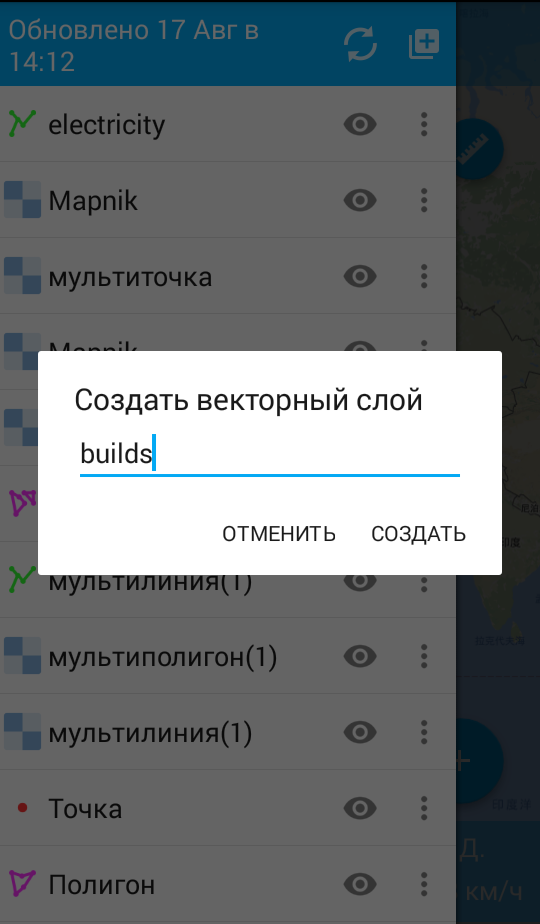

   Настройки параметров создаваемого слоя.

   
4. При нажатии на кнопку "Создать", начнется процесс обработки и создания 
   слоя.

.. note::
   В случае загрузки в программу файла формата GeoJSON создаваемый слой в результате 
   загрузки геоданных такого типа будет всегда векторным!

Наличие или отсутствие слоя можно проверить в дереве слоев. В случае удачной процедуры 
обработки и создания слоя, новый слой располагается первым в дереве слоев (см. :numref:`ngmobile_tree_layers_geo_pic`): 

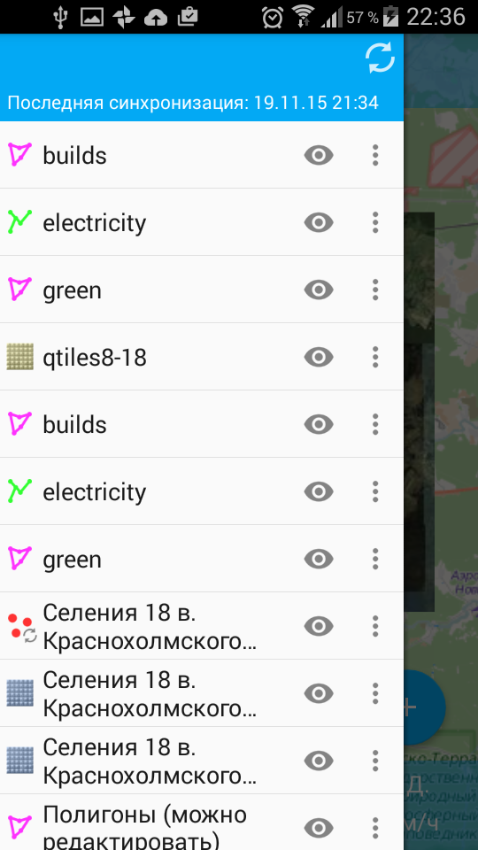

   Дерево слоев.

**Требования к формату GeoJSON**

* :term:`Система координат` геометрий может быть только WGS 84 (EPSG:4326) или Web Mercator 
  (EPSG:3857). Если на вход будет подан файл в другой системе координат, то будет выведено 
  сообщение о том, что такая система координат не поддерживается. 
* Все геометрии в файле должны быть одного типа. Если во входном файле содержатся геометрии 
  разного типа, то будут загружены записи, у которых тип геометрии совпадает с первой 
  записью (геометрия первой записи файла определяет тип геометрии слоя).
* Текстовые строки должны быть кодированы в формате UTF-8. 

.. note::
   Подробнее о формате GeoJSON можно прочитать в его `спецификации <http://geojson.org/>`_. 
   GeoJSON основывается на формате JSON (см. `RFC 4627 <https://www.ietf.org/rfc/rfc4627.txt>`_).

При редактирования векторного слоя, полученного из GeoJSON, доступна только стандартная форма 
редактирования атрибутов. В отличие от пользовательской формы (см. *.ngfp) стандартная форма 
может содержать только три типа полей:

1. Текстовое поле для ввода текста и цифр.
2. Диалог ввода и времени.
3. Кнопка добавления фотографии и записи.

Пример стандартной формы редактирования атрибутов слоя представлен на :numref:`ngmobile_standard_form_layer_attributes_pic`: 

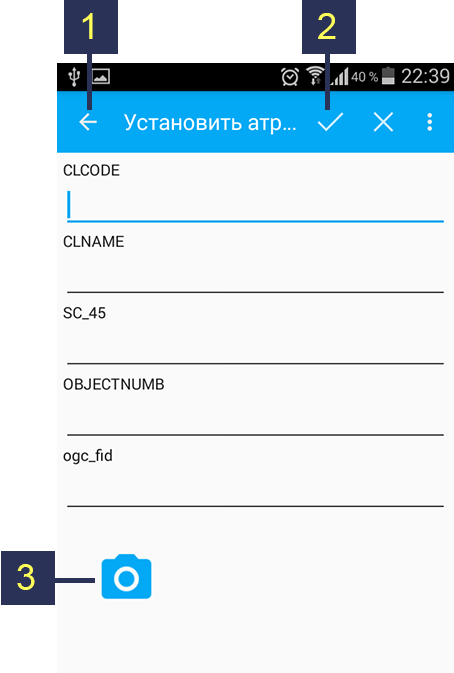
    
   Стандартная форма редактирования атрибутов слоя.

Затем над этим слоем можно выполнять стандартные операции редактирования, такие как Добавить, Изменить или Удалить. Подробнее о редактировании файла формата GeoJSON описано в разделе :ref:`ngmobile_editing`.

.. _ngmobile_import_ngfp:

Пользовательские формы
-------------------

.. versionadded:: 2.2

NextGIS Mobile позволяет создавать векторный слой путем импорта существущего файла NGFP. 

Файл формата ngfp получается в результате работы программы `NextGIS FormBuilder <http://nextgis.ru/nextgis-formbuilder/>`_ и представляет собой файл :term:`GeoJSON` и файлы с дополнительной информацией (JSON), которые упакованы в архив zip, но расширением .ngfp.

Особенностью редактирования слоя на базе файла формата NGFP является заполнение не стандартной, 
а пользовательской формы для редактирования атрибутов. Пользовательская форма специальным 
образом оптимизирована для ввода данных и может содержать особые управляющие элементы 
для более удобного ввода данных, выбор из выпадающего списка, связанные списки, радио-кнопки и т.д. (см. :numref:`ngmobile_non-standard_form_pic`). 

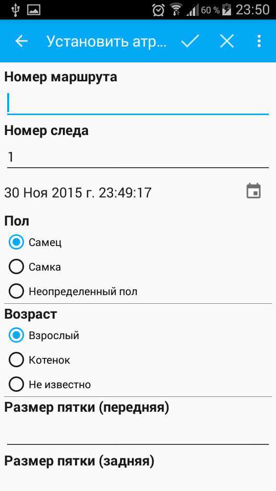
    
   Пользовательская форма редактирования атрибутов слоя.
   
    Цифрами указаны: 1 - назад на предыдущий экран; 2 - применить изменения; 3 - настройки; 4 - текстовое поле для ввода текста и цифр; 5 - выпадющий список; 6 - время и дата; 7 - радио-кнопки.

Для того, чтобы загрузить в программу файл формата ngfp, необходимо выполнить 
следующую последовательность шагов:

1. На панели инструментов дерева слоев (:numref:`ngmobile_main_activity_pic`, п.1) нажать на кнопку "Добавить геоданные" (:numref:`ngmobile_layer_tree_pic`, п.4). В открывшемся диалоге выбрать пункт меню "Открыть локальный" (см. :numref:`ngmobile_the_menu_button_new_layer_pic`). 

2. В открывшемся окне выбора сохраненных файлов на диске мобильного устройства 
   выбрать необходимый для загрузки файл формата ngfp (см. :numref:`ngmobile_saved_files_on_the_drive_pic_3`).
   

   
   Выбор файла для загрузки.

3. После выбора файла откроется диалог настройки параметров создаваемого слоя, в 
   котором можно задать имя слоя (см. :numref:`ngmobile_settind_layer_form_pic`): 

.. figure:: _static/settind_layer_form.png
   :name: ngmobile_settind_layer_form_pic
   :align: center
   :height: 10cm

   Настройки параметров создаваемого слоя.
   
4. При нажатии на кнопку "Создать", начнется процесс обработки и создания слоя (см. :numref:`ngmobile_tree_layers_geo_pic`). Наличие или отсутствие слоя можно проверить в дереве слоев. В случае удачной процедуры обработки и создания слоя, новый слой располагается первым в дереве слоев.

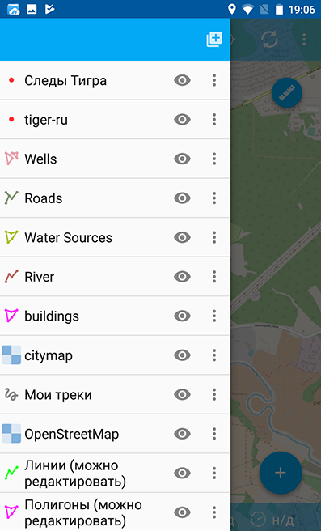

   Дерево слоев.

Затем над этим слоем можно выполнять стандартные операции редактирования, такие как Добавить, Изменить или Удалить. Подробнее о редактировании файла формата ngfp изложено в разделе :ref:`ngmobile_editing`.

.. _ngmobile_import_cache:

Тайловый кэш (XYZ/TMS)
----------------------

NextGIS Mobile позволяет создавать растровый слой путем импорта тайлового кэша.

Тайловый кэш представляет собой zip-архив, в котором упакованы папки и тайлы 
в соответствии с нарезкой (например, folder_z/folder_x/y.png). Сами папки уровня Z 
могут находиться в корне архива или в одной папке в корне архива (название папки 
может быть любым, но папка должна быть одна). Более глубокая вложенность не допускается. 

Тайловый кэш может быть получен при помощи модуля расширения `NextGIS QGIS - QTiles <http://plugins.qgis.org/plugins/qtiles/>`_. 
Полученный в результате работы модуля архив можно загрузить на устройство в любую 
доступную папку.

Для того, чтобы загрузить в программу zip-архив, в котором упакованы папки 
и тайлы, необходимо выполнить следующую последовательность шагов:

1. На панели инструментов дерева слоев (:numref:`ngmobile_main_activity_pic`, п.1) нажать на кнопку "Добавить геоданные" (:numref:`ngmobile_layer_tree_pic`, п.4). В открывшемся диалоге выбрать пункт меню "Открыть локальный" (см. :numref:`ngmobile_the_menu_button_new_layer_pic`).

2. В открывшемся окне выбора сохраненных файлов на диске мобильного устройства 
   выбрать необходимый для загрузки zip-архив: 

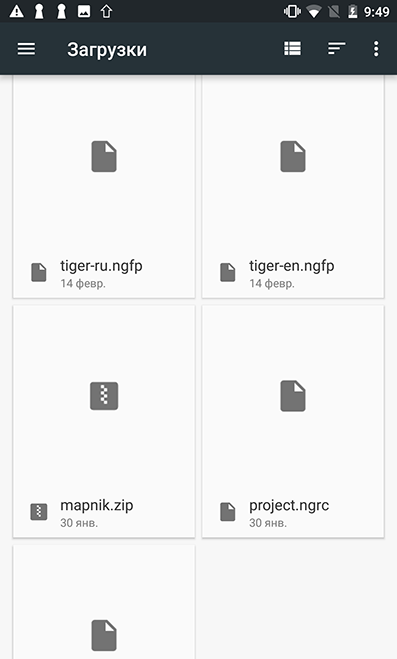
   
   Окно с файлами на диске мобильного устройства. 

3. После выбора на диске устройства zip-архива откроется диалог настройки 
   параметров создаваемого слоя (см. :numref:`ngmobile_layer_setting_tms_pic`):

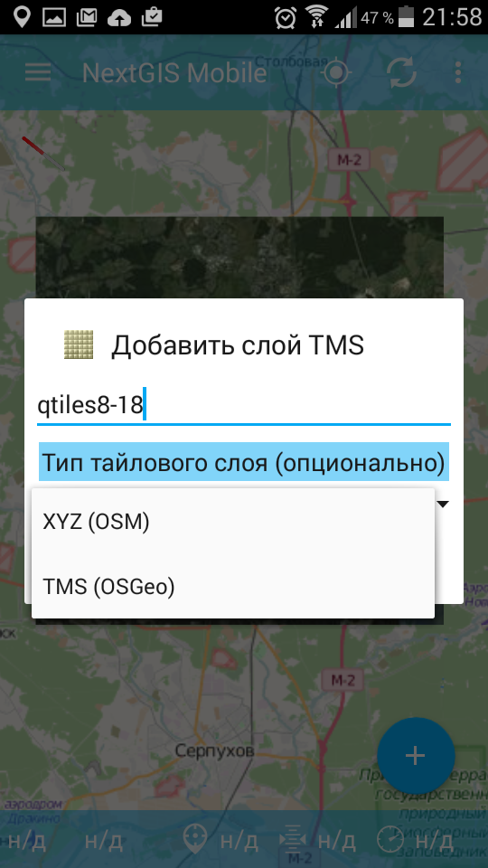

   Диалог настройки тайлового слоя.

Здесь можно выбрать тип тайлового слоя (систему кодирования тайлов) - XYZ (OSM) или TMS (OSGeo) (см. :numref:`ngmobile_layer_setting_tms_pic_2`), и размер кэша (см. :numref:`ngmobile_layer_setting_tms_pic_3`):

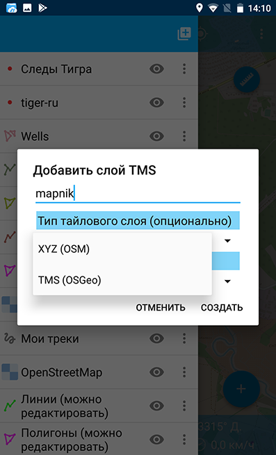

   Настройка типа тайлового слоя.

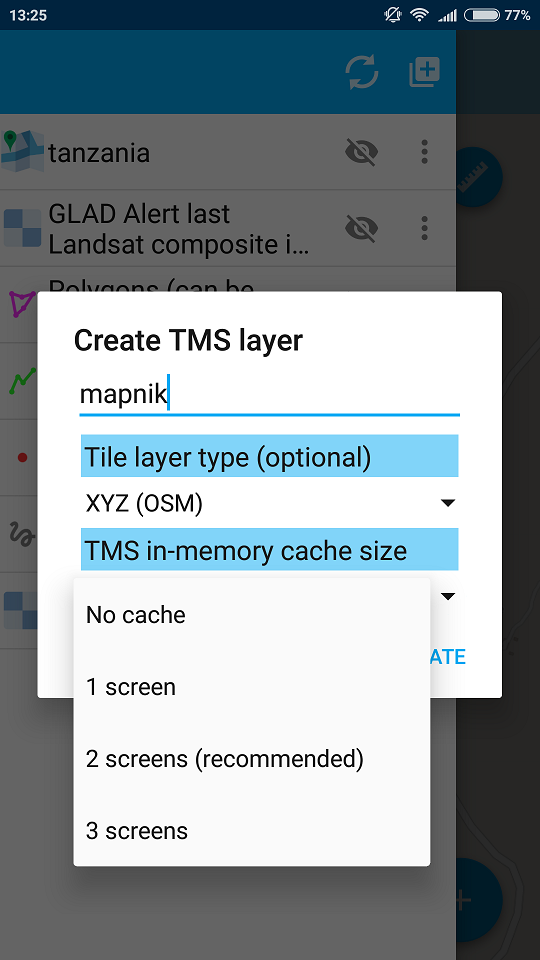

   Настройка размера кэша тайлов TMS.

4. При нажатии на кнопку "Создать", начнется процесс обработки и создания нового растрового слоя
   (см. (see :numref:`ngmobile_processing_and_creation_layer_tms_pic`).

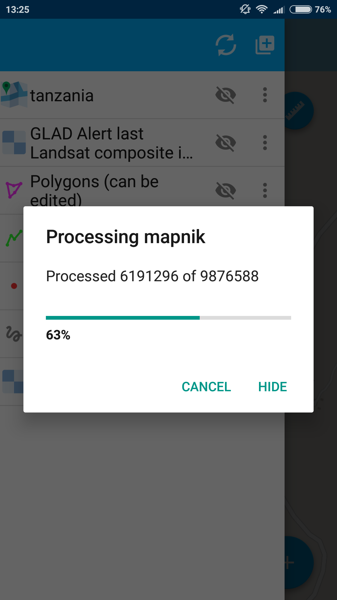

   Окно обработки и создания слоя.

Наличие или отсутствие тайлового слоя можно проверить в дереве слоев. В случае удачной процедуры обработки и создания слоя, имя нового слоя будет отображаться первым в дереве слоев: 

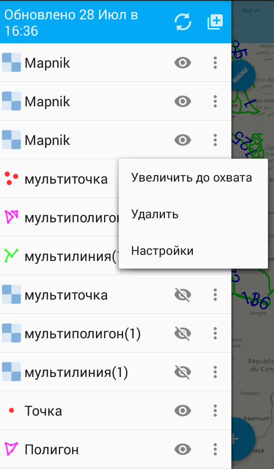

   Меню дерева слоев.
   
.. _ngmobile_import_ngrc:

Тайловый кэш (NGRC)
-------------------

NextGIS Mobile также позволяет создавать растровый слой путем импорта тайлового кэша в формате *.ngrc.

Для того, чтобы загрузить в программу файл формата ngrc, в котором упакованы папки 
и тайлы, необходимо выполнить следующую последовательность шагов:

1. На панели инструментов дерева слоев (:numref:`ngmobile_main_activity_pic`, п.1) нажать на кнопку "Добавить геоданные" (:numref:`ngmobile_layer_tree_pic`, п.4). В открывшемся диалоге выбрать пункт меню "Открыть локальный" (см. :numref:`ngmobile_the_menu_button_new_layer_pic`).

2. В открывшемся окне выбора сохраненных файлов на диске мобильного устройства 
   выбрать необходимый для загрузки файл в формате *.ngrc: 

   
   Окно с файлами на диске мобильного устройства. 

3. При нажатии на кнопку "Создать", начнется процесс обработки и создания нового растрового слоя.
Наличие или отсутствие тайлового слоя можно проверить в дереве слоев. В случае 
удачной процедуры обработки и создания слоя, имя нового слоя будет отображаться 
первым в дереве слоев: 

   Меню дерева слоев.

.. _ngmobile_add_geoservice:

Добавление геосервиса
----------------------

Также NextGIS Mobile позволяет создавать растровые слои из внешних геосервисов.

.. warning::
   Для создания слоев из внешних геосервисов необходимо подключение к сети Интернет.

.. _ngmobile_qms_service:

Создание растрового слоя из тайлового сервиса
^^^^^^^^^^^^^^^^^^^^^^^^^^^^^^^^^^^^^^^^^^^^^

Для создания растрового слоя необходимо выполнить следующие шаги:

1. На панели инструментов дерева слоев (:numref:`ngmobile_main_activity_pic`, п.1) нажать на кнопку "Добавить геоданные" (:numref:`ngmobile_layer_tree_pic`, п.4). В открывшемся диалоге выбрать пункт меню Добавить геосервис (см. :numref:`ngmobile_add_geoservice_pic`): 

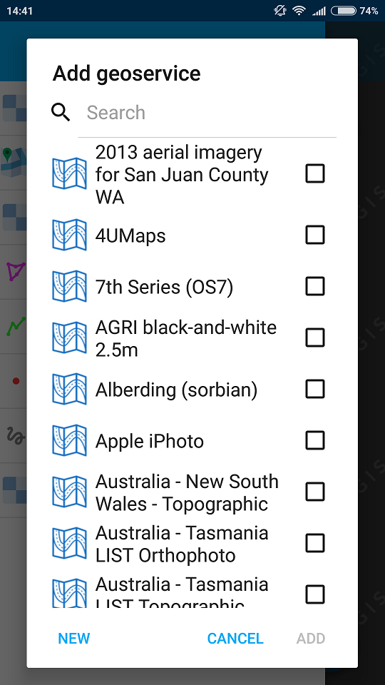
 
   Окно со списком геосервисов.

Выбор геосервиса из списка осуществляется путем проставления в пустом окошке метки/галочки с правой 
стороны экрана. После нахождения и выбора необходимого геосервиса следует нажать кнопку Добавить.

В результате удачного добавления геосервиса, новый геосервис будет отображаться 
первым в дереве слоев.

.. _ngmobile_tile_service:

Создание растрового слоя из частного тайлового сервиса
^^^^^^^^^^^^^^^^^^^^^^^^^^^^^^^^^^^^^^^^^^^^^^^^^^^^^^

При необходимости добавить тайловый сервис, отсутствующий в списке, нужно выполнить следующую последовательность действий:

1. Нажать на кнопку "Новый" в диалоговом окне :numref:`ngmobile_add_geoservice_pic`. Это приведет к открытию диалога добавления слоя TMS, как показано на :numref:`ngmobile_ngmobile_new_geoservice_pic`.

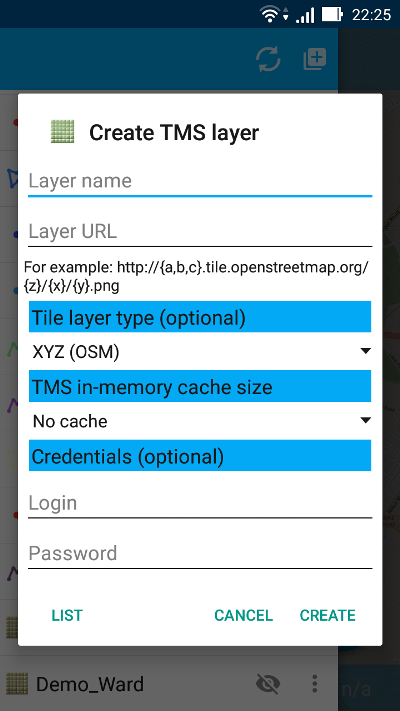

   Диалог создания сервиса TMS.
   
2. При формировании адреса сервиса тайлов необходимо указать место в адресе значений X (номер тайла по горизонтали),
Y (номер тайла по вертикали) и Z (уровень зума). Для этого в строке адреса на месте цифры, соответствующей Х, 
необходимо поставить подстановочный код **{x}**, для Y - **{y}**, для Z - **{z}**. 
Дополнительно в строке адреса можно указать поддомены (например, для поддоменов a.tileopenstreetmap.org, 
b.tileopenstreetmap.org, c.tileopenstreetmap.org адрес будет выглядеть так: **{a,b,c}.tile.openstreetmap.org**).

.. note::
   При загрузке тайлов на каждый адрес (поддомен) NextGIS Mobile осуществляет запрос 
   в два потока. Таким образом для адреса {a,b,c}.tile.openstreetmap.org приложение 
   будет скачивать тайлы в 6 потоков.

3. Также можно уточнить тип тайлового слоя (XYZ (OSM) или TMS (OSGeo)), размер кэша TMS (без кэша, 1, 2 или 3 экрана) и аутентификация пользователя (имя пользователя и пароль) в случае, когда это требуется для доступа к тайлам. 

.. note::
   В настоящее время поддерживается только `Basic access authentication <http://en.wikipedia.org/wiki/Basic_access_authentication>`_.

4. Нажать "Создать" для создания нового растрового слоя из этого сервиса TMS. В результате удачного добавления геосервиса, новый геосервис будет отображаться первым в дереве слоев.

.. _ngmobile_tile_cache:

Кэширование данных тайлового сервиса 
^^^^^^^^^^^^^^^^^^^^^^^^^^^^^^^^^^^^

С растровыми слоями, созданными из внешних геосервисов, можно работать и при отсутствии подключения к сети Интернет. Для этого необходимо сначала загрузить тайлы для интересующей области:

1. Следует убедиться, что растровый слой, который потребуется **Оффлайн**, добавлен на экран карты и виден. Затем необходимо открыть содержимое карты, для которого нужно скачать тайлы.

2. На панели инструментов дерева слоев (:numref:`ngmobile_main_activity_pic`, п.1) слелует найти растровый слой и нажать кнопку вызова контекстного меню слоя (:numref:`ngmobile_layer_tree_pic`, п.5).

3. Нажать кнопку "Загрузить тайлы", как показано ниже на :numref:`download_tiles_pic`. 

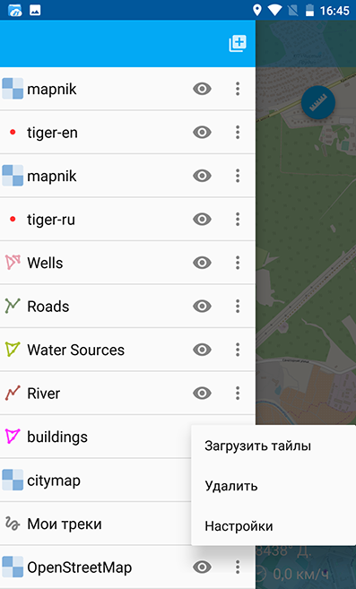
 
   Кнопка "Загрузить тайлы".

4. Далее откроется окно с настройками загрузки тайлов (см. :numref:`ngmobile_levels_of_zoom_pic`), где нужно задать необходимый зум и нажать кнопку "Начать". 

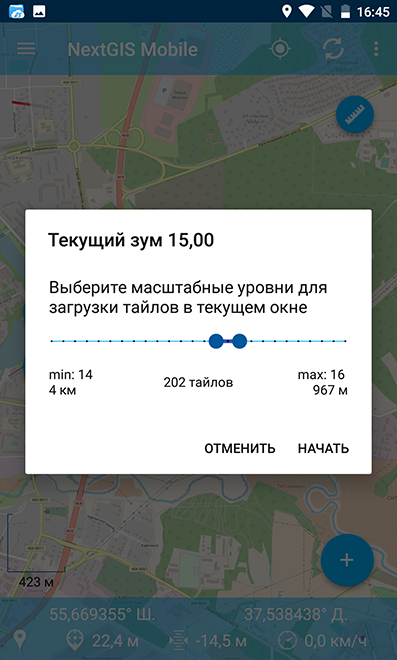
 
   Окно выбора уровня зума для загрузки тайлов.

.. note::
   Чем меньше уровень выбранного зума для загрузки тайлов, тем меньшее количество тайлов попадают в интересующую нас область и тем быстрее происходит загрузка всего изображения. На панели статуса устройства Android можно отслеживать прогресс загрузки. Уведомления для приложения NextGIS Mobile должны быть активированы в системных настройках.

.. warning::
   Если список загружаемых тайлов для заданного диапазона зумов превышает 6000, то будут загружены только первые 6000 тайлов. Остальные тайлы не будут загружаться из-за ограничений на переполнение памяти.

.. _ngmobile_webgis:

Создание Вeб GIS в браузере
----------------------------

Для начала работы Вам необходимо зайти на сайт NextGIS и зарегистрировать учётную запись, 
которая позволит начать работу с Веб ГИС. Для создания учетной записи необходимо нажать на 
кнопку Создать Веб ГИС на странице сайта nextgis.ru (см. :numref:`ngmobile_create_an_account_WebGIS_pic`): 

.. figure:: _static/ngmobile_create_an_account_WebGIS.png
   :name: ngmobile_create_an_account_WebGIS_pic
   :align: center
   :width: 16cm    

   Сайт NextGIS с кнопкой для создания учетной записи.   

Откроется форма для заполнения аккаунта, в которой необходимо заполнить полe e-mail и 
назначить пароль для вашего аккаунта, а затем нажать на кнопку "Создать аккаунт" (см. :numref:`ngmobile_account_form_WebGIS_pic`): 

.. figure:: _static/ngmobile_account_form_WebGIS_rus.png
   :name: ngmobile_account_form_WebGIS_pic
   :align: center
   :width: 16cm    

   Форма для заполнения аккаунта.

.. note::

   Собственную учетную запись, которая позволит работать с Веб ГИС, можно также создать 
   через социальные сети, в которых вы зарегистрированы. 

От NextGIS.com на указанную в форме почту придет письмо со ссылкой. Кликнув по ссылке, 
вы подтвердите электронную почту для обратной связи.
После активации ссылки и подтверждения адреса электронной почты на сайте NextGIS.com 
откроется страница с профилем, который необходимо заполнить, выбрать язык общения и 
нажать кнопку "Сохранить" (см. :numref:`ngmobile_profile_1_WebGIS_pic`): 

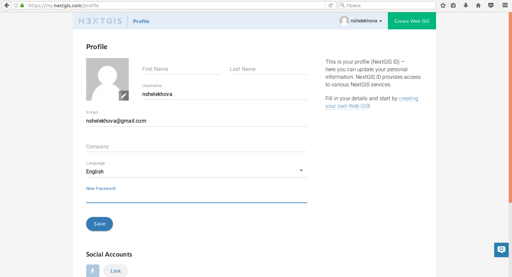
  
   Страница профиля на сайте nextgis.com. 

Далее следует заполнить форму создания Веб ГИС, в которой назначается и заполняется заголовок 
домена вашей Веб ГИС, выбирается язык интерфейса. Также следует выбрать тарифный план с перечнем 
возможных услуг (см. :numref:`ngmobile_creation_form_WebGIS_pic`): 

.. figure:: _static/ngmobile_creation_form_WebGIS.png
   :name: ngmobile_creation_form_WebGIS_pic
   :align: center
   :width: 16cm    

   Заполнение формы Веб ГИС.

Закончить создание своей Веб ГИС следует нажатием на кнопку "Создать Веб ГИС" 
(см. :numref:`ngmobile_creation_form_1_WebGIS_pic`): 

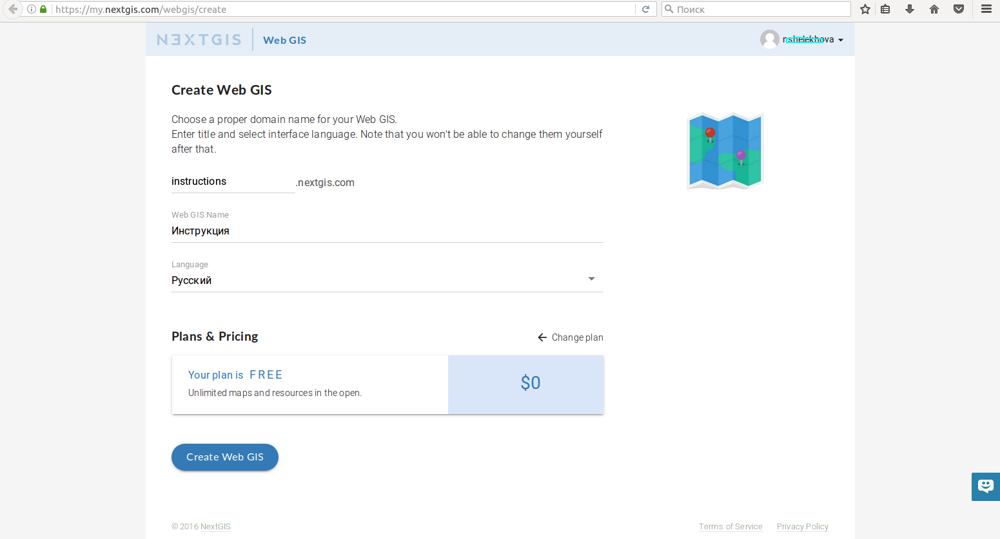

   Создание Веб ГИС.

.. note::

   После ввода заголовка домена вашей Веб ГИС и выбора языка для интерфейса изменить 
   их будет невозможно!

Далее откроется окно с информацией о том, что ваша Веб ГИС находится в процессе создания. 
И когда этот процесс завершится, вам на электронную почту придет письмо с логином и паролем 
для последующих входов в вашу Веб ГИС через сайт nextgis.com
(см. :numref:`ngmobile_e-mail_WebGIS_pic`): 

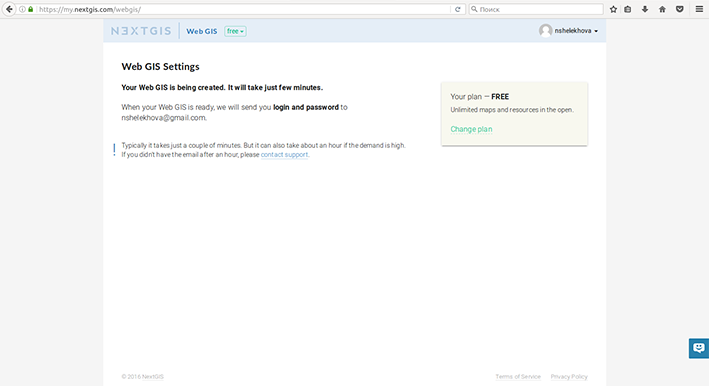

   Окно с информацией о создании Веб ГИС.

После создания вашей Веб ГИС в вашем профиле пользователя будет иметься ссылка с 
названием вашей Веб ГИС. Ссылка находится в верхнем правом углу рядом с вашей электронной почтой (см. :numref:`ngmobile_profile_with_a_link_WebGIS_pic`): 

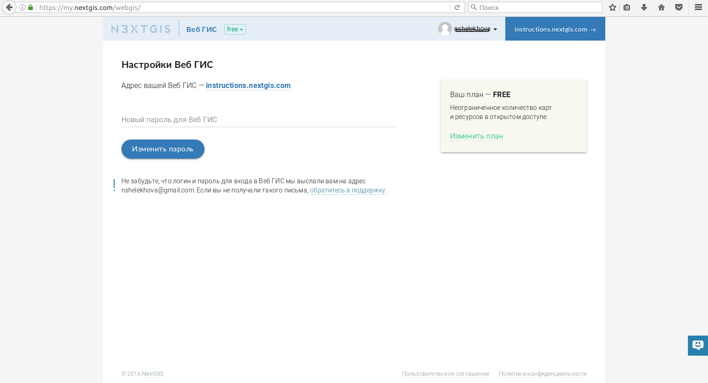

   Профиль со ссылкой на вашу Веб ГИС.

Следует пройти по этой ссылке. Откроется окно с Основной группой ресурсов 
(см. :numref:`ngmobile_main_resources_WebGIS_pic`): 

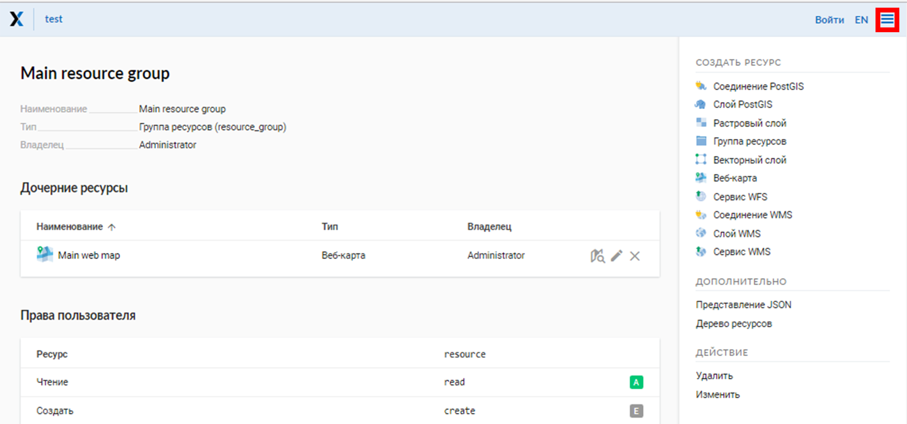

   Окно "Основная группа ресурсов".
   
   Красным прямоугольником выделена панель, в которой находятся кнопки "Ресурсы", "Панель управления" и "Справка".

.. note::

   Для осуществления загрузки файлов в вашу Веб ГИС следует выполнить вход с правами 
   на создание данных. Кнопка Войти находится в правом верхнем углу!

Ознакомиться с основами работы с Веб ГИС следует воспользоваться кнопкой Справка, которую можно найти, открыв крайнюю панель в верхнем правом углу (см. :numref:`ngmobile_help_button_WebGIS_pic`): 

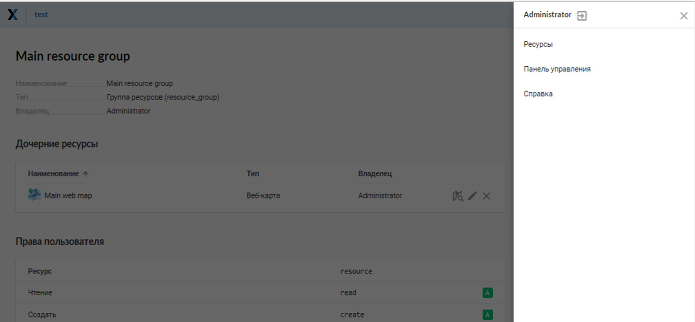

   Кнопка Справка.

После нажатия на кнопку Справка откроется окно, в котором следует выбрать пункт 
Начало работы с Веб ГИС (см. :numref:`ngmobile_beginning_of_work_WebGIS_pic`): 

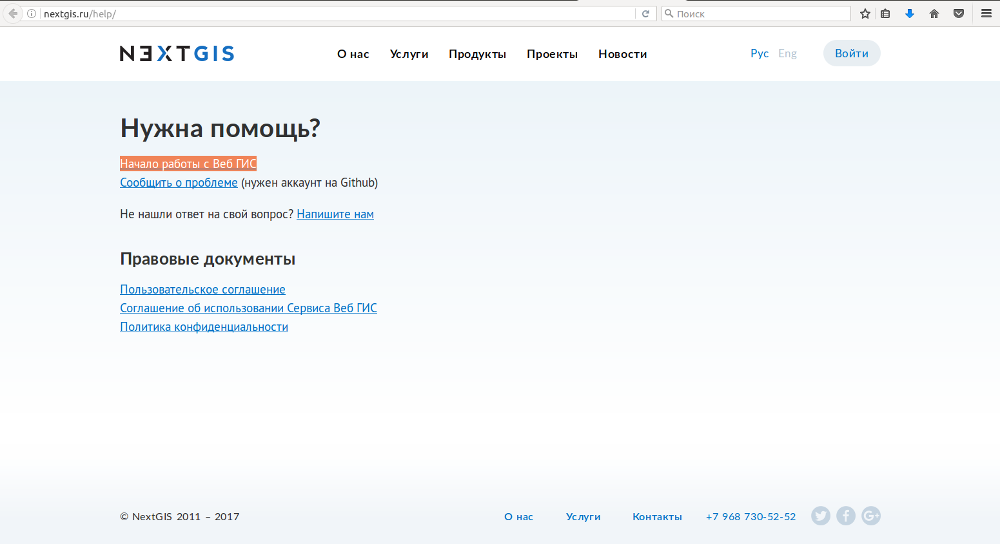

   Окно "Начало работы в Веб ГИС".

Откроется страница с документацией "Начало работы с Веб ГИС". Выбираем раздел 
"Как загружать данные" (см. :numref:`ngmobile_documentation_WebGIS_pic`): 

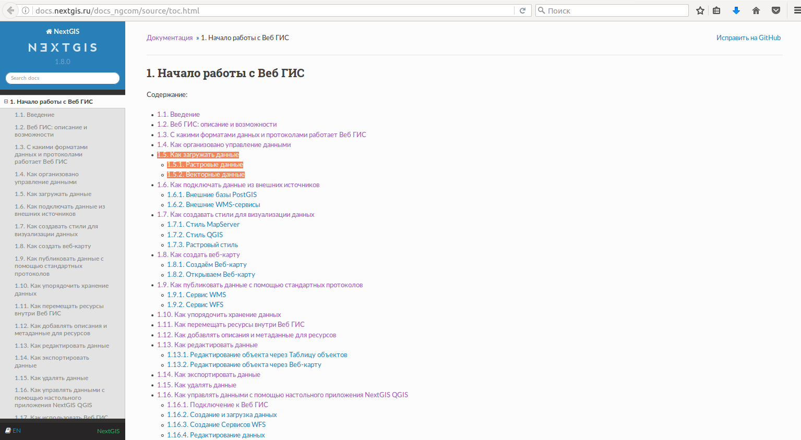

   Окно документации "Начало работы с Веб ГИС". 

.. _ngmobile_webgis_download:

Загрузка геоданных и создание веб-карт на основе геоданных в своей Веб ГИС
----------------------------------------------------------------------------------------

.. only:: html

   Для осуществления загрузки геоданых необходимо выполнить вход в Веб ГИС с 
   правами на создание данных, не гостевой вход. Подробнее о загрузке геоданных в 
   :ref:`Веб ГИС <ngcom_description>` можно ознакомиться в следующих разделах 
   документации :ref:`Растровый слой <ngcom_raster_layer>` и 
   :ref:`Векторный слой <ngcom_vector_layer>`.

.. only:: latex

   Для осуществления загрузки геоданых необходимо выполнить вход в Веб ГИС с 
   правами на создание данных, не гостевой вход. Подробнее о загрузке геоданных в 
   :ref:`Веб ГИС <ngcom_description>` можно ознакомиться в следующих разделах 
   документации `Растровый слой <http://docs.nextgis.ru/docs_ngcom/source/data_upload.html#ngcom-raster-layer>`_ и 
   `Векторный слой <http://docs.nextgis.ru/docs_ngcom/source/data_upload.html#ngcom-vector-layer>`_.

Добавление геоданных из Веб ГИС
^^^^^^^^^^^^^^^^^^^^^^^^^^^^^^^

Для того, чтобы загрузить в программу файлы/геоданные из Веб ГИС, необходимо выполнить 
следующую последовательность шагов:

1. На панели инструментов дерева слоев (:numref:`ngmobile_main_activity_pic`, п.1) нажать на кнопку "Добавить геоданные" (:numref:`ngmobile_layer_tree_pic`, п.4). В открывшемся диалоге выбрать пункт меню "Добавить из Веб ГИС" (см. :numref:`ngmobile_addition_of_NextGIS_pic`): 

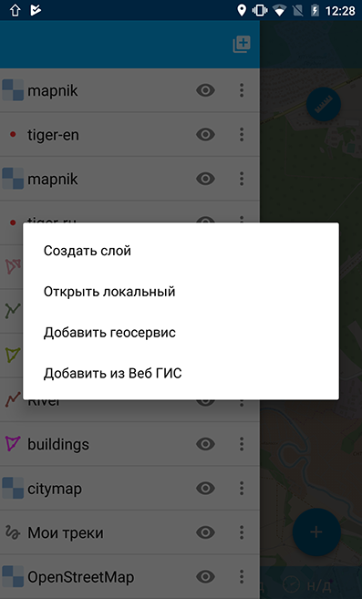

   Добавление из Веб ГИС.
 
2. В открывшемся окне следует выбрать пункт Добавить Веб ГИС и нажать кнопку Добавить
(см. :numref:`ngmobile_add_an_account_NextGIS_pic`): 

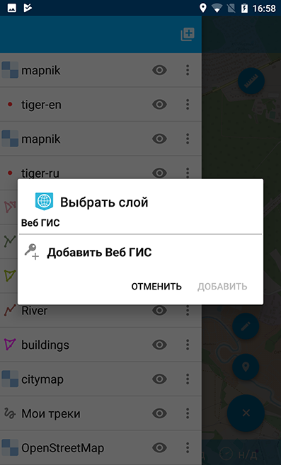

   Добавление учетной записи.

3. В открывшемся окне необходимо заполнить название домена вашей Веб ГИС и пароль, назначенный для входов в вашу Веб ГИС через сайт NextGIS.com. По окончании заполнения формы необходимо нажать кнопку Войти (см. :numref:`ngmobile_conversation_connection_WebGIS_pic`): 

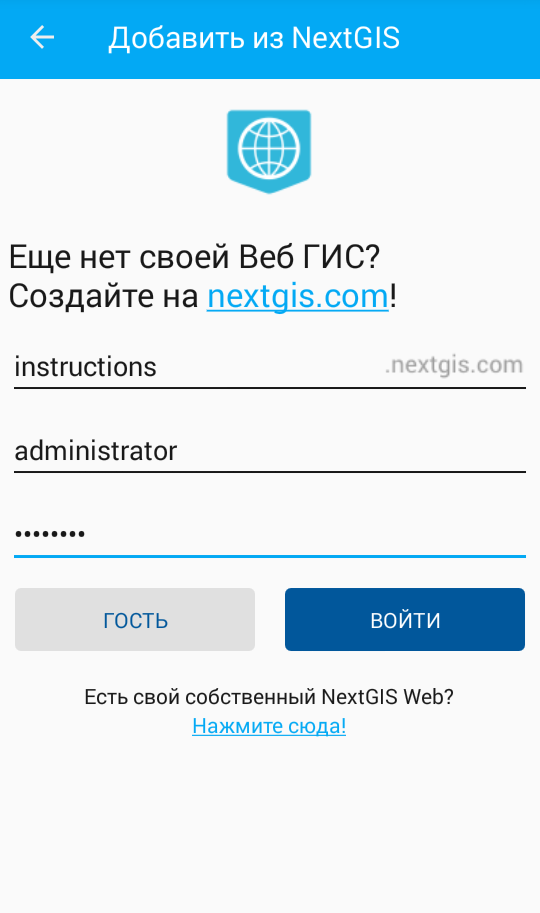

   Диалог подключения Веб ГИС.

4. По окончании подключения Веб ГИС, откроется в окно, в котором следует выбрать 
учетную запись, которая соответствует заголовку домена вашей Веб ГИС, и нажать кнопку 
Добавить (см. :numref:`ngmobile_account_election_Web_GIS_pic`): 

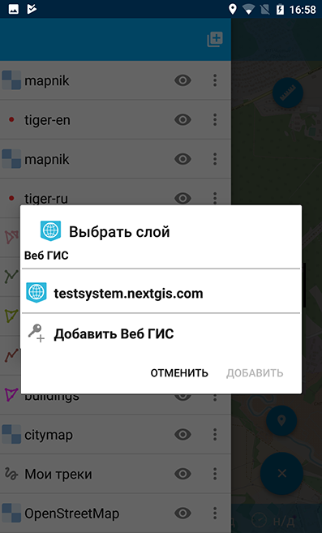

   Выбор учетной записи Веб ГИС. 

5. Далее откроется окно диалога выбора слоя для импорта геоданных из вашей Веб ГИС в 
NextGIS Mobile (см. :numref:`ngmobile_layer_selection_dialog_for_importing_pic`): 

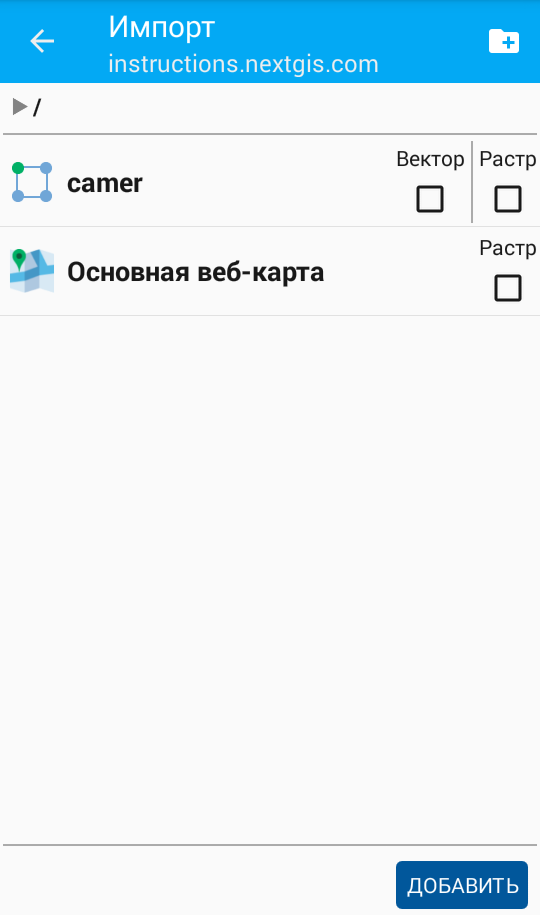

   Окно диалога выбора слоя для импорта геоданных из Веб ГИС. 

Если у слоя в Веб ГИС создан стиль, то появляется возможность выбрать для импорта 
помимо векторных данных еще и растр. Если данные импортируются на мобильное 
устройство в виде векторный данных, то такие данные скачиваются на мобильное устройство 
и могут быть доступны для использования при отсутствии Интернета. 
Если данные импортируются на мобильное устройство в виде растра при наличии в Веб ГИС 
созданного стиля у слоя на сервере, то такие данные могут быть доступны только при 
наличии сервера для отрисовывания картинки.   
Таким образом векторный слой можно добавить/импортировать в виде вектора либо в виде 
растра. Для этого следует поставить галочку в пустом окошке под названием необходимого 
слоя в правой части экрана (см. :numref:`ngmobile_layer_type_selection_pic`): 

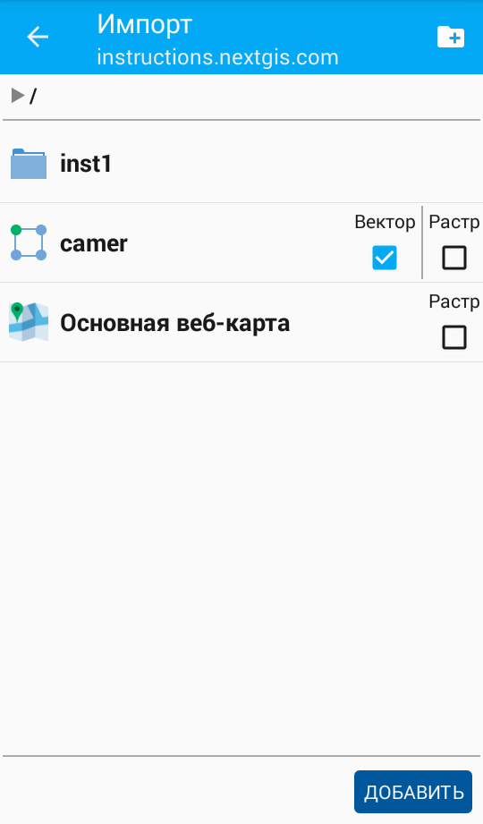
  
   Выбор типа слоя.

На верхней панели инструментов в правом углу имеется иконка в виде папки с плюсом.
При нажатии на эту иконку откроется диалог для создания новой группы данных в вашей 
Веб ГИС. В поле диалога следует задать имя для новой группы и нажать на кнопку ОК.
В случае удачного создания и сохранения новой папки, название новой папки появится в 
окне содержимого вашей Веб ГИС (см. :numref:`ngmobile_add_a_new_group_pic`): 

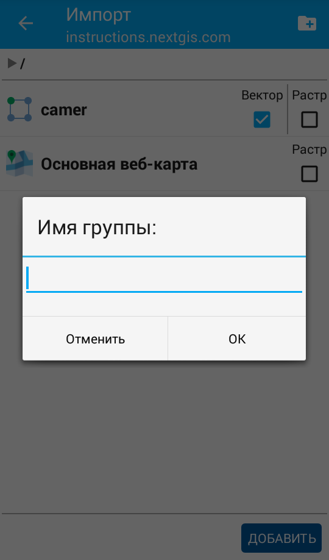
   
   Создание новой группы.  

6. После выбора слоя для импорта из Веб ГИС в NextGIS Mobile следует нажать на 
кнопку Добавить внизу экрана. После этого начнется процесс импорта из Веб ГИС в 
NextGIS Mobile. Наличие или отсутствие слоя можно проверить в дереве слоев. В случае удачной процедуры 
обработки и импортирования слоя, новый слой располагается первым в дереве слоев.
