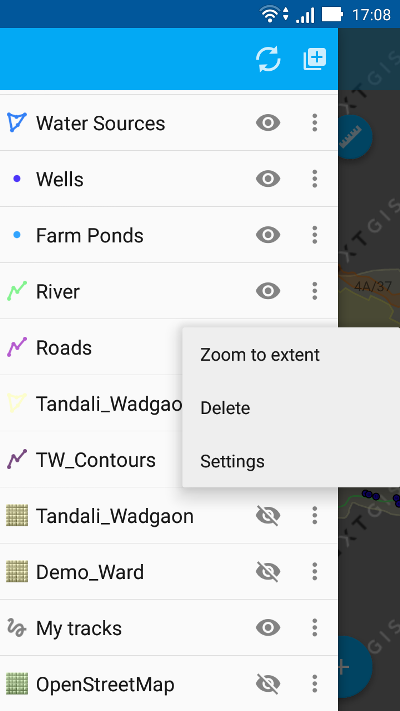

.. sectionauthor:: Дмитрий Барышников <dmitry.baryshnikov@nextgis.ru>

.. _load_geodata:

Загрузка данных
===============

GeoJSON
-------

При загрузке из формата :term:`GeoJSON` в файле должна быть хотя бы одна запись. 

:term:`Система координат` геометрий может быть WGS 84 (EPSG:4326) или Web Mercator (EPSG:3857). Если на вход будет подан файл в другой системе координат, то будет выведено сообщение о том, что такая система координат не поддерживается. 

Геометрия в файле должна быть одного типа. Если во входном файле содержаться геометрии разного типа, то будут загружены записи, у которых тип геометрии совпадает с первой записью (геометрия первой записи файла определяет тип геометрии слоя).

Текстовые строки должны быть кодированы в формате UTF-8. 

.. note::
   Подробнее о формате GeoJSON можно прочитать в его `спецификации <http://geojson.org/>`_. GeoJSON основывается на формате JSON (см. `RFC 4627 <https://www.ietf.org/rfc/rfc4627.txt>`_).

Тайловый кэш
------------

Тайловый кэш представляет собой архив формата zip, в котором упакованы папки и тайлы в соответствии с нарезкой (например, folder_z/folder_x/y.png). Сами папки уровня Z могут находится в корне архива или в одной папке в корне архива (название папки может быть любым). Более глубокая вложенность не допускается. 

Тайловый кэш может быть получен при помощи модуля расширения NextGIS QGIS - QTiles. Полученный в результате работы модуля архив можно загрузить на устройство в любую доступную папку.

Настраиваемые формы
-------------------

.. versionadded:: 2.2

Файл формата ngfb получается в результате работы программы NextGIS FormBuilder и представляет собой :term:`GeoJSON` файл с дополнительной информацией, которые упакованы в архив zip, но расширением ngfb.

Подключение тайлового сервиса
-----------------------------
 
При выборе пункта меню "веб" (см. :numref:`ngmobile_main_activity_pic` п. 3) открывается диалоговое окно, представленное на :numref:`add_tms_pic`.

.. figure:: _static/ngmobile_addtms.png
   :name: add_tms_pic
   :align: center
   :height: 11cm
   
   Диалог подключения тайлового источника геоданных.
   
   Цифрами обозначено: 1 - название нового слоя; 2 - адрес тайлов слоя; 3 - тип тайлового сервиса; 4 - логин; 5 - пароль; 6 - кнопка создания слоя; 7 - кнопка отмены.
   
При формировании адреса сервиса тайлов необходимо указать место в адресе значений X (номер тайла по горизонтали), Y (номер тайла по вертикали) и Z (уровень зума). Для этого в строке адреса на месте цифры соответствующей Х необходимо поставить подстановочный код **{x}**, для Y - **{y}**, для Z - **{z}**. Дополнительно в строке адреса можно указать поддомены (например, для поддоменов a.tileopenstreetmap.org, b.tileopenstreetmap.org, c.tileopenstreetmap.org адрес будет выглядеть так: **{a,b,c}.tile.openstreetmap.org**).

.. note::

   При загрузке тайлов на каждый адрес (поддомен) приложение осуществляет запрос в два потока. Таким образом для адреса {a,b,c}.tile.openstreetmap.org приложение будет скачивать тайлы в 6 потоков.
   
Все полученные из сети Интернет/Интранет тайлы кэшируются на карте памяти. При запросе конкретного тайла, в начале проверяется локальный кэш. Если в локальном кэше есть тайл и его время создания менее семи дней, то на карту будет выведен он. Также кэшированный тайл будет выведен при отсутствии подключения к сети Интернет/Интранет или если в ходе загрузи был сбой. Полученный из сети Интернет/Интранет тайл перекрывает имеющийся в кэше.

В списке выбора типа тайлового слоя (см. :numref:`add_tms_pic`, п. 3) имеется следующий выбор:

* XYZ (OSM) - стандартный тип тайлового сервиса;
* TMS (OSGeo) - в соответствии со стандартом OSGeo.

Если для доступа к тайлам необходима аутентификация, то можно указать логин и пароль.

.. note::

   Поддерживается только `Basic access authentication <http://en.wikipedia.org/wiki/Basic_access_authentication>`_. 

Кэширование тайлового сервиса
------------------------------

.. versionadded:: 2.2

Карта представляет собой набор растровых и векторных слоев. Порядок и видимость 
слоев настраивается при помощи дерева слоев.
В пользовательском интерфейсе программы имеется выезжающая панель дерева слоев, 
которая отображает состав карты в виде набора слоев, выполняет навигацию по карте 
(увеличение, уменьшение, перемещение), создает и модифицирует растровые и 
векторные слои, а также модицифирует данные этих слоев при помощи настраиваемых форм ввода.
Контекстное меню растрового слоя имеет следующий состав 
(см. :numref:`ngmobile_raster_layer_menu_pic`):

1. Загрузить тайлы
2. Удалить
3. Настройки

   
   Окно меню для растрового слоя 

Для создания изображения используются тайлы, полученные из сети Интернет, которые
кэшируются на карте памяти устройства. Кэшированный тайл будет доступен при отсутствии 
подключения к сети Интернет. 
Для создания изображения следует выбрать пункт меню "Загрузить тайлы", после 
выбора которого откроется окно с функцией выбора уровня зума для загрузки тайлов 
в текущем охвате (см. :numref:`ngmobile_levels_of_zoom_pic`):

.. figure:: _static/levels_of_zoom.png
   :name: ngmobile_levels_of_zoom_pic
   :align: center
   :height: 10cm
 
   Окно выбора уровня зума для загрузки тайлов

Следует обратить внимание, что чем меньше уровень выбранного зума для загрузки тайлов, 
тем меньшее количество тайлов попадают в интересующую нас область и тем быстрее 
происходит загрузка изображения.

.. note::
   Если на шкале охвата значение зума установлено значение от min до max, то таком 
   уровне зума будет загружена и отображена только первая тысяча тайлов! 
   Загрузка следующих после тысячного тайла производиться не будет в связи с    
   введением ограничения на количество одновременно скачиваемых тайлов, попадающих 
   в выделенный участок на выбранных масштабах!  

После установки на шкале необходимого уровня зума загрузки тайлов можно начинать 
загрузку изображения. В открывшемся окне выбраем пункт меню "Начать".
Процесс загрузки тайлов переносится в панель статуса.
Если необходимо завершить загрузку тайлов, процесс загрузки которых можно наблюдать 
в панели статуса, в области панели загрузки тайлов следует сделать следующее: коснитесь экрана 
большим и указательным пальцами и разведите их в стороны, скользя пальцами по экрану. 
В результате таких действий появится кнопка "Стоп", при нажатии на которую процесс 
загрузки тайлов завершится (см. :numref:`ngmobile_loading_tiles_in_the_status_bar_pic`):

.. figure:: _static/loading_tiles_in_the_status_bar.png
   :name: ngmobile_loading_tiles_in_the_status_bar_pic
   :align: center
   :height: 10cm

   Процесс загрузки тайлов в панели статуса

