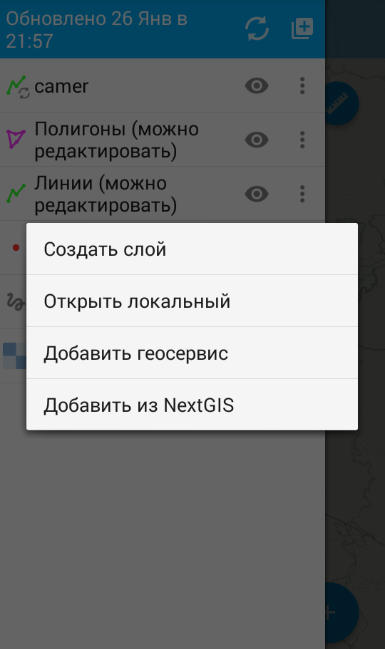
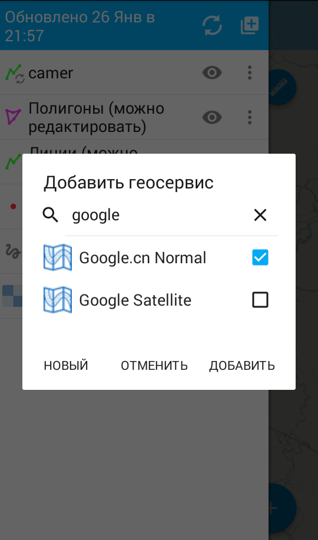
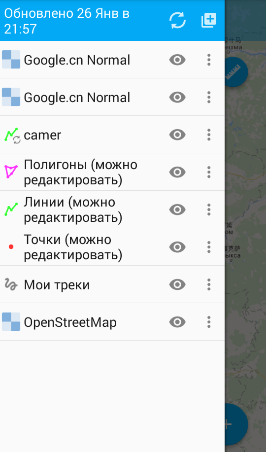
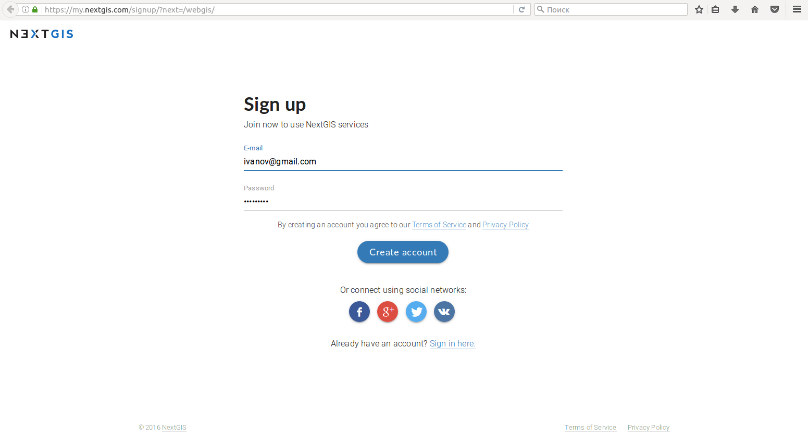
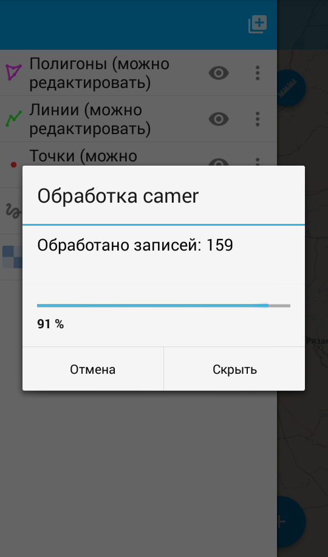
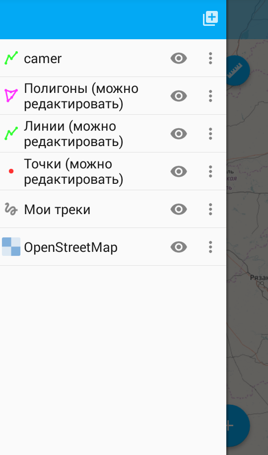

.. sectionauthor:: Дмитрий Барышников <dmitry.baryshnikov@nextgis.ru>

.. _ngmobile_load_geodata:

Добавление слоев
=================

В программе имеется возможность загрузки локальных данных с облачных хранилищ и 
с хранилища мобильного устройства, а также возможность создавать пустой векторный слой.
Существуют следующие типы хранения локальных данных: GeoJSON, тайловый кэш, 
настраиваемые формы.

Создание слоя
--------------

.. versionadded:: 2.3

Для того, чтобы создать пустой векторный слой в программу необходимо выполнить 
следующую последовательность шагов:

1. Вызвать меню опций и выбрать пункт меню "Новый слой", далее выбрать пункт меню
"Создать слой" (см. :numref:`ngmobile_options_menu_new_layer_pic`) 

.. figure:: _static/options_menu_new_layer.png
   :name: ngmobile_options_menu_new_layer_pic
   :align: center
   :height: 10cm
 
   Окно меню опций.

2. В открывшемся окне необходимо заполнить поля стандартной формы атрибутов для создаваемого
векторного слоя (см. :numref:`ngmobile_input_form_attributes_new_layer_pic`) 

.. figure:: _static/input_form_attributes_new_layer.png
   :name: ngmobile_input_form_attributes_new_layer_pic
   :align: center
   :height: 10cm
   
   Форма ввода атрибутов нового векторного слоя. 

При создании векторного слоя нужно указать следующие параметры:

1. Имя слоя - название слоя, которое будет отображаться в дереве слоев.
2. Тип геометрии - выбор геометрии (точка, линия, полигон, мультиточка, мультилиния, мультиполигон).
3. Поля - список полей, содержащий добавляемые поля, их можно добавлять, изменять и удалять.

При выборе пункта "Поля" откроется диалог  создания нового поля (см. :numref:`ngmobile_dialogue_create_new_field_pic`) 

.. figure:: _static/dialogue_create_new_field.png
   :name: ngmobile_dialogue_create_new_field_pic
   :align: center
   :height: 10cm

   Диалог создания нового поля.

Открывшийся диалог содержит следующие для заполнения поля:

1. Имя поля - название поля. 

.. note:: 
   Имя поля может быть введено только на английском языке (буквы и цифры!) 
   и без пробелов. Также не должно совпадать со служебными словами SQL.

2. Тип поля - выбор типа поля (строка, целочисленное, вещественное, дата и время,
   дата, время) 

GeoJSON
-------

Для того, чтобы загрузить в программу файл формата GeoJSON необходимо выполнить 
следующую последовательность шагов:

1. Вызвать меню опций и выбрать пункт "Добавить слой", далее выбрать пункт меню "Локальный" (см. :numref:`ngmobile_add_ngw_layer_geo_pic`) 

.. figure:: _static/add_layer1.png
   :name: ngmobile_add_ngw_layer_geo_pic
   :align: center
   :height: 10cm
    
   Добавление локального слоя.

2. В открывшемся окне выбора сохраненных файлов на диске мобильного устройства 
   выбрать необходимый для загрузки файл формата GeoJSON (см. :numref:`ngmobile_saved_files_on_the_drive_unit_pic`): 

.. figure:: _static/saved_files_on_the_drive_unit.png
   :name: ngmobile_saved_files_on_the_drive_unit_pic
   :align: center
   :height: 10cm
   
   Окно с сохраненными файлами на диске мобильного устройства.

3. После выбора файла откроется диалог настройки параметров создаваемого слоя, в 
   котором можно задать имя слоя (см. :numref:`ngmobile_layer_settings_geo_pic`): 

.. figure:: _static/layer_settings_geo.png
   :name: ngmobile_layer_settings_geo_pic
   :align: center
   :height: 10cm

   Настройки параметров создаваемого слоя.

   
4. При нажатии на кнопку "Создать", начнется 
   процесс обработки и создания слоя (см. :numref:`ngmobile_processing_and_creation_layer_pic`): 

.. figure:: _static/processing_and_creation_layer.png
   :name: ngmobile_processing_and_creation_layer_pic
   :align: center
   :height: 10cm  

   Окно обработки и создания слоя.

.. note::
   В случае загрузки в программу файла формата GeoJSON создаваемый слой в результате 
   загрузки геоданных такого типа будет всегда векторным!

Наличие или отсутствие слоя можно проверить в дереве слоев. В случае удачной процедуры 
обработки и создания слоя, новый слой располагается первым в дереве слоев (см. :numref:`ngmobile_tree_layers_geo_pic`): 

.. figure:: _static/tree_layers_geo.png
   :name: ngmobile_tree_layers_geo_pic
   :align: center
   :height: 10cm  

   Дерево слоев.

*Требования к формату GeoJSON:*

* :term:`Система координат` геометрий может быть WGS 84 (EPSG:4326) или Web Mercator (EPSG:3857). Если на вход будет подан файл   в другой системе координат, то будет выведено сообщение о том, что такая система координат не поддерживается. 
* Геометрия в файле должна быть одного типа. Если во входном файле содержаться геометрии 
  разного типа, то будут загружены записи, у которых тип геометрии совпадает с первой 
  записью (геометрия первой записи файла определяет тип геометрии слоя).
* Текстовые строки должны быть кодированы в формате UTF-8. 

.. note::
   Подробнее о формате GeoJSON можно прочитать в его `спецификации <http://geojson.org/>`_. 
   GeoJSON основывается на формате JSON (см. `RFC 4627 <https://www.ietf.org/rfc/rfc4627.txt>`_).

При редактирования векторного слоя, полученного из GeoJSON, доступна только стандартная форма редактирования атрибутов. В отличие от пользовательской формы (см. NGFP) стандартная форма может содержать только три типа полей:

1. Текстовое поле для ввода текста и цифр.
2. Диалог ввода и времени.
3. Кнопка добавления фотографии и записи.

Пример стандартной формы редактирования атрибутов слоя представлен на :numref:`ngmobile_standard_form_layer_attributes_pic`: 

.. figure:: _static/standard_form_layer_attributes.png
   :name: ngmobile_standard_form_layer_attributes_pic
   :align: center
   :height: 10cm  
    
   Стандартная форма редактирования атрибутов слоя.

Подробнее о редактировании файла формата GeoJSON описано разделе :ref:`ngmobile_editing`.

Тайловый кэш
------------

Тайловый кэш представляет собой архив формата zip, в котором упакованы папки и тайлы 
в соответствии с нарезкой (например, folder_z/folder_x/y.png). Сами папки уровня Z 
могут находится в корне архива или в одной папке в корне архива (название папки 
может быть любым, но папка должна быть одна). Более глубокая вложенность не допускается. 

Тайловый кэш может быть получен при помощи модуля расширения NextGIS QGIS - QTiles. 
Полученный в результате работы модуля архив можно загрузить на устройство в любую 
доступную папку.

Для того, чтобы загрузить в программу архив формата zip, в котором упакованы папки 
и тайлы необходимо выполнить следующую последовательность шагов:

1. Вызвать меню опций и выбрать пункт "Добавить слой", далее выбрать пункт меню "Локальный" 
   (см. :numref:`ngmobile_add_ngw_layer_geo_pic`) 

2. В открывшемся окне выбора сохраненных файлов на диске мобильного устройства 
   выбрать необходимый для загрузки архив формата ziр (см. :numref:`ngmobile_files_on_the_drive_unit_tms_pic`): 

.. figure:: _static/files_on_the_drive_unit_tms.png
   :name: ngmobile_files_on_the_drive_unit_tms_pic
   :align: center
   :height: 10cm
   
   Окно с файлами на диске мобильного устройства. 

3. После выбора на диске устройства архива формата zip откроется диалог настройки 
параметров создаваемого слоя, в котором можно выбрать тип тайлового слоя (систему 
кодирования тайлов) - XYZ (OSM) или TMS (OSGeo) (см. :numref:`ngmobile_layer_setting_tms_pic`): 

.. figure:: _static/layer_setting_tms.png
   :name: ngmobile_layer_setting_tms_pic
   :align: center
   :height: 10cm

   Настройка параметров тайлового слоя.

4. При нажатии на кнопку "Создать", 
начнется процесс обработки и создания слоя (см. :numref:`ngmobile_processing_and_creation_layer_tms_pic`): 

.. figure:: _static/processing_and_creation_layer_tms.png
   :name: ngmobile_processing_and_creation_layer_tms_pic
   :align: center
   :height: 10cm  

   Окно обработки и создания слоя.

Наличие или отсутствие тайлового слоя можно проверить в дереве слоев. В случае 
удачной процедуры обработки и создания слоя, имя нового слоя будет отображаться 
первым в дереве слоев (см. :numref:`ngmobile_tree_layers_tms_pic`): 

.. figure:: _static/tree_layers_tms.png
   :name: ngmobile_tree_layers_tms_pic
   :align: center
   :height: 10cm  

   Меню дерева слоев.

Добавление геосервиса
----------------------

В выезжающей панели дерева слоев выбираем кнопку добавления новых геоданных, появляется 
меню выбора. Выбираем пункт меню Добавить геосервис (см. :numref:`ngmobile_menu_pic`): 

   
   Окно меню выбора при активировании кпонки добавлении новых геоданных.

Откроется окно Добавить геосервис со списком геосервисов, получаемых из сети Интернет. 
В случае отсутствия подключения к сети Интернет, список геосервисов отображаться не будет
(см. :numref:`ngmobile_add_geoservice_pic`): 

.. figure:: _static/ngmobile_add_geoservice.png
   :name: ngmobile_add_geoservice_pic
   :align: center
   :height: 10cm  
 
   Окно со списком геосервисов.

Можно воспользоваться строкой поиска для нахождения геосервиса и выбора из списка, 
если система поиска в результате выдала несколько вариантов. Выбор геосервиса из 
списка осуществляется путем проставления в пустом окошке метки/галочки с правой 
стороны экрана. После нахождения и выбора необходимого геосервиса следует нажать 
кнопку Добавить (см. :numref:`ngmobile_search_line_pic`): 

   Поиск и выбор геосервиса.

В результате удачного добавления геосервиса, новый геосервис будет отображаться 
первым в дереве слоев (см. :numref:`ngmobile_layers_tree_geoservice_pic`): 

   Дерево слоев.

Создание Вeб GIS в браузере
----------------------------

Для начала работы Вам необходимо зайти на сайт NextGIS и зарегистрировать учётную запись, 
которая позволит начать работу с Веб ГИС. Для создания учетной записи необходимо нажать на 
кнопку Создать Веб ГИС на странице сайта nextgis.ru (см. :numref:`ngmobile_create_an_account_WebGIS_pic`): 

.. figure:: _static/ngmobile_create_an_account_WebGIS.png
   :name: ngmobile_create_an_account_WebGIS_pic
   :align: center
   :height: 7cm  

   Сайт NextGIS с кнопкой для создания учетной записи.   

Откроется форма для заполнения аккаунта, в которой необходимо заполнить полe e-mail и 
назначить пароль для вашего аккаунта, а затем нажать на кнопку "Создать аккаунт"/ Create account (см. :numref:`ngmobile_account_form_WebGIS_pic`): 

   Форма для заполнения аккаунта.

.. note::

   Собственную учетную запись, которая позволит работать с Веб ГИС, можно было создать 
   через социальные сети, в которых вы зарегистрированы. 

От NextGIS.com на указанную в форме почту придет письмо со ссылкой. Кликнув по ссылке, 
вы подтвердите электронную почту для обратной связи.
После активации ссылки и подтверждения адреса электронной почты на сайте NextGIS.com 
откроется страница с профилем, который необходимо заполнить, выбрать язык общения и 
нажать кнопку Сохранить/Save (см. :numref:`ngmobile_profile_1_WebGIS_pic`): 

.. figure:: _static/ngmobile_profile_1_WebGIS.png
   :name: ngmobile_profile_1_WebGIS_pic
   :align: center
   :height: 7cm    
  
   Страница профиля на сайте NextGIS.com . 

Далее следует заполнить форму создания Веб ГИС, в которой назначается и заполняется заголовок 
домена вашей Веб ГИС, выбирается язык интерфейса. Также следует выбрать тарифный план с перечнем 
возможных услуг, нажав на кнопку Выбрать/Select.
(см. :numref:`ngmobile_creation_form_WebGIS_pic`): 

.. figure:: _static/ngmobile_creation_form_WebGIS.png
   :name: ngmobile_creation_form_WebGIS_pic
   :align: center
   :height: 7cm    

   Заполнение формы Веб ГИС.

Закончить создание своей Веб ГИС следует нажатием на кнопку Create Web GIS 
(см. :numref:`ngmobile_creation_form_1_WebGIS_pic`): 

.. figure:: _static/ngmobile_creation_form_1_WebGIS.png
   :name: ngmobile_creation_form_1_WebGIS_pic
   :align: center
   :height: 7cm    

   Создание Веб ГИС.

.. note::

   После ввода заголовка домена вашей Веб ГИС и выбора языка для интерфейса изменить 
   их будет невозможно!

Далее откроется окно с информацией о том, что ваша Веб ГИС находится в процессе создания. 
И когда этот процесс завершится, вам на электронную почту придет письмо с логином и паролем 
для последующих входов в вашу Веб ГИС через сайт NextGIS.com
(см. :numref:`ngmobile_e-mail_WebGIS_pic`): 

.. figure:: _static/ngmobile_e-mail_WebGIS.png
   :name: ngmobile_e-mail_WebGIS_pic
   :align: center
   :height: 7cm    

   Окно с информацией о создании Веб ГИС.

После создания вашей Веб ГИС в вашем профиле пользователя будет иметься ссылка с 
названием вашей Веб ГИС. Ссылка находится в верхнем правом углу рядом с вашей электронной почтой (см. :numref:`ngmobile_profile_with_a_link_WebGIS_pic`): 

.. figure:: _static/ngmobile_profile_with_a_link_WebGIS.png
   :name: ngmobile_profile_with_a_link_WebGIS_pic
   :align: center
   :height: 7cm    

   Профиль со ссылкой на вашу Веб ГИС.

Следует пройти по это ссылке. Откроется окно с Основными группами ресурсов 
(см. :numref:`ngmobile_main_resources_WebGIS_pic`): 

.. figure:: _static/ngmobile_main_resources_WebGIS.png
   :name: ngmobile_main_resources_WebGIS_pic
   :align: center
   :height: 7cm    

   Окно "Основная группа ресурсов".

.. note::

   Для осуществления загрузки файлов в вашу Веб ГИС следует выполнить вход с правами 
   на создание данных (панель Меню - кнопка Войти)!   
   Кнопка Войти находится в правом верхнем углу рядом с кнопкой Справка!

Для работы в ашей Веб ГИС, для загрузки файлов необходимо воспользоваться в меню 
кнопкой Справка, которая находится в верхнем правом углу 
(см. :numref:`ngmobile_help_button_WebGIS_pic`): 

.. figure:: _static/ngmobile_help_button_WebGIS.png
   :name: ngmobile_help_button_WebGIS_pic
   :align: center
   :height: 2cm    

   Кнопка Справка.

После нажатия на кнопку Справка откроется окно в котором следует выбрать пункт 
Начало работы с Веб ГИС (см. :numref:`ngmobile_beginning_of_work_WebGIS_pic`): 

.. figure:: _static/ngmobile_beginning_of_work_WebGIS.png
   :name: ngmobile_beginning_of_work_WebGIS_pic
   :align: center
   :height: 7cm    

   Окно Начало работы в Веб ГИС.

Откроется станица с документацией "Начало работы с Веб ГИС". Выбираем раздел 
"Как загружать данные" (см. :numref:`ngmobile_documentation_WebGIS_pic`): 

.. figure:: _static/ngmobile_documentation_WebGIS.png
   :name: ngmobile_documentation_WebGIS_pic
   :align: center
   :height: 7cm    

   Окно документации, Начало работы с Веб ГИС. 

Загрузка геоданных и создание веб-карт на основе геоданных в своей Веб ГИС
----------------------------------------------------------------------------------------

Для осуществления загрузки геоданых необходимо выполнить вход в Веб ГИС с 
правами на создание данных, не гостевой вход. Подробнее о загрузке геоданных в 
:ref:`Веб ГИС <ngcom_description>` можно ознакомиться в следующих разделах 
документации :ref:`Растровый слой <ngcom_raster_layer>` и 
:ref:`Векторный слой <ngcom_vector_layer>`.

Добавление геоданных из NextGIS
-------------------------------

Для того, чтобы загрузить в программу файлы/геоданные из Веб ГИС необходимо выполнить 
следующую последовательность шагов:

1. Вызвать меню опций, далее выбрать и нажать на иконку с изображением папки. Из списка 
выбрать пункт меню “Добавить из NextGIS” (см. :numref:`ngmobile_addition_of_NextGIS_pic`): 

.. figure:: _static/ngmobile_addition_of_NextGIS.png
   :name: ngmobile_addition_of_NextGIS_pic
   :align: center
   :height: 10cm    

   Добавление из NextGIS.
 
2. В открывшемся окне следует выбрать пункт Добавить аккаунт и нажать кнопку Добавить
(см. :numref:`ngmobile_add_an_account_NextGIS_pic`): 

.. figure:: _static/ngmobile_add_an_account_NextGIS.png
   :name: ngmobile_add_an_account_NextGIS_pic
   :align: center
   :height: 10cm    

   Добавление учетной записи.

3. В открывшемся окне заполняем форму диалога для подключения Веб ГИС. Заполняются 
следующие поля формы (см. :numref:`ngmobile_conversation_connection_WebGIS_pic`): 

    - Название домена вашей Веб ГИС.
    - Пароль, который назначен для последующих входов в вашу Веб ГИС через сайт NextGIS.com.

.. figure:: _static/ngmobile_conversation_connection_WebGIS.png
   :name: ngmobile_conversation_connection_WebGIS_pic
   :align: center
   :height: 10cm  

   Диалог подключения Веб ГИС.

    - По окончании заполнения формы необходимо нажать кнопку Войти.

4. По окончании подключения Веб ГИС, откроется в окно, в котором следует выбрать 
учетную запись, которая соответствует заголовку домена вашей Веб ГИС, и нажать кнопку 
Добавить (см. :numref:`ngmobile_account_election_Web_GIS_pic`): 

.. figure:: _static/ngmobile_account_election_Web_GIS.png
   :name: ngmobile_account_election_Web_GIS_pic
   :align: center
   :height: 10cm    

   Выбор учетной записи Веб ГИС. 

5. Далее откроется окно диалога выбора слоя для импорта геоданных из вашей Веб ГИС в NextGIS 
Mobile (см. :numref:`ngmobile_layer_selection_dialog_for_importing_pic`): 

.. figure:: _static/ngmobile_layer_selection_dialog_for_importing.png
   :name: ngmobile_layer_selection_dialog_for_importing_pic
   :align: center
   :height: 10cm    

   Окно диалога выбора слоя для импорта геоданных из Веб ГИС. 

Если у слоя в Веб ГИС создан стиль, то появляется возможность выбрать для импорта 
помимо векторных данных еще и растр. Если данные импортируются на мобильное 
устройство в виде векторный данных, то такие данные скачиваются на мобильное устройство 
и могут быть доступны для использования при отсутствии Интернета. 
Если данные импортируются на мобильное устройство в виде растра при наличии в Веб ГИС 
созданного стиля у слоя на сервере, то такие данные могут быть доступны только при 
наличии сервера для отрисовывания картинки.   
Таким образом векторный слой можно добавить/импортировать в виде вектора либо в виде 
растра. Для этого следует поставить галочку в пустом окошке под названием необходимого 
слоя в правой части экрана (см. :numref:`ngmobile_layer_type_selection_pic`): 

.. figure:: _static/ngmobile_layer_type_selection.png
   :name: ngmobile_layer_type_selection_pic
   :align: center
   :height: 10cm    
  
   Выбор типа слоя.

На верхней панели инструментов в правом углу имеется иконка в виде папки с плюсом.
При нажатии на эту иконку откроется диалог для создания новой группы данных в вашей 
Веб ГИС. В поле диалога следует задать имя для новой группы и нажать на кнопку ОК.
В случае удачного создания и сохранения новой папки, название новой папки появится в 
окне содержимого вашей Веб ГИС (см. :numref:`ngmobile_add_a_new_group_pic`): 

.. figure:: _static/ngmobile_add_a_new_group.png
   :name: ngmobile_add_a_new_group_pic
   :align: center
   :height: 10cm    
   
   Создание новой группы.  

6. После выбора слоя для импорта из Веб ГИС в NextGIS Mobile следует нажать на 
кнопку Добавить внизу экрана. После этого начнется процесс импорта из Веб ГИС в 
NextGIS Mobile (см. :numref:`ngmobile_layer_processing_for_imports_pic`): 

  
   Обработка слоя перед импортированием в NextGIS Mobile. 

Наличие или отсутствие слоя можно проверить в дереве слоев. В случае удачной процедуры 
обработки и импортирования слоя, новый слой располагается первым в дереве слоев 
(см. :numref:`ngmobile_layerstree_of_WebGIS_pic`): 

    
   Дерево слоев.

Настраиваемые формы
-------------------

.. versionadded:: 2.2

Файл формата ngfp получается в результате работы программы NextGIS Formbuilder и представляет собой файл :term:`GeoJSON` 
и файлы с дополнительной информацией (JSON), которые упакованы в архив zip, но расширением ngfp.

Для того, чтобы загрузить в программу файл формата ngfp, необходимо выполнить 
следующую последовательность шагов:

1. Вызвать меню опций и выбрать пункт "Добавить слой", далее выбрать пункт меню "Локальный" (см. :numref:`ngmobile_add_ngw_layer_geo_pic`) 

2. В открывшемся окне выбора сохраненных файлов на диске мобильного устройства 
   выбрать необходимый для загрузки файл формата ngfp (см. :numref:`ngmobile_files_on_the_drive_unit_tms_pic`)

3. После выбора файла откроется диалог настройки параметров создаваемого слоя, в 
   котором можно задать имя слоя (см. :numref:`ngmobile_settind_layer_form_pic`): 

.. figure:: _static/settind_layer_form.png
   :name: ngmobile_settind_layer_form_pic
   :align: center
   :height: 10cm

   Настройки параметров создаваемого слоя.

   
4. При нажатии на кнопку "Создать", начнется процесс обработки и создания слоя (см. :numref:`ngmobile_loading_layer_form_pic`): 

.. figure:: _static/loading_layer_form.png
   :name: ngmobile_loading_layer_form_pic
   :align: center
   :height: 10cm  

   Окно создания слоя.

Особенностью редактирования слоя на базе файла формата NGFP является заполнение не стандартной, а пользовательской 
формы для редактирования атрибутов. Пользовательская форма специальным образом оптимизирована для ввода данных и может содержать особые управляющие элементы для более удобного ввода данных, выбор из выпадающего списка, связанные списки, флаги и т.д.

Пример пользовательской формы редактирования атрибутов слоя представлен на :numref:`ngmobile_non-standard_form_pic`: 

.. figure:: _static/non-standard_form.png
   :name: ngmobile_non-standard_form_pic
   :align: center
   :height: 10cm  
    
   Пользовательская форма редактирования атрибутов слоя.

Подробнее о редактировании файла формата ngfp изложено в разделе :ref:`ngmobile_editing`.

Подключение тайлового сервиса
-----------------------------
 
При выборе пункта меню "веб" (см. :numref:`ngmobile_main_activity_pic` п. 3) открывается диалог, представленный на :numref:`ngmobile_add_tms_pic`.

.. figure:: _static/ngmobile_addtms.png
   :name: ngmobile_add_tms_pic
   :align: center
   :height: 11cm
   
   Диалог подключения тайлового источника геоданных.
   
   Цифрами обозначено: 1 - название нового слоя; 2 - адрес тайлов слоя; 3 - тип тайлового сервиса; 4 - логин; 5 - пароль; 6 - кнопка создания слоя; 7 - кнопка отмены.
   
При формировании адреса сервиса тайлов необходимо указать место в адресе значений X (номер тайла по горизонтали), Y (номер тайла по вертикали) и Z (уровень зума). Для этого в строке адреса на месте цифры соответствующей Х необходимо поставить подстановочный код **{x}**, для Y - **{y}**, для Z - **{z}**. Дополнительно в строке адреса можно указать поддомены (например, для поддоменов a.tileopenstreetmap.org, b.tileopenstreetmap.org, c.tileopenstreetmap.org адрес будет выглядеть так: **{a,b,c}.tile.openstreetmap.org**).

.. note::

   При загрузке тайлов на каждый адрес (поддомен) приложение осуществляет запрос 
   в два потока. Таким образом для адреса {a,b,c}.tile.openstreetmap.org приложение 
   будет скачивать тайлы в 6 потоков.
   
Все полученные из сети Интернет/Интранет тайлы кэшируются на карте памяти. При 
запросе конкретного тайла, в начале проверяется локальный кэш. Если в локальном 
кэше есть тайл и его время создания менее семи дней, то на карту будет выведен он. 
Также кэшированный тайл будет выведен при отсутствии подключения к сети Интернет/Интранет 
или если в ходе загрузи был сбой. Полученный из сети Интернет/Интранет тайл перекрывает 
имеющийся в кэше.

В списке выбора типа тайлового слоя (см. :numref:`ngmobile_add_tms_pic`, п. 3) имеется следующий выбор:

* XYZ (OSM) - стандартный тип тайлового сервиса;
* TMS (OSGeo) - в соответствии со стандартом OSGeo.

Если для доступа к тайлам необходима аутентификация, то можно указать логин и пароль.

.. note::

   Поддерживается только `Basic access authentication <http://en.wikipedia.org/wiki/Basic_access_authentication>`_. 

Кэширование данных тайлового сервиса
------------------------------------

.. versionadded:: 2.2

Для создания изображения используются :term:`тайлы <тайл>`, полученные из сети Интернет, 
которые кэшируются на карте памяти устройства. Кэшированный тайл будет доступен 
при отсутствии подключения к сети Интернет. 
Для загрузки тайлов на текущий охват карты следует выбрать пункт меню "Загрузить тайлы", после 
выбора которого откроется окно с настройками загрузки тайлов (см. :numref:`ngmobile_levels_of_zoom_pic`):

.. figure:: _static/levels_of_zoom.png
   :name: ngmobile_levels_of_zoom_pic
   :align: center
   :height: 10cm
 
   Окно выбора уровня зума для загрузки тайлов.

Следует обратить внимание, что чем меньше уровень выбранного зума для загрузки тайлов, 
тем меньшее количество тайлов попадают в интересующую нас область и тем быстрее 
происходит загрузка всего изображения.

.. note::
   Если список загружаемых тайлов для заданного диапазона зумов превышает 1000, 
   то будет загружена только первая 1000 тайлов. Остальные тайлы не будут загружаться 
   из-за ограничений на переполнение памяти.

После установки на шкале масштабов необходимого диапазона зума загрузки тайлов можно начинать 
загрузку тайлов. В открывшемся окне выбраем пункт меню "Начать".
Процесс загрузки тайлов переносится в панель статуса, где за ним можно наблюдать.
Если необходимо завершить загрузку тайлов,то в области панели загрузки тайлов следует 
сделать следующее.
Коснитесь экрана большим и указательным пальцами и разведите 
их в стороны, скользя пальцами по экрану. 
В результате таких действий появится кнопка "Стоп", при нажатии на которую процесс 
загрузки тайлов завершится (см. :numref:`ngmobile_loading_tiles_in_the_status_bar_pic`):

.. figure:: _static/loading_tiles_in_the_status_bar.png
   :name: ngmobile_loading_tiles_in_the_status_bar_pic
   :align: center
   :height: 10cm

   Индикация процесса загрузки тайлов в панели статуса.

