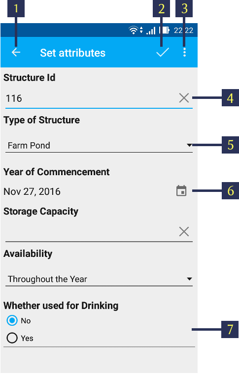
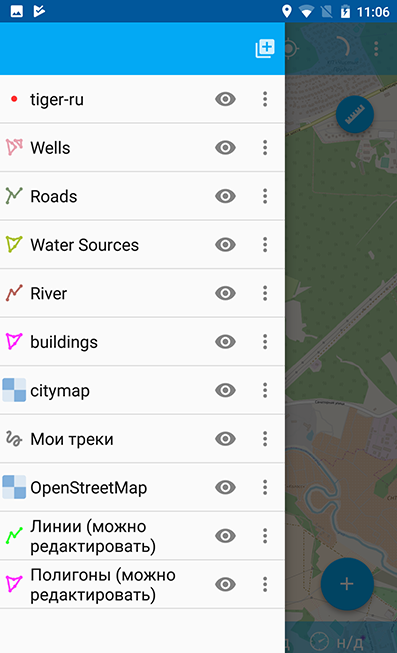
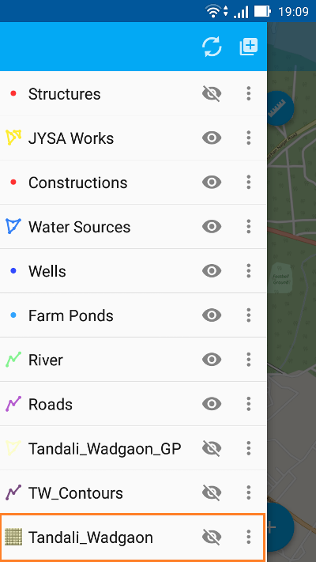

.. sectionauthor:: Dmitry Baryshnikov <dmitry.baryshnikov@nextgis.ru>, Abhay Kulkarni <praxisnfp@gmail.com>

.. _ngmobile_load_geodata:

Adding layers
==============

NextGIS Mobile allows to create new empty vector layers or import vector and raster layers from Android local storage, `QuickMapServices catalog <https://qms.nextgis.com/>`_, `nextgis.com <https://my.nextgis.com/signup/?next=/webgis/>`_ or `NextGIS Web <http://nextgis.com/nextgis-web/>`_. The supported data types are:

* :term:`GeoJSON`;
* XYZ/TMS tile cache in ZIP-archive;
* tile cache in *.ngrc format;
* custom forms in *.ngfp format.

.. _ngmobile_create_vector:

Creating new vector layer
---------------------------
  
Here are the steps to create an empty vector layer:

1. Open Layers tree panel (item 1 in :numref:`ngmobile_main_activity_pic_1`). Then tap on "Add geodata" button (item 4 in :numref:`ngmobile_layer_tree_pic`). The dialogue will open as shown in :numref:`ngmobile_options_menu_new_layer_pic`. Select "Create layer".

.. figure:: _static/options_menu_new_layer.png
   :name: ngmobile_options_menu_new_layer_pic
   :align: center
   :height: 10cm
 
   Add geodata dialogue.

2. In the opened dialogue enter the parameters of new vector layer (see :numref:`ngmobile_input_form_attributes_new_layer_pic`) 

.. figure:: _static/input_form_attributes_new_layer.png
   :name: ngmobile_input_form_attributes_new_layer_pic
   :align: center
   :height: 10cm
   
   Parameters of the new vector layer.

The standard form for the creation of new vector layer contains the following parameters:

1. Layer name - enter the name of layer which will be displayed in the layers tree.
2. Geometry type - select layer geometry type (point, linestring, polygon, multipoint, multilinestring, multipolygon).
3. Fields - list of fields which can be added, edited or deleted. These are attribute values of the layer.

You can add as many attributes for a new vector layer as you like. To add a new attribute tap on "+" button next to "Fields". This will open a new dialogue for creation of each new field (see :numref:`ngmobile_dialogue_create_new_field_pic`).

.. figure:: _static/dialogue_create_new_field.png
   :name: ngmobile_dialogue_create_new_field_pic
   :align: center
   :height: 10cm

   Dialog for creation of a new field.

Dialog for creation of a new field contains the following parameters:

1. Field name – enter the name of the field.

.. note:: 
	The field name can only be entered in Latin characters (letters and numbers!) without spaces. It should also differ from SQL reserved keywords.

2. Field type - select field type from one of the following types: string, integer, real, date&time, date, time.

.. _ngmobile_import_vector:

Creating vector layer from GeoJSON data
-----------------------------------------

NextGIS Mobile allows to create a vector layer by importing an existing GeoJSON file. To open data in GeoJSON format:

1. Open Layers tree panel (item 1 in :numref:`ngmobile_main_activity_pic_1`). Then tap on "Add geodata" button (item 4 in :numref:`ngmobile_layer_tree_pic`). The dialogue will open as shown in :numref:`ngmobile_options_menu_new_layer_pic`. Select "Open local".

2. Select GeoJSON file from your mobile device storage (see :numref:`ngmobile_saved_files_on_the_drive_pic_1`). For example, tap on the file "Roads.geojson" to import the "Roads" vector data file.

.. figure:: _static/saved_files_on_the_drive_unit.png
   :name: ngmobile_saved_files_on_the_drive_pic_1
   :align: center
   :height: 10cm
   
   Android local storage.
   
3. When the file is selected Layer settings dialogue opens. Here you can specify a new vector layer name or keep the name as it is, e.g. "Roads" (see :numref:`ngmobile_layer_settings_geo_pic`).

.. figure:: _static/layer_settings_geo.png
   :name: ngmobile_layer_settings_geo_pic
   :align: center
   :height: 10cm

   Layer settings dialogue.

4. Pressing "Create" button starts data processing for creation of a new layer. 

.. note::  
	In case of GeoJSON file importing the new layer will always be a vector layer!

You can check if the new layer was created successfully in the layers tree panel. The newly created layer will show up in the layers tree (see :numref:`ngmobile_tree_layers_geo_pic`). The "Roads" layer is marked in orange rectangle.

.. figure:: _static/tree_layers_geo.png
   :name: ngmobile_tree_layers_geo_pic
   :align: center
   :height: 10cm  

   Layers tree panel.

**GeoJSON: format requirements**

* :term:`Coordinate system` of input geometries can be WGS 84 (EPSG:4326) or Web Mercator (EPSG:3857) only. If input file has different coordinate system you will see a warning message about unsupported coordinate system.
* All geometries in the file must be of the same type. If input file contains varying types of geometry in the output you will have a file with geometries type that coincides with the type of first record, i.e. geometry of first entry will determine the type of layer geometry.
* Text strings must be encoded in UTF-8 format.

.. note::
	You can read more about GeoJSON format in its `specification <http://geojson.org/>`_.
	GeoJSON is based on JSON format (see `RFC 4627 <https://www.ietf.org/rfc/rfc4627.txt>`_).

You can only use standard attributes form (not custom *.ngfp form) for editing GeoJSON layer. 

The standard attributes form contains only following three fields:

1. Text field for entering characters or digits.
2. Dialogue for entering date & time.
3. "Add pictures" button.

A sample standard attributes form is shown below in :numref:`ngmobile_standard_input_form_attributes_pic`.

.. figure:: _static/input_form_attributes.png
   :name: ngmobile_standard_input_form_attributes_pic
   :align: center
   :height: 10cm
   
   Standard attributes form.
   
   The numbers indicate: 1 - Back to previous screen; 2 - Apply changes; 3 - Add pictures.

You can further perform standard edit operations like Add, Modify or Delete operations for this layer. For more information about GeoJSON layer editing see :ref:`ngmobile_edit_geometry`.

.. _ngmobile_import_ngfp:

Creating vector layer from Custom forms (NGFP)
-----------------------------------------------

NextGIS Mobile allows to create a vector layer by importing an existing NGFP file. 

NGFP files can be generated using `NextGIS FormBuilder <http://nextgis.com/nextgis-formbuilder/>`_. NGFP is a :term:`GeoJSON` file with additional information (JSON) which is packaged in zip archive and has .ngfp extension.

NGFP file allows to use custom (not standard) attributes forms optimized for attributes viewing and editing. Custom form may contain special controls for editing, such as dropdown lists, radio buttons or linked lists.

   
   Custom attributes form.
   
   The numbers indicate: 1 - Back to previous screen; 2 - Apply changes; 3 - Settings; 4 - Text or Integer; 5 - Dropdown list; 6 - Date & Time; 7 - Radio buttons.

Follow these steps to open NGFP file in NextGIS Mobile:

1. Open Layers tree panel (item 1 in :numref:`ngmobile_main_activity_pic_1`). Then tap on "Add geodata" button (item 4 in :numref:`ngmobile_layer_tree_pic`). The dialogue will open as shown in :numref:`ngmobile_options_menu_new_layer_pic`. Select "Open local".

2. Select NGFP file from your mobile device storage (see :numref:`ngmobile_saved_files_on_the_drive_pic_3`). For example, tap on the file "Structures.ngfp" to import the "Structures" form. 

.. figure:: _static/saved_files_on_the_drive_unit.png
   :name: ngmobile_saved_files_on_the_drive_pic_3
   :align: center
   :height: 10cm
   
   Android local storage.

3. When the file is selected Layer settings dialogue opens. Here you can specify a new vector layer name or keep the name as it is, e.g. "Structures" (see :numref:`ngmobile_settind_layer_form_pic`): 

.. figure:: _static/settind_layer_form.png
   :name: ngmobile_settind_layer_form_pic
   :align: center
   :height: 10cm

   Layer settings dialogue.

4. Pressing "Create" button starts data processing for creation of a new vector layer.

You can check if the new layer was created successfully in the layers tree panel. The newly created layer will show up in the layers tree (see :numref:`ngmobile_tree_layers_geo_pic`). The "Structures" layer is shown in orange rectangle.

   Layers tree panel.

You can further perform standard edit operations like Add, Modify or Delete operations for this vector layer. For more information about NGFP layer editing see :ref:`ngmobile_edit_geometry`.

.. _ngmobile_import_cache:

Creating raster layer from Tile cache (XYZ/TMS)
------------------------------------------------

NextGIS Mobile allows to create a raster layer by importing tile cache. 

Tile cache is a zip-archive with folders and tiles stored in accordance with a tiling scheme (for example, folder_z/folder_x/y.png). Folders of level Z can be located in the root or in a folder in the root folder (name of the folder doesn't matter, but there have to be only one folder). Deeper nesting of level Z folders is not allowed.

Tile cache can be created with the extension module `NextGIS QGIS - QTiles <http://plugins.qgis.org/plugins/qtiles/>`_. 
Resulted archive can be uploaded to any available folder in your mobile device storage.

Follow these steps to open zip-archive with tile cache:

1. Open Layers tree panel (item 1 in :numref:`ngmobile_main_activity_pic_1`). Then tap on "Add geodata" button (item 4 in :numref:`ngmobile_layer_tree_pic`). The dialogue will open as shown in :numref:`ngmobile_options_menu_new_layer_pic`. Select "Open local".

2. Select zip-archive from your mobile device storage (see :numref:`ngmobile_files_on_the_drive_unit_tms_pic`). For example, tap on the file "mapnik.zip" to import the tile cache: 

.. figure:: _static/files_on_the_drive_unit_tms.png
   :name: ngmobile_files_on_the_drive_unit_tms_pic
   :align: center
   :height: 10cm
   
   Android local storage.

3. When zip-archive is selected a layer settings dialog opens (see :numref:`ngmobile_layer_setting_tms_pic`):

.. figure:: _static/layer_setting_tms.png
   :name: ngmobile_layer_setting_tms_pic
   :align: center
   :height: 10cm

   Tile layer settings dialog.

Here you can select tile layer type (tile structure system) - XYZ (OSM) or TMS (OSGeo) (see :numref:`ngmobile_layer_setting_tms_pic_2`) and in-memory cache size (see :numref:`ngmobile_layer_setting_tms_pic_3`):

.. figure:: _static/layer_setting_tms_2.png
   :name: ngmobile_layer_setting_tms_pic_2
   :align: center
   :height: 10cm

   Tile structure settings dialog.

.. figure:: _static/layer_setting_tms_3.png
   :name: ngmobile_layer_setting_tms_pic_3
   :align: center
   :height: 10cm

   Cache size settings dialog.

4. Pressing "Create" button starts data processing for creation of a new raster layer (see :numref:`ngmobile_processing_and_creation_layer_tms_pic`).

.. figure:: _static/processing_and_creation_layer_tms.png
   :name: ngmobile_processing_and_creation_layer_tms_pic
   :align: center
   :height: 10cm  

   Data processing for creation of a new layer from tiles.
   
You can check if the new raster layer was created successfully in the Layers tree panel. The newly created raster layer will show up first in the Layers tree (see :numref:`ngmobile_tree_layers_tms_pic`).

.. figure:: _static/tree_layers_tms.png
   :name: ngmobile_tree_layers_tms_pic
   :align: center
   :height: 10cm  

   Layers tree panel.

.. _ngmobile_import_ngrc:

Creating raster layer from Tile cache (NGRC)
----------------------------------------------

NextGIS Mobile also allows to create a raster layer by importing tile cache in *.ngrc format. 

Follow these steps to import tile cache in *.ngrc format :

1. Open Layers tree panel (item 1 in :numref:`ngmobile_main_activity_pic_1`). Then tap on "Add geodata" button (item 4 in :numref:`ngmobile_layer_tree_pic`). The dialogue will open as shown in :numref:`ngmobile_options_menu_new_layer_pic`. Select "Open local".

2. Select *.ngrc file from your mobile device storage (see :numref:`ngmobile_saved_files_on_the_drive_pic_2`). For example, tap on the file "Tandali_Wadgaon.ngrc" to import the "Tandali Wadgaon" tile cache prepared using satellite raster image. 

.. figure:: _static/saved_files_on_the_drive_unit.png
   :name: ngmobile_saved_files_on_the_drive_pic_2
   :align: center
   :height: 10cm
   
   Android local storage.

3. NextGIS Mobile will start data processing for creation of a new raster layer. You can check if the new layer was created successfully in the Layers tree panel. The newly created layer will show up in the layers tree as shown in (see :numref:`ngmobile_tree_layers_ngrc_pic`). The "Tandali_Wadgaon" layer is shown in orange rectangle.

   Layers tree panel.

.. _ngmobile_add_geoservice:

Creating raster layer from external geoservice
------------------------------------------------

NextGIS Mobile also supports creation of raster layers from external geoservices. 

.. warning::
   You need to be **Online** while creating layer from external geoservice. It will consume your data pack & apply standard Internet charges from your Internet service provider.

.. _ngmobile_qms_service:

Creating raster layer from QuickMapServices tile service
^^^^^^^^^^^^^^^^^^^^^^^^^^^^^^^^^^^^^^^^^^^^^^^^^^^^^^^^^^

Follow these steps to add raster layer from TMS services listed in `QuickMapServices catalog <https://qms.nextgis.com/>`_:

1. Open Layers tree panel (item 1 in :numref:`ngmobile_main_activity_pic_1`). Then tap on "Add geodata" button (item 4 in :numref:`ngmobile_layer_tree_pic`). The dialogue will open as shown in :numref:`ngmobile_options_menu_new_layer_pic`. Select "Add geoservice" and the dialogue will open as shown in :numref:`ngmobile_ngmobile_add_geoservice_pic` below.

.. figure:: _static/ngmobile_add_geoservice.png
   :name: ngmobile_ngmobile_add_geoservice_pic
   :align: center
   :height: 10cm

   Add Geoservice dialogue.
   
2. Select a geoservice you want to add and tap "Add" to create raster layer from that service. The newly created layer will show up in Layers tree.

.. _ngmobile_tile_service:

Creating raster layer from private tile service
^^^^^^^^^^^^^^^^^^^^^^^^^^^^^^^^^^^^^^^^^^^^^^^^^

If you want to add tile service not listed in `QuickMapServices catalog <https://qms.nextgis.com/>`_ you can do it by following these steps:

1. Tap "New" in above :numref:`ngmobile_ngmobile_add_geoservice_pic`. It will open up "Create" dialogue for a new TMS service as shown in :numref:`ngmobile_ngmobile_new_geoservice_pic` below.

.. figure:: _static/ngmobile_new_geoservice.png
   :name: ngmobile_ngmobile_new_geoservice_pic
   :align: center
   :height: 10cm

   Create TMS service dialogue.
   
2. Specify Layer name & Layer URL. Layer URL should specify location of X value (number of tile by horizontal), Y (number of tile by vertical) and Z (zoom level). These values are specified using wildcard code for X - **{x}**, for Y - **{y}**, for Z - **{z}**. Additionally you can specify subdomains (e.g. for subdomains a.tileopenstreetmap.org, b.tileopenstreetmap.org, c.tileopenstreetmap.org the address will look like this: **{a,b,c}.tile.openstreetmap.org**).

.. note::
   NextGIS Mobile requests tiles from each URL (subdomain) in 2 streams. So from URL like {a,b,c}.tile.openstreetmap.org tiles will be downloaded in 6 streams.

3. You can also specify Tile layer type (XYZ (OSM) and TMS (OSGeo) standards are supported), TMS in-memory cache size (none, 1, 2 or 3 screens) and credentials (Login & Password) if authentication is required for accessing tiles. 

.. note::
   Only `Basic access authentication <http://en.wikipedia.org/wiki/Basic_access_authentication>`_ is currently supported.

4. Tap "Create" to create new raster layer from that TMS service. The newly created layer will show up in Layers tree.

.. _ngmobile_tile_cache:

Caching of tile service data 
^^^^^^^^^^^^^^^^^^^^^^^^^^^^^^

You can work **Offline** with raster layers created from external geoservices. In order to do it you need to download tiles for your area of interest to your device before going into the field:

1. Make sure raster layer you need in the field is added to Map screen and is visible. Then open the map extent you want to download tiles for.

2. Open Layers tree panel (item 1 in :numref:`ngmobile_main_activity_pic_1`). Then find raster layer in Layers tree and tap Layer contextual menu icon (item 5 in :numref:`ngmobile_layer_tree_pic`).

3. Tap "Download tiles" button in Layer contextual menu as shown in :numref:`download_tiles_pic` below. 

.. figure:: _static/download_tiles.png
   :name: download_tiles_pic
   :align: center
   :height: 10cm
 
   Download tiles button.

4. A new dialogue will open as shown in :numref:`ngmobile_levels_of_zoom_pic`. Select zoom levels you need and tap "Start" button. 

.. figure:: _static/levels_of_zoom.png
   :name: ngmobile_levels_of_zoom_pic
   :align: center
   :height: 10cm
 
   Select zoom levels dialogue.

.. note::
   The lower selected zoom levels, the smaller number of tiles for an area of interest will have to be downloaded and the faster they will be downloaded. You can track downloading progress in Android Status Bar. Notifications for NextGIS Mobile app should be switched ON in System Settings.

.. warning::
   If number of tiles to download for selected zoom levels is more than 6000 tiles for each zoom level, only first 6000 tiles for each zoom level will be downloaded. The rest will not be downloaded due to danger of memory overflow. 
