.. _ngmobile_load_geodata:

Добавление слоев
=================

В программе имеется возможность добавления слоёв разными способами:

* `создать пустой <https://docs.nextgis.ru/docs_ngmobile/source/load_geodata.html#ngmobile-create-vector>`_ векторный слой выбранной геометрии;
* загрузить векторный или растровый слой:

   * `из файла на устройстве <https://docs.nextgis.ru/docs_ngmobile/source/load_geodata.html#ngmobile-import-vector>`_, 
   * `из хранилища NextGIS Web <https://docs.nextgis.ru/docs_ngmobile/source/ngw_integration.html#ngmobile-add-layer-webgis>`_  `в облаке или на своём сервере <http://nextgis.ru/nextgis-web/>`_. 
   * из `каталога QuickMapServices <https://qms.nextgis.com/>`_,
   * с помощью внешнего сервиса (`см. ниже <https://docs.nextgis.ru/docs_ngmobile/source/load_geodata.html#ngmobile-add-geoservice>`_).

.. _ngmobile_create_vector:

Создание пустого слоя
------------------------

Для того, чтобы создать пустой векторный слой, в панели слоёв нажмите |button_add_layer|.

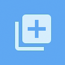

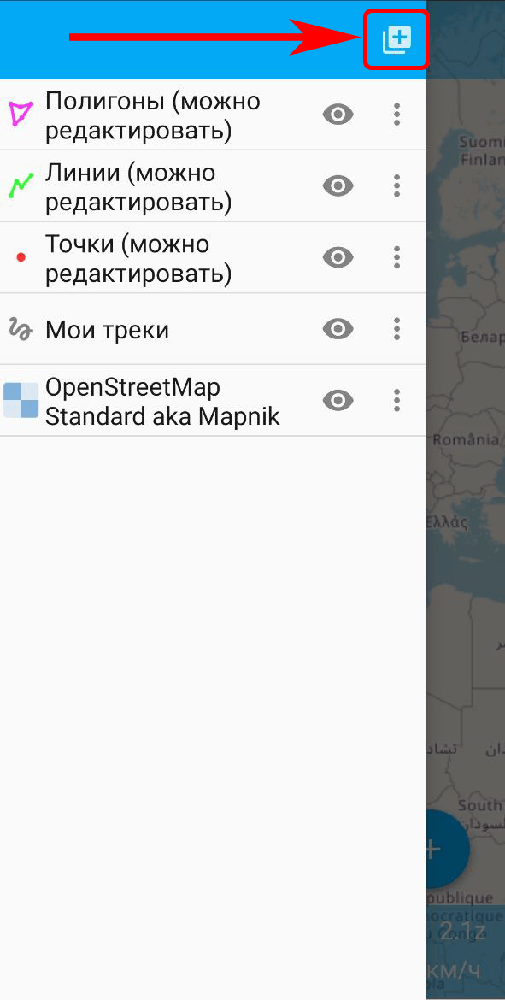

   Вызов меню в панели слоёв

В меню добавления геоданных выберите **Создать слой**.

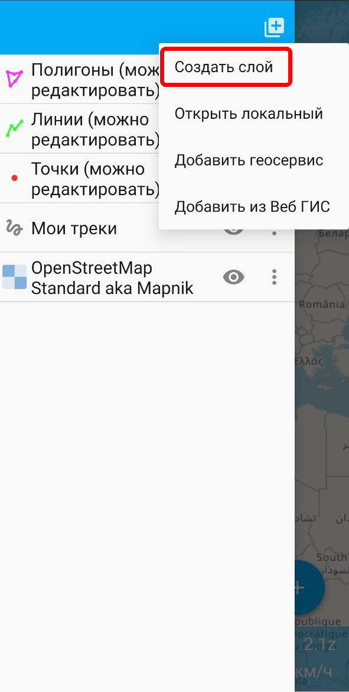
 
   Диалог "Добавить геоданные"

Откроется диалог создания нового слоя.

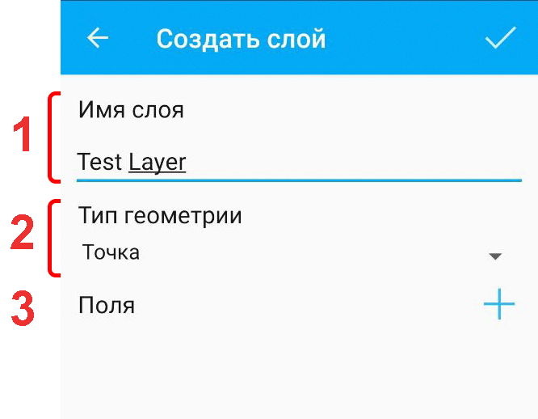
   
   Диалог создания нового векторного слоя

При создании векторного слоя задаются следующие параметры:

1. Имя слоя - обязательный пункт, введите название слоя, которое будет отображаться в дереве слоев.
2. Тип геометрии - выбор геометрии объектов слоя (точка, линия, полигон, мультиточка, мультилиния, мультиполигон).
3. Поля - список полей, содержащих атрибуты слоя.

Если задать только имя слоя и тип геометрии, по умолчанию в слое помимо служебного поля fid (идентификатор объекта) будет создано текстовое поле description (описание). 

Можно добавить к новому векторному сколько угодно пользовательских полей. Для этого нужно нажать на кнопку "+" рядом с кнопкой "Поля". При этом откроется диалог создания нового поля:

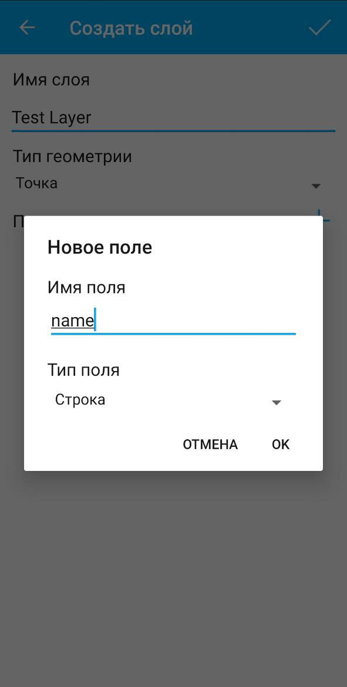

   Диалог создания нового поля

Задайте следующие параметры:

1. Имя поля, под которым оно будет записано в структуру слоя. 

.. note:: 
   Имя поля может быть введено только на английском языке (буквы и цифры!) и без пробелов. Также имя поля не должно совпадать со служебными словами SQL. 

2. Тип поля - строка, целочисленное 32 бит, целочисленное 64 бит, вещественное, дата и время, дата, время.

.. seealso::

   Настроить псевдоним для поля можно `при изменении слоя в Веб ГИС <https://docs.nextgis.ru/docs_ngweb/source/layers.html#vector-layer-field-settings-pic>`_. Также вы можете создать форму с пользовательскими названиями полей, комментариями к ним и другими более интуитивными элементами для ввода данных.

Для завершения создания слоя нажмите галочку |button_tick| в правом верхнем углу.

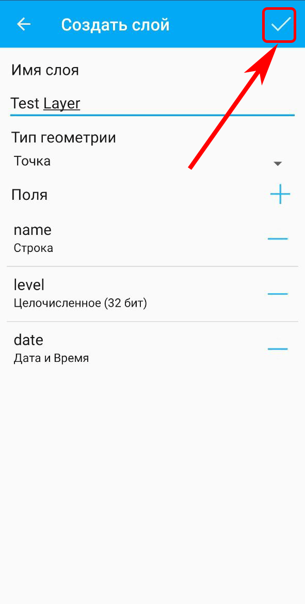

   Завершение создания слоя

Созданный слой будет добавлен на верх списка слоёв.

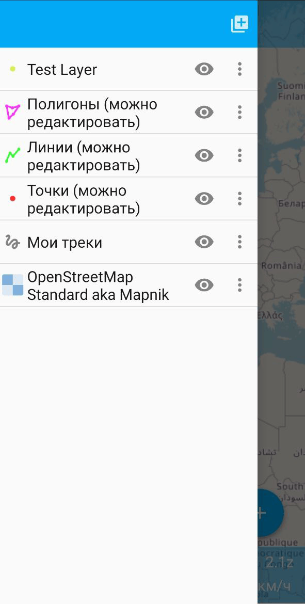

   Созданный локальный слой

Теперь вы можете:

* Добавить в слой объекты;
* Отправить его в Веб ГИС;
* Поделиться слоем в виде файла.

.. _ngmobile_import_vector:

Создание слоя из файла
-----------------------

Можно добавить слой из файла, локально сохранённого на устройстве.

Поддерживаются следующие форматы данных: 

Векторные:

* `GeoJSON <https://docs.nextgis.ru/docs_ngmobile/source/load_geodata.html#geojson>`_;
* `настраиваемые формы <https://docs.nextgis.ru/docs_ngmobile/source/load_geodata.html#ngmobile-import-ngfp>`_ в формате \*.NGFP.

Растровые:

* `тайловый кэш XYZ/TMS <https://docs.nextgis.ru/docs_ngmobile/source/load_geodata.html#xyz-tms>`_ в ZIP-архиве;
* `тайловый кэш в формате \*.NGRC <https://docs.nextgis.ru/docs_ngmobile/source/load_geodata.html#ngrc>`_. 

Ниже подробнее описано добавление слоя из каждого из этих форматов.

.. _geojson:

Создание векторного слоя из файла GeoJSON
~~~~~~~~~~~~~~~~~~~~~~~~~~~~~~~~~~~~~~~~~

NextGIS Mobile позволяет создать векторный слой путем загрузки существующего файла :term:`GeoJSON`. 

На панели дерева слоев нажмите на кнопку "Добавить геоданные" |button_add_layer|, далее выберите пункт диалога "Открыть локальный".

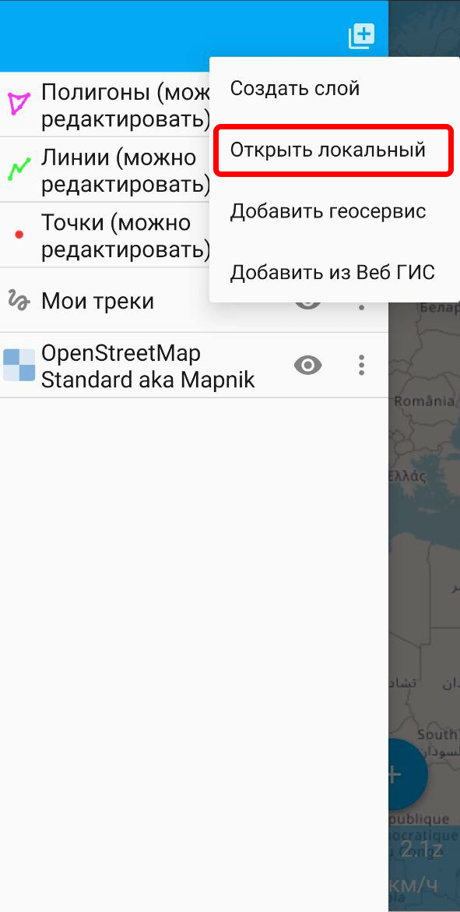

   Добавление слоя из файла

В открывшемся окне выбора сохраненных файлов на диске мобильного устройства выберите необходимый для загрузки файл формата GeoJSON (Файл должен иметь расширение .geojson; он также может находиться внутри архива с расширением .geojson.zip, при этом файл должен быть в корне, а не в подпапках этого архива).

После выбора файла откроется диалог настройки параметров создаваемого слоя, в котором можно оставить существующее или задать новое имя слоя: 

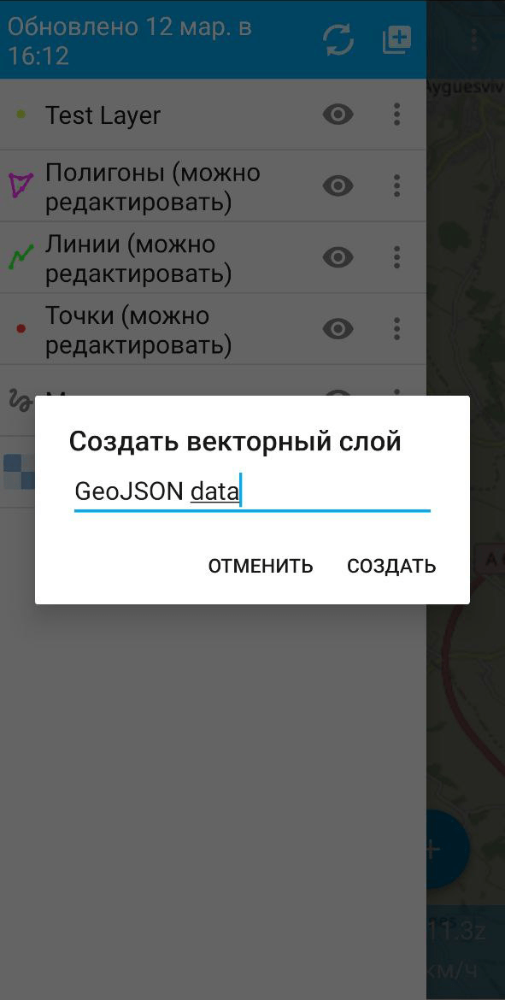

   Имя для добавляемого слоя
   
При нажатии на кнопку "Создать" начнется процесс загрузки данных и создания нового слоя. За его продвижением можно наблюдать во всплывающем окне и в панели уведомлений телефона.

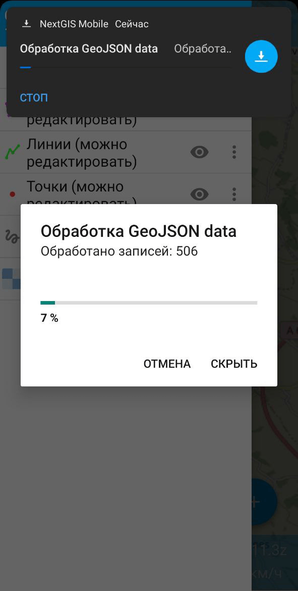

   Процесс загрузки слоя из файла

В случае удачного создания слоя новый слой будет располагаться первым в дереве слоев: 

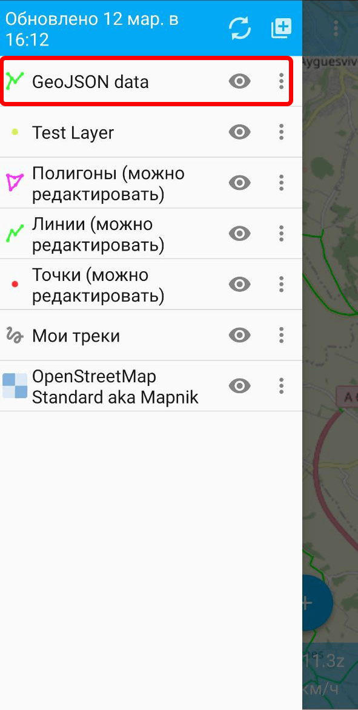

   Добавленный слой в списке слоёв

**Требования к формату GeoJSON**

* :term:`Система координат` геометрий может быть только WGS 84 (EPSG:4326) или Web Mercator 
  (EPSG:3857). Если на вход будет подан файл в другой системе координат, то будет выведено 
  сообщение о том, что такая система координат не поддерживается. 
* Все геометрии в файле должны быть одного типа. Если во входном файле содержатся геометрии 
  разного типа, то будут загружены записи, у которых тип геометрии совпадает с первой 
  записью (геометрия первой записи файла определяет тип геометрии слоя).
* Текстовые строки должны быть кодированы в формате UTF-8. 

.. seealso::
   Подробнее о формате GeoJSON можно прочитать в его `спецификации <http://geojson.org/>`_. 
   GeoJSON основывается на формате JSON (см. `RFC 4627 <https://www.ietf.org/rfc/rfc4627.txt>`_).

При редактировании векторного слоя, созданного на базе файла GeoJSON, доступна только стандартная форма редактирования атрибутов. В отличие от пользовательской формы (см. :numref:`ngmobile_import_ngfp`) стандартная форма 
может содержать только три типа полей:

1. Текстовое поле для ввода текста и цифр.
2. Диалог ввода даты и времени.
3. Кнопка добавления фотографиий.

После создания слоя над ним можно выполнять стандартные операции редактирования, такие как Добавить, Изменить или Удалить. Подробнее редактирование векторного слоя описано в разделе :ref:`ngmobile_editing`.

.. _ngmobile_import_ngfp:

Создание векторного слоя из формы
~~~~~~~~~~~~~~~~~~~~~~~~~~~~~~~~~

NextGIS Mobile позволяет создавать векторный слой путем импорта существущего файла формата NGFP. 

Файл формата NGFP представляет собой файл формата :term:`GeoJSON` с дополнительной информацией (JSON), упакованный в zip-архив c расширением \*.NGFP. Создаётся как `дочерний ресурс векторного слоя <https://docs.nextgis.ru/docs_ngweb/source/collector.html#collector-create-form>`_ в NextGIS Web.

При редактировании слоя на базе файла формата NGFP пользователь вводит данные не в стандартный список полей, а в пользовательскую форму редактирования атрибутов. Форма специальным образом оптимизирована для ввода данных и может содержать особые элементы для более удобного ввода данных: выбор из выпадающего списка, связанные списки, радио-кнопки и т.д. (см. :numref:`ngmobile_non-standard_form_pic`). 

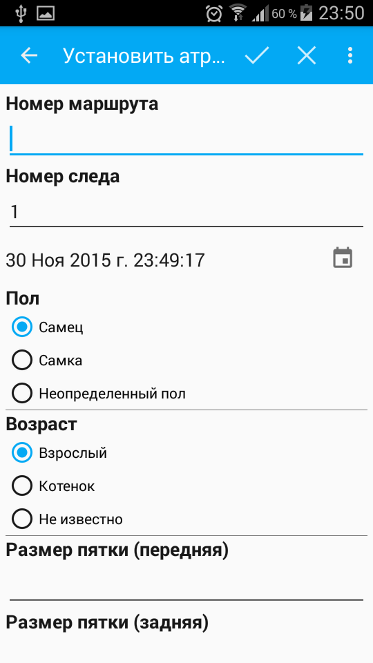
    
   Пользовательская форма редактирования атрибутов слоя
   
   Цифрами указаны: 1 - кнопка "Назад"; 2 - кнопка "Применить изменения"; 3 - настройки; 4 - текстовое поле для ввода букв и цифр; 5 - выпадающий список; 6 - время и дата; 7 - радио-кнопки.

Для того, чтобы загрузить в программу файл формата NGFP:

На панели дерева слоев нажмите на кнопку "Добавить геоданные" |button_add_layer|, далее выберите пункт диалога "Открыть локальный".

   Добавление слоя из файла

В открывшемся окне на диске мобильного устройства выберите файл формата NGFP.

После выбора файла откроется диалог настройки параметров создаваемого слоя, в котором можно задать имя слоя: 

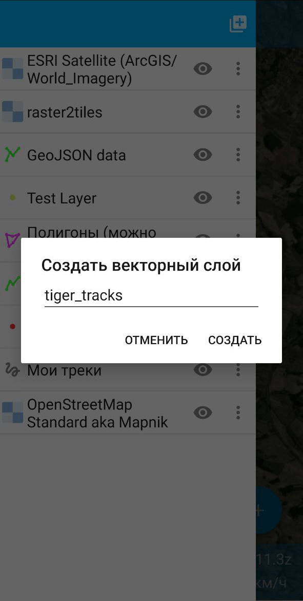

   Диалог настройки параметров создаваемого слоя
   
При нажатии на кнопку "Создать" начнется процесс загрузки данных и создания нового слоя (см. :numref:`ngmobile_tree_layers_geo_pic`). Результат создания слоя можно проверить в дереве слоев. В случае удачного создания слоя новый слой будет располагаться первым в дереве слоев.

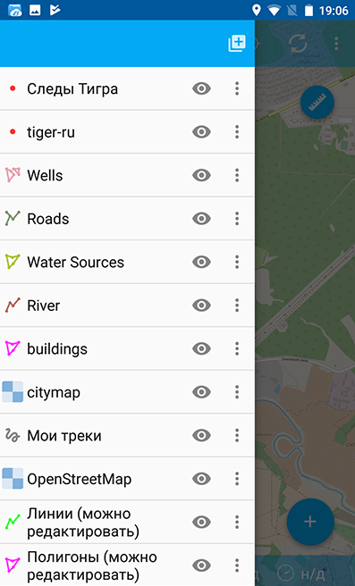

   Дерево слоев

После создания слоя над ним можно выполнять стандартные операции редактирования, такие как Добавить, Изменить или Удалить. Подробнее редактирование векторного слоя, созданного на базе файла NGFP, описано в разделе :ref:`ngmobile_editing`.

.. _ngmobile_import_cache:

Тайловый кэш (XYZ/TMS)
~~~~~~~~~~~~~~~~~~~~~~

NextGIS Mobile позволяет создавать растровый слой путем импорта тайлового кэша.

Тайловый кэш представляет собой ZIP-архив c папками и тайлами, нарезанными и сохраненными в соответствии с определенной схемой (например, folder_z/folder_x/y.png). Папки уровня Z могут находиться в корне архива или в папке в корне архива (название папки 
может быть любым, но папка должна быть одна). Более глубокая вложенность папок уровня Z не допускается. 

Тайловый кэш может быть получен при помощи модуля расширения `NextGIS QGIS - QTiles <http://plugins.qgis.org/plugins/qtiles/>`_. 
Полученный в результате работы модуля архив можно загрузить на устройство в любую доступную папку.

Для того, чтобы загрузить в программу zip-архив с тайловым кэшем:

На панели дерева слоев нажмите на кнопку "Добавить геоданные" |button_add_layer|, далее выберите пункт диалога "Открыть локальный".

   Добавление слоя из файла

В открывшемся окне выбора сохраненных файлов на диске мобильного устройства выберите необходимый для загрузки ZIP-архив. Откроется диалог настройки параметров создаваемого слоя:

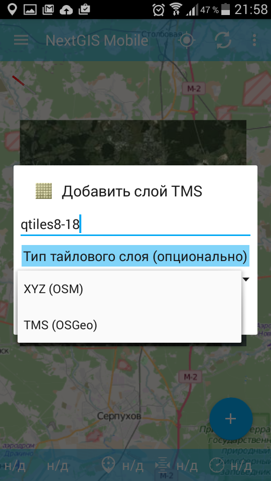

   Диалог настройки параметров тайлового слоя

Здесь можно выбрать тип тайлового слоя (схему нарезки тайлов) - XYZ (OSM) или TMS (OSGeo), и размер кэша:

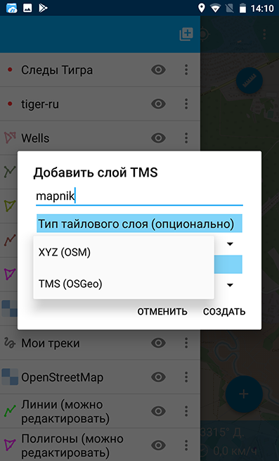

   Настройка типа тайлового слоя

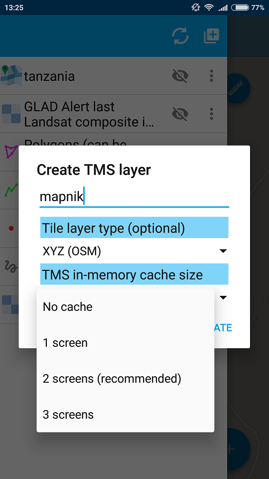

   Настройка размера кэша тайлов TMS

При нажатии на кнопку "Создать" начнется процесс обработки данных и создания нового растрового слоя.

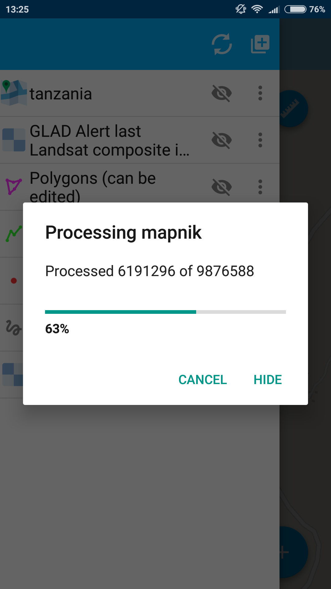

   Окно обработки данных и создания слоя

В случае удачного создания слоя новый слой будет располагаться первым в дереве слоев:

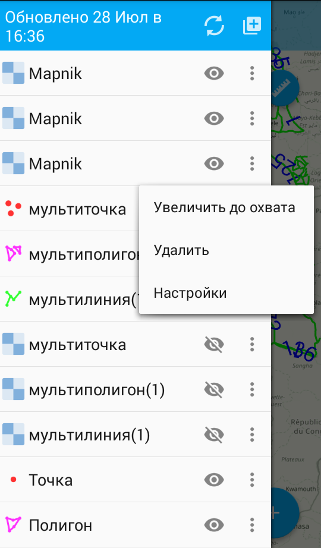

   Дерево слоев
   
.. _ngmobile_import_ngrc:

Тайловый кэш (NGRC)
~~~~~~~~~~~~~~~~~~~

NextGIS Mobile также позволяет создавать растровый слой путем импорта тайлового кэша в формате NGRC. Файлы NGRC могут быть получены из геоданных в практически любом формате, используя модуль `QTiles <https://docs.nextgis.ru/docs_ngqgis/source/qtiles.html>`_ для NextGIS QGIS или онлайн-инструмент `Набор тайлов из растра <https://toolbox.nextgis.com/t/raster2tiles>`_.

Для того чтобы загрузить в программу тайловый кэш в формате NGRC:

На панели дерева слоев нажмите на кнопку "Добавить геоданные" |button_add_layer|, далее выберите пункт диалога "Открыть локальный".

   Добавление слоя из файла

В открывшемся окне выбора сохраненных файлов на диске мобильного устройства выберите необходимый для загрузки файл в формате \*.ngrc.

При нажатии на кнопку "Создать" начнется процесс обработки и создания нового растрового слоя. В случае удачного создания слоя новый слой будет располагаться первым в дереве слоев:

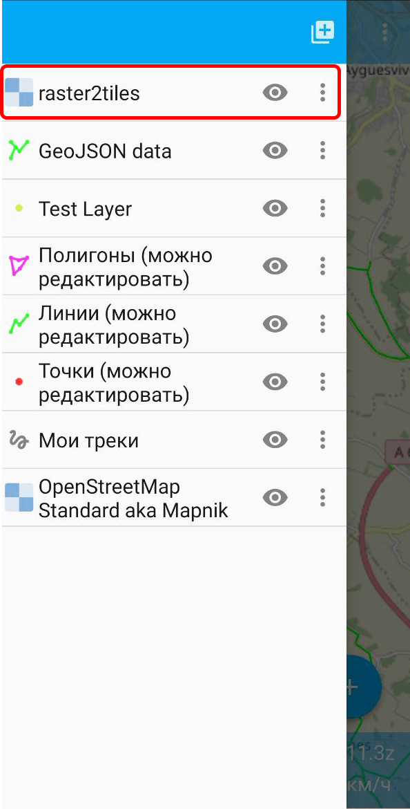

   Растровый слой в списке слоёв

.. _ngmobile_add_geoservice:

Добавление геосервиса
----------------------

NextGIS Mobile позволяет создавать растровые слои из внешних геосервисов. Это позволяет, например, добавить подложку.

Наиболее удобный способ - добавление тайлового сервиса из каталога `QuickMapServices <qms.nextgis.com>`_.

.. warning::
   Для создания слоев из внешних геосервисов необходимо подключение к сети Интернет.

.. _ngmobile_qms_service:

Создание растрового слоя из тайлового сервиса из каталога QuickMapServices
~~~~~~~~~~~~~~~~~~~~~~~~~~~~~~~~~~~~~~~~~~~~~~~~~~~~~~~~~~~~~~~~~~~~~~~~~~~

Для создания растрового слоя из тайлового сервиса, содержащегося в `каталоге QuickMapServices <https://qms.nextgis.com/>`_, необходимо выполнить следующие шаги:

На панели дерева слоев нажмите на кнопку "Добавить геоданные" |button_add_layer|, далее выберите пункт диалога "Добавить геосервис".

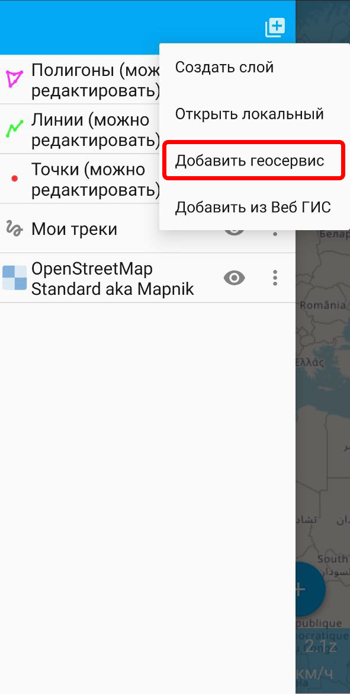
 
   Диалог добавления геоданных

Отроется список сервисов, доступных в каталоге QMS. Начните вводить в поле поиска название нужного сервиса или ключевые слова, например, ``satellite``. Выберите из результатов поиска нужный сервис или несколько сервисов, отметьте их галочками, затем нажмите **Добавить** внизу окна.

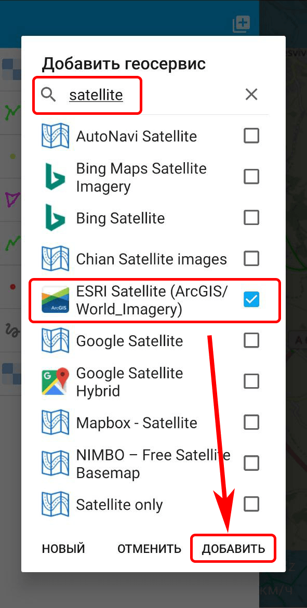

   Выбор геосервиса из каталога

В случае удачного создания слоя новый слой будет располагаться первым в дереве слоев.

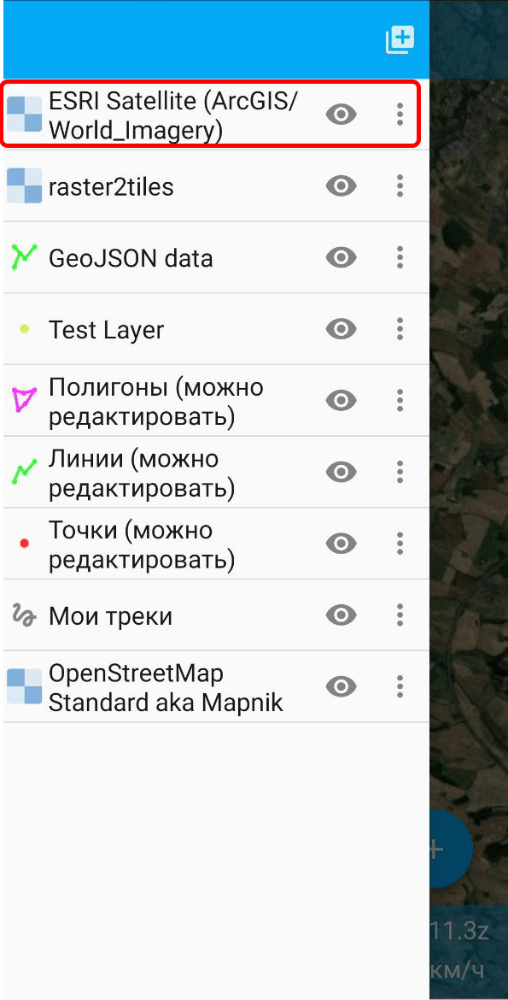

   Добавленный геосервис в списке слоёв

Растровый слой при этом перекроет все остальные слои. Нажмите на слой и перетащите его ниже, на нужное место в списке слоёв.

.. _ngmobile_tile_service:

Создание растрового слоя из частного тайлового сервиса
~~~~~~~~~~~~~~~~~~~~~~~~~~~~~~~~~~~~~~~~~~~~~~~~~~~~~~~

Если вы хотите создать растровый слой из тайлового сервиса, не содержащегося в `каталоге QuickMapServices <https://qms.nextgis.com/>`_, необходимо выполнить следующие шаги:

На панели дерева слоев нажмите на кнопку "Добавить геоданные" |button_add_layer|, далее выберите пункт диалога "Добавить геосервис".

 
   Диалог добавления геоданных

В диалоговом окне "Добавить геосервис" нажмите "Новый":

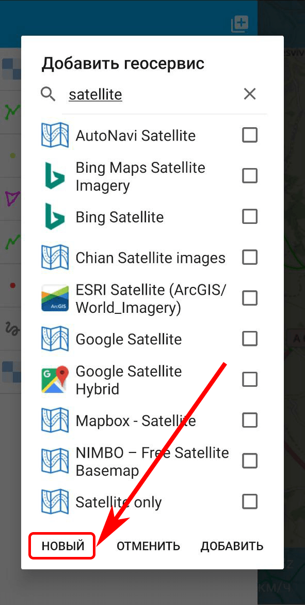

   Выбор создания нового сервиса

Отроется окно настроек нового сервиса:

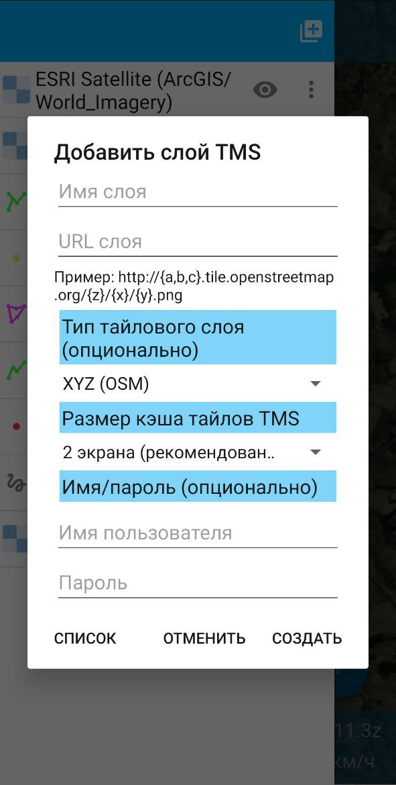

   Диалог добавления сервиса TMS
   
Для добавления сервиса нужно указать как минимум два параметра:

* Имя слоя;
* Адрес (URL) слоя. 

При формировании адреса слоя указывается, какое место в адресе занимают значения X (номер тайла по горизонтали), Y (номер тайла по вертикали) и Z (уровень зума). Для этого в строке адреса на месте цифры, соответствующей Х, необходимо поставить подстановочный код **{x}**, для Y - **{y}**, для Z - **{z}**. 
Дополнительно в строке адреса можно указать поддомены (например, для поддоменов a.tileopenstreetmap.org, 
b.tileopenstreetmap.org, c.tileopenstreetmap.org адрес будет выглядеть так: **{a,b,c}.tile.openstreetmap.org**).

.. note::
   NextGIS Mobile запрашивает тайлы с каждого адреса (поддомена) в два потока. Таким образом для адреса формата **{a,b,c}.tile.openstreetmap.org** приложение будет скачивать тайлы в 6 потоков.

Также можно указать:

* тип тайлового слоя: XYZ (OSM) или TMS (OSGeo);
* размер кэша TMS: без кэша, 1, 2 или 3 экрана;
* параметры аутентификации пользователя (имя пользователя и пароль) в случае, если это требуется для доступа к тайлам. 

.. note::
   В настоящее время поддерживается только `Basic access authentication <http://en.wikipedia.org/wiki/Basic_access_authentication>`_.

После введения необходимых параметров нажмите **Создать**.В случае удачного создания слоя новый слой будет располагаться первым в дереве слоев.

.. _ngmobile_tile_cache:

Кэширование данных тайлового сервиса 
~~~~~~~~~~~~~~~~~~~~~~~~~~~~~~~~~~~~

С растровыми слоями, созданными из внешних геосервисов, можно работать и **при отсутствии подключения к сети Интернет**. Для этого необходимо сначала загрузить тайлы для интересующей области:

1. Следует убедиться, что растровый слой, который потребуется для работы оффлайн, добавлен в Дерево слоев и включен для отображения на карте. Затем необходимо открыть охват карты, для которого нужно скачать тайлы.

2. На панели инструментов дерева слоев (:numref:`ngmobile_main_activity_pic`, п.1) слелует найти растровый слой и нажать кнопку вызова контекстного меню слоя (:numref:`ngmobile_layer_tree_pic`, п.5).

3. Нажать кнопку "Загрузить тайлы", как показано ниже:

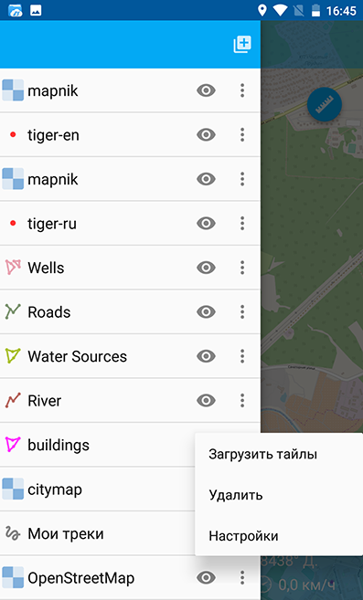
 
   Кнопка "Загрузить тайлы"

4. Далее откроется окно с настройками загрузки тайлов, где нужно задать необходимый диапазон зумов и нажать кнопку "Начать". 

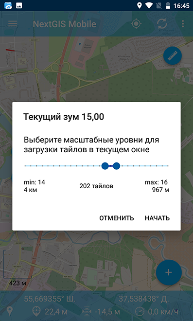
 
   Окно выбора уровня зума для загрузки тайлов

.. note::
   Чем меньше уровень выбранного зума для загрузки тайлов, тем меньшее количество тайлов попадают в интересующую нас область и тем быстрее происходит загрузка всего изображения. На панели статуса устройства Android можно отслеживать прогресс загрузки. Уведомления для приложения NextGIS Mobile должны быть активированы в системных настройках.

.. warning::
   Если список загружаемых тайлов для заданного диапазона зумов превышает 6000, то будут загружены только первые 6000 тайлов. Остальные тайлы не будут загружаться из-за ограничений на переполнение памяти.

.. seealso:: Также можно добавить векторный или растровый слой `из Веб ГИС <https://docs.nextgis.ru/docs_ngmobile/source/ngw_integration.html#ngmobile-add-layer-webgis>`_.