.. _ngmobile_load_geodata:

Добавление слоев
=================

В программе имеется возможность добавления слоёв разными способами:

* `создать пустой <https://docs.nextgis.ru/docs_ngmobile/source/load_geodata.html#ngmobile-create-vector>`_ векторный слой выбранной геометрии;
* загрузить векторный или растровый слой:

  * `из файла на устройстве <https://docs.nextgis.ru/docs_ngmobile/source/load_geodata.html#ngmobile-import-vector>`_, 
  * `из хранилища NextGIS Web <https://docs.nextgis.ru/docs_ngmobile/source/ngw_load.html#ngmobile-add-layer-webgis>`_  `в облаке или на своём сервере <http://nextgis.ru/nextgis-web/>`_. 
  * из `каталога QuickMapServices <https://qms.nextgis.com/>`_,
  * `с помощью внешнего сервиса <https://docs.nextgis.ru/docs_ngmobile/source/load_geodata.html#ngmobile-add-geoservice>`_.

.. admonition:: Где взять данные?

   Вам поможет `NextGIS Data <https://data.nextgis.com/ru/region/custom/base/>`_

.. _ngmobile_create_vector:

Создание пустого слоя
------------------------

Для того, чтобы создать пустой векторный слой, откройте панель слоёв |ic_layer_tree| и нажмите |button_add_layer|.

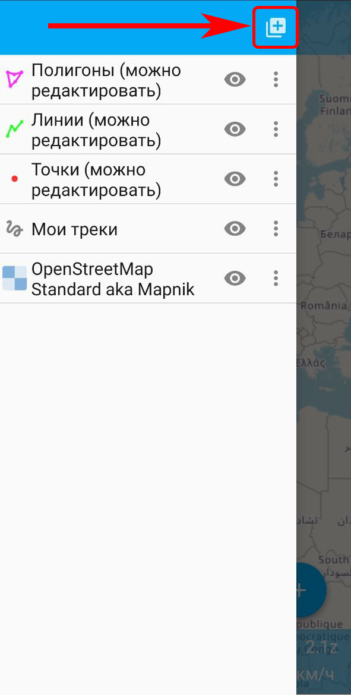

   Вызов меню в панели слоёв

В меню добавления геоданных выберите **Создать слой**.

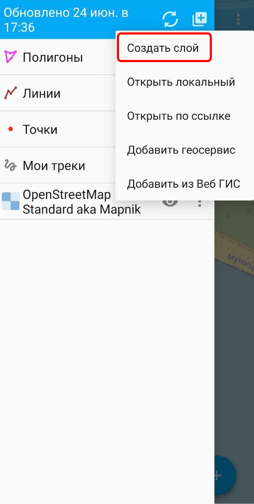
 
   Диалог "Добавить геоданные"

Откроется диалог создания нового слоя.

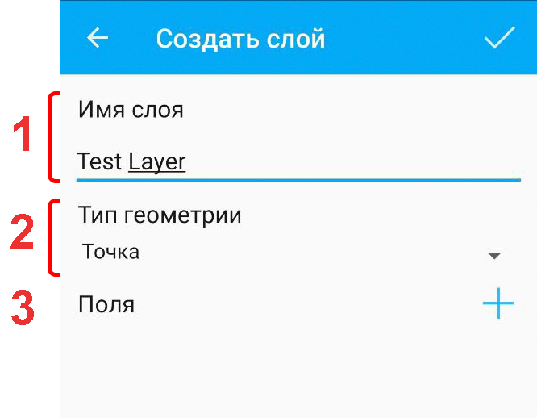
   
   Диалог создания нового векторного слоя

При создании векторного слоя задаются следующие параметры:

1. Имя слоя - обязательный пункт, введите название слоя, которое будет отображаться в дереве слоев.
2. Тип геометрии - выбор геометрии объектов слоя (точка, линия, полигон, мультиточка, мультилиния, мультиполигон).
3. Поля - список полей, содержащих атрибуты слоя.

Если задать только имя слоя и тип геометрии, по умолчанию в слое помимо служебного поля fid (идентификатор объекта) будет создано текстовое поле description (описание). 

Можно добавить к новому векторному сколько угодно пользовательских полей. Для этого нужно нажать на кнопку "+" рядом с надписью "Поля". При этом откроется диалог создания нового поля:

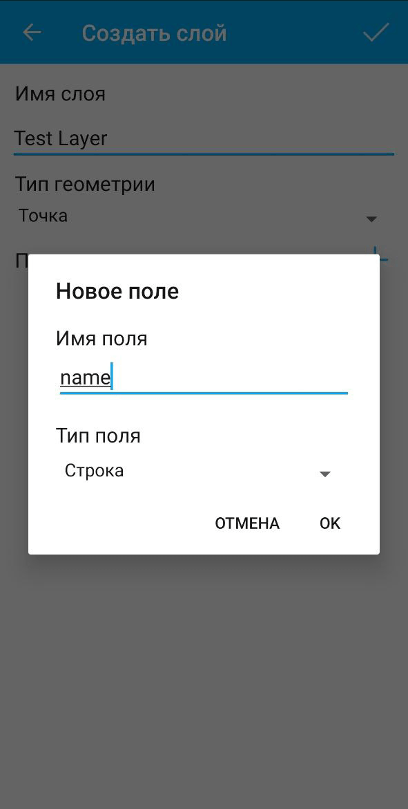

   Диалог создания нового поля

Задайте следующие параметры:

1. Имя поля, под которым оно будет записано в структуру слоя. 

.. note:: 
   Имя поля может быть введено только на английском языке (буквы и цифры!) и без пробелов. Также имя поля не должно совпадать со служебными словами SQL. 

2. Тип поля - строка, целочисленное 32 бит, целочисленное 64 бит, вещественное, дата и время, дата, время.

.. seealso::

   Настроить псевдоним для поля можно `при изменении слоя в Веб ГИС <https://docs.nextgis.ru/docs_ngweb/source/layers.html#vector-layer-field-settings-pic>`_. Также вы можете `создать форму <https://docs.nextgis.ru/docs_ngweb/source/collector.html#collector-create-form>`_ с пользовательскими названиями полей, комментариями к ним и другими более интуитивными элементами для ввода данных.

Для завершения создания слоя нажмите галочку |button_tick| в правом верхнем углу.

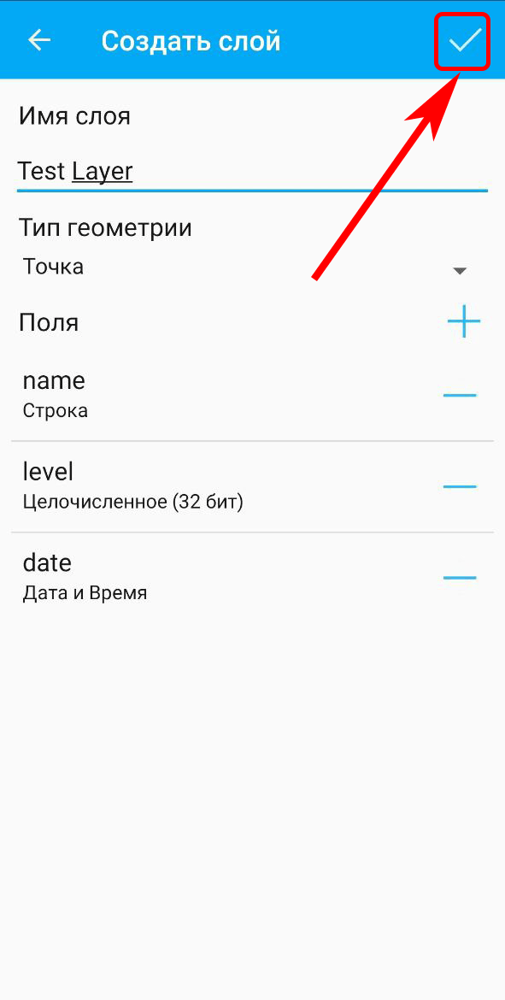

   Завершение создания слоя

Созданный слой будет первым в списке слоёв.

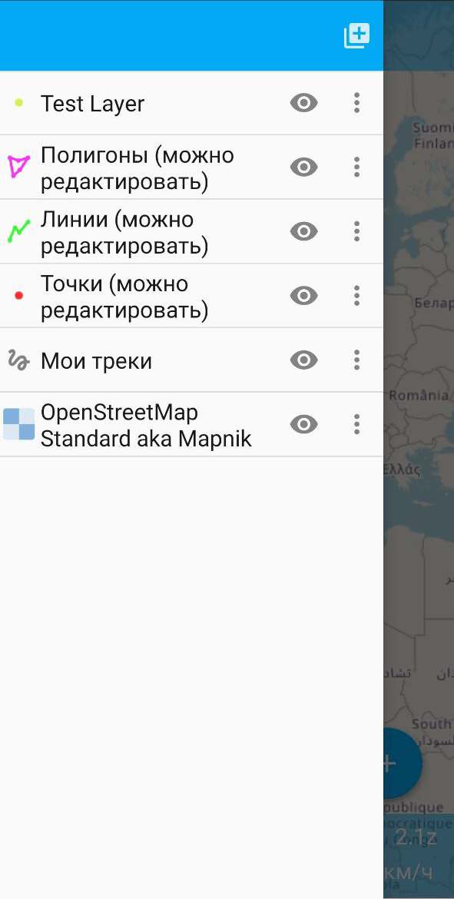

   Созданный локальный слой

Теперь вы можете:

* `Добавить в слой объекты <https://docs.nextgis.ru/docs_ngmobile/source/editing.html#ngmobile-add-geometry>`_;
* `Отправить его в Веб ГИС <https://docs.nextgis.ru/docs_ngmobile/source/ngw_load.html#ngmobile-upload>`_;
* `Поделиться слоем в виде файла <https://docs.nextgis.ru/docs_ngmobile/source/share.html>`_.

.. _ngmobile_import_vector:

Создание векторного слоя из файла
----------------------------------

Поддерживаются следующие форматы данных: 

* GeoJSON;
* настраиваемые формы в формате \*.NGFP (создаётся в NextGIS Web, `инструкция <https://docs.nextgis.ru/docs_ngweb/source/collector.html#collector-create-form>`_ )

На панели дерева слоев |ic_layer_tree| нажмите на кнопку "Добавить геоданные" |button_add_layer|, далее выберите пункт диалога **Открыть локальный**.

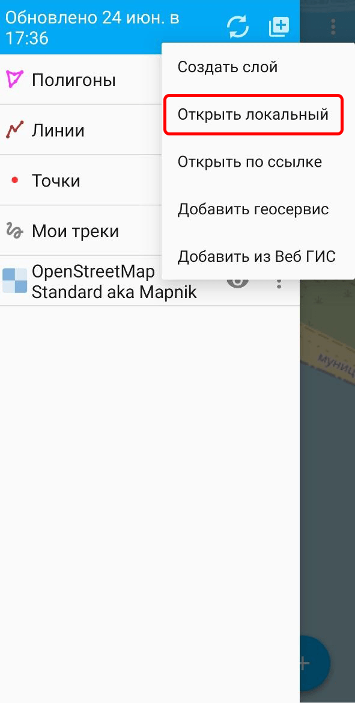

   Добавление слоя из файла

После выбора файла откроется диалог настройки параметров создаваемого слоя, в котором можно задать новое имя слоя: 

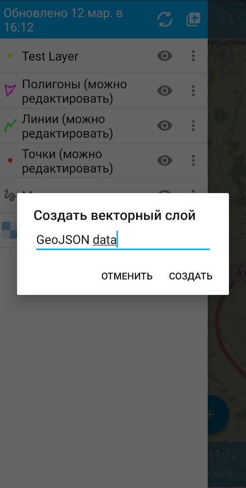

   Имя для добавляемого слоя
   
При нажатии на кнопку **Создать** начнётся процесс загрузки данных и создания нового слоя. За его продвижением можно наблюдать во всплывающем окне и в панели уведомлений.

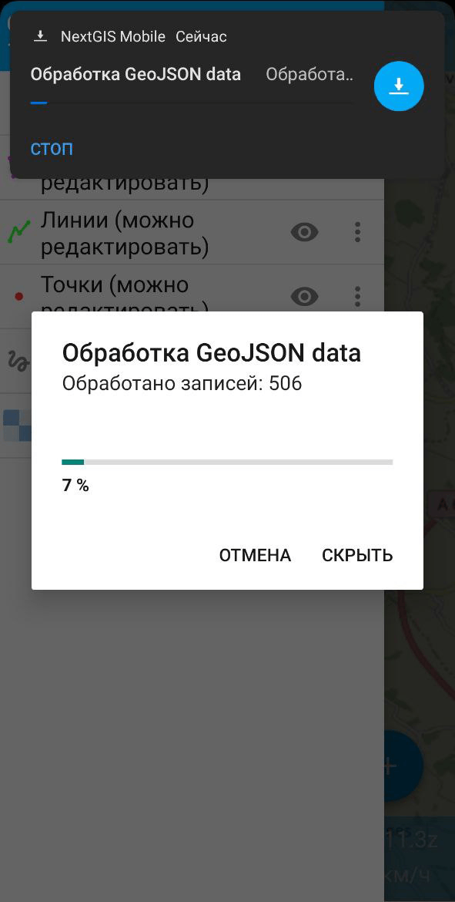

   Процесс загрузки слоя из файла

После окончания загрузки новый слой будет располагаться первым в дереве слоев: 

.. figure:: _static/ngm_add_local_result_ru.png
   :name: ngm_add_local_result_pic
   :align: center
   :width: 9cm  

   Добавленный слой в списке слоёв

Созданный векторный слой можно редактировать, как это сделать см. :ref:`ngmobile_editing`.

.. note:: Требования к формату GeoJSON

  * Файл должен иметь расширение .geojson; он также может находиться внутри архива с расширением .geojson.zip, при этом файл должен быть в корне, а не в подпапках этого архива;
  * :term:`Система координат` геометрий может быть только WGS 84 (EPSG:4326) или Web Mercator (EPSG:3857).
  * Если во входном файле содержатся геометрии разного типа, то геометрия первой записи определяет тип геометрии слоя, записи с другими геометриями будут проигнорированы.
  * Текстовые строки должны быть кодированы в формате UTF-8. 

.. _ngmobile_import_cache:

Создание растрового слоя из файла (Тайловый кэш)
--------------------------------------------------

Поддерживаются следующие форматы:

* XYZ/TMS  в ZIP-архиве;
* MBTiles;
* \*.NGRC. 

.. admonition:: Хотите купить готовые тайлы на нужную область?

   Вам поможет `Data.nextgis.com <https://data.nextgis.com/ru/region/custom/tiles/>`_

Тайловый кэш может быть получен из ваших данных при помощи модуля расширения `NextGIS QGIS - QTiles <http://plugins.qgis.org/plugins/qtiles/>`_ или онлайн-инструментов `Растр в NGRC <https://toolbox.nextgis.com/t/raster2tiles>`_.

Для того, чтобы загрузить в программу растровый слой:

На панели дерева слоев нажмите на кнопку "Добавить геоданные" |button_add_layer|, далее выберите пункт диалога **Открыть локальный**.

   Добавление слоя из файла

Выберите на устройстве файл тайлового кэша.

Созданный растровый слой будет располагаться первым в списке слоёв:

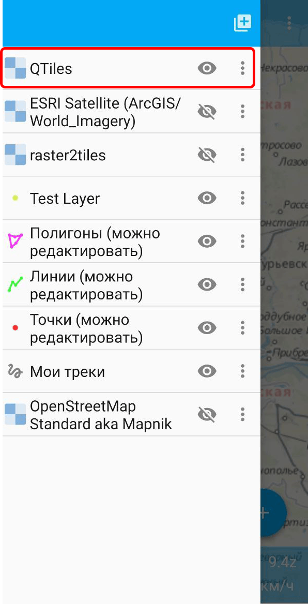

   Новый растровый слой в списке слоёв
   
.. note:: Требования к архиву с тайлами

  Папки уровня Z могут находиться в корне архива или в папке в корне архива (название папки может быть любым, но папка должна быть одна). Более глубокая вложенность папок уровня Z не допускается. 

.. _ngmobile_add_geoservice:

Добавление геосервиса
----------------------

NextGIS Mobile позволяет создавать растровые слои, например, подложки, из внешних геосервисов.

Наиболее удобный способ - добавление тайлового сервиса из каталога `QuickMapServices <qms.nextgis.com>`_.

Если вы не хотите зависеть от доступности сторонних сервисов, можно создавать свои автономные подложки с контролируемым доступом при помощи `NextGIS GeoServices <https://docs.nextgis.ru/docs_geoserv_prem/source/intro.html>`_.

.. _ngmobile_qms_service:

Добавление сервиса из каталога QuickMapServices
~~~~~~~~~~~~~~~~~~~~~~~~~~~~~~~~~~~~~~~~~~~~~~~~

Для создания растрового слоя из тайлового сервиса, содержащегося в `каталоге QuickMapServices <https://qms.nextgis.com/>`_:

На панели дерева слоев нажмите на кнопку "Добавить геоданные" |button_add_layer|, далее выберите пункт диалога **Добавить геосервис**.

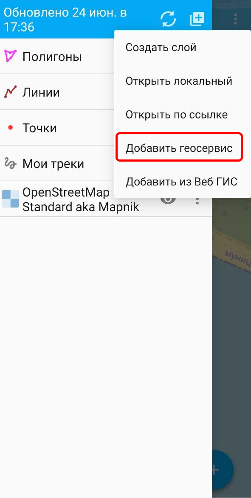
 
   Диалог добавления геоданных

Отроется список сервисов, доступных в каталоге QMS. Начните вводить в поле поиска название нужного сервиса или ключевые слова, например, ``satellite``. Выберите из результатов поиска нужный сервис или несколько сервисов, отметьте их галочками, затем нажмите **Добавить** внизу окна.

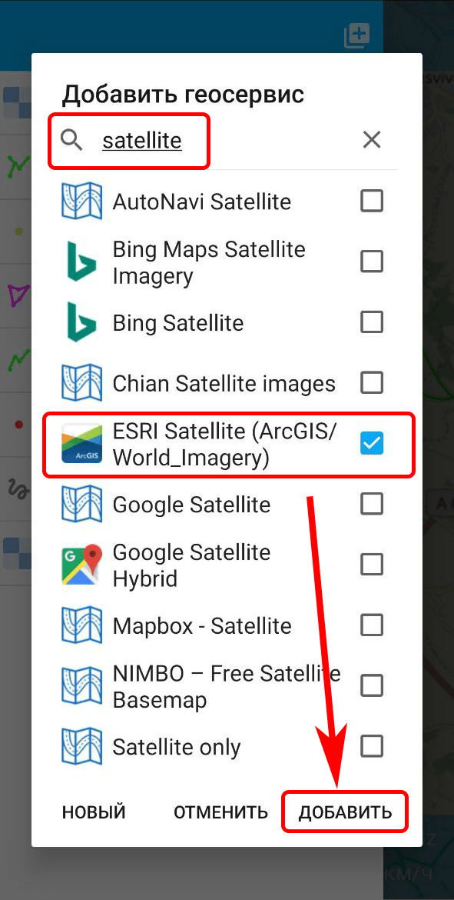

   Выбор геосервиса из каталога

Новый слой будет располагаться первым в дереве слоев.

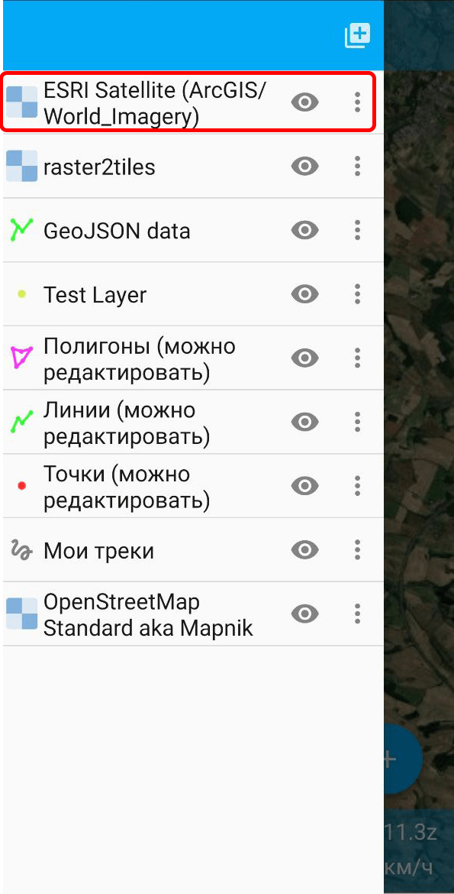

   Добавленный геосервис в списке слоёв

.. hint:: Растровый слой при этом перекроет все остальные слои. Нажмите на слой и перетащите его ниже, на нужное место в списке слоёв.

.. _ngmobile_tile_service:

Создание растрового слоя из пользовательского тайлового сервиса
~~~~~~~~~~~~~~~~~~~~~~~~~~~~~~~~~~~~~~~~~~~~~~~~~~~~~~~~~~~~~~~~

Если вы хотите создать растровый слой из тайлового сервиса, не содержащегося в `каталоге QuickMapServices <https://qms.nextgis.com/>`_:

На панели дерева слоев нажмите на кнопку "Добавить геоданные" |button_add_layer|, далее выберите пункт диалога **Добавить геосервис**.

 
   Диалог добавления геоданных

В диалоговом окне "Добавить геосервис" нажмите **Новый**:

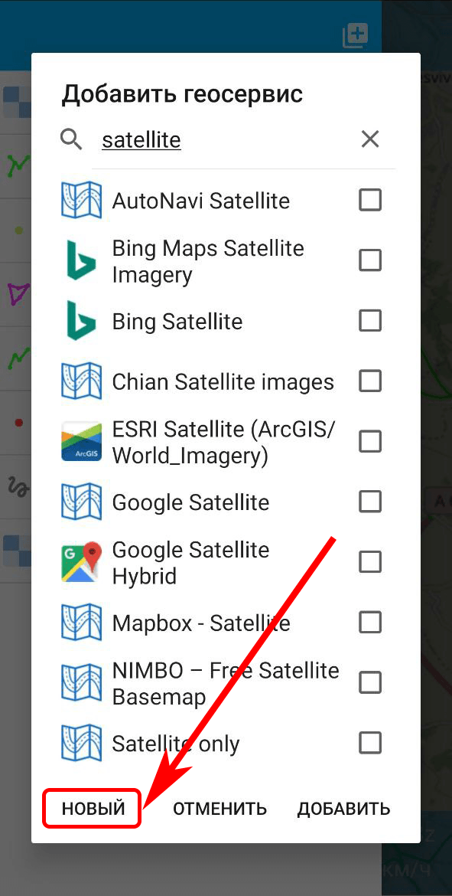

   Выбор создания нового сервиса

Отроется окно настроек нового сервиса:

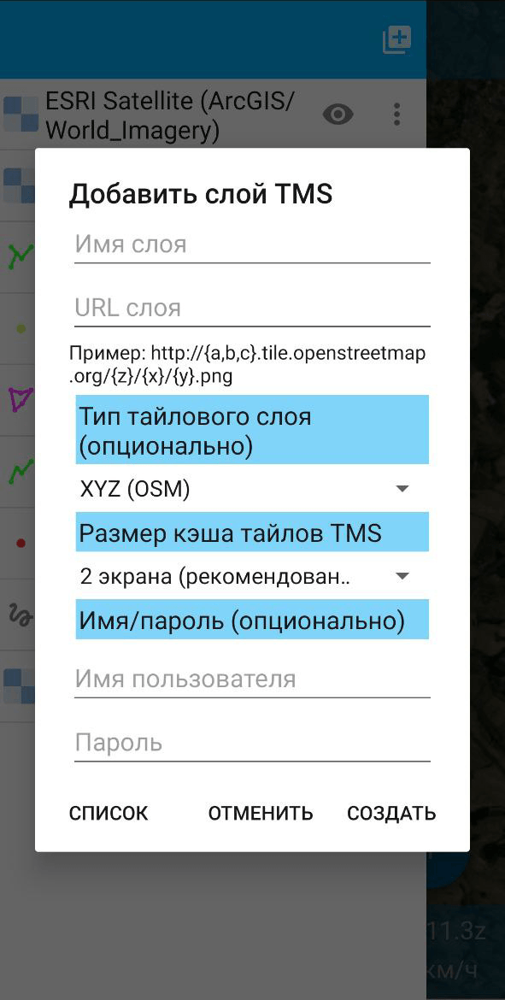

   Диалог добавления сервиса TMS
   
Для добавления сервиса нужно указать как минимум два параметра:

* Имя слоя;
* Адрес (URL) слоя. 

В адресе указывается, какое место в адресе занимают значения X (номер тайла по горизонтали), Y (номер тайла по вертикали) и Z (уровень зума), для этого используются коды в фигурных скобках ``{x}, {y}, {z}`` в нужном порядке. 

Дополнительно в строке адреса можно указать поддомены (например, для поддоменов ``a.tile.openstreetmap.org, b.tile.openstreetmap.org, c.tile.openstreetmap.org`` адрес будет выглядеть так: ``{a,b,c}.tile.openstreetmap.org``).

Также можно указать:

* тип тайлового слоя: XYZ (OSM) или TMS (OSGeo);
* размер кэша TMS: без кэша, 1, 2 или 3 экрана;
* параметры аутентификации пользователя (имя пользователя и пароль) в случае, если это требуется для доступа к тайлам. 

.. note::
   В настоящее время поддерживается только `Basic access authentication <http://en.wikipedia.org/wiki/Basic_access_authentication>`_.

После введения необходимых параметров нажмите **Создать**.Новый слой будет располагаться первым в дереве слоев.

.. _ngmobile_tile_cache:

Кэширование данных тайлового сервиса 
~~~~~~~~~~~~~~~~~~~~~~~~~~~~~~~~~~~~

С растровыми слоями, созданными из внешних геосервисов, можно работать и **при отсутствии подключения к сети Интернет**. Для этого необходимо сначала загрузить тайлы для интересующей области:

Убедитесь, что растровый слой, который потребуется для работы оффлайн, добавлен в Дерево слоев и включен для отображения на карте. 

Откройте охват карты, для которого нужно скачать тайлы.

Вызовите меню слоя и нажмите **Загрузить тайлы**:

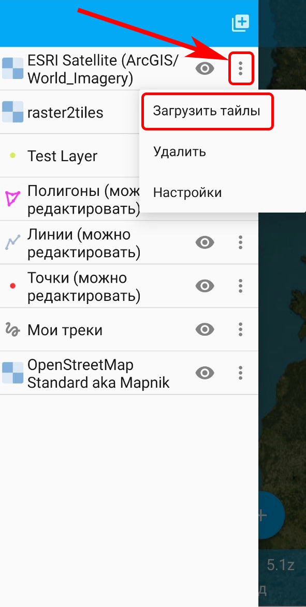
 
   Кнопка "Загрузить тайлы"

Далее откроется окно с настройками загрузки тайлов. Задайте необходимый диапазон зумов и нажмите **Начать**. 

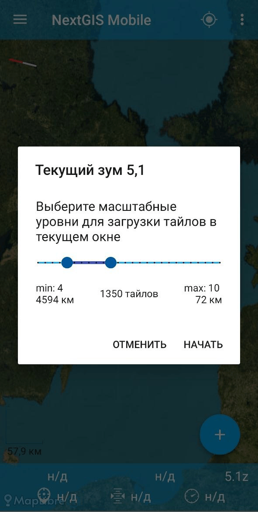
 
   Окно выбора уровня зума для загрузки тайлов

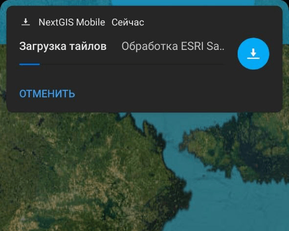

   Отображение хода загрузки тайлов

.. warning::
   Если список загружаемых тайлов для заданного диапазона зумов превышает 6000, то будут загружены только первые 6000 тайлов. Остальные тайлы не будут загружаться из-за ограничений на переполнение памяти.

Созданный кэш будет добавлен отдельным растровым слоем на первое место списка и отмечен стрелкой вниз.

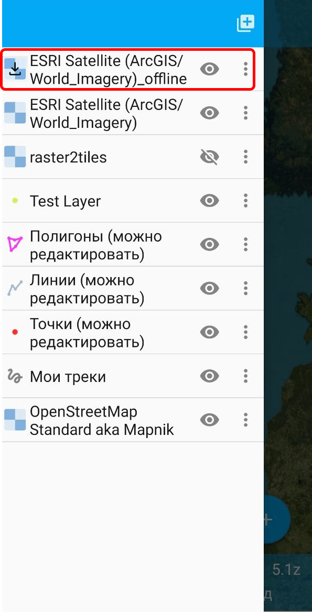

   Кэшированные тайлы в списке слоёв

Теперь даже при отсутствии сети тайлы выбранной области будут отображаться в приложении.

.. seealso:: Как добавить векторный или растровый слой `из Веб ГИС <https://docs.nextgis.ru/docs_ngmobile/source/ngw_load.html>`_.

.. |button_tick| image:: _static/button_tick.png
   :width: 6mm

.. |button_add_layer| image:: _static/button_add_layer.png
   :width: 6mm

.. |ic_layer_tree| image:: _static/ic_layer_tree.png
   :width: 7mm
   :alt: три полоски
