.. _ngmobile_load_geodata:

Add layers
=================

In NextGIS Mobile there are several ways to add geodata:

* `create a new layer of chosen geometry <https://docs.nextgis.com/docs_ngmobile/source/load_geodata.html#ngmobile-create-vector>`_;
* upload a vector or raster layer:

  * `from a file <https://docs.nextgis.com/docs_ngmobile/source/load_geodata.html#ngmobile-import-vector>`_ 
  * `from NextGIS Web <https://docs.nextgis.com/docs_ngmobile/source/ngw_load.html#ngmobile-add-layer-webgis>`_ `cloud storage or on-premise server <http://nextgis.com/nextgis-web/>`_; 
  * from `QuickMapServices catalog <https://qms.nextgis.com/>`_
  * from an `external service <https://docs.nextgis.com/docs_ngmobile/source/load_geodata.html#ngmobile-add-geoservice>`_ you have a link for.

.. admonition:: Where to get data?

   Explore `NextGIS Data <https://data.nextgis.com/en/region/custom/base/>`_

.. _ngmobile_create_vector:

Create empty layer
------------------------

To create an empty vector layer, open the layer panel |ic_layer_tree| and tap |ic_add_layer|.

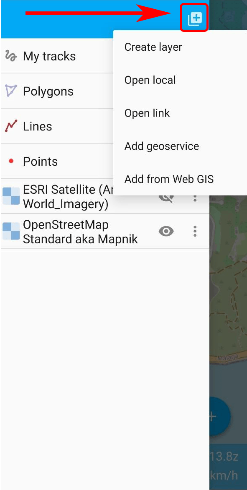

   Opening "Add geodata" menu

In the menu select **Create layer**.

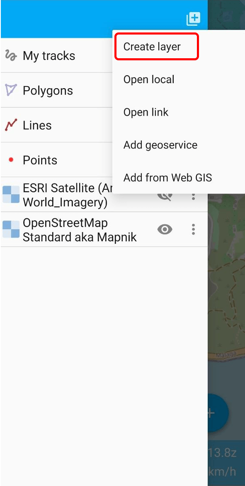
 
   "Add geodata" menu

A dialog opens that allows you to set up your layer.

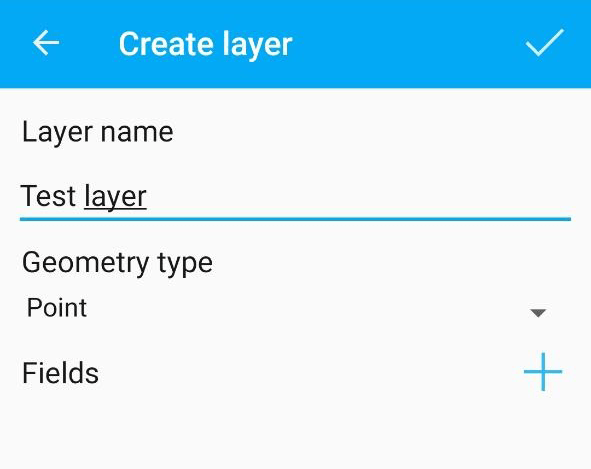
   
   Creating a new vector layer

Set up the following parameters for the vector layer:

1. Name - required, enter a name to be displayed in the layer list.
2. Geometry type - select what geometry the layer features are going to be (point, linestring, polygon, multipoint, multilinestring, multipolygon).
3. Fields - a list of fields containing layer attributes.

If you only set the name and geometry type, by default the layer is created with two fields: technical field for feature identifier (fid) and a text field (description). 

You can create a layer with as many fields as you need. Tap on the "+" next to the Fields label. A field creation dialog opens:

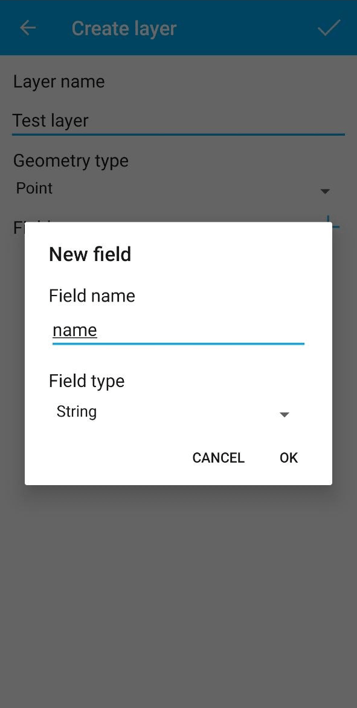

   Adding a new field

Set up the following parameters:

1. Field name, it will be used in the layer structure. 

.. note:: 
   Only use plain Latin symbols and numbers, no spaces. SQL keywords cannot be used for field names. 

2. Field type - string, integer (32 bit), integer (64 bit), real, date&time, date, time.

.. seealso::

   To set up aliases for the fields you can `update the layer in Web GIS <https://docs.nextgis.com/docs_ngweb/source/layers.html#vector-layer-field-settings-pic>`_. You can also create a `custom form <https://docs.nextgis.com/docs_ngweb/source/collector.html#collector-create-form>`_ with field labels, comments and more intuitive controls for entering values.

To complete layer creation tap |button_tick| in the top right corner.

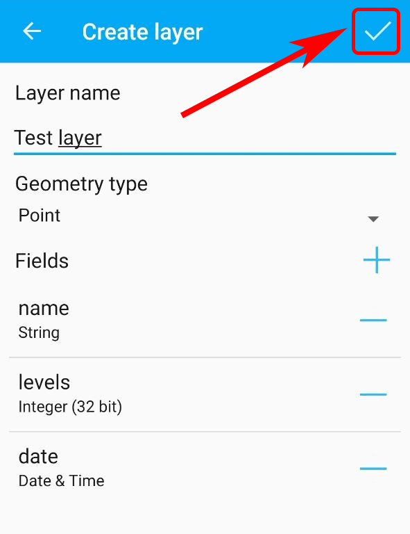

   Completing layer creation

New layer is added to the top of the layer list.

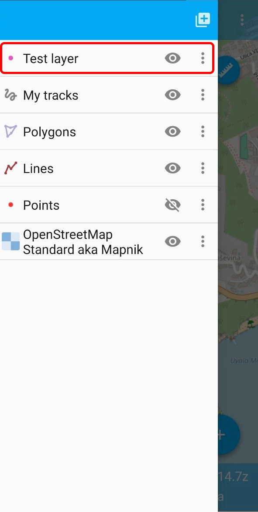

   New local layer

Now you can:

* `Add features to the layer <https://docs.nextgis.com/docs_ngmobile/source/editing.html#ngmobile-add-geometry>`_;
* `Send it to WebGIS <https://docs.nextgis.com/docs_ngmobile/source/ngw_load.html#ngmobile-upload>`_ ;
* `Share the layer as a file <https://docs.nextgis.com/docs_ngmobile/source/share.html>`_.

.. _ngmobile_import_vector:

Create vector layer from a file
----------------------------------

The following formats are supported: 

* GeoJSON
* custom forms in \*.NGFP format (created in NextGIS Web, `see how to do it <https://docs.nextgis.com/docs_ngweb/source/collector.html#collector-create-form>`_ )

Open the Layer tree panel |ic_layer_tree|, tap "Add geodata" |ic_add_layer| and select **Open local**.

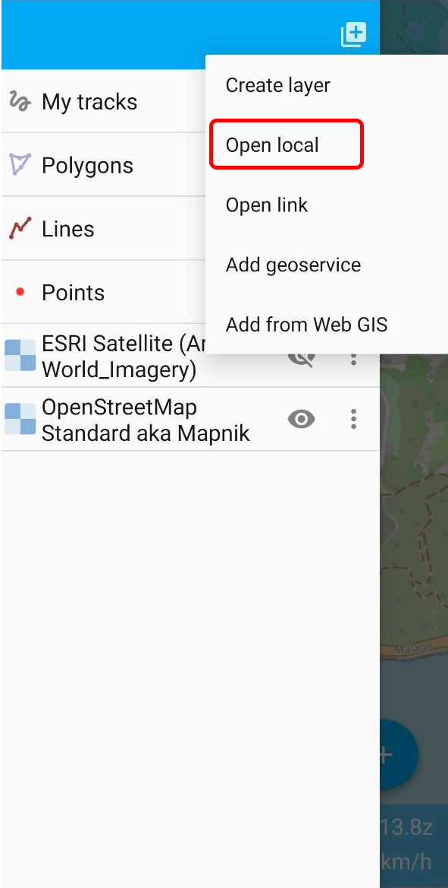

   Creating layer from file

Next a pop-up opens where you can set a custom name for the layer: 

.. figure:: _static/ngm_add_local_name_en.png
   :name: ngm_add_local_name_pic
   :align: center
   :width: 9cm

   Name of the new layer
   
Tap **Create** to start loading data. You can see the loading progress in a pop-up as well as in your device notifications.

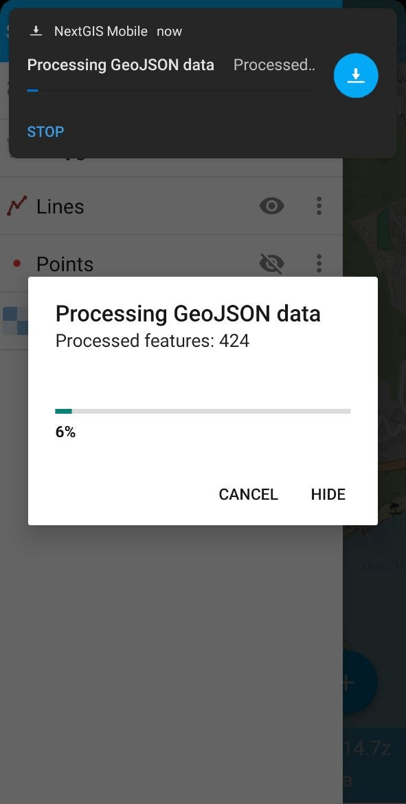

   Loading data from file

New layer is placed at the top of the layer list: 

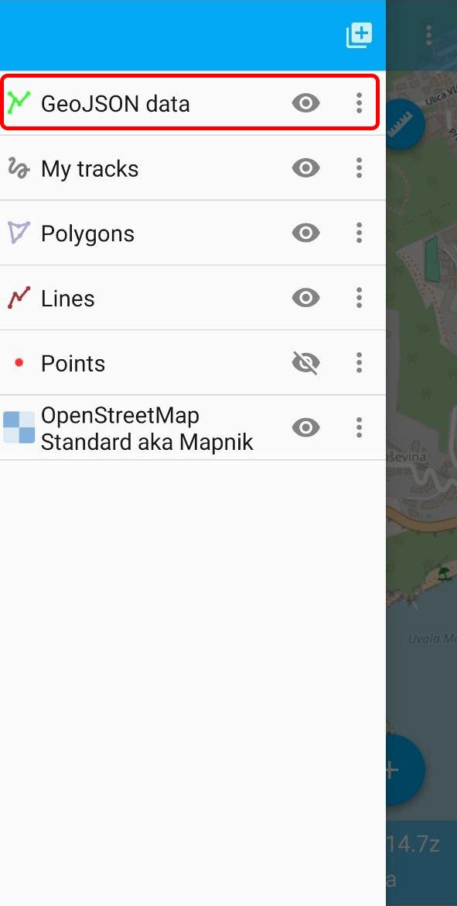

   Newly created layer in the layer list

See how you can modify the data in the section :ref:`ngmobile_editing`.

.. note:: Requirements for GeoJSON files

  * The extension must be .geojson, or .geojson.zip - an archive that has the file in the root directory;
  * Spacial reference system - only WGS 84 (EPSG:4326) or Web Mercator (EPSG:3857).
  * If the file contains multiple geometry types,the first feature determines the geometry type and all other types are ignored.
  * Text must be in UTF-8 encoding. 

.. _ngmobile_import_cache:

Create raster layer from file (tile cache)
--------------------------------------------------

The following formats are supported:

* XYZ/TMS in a ZIP-archive;
* MBTiles;
* \*.NGRC. 

.. admonition:: Want to buy ready-made tiles for your area of interest?

   Explore `NextGIS Data <https://data.nextgis.com/en/region/custom/tiles/>`_

You can generate tile cache with a QGIS plugin called `QTiles <http://plugins.qgis.org/plugins/qtiles/>`_ or use an online tool `Raster to NGRC <https://toolbox.nextgis.com/t/raster2tiles>`_.

To load a raster layer into NextGIS Mobile:

Open the Layer tree panel |ic_layer_tree|, tap "Add geodata" |ic_add_layer| and select **Open local**.

   Creating layer from file

Select tile cache file from your device.

New raster layer is placed at the top of the layer list:

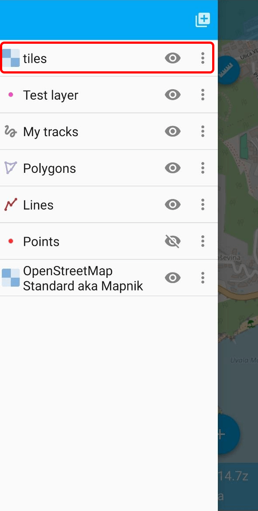

   Newly created raster layer in the layer list
   
.. note:: Requirements for tile archive

  Z-level folders can be in the root of the archive or in a folder that's in the root of the archive (name doesn't matter, but there must be only one folder). Deeper nesting for Z-level folders is not supported. 

.. _ngmobile_add_geoservice:

Add geoservice
----------------------

In NextGIS Mobile you can create raster layers from external geoservices (basemaps, for example)

The easiest way to do it is to pick a service from `QuickMapServices <qms.nextgis.com>`_ catalog.

If you don't want to depend on the availability of external services, you can host your own key-protected basemaps with `NextGIS GeoServices <https://docs.nextgis.com/docs_geoserv_prem/source/intro.html>`_.

.. _ngmobile_qms_service:

Add service from QuickMapServices catalog
~~~~~~~~~~~~~~~~~~~~~~~~~~~~~~~~~~~~~~~~~~~~~~~~

To use a tile service from `QuickMapServices <https://qms.nextgis.com/>`_ catalog:

Open the Layer tree panel |ic_layer_tree|, tap "Add geodata" |ic_add_layer| and select **Add geoservice**.

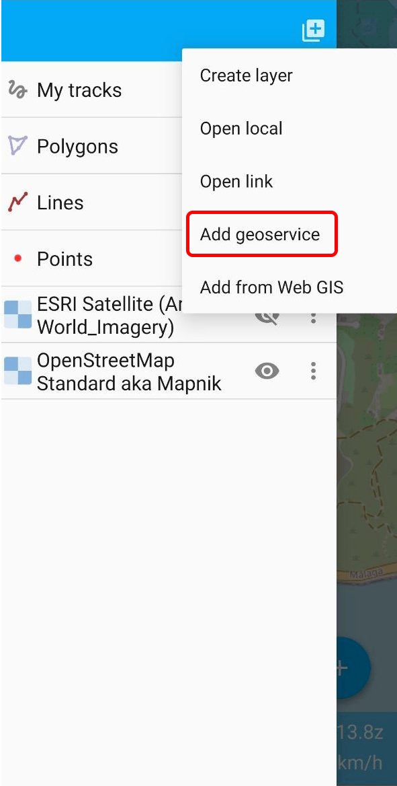
 
   Add geodata dialog

A pop-up opens displaying all services available in the QMS catalog. Start typing in the search bar the name of the service or some key words like ``satellite``. Pick a service or several services from the search results by putting a tick next to them, then tap **Add** at the bottom of the screen.

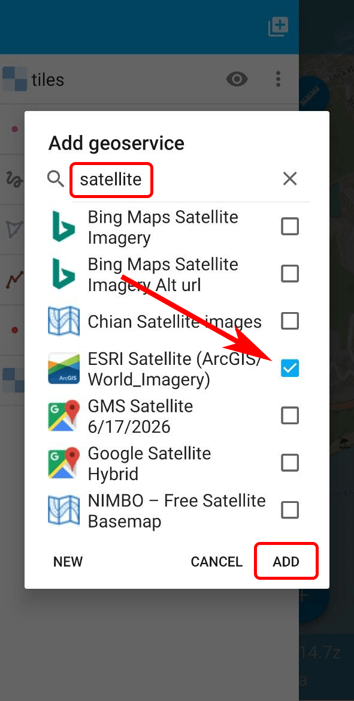

   Selecting geoservice from catalog

New layer is placed at the top of the layer list:

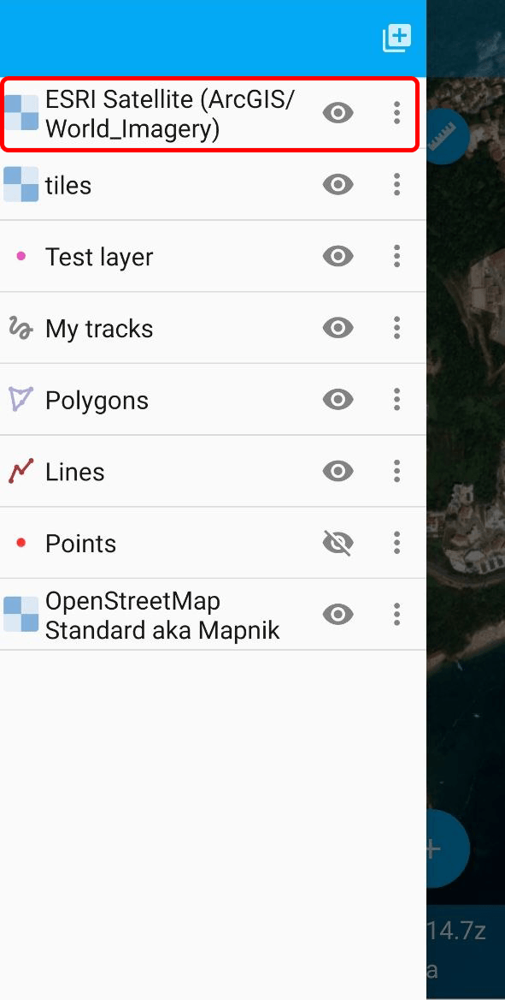

   Newly added geoservice in the layer list

.. hint:: Since it's a raster layer, it covers all the layer below it. Drag the layer to a convenient place at the bottom of the layer tree.

.. _ngmobile_tile_service:

Add custom tile service
~~~~~~~~~~~~~~~~~~~~~~~~~~~~~~~~~~~~~~~~~~~~~~~~~~~~~~~~~~~~~~~~

To use a custom tile service not included in `QuickMapServices <https://qms.nextgis.com/>`_ catalog:

Open the Layer tree panel |ic_layer_tree|, tap "Add geodata" |ic_add_layer| and select **Add geoservice**.

 
   Add geodata dialog

Tap **New**.

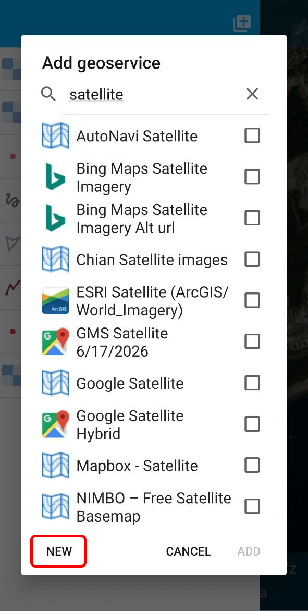

   Adding new service

A settings pop-up appears.

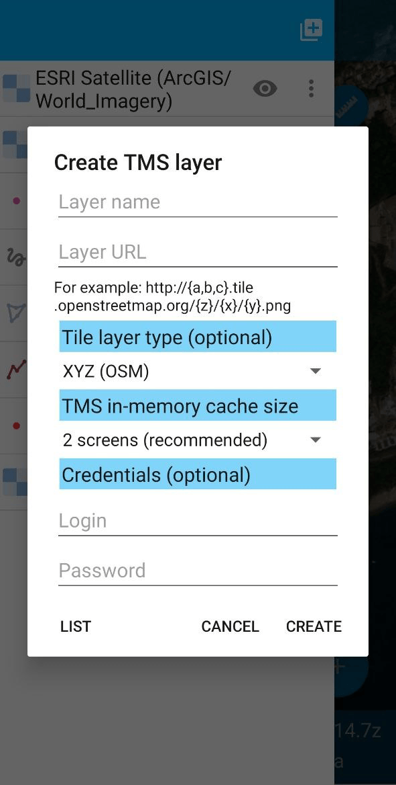

   Settings for custom TMS service
   
Enter at least two parameters:

* Layer name;
* URL. 

Service URL determines the order of tile numbers (vertical, horizontal and zoom level). In the address, it's marked by **{x}, {y}, {z}** in the corresponding order. 

You can also add subdomains. For example, for subdomains ``a.tile.openstreetmap.org, b.tile.openstreetmap.org, c.tile.openstreetmap.org`` the URL is **{a,b,c}.tile.openstreetmap.org**.

You can also set:

* schema (how the tiles are cut): XYZ (OSM) or TMS (OSGeo);
* cache size: no cache, 1 screen, 2 or 3 screens;
* credentials (login and password) if thery are required to access the tiles. 

.. note::
   Only `Basic access authentication <http://en.wikipedia.org/wiki/Basic_access_authentication>`_ is supported.

When all is set, tap **Create**. The new layer is placed at the top of the layer list.

.. _ngmobile_tile_cache:

Cache tile service data 
~~~~~~~~~~~~~~~~~~~~~~~~~~~~~~~~~~~~

You can work with data from external geoservices even **without Internet connection**. To make it possible, download tiles for your area of interest.

Make sure that the raster layer is added to the Layer tree and visible. 

Open the map at the extend of the area you want to download tiles for.

Open the layer menu and select **Download tiles**.

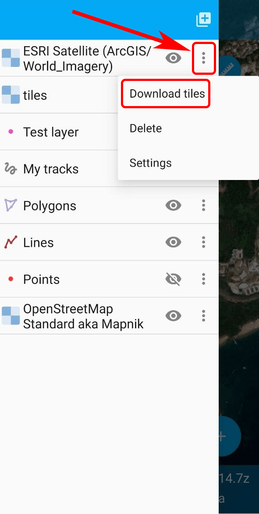
 
   Raster service menu

In the pop-up window select the necessary zoom range. Tap **Start**. 

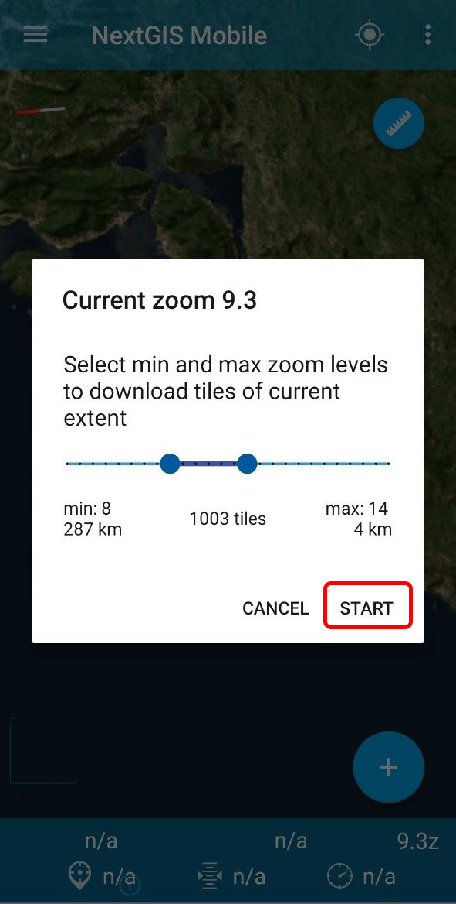
 
   Selecting zoom range to download tiles

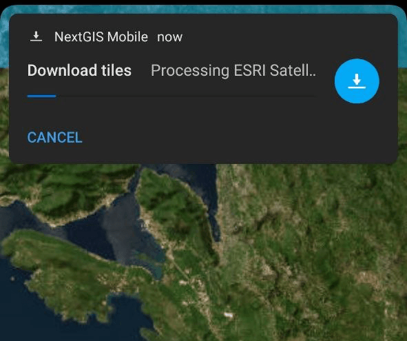

   Download in progress

.. warning::
   If the total number of tiles of the selected range is over 6000, only the first 6000 tiles are downloaded. The rest won't be downloaded to avoid memory overload.

Cache layer is added to the top of the layer list and marked by a downward arrow.

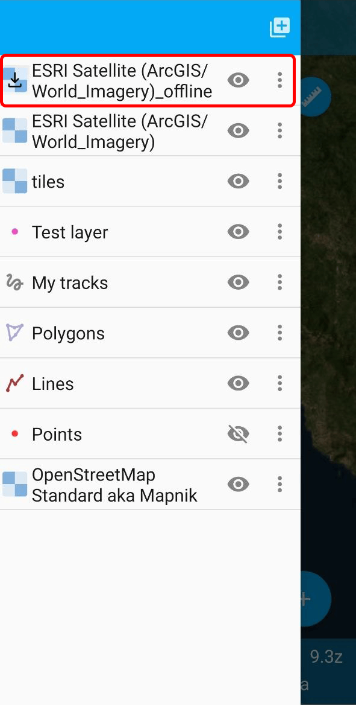

   Cached tiles in the layer tree

Now even when there's no connection the tiles for the are will be displayed in the app.

.. seealso:: `How to add a layer from Web GIS <https://docs.nextgis.com/docs_ngmobile/source/ngw_load.html>`_.

.. |ic_add_layer| image:: _static/ic_add_layer.png
   :width: 6mm

.. |ic_layer_tree| image:: _static/ic_layer_tree.png
   :width: 6mm
   :alt: three lines
