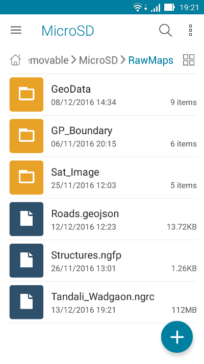

.. sectionauthor:: Dmitry Baryshnikov <dmitry.baryshnikov@nextgis.ru>

.. _ngmobile_load_geodata:

Adding layers
==============

NextGIS Mobile has the ability to create layers using data from cloud storage or 
mobile device storage and also to create new empty vector layers. Supported data types: 
GeoJSON, cached tiles, custom forms.

Creating new vector layer
---------------------------
  
.. versionadded:: 2.3

Here are the steps to create an empty vector layer:

1. Open contextual menu and select "New Layer", then select "Create Layer" (see :numref:`ngmobile_options_menu_new_layer_pic`)

.. figure:: _static/options_menu_new_layer.png
   :name: ngmobile_options_menu_new_layer_pic
   :align: center
   :height: 10cm
 
   Contextual menu.

2. In the opened dialog enter the parameters of new vector layer (see :numref:`ngmobile_input_form_attributes_new_layer_pic`) 

.. figure:: _static/input_form_attributes_new_layer.png
   :name: ngmobile_input_form_attributes_new_layer_pic
   :align: center
   :height: 10cm
   
   Parameters of new vector layer.

The standard form for the creation of new vector layer contains the following parameters:

1. Layer name - enter the name of layer which will be displayed in layers tree.
2. Geometry type - select layer geometry type (point, linestring, polygon, multypoint, multilinestring or multipolygon).
3. Fields - list of fields which can be added, edited or deleted.

New dialog will be opened for creation of each field (see :numref:`ngmobile_dialogue_create_new_field_pic`) 

.. figure:: _static/dialogue_create_new_field.png
   :name: ngmobile_dialogue_create_new_field_pic
   :align: center
   :height: 10cm

   Dialog for creation of a new field.

Dialog for creation of a new field contains the following parameters:

1. Field name – enter the name of the field.

.. note:: 
	The field name can only be entered in Latin characters (letters and numbers!) without spaces. It should also differ from SQL reserved keywords.

2. Field type - select field type (string, integer, real, date&time, date, time)

Creating vector layer from GeoJSON data
-----------------------------------------

To open data in GeoJSON format:

1. Open contextual menu, select "New layer", then select "Open local" (see :numref:`ngmobile_add_ngw_layer_geo_pic`)

.. figure:: _static/add_layer1.png
   :name: ngmobile_add_ngw_layer_geo_pic
   :align: center
   :height: 10cm
    
    Adding local layer.

2. Select the GeoJSON dataset from your mobile device storage (see :numref:`ngmobile_saved_files_on_the_drive_unit_pic`): 

   
   Android local storage.

3. When the file is selected a layer settings dialog opens. Here you can specify a layer name. (see :numref:`ngmobile_layer_settings_geo_pic`): 

.. figure:: _static/layer_settings_geo.png
   :name: ngmobile_layer_settings_geo_pic
   :align: center
   :height: 10cm

   Layer settings dialog.

4. Pressing "Create" button starts data processing for creation of a new layer (see :numref:`ngmobile_processing_and_creation_layer_pic`): 

.. figure:: _static/processing_and_creation_layer.png
   :name: ngmobile_processing_and_creation_layer_pic
   :align: center
   :height: 10cm  

   Data processing for creation of a new layer.

.. note::  
	In case of GeoJSON data uploading the new layer will always be a vector type layer!

You can check if the new layer was created successfully in the layers tree panel. The newly created layer will show up first in the layers tree (see :numref:`ngmobile_tree_layers_geo_pic`):

.. figure:: _static/tree_layers_geo.png
   :name: ngmobile_tree_layers_geo_pic
   :align: center
   :height: 10cm  

   Layers tree panel.

*GeoJSON: format requirements*

* :term:`Coordinate system` of input geometries can be WGS 84 (EPSG:4326) or Web Mercator (EPSG:3857) only. If input file has different coordinate system you will see a warning message about unsupported coordinate system.
* All geometries in the file must be of the same type. If input file contains varying types of geometry in the output you will have a file with geometries type that coincides with the type of first record, i.e. geometry of first entry will determine the type of layer geometry.
* Text strings must be encoded in UTF-8 format.

.. note::
	You can read more about the GeoJSON format in its `specification <http://geojson.org/>`_.
	GeoJSON is based on the format JSON (see `RFC 4627 <https://www.ietf.org/rfc/rfc4627.txt>`_).

You can only use standard attributes form (not custom NGFP form) for editing GeoJSON layer. Standard attributes form contains the following fields:

1. Text field for entering characters or digits.
2. Dialog for entering time.
3. "Add pictures and records" button.

.. figure:: _static/standard_form_layer_attributes.png
   :name: ngmobile_standard_form_layer_attributes_pic
   :align: center
   :height: 10cm  
    
    Standard attributes form.

For more information about GeoJSON layer editing see :ref:`ngmobile_editing`.

Creating new raster layer from Tile cache
-------------------------------------------

Tile cache is a zip-archive with folders and tiles stored in accordance with a tiling scheme (for example, folder_z/folder_x/y.png). Folders of level Z can be located in the root or in a folder in the root folder (name of the folder doesn't matter, but there have to be only one folder). Deeper nesting of level Z folders is not allowed.

Follow these steps to open zip-archive with tiles:

1. Open contextual menu and select "New layer", then select "Open local" (see :numref:`ngmobile_add_ngw_layer_geo_pic`) 

2. Select zip-archive from your mobile device storage (see :numref:`ngmobile_files_on_the_drive_unit_tms_pic`): 

.. figure:: _static/files_on_the_drive_unit_tms.png
   :name: ngmobile_files_on_the_drive_unit_tms_pic
   :align: center
   :height: 10cm
   
   Android local storage.

3. When zip-archive is selected a layer settings dialog opens. Here you can select tile layer type (tile structure system) - XYZ (OSM) or TMS (OSGeo) (see :numref:`ngmobile_layer_setting_tms_pic`):

.. figure:: _static/layer_setting_tms.png
   :name: ngmobile_layer_setting_tms_pic
   :align: center
   :height: 10cm

   Tile layer settings dialog.

4. Pressing "Create" button starts data processing for creation of a new layer (see :numref:`ngmobile_processing_and_creation_layer_tms_pic`): 

.. figure:: _static/processing_and_creation_layer_tms.png
   :name: ngmobile_processing_and_creation_layer_tms_pic
   :align: center
   :height: 10cm  

   Data processing for creation of a new layer from tiles.

You can check if the new layer was created successfully in the layers tree panel. The newly created layer will show up first in the layers tree (see :numref:`ngmobile_tree_layers_tms_pic`):  

.. figure:: _static/tree_layers_tms.png
   :name: ngmobile_tree_layers_tms_pic
   :align: center
   :height: 10cm  

   Layers tree panel.

Creating new vector layer from Custom forms (NGFP)
-----------------------------------------------------

.. versionadded:: 2.2

NGFP files can be generated using NextGIS FormBuilder. NGFP is a :term:`GeoJSON` file with additional information (JSON) which is packaged in zip archive and has .ngfp extension.

Perform the following steps to add NGFP file to NextGIS Mobile:

1. Open contextual menu and select "New layer", then select "Open local" (see :numref:`ngmobile_add_ngw_layer_geo_pic`) 

2. Select NGFP file from your mobile device storage (see :numref:`ngmobile_files_on_the_drive_unit_tms_pic`)

3. When the file is selected a layer settings dialog opens. Here you can specify a layer name (see :numref:`ngmobile_settind_layer_form_pic`): 

.. figure:: _static/settind_layer_form.png
   :name: ngmobile_settind_layer_form_pic
   :align: center
   :height: 10cm

   Layer settings dialog.

4. Pressing "Create" button starts data processing for creation of a new layer (see :numref:`ngmobile_loading_layer_form_pic`): 

.. figure:: _static/loading_layer_form.png
   :name: ngmobile_loading_layer_form_pic
   :align: center
   :height: 10cm  

   Data processing for creation of a new layer.

NGFP layers use custom (not standard) attributes form optimized for attributes viewing and editing. Custom form may contain special controls for editing, such as dropdowns, checkboxes or linked lists.

.. figure:: _static/non-standard_form.png
   :name: ngmobile_non-standard_form_pic
   :align: center
   :height: 10cm  
    
    Custom attributes form.

For more information about NGFP layer editing see :ref:`ngmobile_editing`.

Adding tile service
--------------------

"Add web" from new layer menu (see :numref:`ngmobile_main_activity_pic` p. 3) opens the following dialog :numref:`ngmobile_add_tms_pic`.

.. figure:: _static/ngmobile_addtms.png
   :name: ngmobile_add_tms_pic
   :align: center
   :height: 11cm
   
   Dialog for adding tile geodata source.

   The numbers indicate: 1 - Tile layer name; 2 - Tile layer URL; 3 - Tile layer type; 4 - Login; 5 - Password; 6 - Create button; 7- Cancel button.

Tile layer URL should specify location of X value (number of tile by horizontal), Y (number of tile by vertical) and Z (zoom level). These values are specified using wildcard code for X - **{x}**, for Y - **{y}**, for Z - **{z}**. Additionally you can specify subdomains (e.g. for subdomains a.tileopenstreetmap.org, b.tileopenstreetmap.org, c.tileopenstreetmap.org the address will look like this: **{a,b,c}.tile.openstreetmap.org**).

.. note::

	NextGIS Mobile requests tiles from each URL (subdomain) in 2 streams. So from URL like {a,b,c}.tile.openstreetmap.org tiles will be downloaded in 6 streams.

All tiles received from Internet/Intranet are cached on memory card. When you request a specific tile, local cache is checked first. If there's a tile in the local cache which was created less then 7 days ago, it will be displayed on the map. Cached tile will also be displayed if device is not connected to Internet/Intranet or if there was a failure while downloading a tile. Tiles obtained from Internet/Intranet replace cached tiles.

Following types of tile layers are supported (item 3 in :numref:`ngmobile_add_tms_pic`):

* XYZ (OSM) - standard type of tile service;
* TMS (OSGeo) - OSGeo standard.

If authentication is required for accessing tiles, you can specify credentials (login and password) (items 4 and 5 in :numref:`ngmobile_add_tms_pic`).

.. note::

	Only `Basic access authentication <http://en.wikipedia.org/wiki/Basic_access_authentication>`_ is currently supported.

Caching of tile service data 
----------------------------

.. versionadded:: 2.2

NextGIS Mobile maps are using :term:`tiles <tile>` received from Internet/Intranet and cached in device memory. Cached tiles are available without Internet/Intranet connection.
To pre-load tiles for current map extent select "Download tiles" (see :numref:`ngmobile_levels_of_zoom_pic`) in Layer contextual menu and select zoom levels:

.. figure:: _static/levels_of_zoom.png
   :name: ngmobile_levels_of_zoom_pic
   :align: center
   :height: 10cm
 
 	Selecting zoom levels to download tiles.

The lower selected zoom levels, the smaller number of tiles for an area of interest will have to be downloaded and the faster they will be downloaded.

.. note::
	If number of tiles to download for selected zoom levels is more than 1000 tiles, only first 1000 tiles will be downloaded. The rest will not be downloaded due to danger for memory overflow.

After setting up required zoom levels you can start downloading tiles by pressing "Start" button. Download process will be moved to Android status bar. You can stop download process by pressing "Stop" button in Android notification area (see :numref:`ngmobile_loading_tiles_in_the_status_bar_pic`):

.. figure:: _static/loading_tiles_in_the_status_bar.png
   :name: ngmobile_loading_tiles_in_the_status_bar_pic
   :align: center
   :height: 10cm

   Loading tiles progress.

