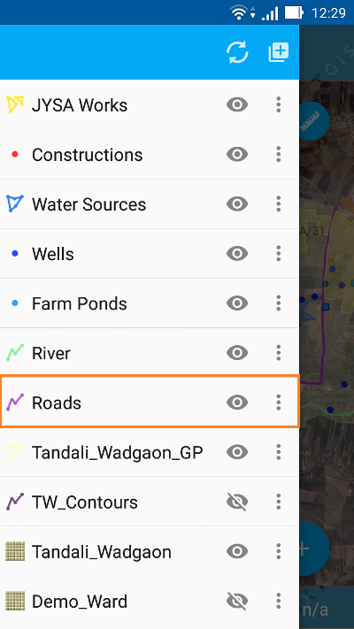
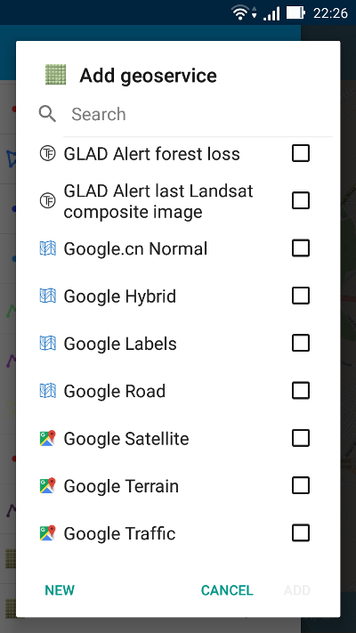

.. sectionauthor:: Дмитрий Барышников <dmitry.baryshnikov@nextgis.ru>

.. _ngmobile_load_geodata:

Добавление слоев
=================

В программе имеется возможность создания новых пустых векторных слоев, а также загрузки векторных и растровых слоев из локального хранилища Android, `каталога QuickMapServices <https://qms.nextgis.com/>`_, облачного сервиса `nextgis.com <https://my.nextgis.com/signup/?next=/webgis/>`_ или серверной Веб ГИС `NextGIS Web <http://nextgis.ru/nextgis-web/>`_.

Поддерживаются следующие форматы данных: 

* :term:`GeoJSON`;
* тайловый кэш XYZ/TMS в ZIP-архиве;
* тайловый кэш в формате *.ngrc;
* настраиваемые формы в формате *.ngfp. 

.. _ngmobile_create_vector:

Создание слоя
--------------

Для того, чтобы создать пустой векторный слой, необходимо выполнить следующую последовательность шагов:

1. На панели инструментов дерева слоев (:numref:`ngmobile_main_activity_pic`, п.1) нажать на кнопку "Добавить геоданные" (:numref:`ngmobile_layer_tree_pic`, п.4), далее выбрать пункт диалога «Создать слой» (см. :numref:`ngmobile_the_menu_button_new_layer_pic`) 

.. figure:: _static/ngmobile_the_menu_button_Add_data.png
   :name: ngmobile_the_menu_button_new_layer_pic
   :align: center
   :height: 10cm
 
   Диалог "Добавить геоданные".

2. В открывшемся окне необходимо заполнить поля стандартной формы создания нового векторного слоя (см. :numref:`ngmobile_input_form_attributes_new_layer_pic`) 

.. figure:: _static/ngmobile_input_form_attributes_new_layer.png
   :name: ngmobile_input_form_attributes_new_layer_pic
   :align: center
   :height: 10cm
   
   Форма создания нового векторного слоя. 

При создании векторного слоя необходимо задать следующие параметры:

1. Имя слоя - название слоя, которое будет отображаться в дереве слоев.
2. Тип геометрии - выбор геометрии объектов слоя (точка, линия, полигон, мультиточка, мультилиния, мультиполигон).
3. Поля - список полей, содержащих атрибуты слоя.

Можно добавить к новому векторному сколько угодно полей. Для этого нужно нажать на кнопку "+" рядом с кнопкой "Поля". При этом откроется  диалог создания нового поля (см. :numref:`ngmobile_dialogue_create_new_field_pic`) 

.. figure:: _static/dialogue_create_new_field_new.png
   :name: ngmobile_dialogue_create_new_field_pic
   :align: center
   :height: 10cm

   Диалог создания нового поля.

Открывшийся диалог содержит следующие для заполнения поля:

1. Имя поля - название поля. 

.. note:: 
   Имя поля может быть введено только на английском языке (буквы и цифры!) и без пробелов. Также имя поля не должно совпадать со служебными словами SQL.

2. Тип поля - выбор типа поля (строка, целочисленное, вещественное, дата и время, дата, время) 

.. _ngmobile_import_vector:

GeoJSON
-------

NextGIS Mobile позволяет создать векторный слой путем загрузки существующего файла GeoJSON. Для этого необходимо выполнить 
следующую последовательность шагов:

1. На панели инструментов дерева слоев (:numref:`ngmobile_main_activity_pic`, п.1) нажать на кнопку "Добавить геоданные" (:numref:`ngmobile_layer_tree_pic`, п.4), далее выбрать пункт диалога "Открыть локальный" (см. :numref:`ngmobile_the_menu_button_new_layer_pic`).

2. В открывшемся окне выбора сохраненных файлов на диске мобильного устройства выбрать необходимый для загрузки файл формата GeoJSON (см. :numref:`ngmobile_saved_files_on_the_drive_unit_pic`) (Файл должен иметь расширение .geojson; он также может находиться внутри архива с расширением .geojson.zip, при этом файл должен быть в корне, а не в подпапках этого архива): 

.. figure:: _static/saved_files_on_the_drive_unit.png
   :name: ngmobile_saved_files_on_the_drive_unit_pic
   :align: center
   :height: 10cm
   
   Окно с сохраненными файлами на диске мобильного устройства. 

3. После выбора файла откроется диалог настройки параметров создаваемого слоя, в котором можно оставить существующее или задать новое имя слоя (см. :numref:`ngmobile_layer_settings_geo_pic`): 

.. figure:: _static/ngmobile_layer_settings_geo.png
   :name: ngmobile_layer_settings_geo_pic
   :align: center
   :height: 10cm

   Диалог настройки параметров создаваемого слоя.
   
4. При нажатии на кнопку "Создать" начнется процесс загрузки данных и создания нового слоя.

.. note::
   В случае загрузки в программу файла формата GeoJSON создаваемый слой в результате загрузки геоданных такого типа будет всегда векторным!

Результат создания слоя можно проверить в дереве слоев. В случае удачного создания слоя новый слой будет располагаться первым в дереве слоев (см. :numref:`ngmobile_tree_layers_geo_pic`): 

   Дерево слоев.

**Требования к формату GeoJSON**

* :term:`Система координат` геометрий может быть только WGS 84 (EPSG:4326) или Web Mercator 
  (EPSG:3857). Если на вход будет подан файл в другой системе координат, то будет выведено 
  сообщение о том, что такая система координат не поддерживается. 
* Все геометрии в файле должны быть одного типа. Если во входном файле содержатся геометрии 
  разного типа, то будут загружены записи, у которых тип геометрии совпадает с первой 
  записью (геометрия первой записи файла определяет тип геометрии слоя).
* Текстовые строки должны быть кодированы в формате UTF-8. 

.. note::
   Подробнее о формате GeoJSON можно прочитать в его `спецификации <http://geojson.org/>`_. 
   GeoJSON основывается на формате JSON (см. `RFC 4627 <https://www.ietf.org/rfc/rfc4627.txt>`_).

При редактирования векторного слоя, созданного на базе файла GeoJSON, доступна только стандартная форма 
редактирования атрибутов. В отличие от пользовательской формы (см. :ref:`ngmobile_import_ngfp`) стандартная форма 
может содержать только три типа полей:

1. Текстовое поле для ввода текста и цифр.
2. Диалог ввода даты и времени.
3. Кнопка добавления фотографиий.

Пример стандартной формы редактирования атрибутов слоя представлен на :numref:`ngmobile_standard_form_layer_attributes_pic`: 

.. figure:: _static/standard_form_layer_attributes.png
   :name: ngmobile_standard_form_layer_attributes_pic
   :align: center
   :height: 10cm  
    
   Стандартная форма редактирования атрибутов слоя.
   
   Цифрами обозначены: 1 - кнопка "Назад", 2 - кнопка "Применить изменения", 3 - кнопка "Добавить фото".

После создания слоя над ним можно выполнять стандартные операции редактирования, такие как Добавить, Изменить или Удалить. Подробнее редактирование векторного слоя, созданного на базе файла GeoJSON, описано в разделе :ref:`ngmobile_editing`.

.. _ngmobile_import_ngfp:

Пользовательские формы
-------------------

NextGIS Mobile позволяет создавать векторный слой путем импорта существущего файла формата NGFP. 

Файл формата NGFP создается в настольном приложении `NextGIS FormBuilder <http://nextgis.ru/nextgis-formbuilder/>`_ и представляет собой файл формата :term:`GeoJSON` с дополнительной информацией (JSON), упакованный в zip-архив c расширением *.ngfp.

Особенностью редактирования слоя на базе файла формата NGFP является заполнение не стандартной, а пользовательской формы редактирования атрибутов. Пользовательская форма специальным образом оптимизирована для ввода данных и может содержать особые элементы 
для более удобного ввода данных, такие как: выбор из выпадающего списка, связанные списки, радио-кнопки и т.д. (см. :numref:`ngmobile_non-standard_form_pic`). 

.. figure:: _static/non-standard_form.png
   :name: ngmobile_non-standard_form_pic
   :align: center
   :height: 10cm  
    
   Пользовательская форма редактирования атрибутов слоя.
   
   Цифрами указаны: 1 - кнопка "Назад"; 2 - кнопка "Применить изменения"; 3 - настройки; 4 - текстовое поле для ввода букв и цифр; 5 - выпадающий список; 6 - время и дата; 7 - радио-кнопки.

Для того, чтобы загрузить в программу файл формата NGFP, необходимо выполнить следующую последовательность шагов:

1. На панели инструментов дерева слоев (:numref:`ngmobile_main_activity_pic`, п.1) нажать на кнопку "Добавить геоданные" (:numref:`ngmobile_layer_tree_pic`, п.4), далее выбрать пункт диалога "Открыть локальный" (см. :numref:`ngmobile_the_menu_button_new_layer_pic`). 

2. В открывшемся окне выбора сохраненных файлов на диске мобильного устройства выбрать необходимый для загрузки файл формата NGFP (см. :numref:`ngmobile_saved_files_on_the_drive_pic_3`).
   
.. figure:: _static/saved_files_on_the_drive_unit.png
   :name: ngmobile_saved_files_on_the_drive_pic_3
   :align: center
   :height: 10cm
   
   Выбор файла для загрузки.

3. После выбора файла откроется диалог настройки параметров создаваемого слоя, в котором можно задать имя слоя (см. :numref:`ngmobile_settind_layer_form_pic`): 

.. figure:: _static/settind_layer_form.png
   :name: ngmobile_settind_layer_form_pic
   :align: center
   :height: 10cm

   Диалог настройки параметров создаваемого слоя.
   
4. При нажатии на кнопку "Создать" начнется процесс загрузки данных и создания нового слоя (см. :numref:`ngmobile_tree_layers_geo_pic`). Результат создания слоя можно проверить в дереве слоев. В случае удачного создания слоя новый слой будет располагаться первым в дереве слоев.

.. figure:: _static/tree_layers_ngfp_rus.png
   :name: ngmobile_tree_layers_ngfp_pic
   :align: center
   :height: 10cm  

   Дерево слоев.

После создания слоя над ним можно выполнять стандартные операции редактирования, такие как Добавить, Изменить или Удалить. Подробнее редактирование векторного слоя, созданного на базе файла NGFP, описано в разделе :ref:`ngmobile_editing`.

.. _ngmobile_import_cache:

Тайловый кэш (XYZ/TMS)
----------------------

NextGIS Mobile позволяет создавать растровый слой путем импорта тайлового кэша.

Тайловый кэш представляет собой zip-архив c папками и тайлами, нарезанными и сохраненными в соответствии с определенной схемой (например, folder_z/folder_x/y.png). Папки уровня Z могут находиться в корне архива или в папке в корне архива (название папки 
может быть любым, но папка должна быть одна). Более глубокая вложенность папок уровня Z не допускается. 

Тайловый кэш может быть получен при помощи модуля расширения `NextGIS QGIS - QTiles <http://plugins.qgis.org/plugins/qtiles/>`_. 
Полученный в результате работы модуля архив можно загрузить на устройство в любую доступную папку.

Для того, чтобы загрузить в программу zip-архив с тайловым кэшем, необходимо выполнить следующую последовательность шагов:

1. На панели инструментов дерева слоев (:numref:`ngmobile_main_activity_pic`, п.1) нажать на кнопку "Добавить геоданные" (:numref:`ngmobile_layer_tree_pic`, п.4), далее выбрать пункт диалога "Открыть локальный" (см. :numref:`ngmobile_the_menu_button_new_layer_pic`).

2. В открывшемся окне выбора сохраненных файлов на диске мобильного устройства выбрать необходимый для загрузки zip-архив: 

.. figure:: _static/ngmobile_files_on_the_drive_unit_tms.png
   :name: ngmobile_files_on_the_drive_unit_tms_pic
   :align: center
   :height: 10cm
   
   Окно с файлами на диске мобильного устройства. 

3. После выбора zip-архива откроется диалог настройки параметров создаваемого слоя (см. :numref:`ngmobile_layer_setting_tms_pic`):

.. figure:: _static/layer_setting_tms.png
   :name: ngmobile_layer_setting_tms_pic
   :align: center
   :height: 10cm

   Диалог настройки параметров тайлового слоя.

Здесь можно выбрать тип тайлового слоя (схему нарезки тайлов) - XYZ (OSM) или TMS (OSGeo) (см. :numref:`ngmobile_layer_setting_tms_pic_2`), и размер кэша (см. :numref:`ngmobile_layer_setting_tms_pic_3`):

.. figure:: _static/layer_setting_tms_2.png
   :name: ngmobile_layer_setting_tms_pic_2
   :align: center
   :height: 10cm

   Настройка типа тайлового слоя.

.. figure:: _static/layer_setting_tms_3.png
   :name: ngmobile_layer_setting_tms_pic_3
   :align: center
   :height: 10cm

   Настройка размера кэша тайлов TMS.

4. При нажатии на кнопку "Создать" начнется процесс обработки данных и создания нового растрового слоя (см. :numref:`ngmobile_processing_and_creation_layer_tms_pic`).

.. figure:: _static/processing_and_creation_layer_tms.png
   :name: ngmobile_processing_and_creation_layer_tms_pic
   :align: center
   :height: 10cm  

   Окно обработки данных и создания слоя.

Результат создания слоя можно проверить в дереве слоев. В случае удачного создания слоя новый слой будет располагаться первым в дереве слоев:

.. figure:: _static/ngmobile_tree_layers_tms.png
   :name: ngmobile_tree_layers_tms_pic
   :align: center
   :height: 10cm  

   Дерево слоев.
   
.. _ngmobile_import_ngrc:

Тайловый кэш (NGRC)
-------------------

NextGIS Mobile также позволяет создавать растровый слой путем импорта тайлового кэша в формате NGRC.

Для того, чтобы загрузить в программу тайловый кэш в формате NGRC, необходимо выполнить следующую последовательность шагов:

1. На панели инструментов дерева слоев (:numref:`ngmobile_main_activity_pic`, п.1) нажать на кнопку "Добавить геоданные" (:numref:`ngmobile_layer_tree_pic`, п.4), далее выбрать пункт диалога "Открыть локальный" (см. :numref:`ngmobile_the_menu_button_new_layer_pic`).

2. В открывшемся окне выбора сохраненных файлов на диске мобильного устройства выбрать необходимый для загрузки файл в формате *.ngrc: 

.. figure:: _static/ngmobile_files_on_the_drive_unit_tms.png
   :name: ngmobile_files_on_the_drive_unit_tms_pic
   :align: center
   :height: 10cm
   
   Окно с файлами на диске мобильного устройства. 

3. При нажатии на кнопку "Создать" начнется процесс обработки и создания нового растрового слоя. Результат создания слоя можно проверить в дереве слоев. В случае удачного создания слоя новый слой будет располагаться первым в дереве слоев:

.. figure:: _static/ngmobile_tree_layers_tms.png
   :name: ngmobile_tree_layers_tms_pic
   :align: center
   :height: 10cm  

   Дерево слоев.

.. _ngmobile_add_geoservice:

Добавление геосервиса
----------------------

NextGIS Mobile позволяет создавать растровые слои из внешних геосервисов.

.. warning::
   Для создания слоев из внешних геосервисов необходимо подключение к сети Интернет.

.. _ngmobile_qms_service:

Создание растрового слоя из тайлового сервиса из каталога QuickMapServices
^^^^^^^^^^^^^^^^^^^^^^^^^^^^^^^^^^^^^^^^^^^^^^^^^^^^^^^^^^^^^^^^^^^^^^^^^^^

Для создания растрового слоя из тайлового сервиса, содержащегося в `каталоге QuickMapServices <https://qms.nextgis.com/>`_, необходимо выполнить следующие шаги:

1. На панели инструментов дерева слоев (:numref:`ngmobile_main_activity_pic`, п.1) нажать на кнопку "Добавить геоданные" (:numref:`ngmobile_layer_tree_pic`, п.4), далее выбрать пункт диалога "Добавить геосервис" (см. :numref:`ngmobile_the_menu_button_new_layer_pic`). В результате будет открыт диалог добавления геосервисов (см. :numref:`ngmobile_add_geoservice_pic`): 

 
   Диалог добавления геосервисов.

Выбор геосервиса из списка осуществляется путем проставления метки/галочки напротив названия геосервиса. После выбора необходимого геосервиса следует нажать кнопку "Добавить", в результате на основе выбранного гесервиса будет создан новый растровый слой.

Результат создания нового растрового слоя можно проверить в дереве слоев. В случае удачного создания слоя новый слой будет располагаться первым в дереве слоев.

.. _ngmobile_tile_service:

Создание растрового слоя из частного тайлового сервиса
^^^^^^^^^^^^^^^^^^^^^^^^^^^^^^^^^^^^^^^^^^^^^^^^^^^^^^

Если вы хотите создать растровый слой из тайлового сервиса, не содержащегося в `каталоге QuickMapServices <https://qms.nextgis.com/>`_, необходимо выполнить следующие шаги:

1. На панели инструментов дерева слоев (:numref:`ngmobile_main_activity_pic`, п.1) нажать на кнопку "Добавить геоданные" (:numref:`ngmobile_layer_tree_pic`, п.4), далее выбрать пункт диалога "Добавить геосервис" (см. :numref:`ngmobile_the_menu_button_new_layer_pic`). В результате будет открыт диалог добавления геосервисов (см. :numref:`ngmobile_add_geoservice_pic`)

2. Нажать на кнопку "Новый" в диалоговом окне "Добавить геосервис" (см. :numref:`ngmobile_add_geoservice_pic`). Это приведет к открытию диалога добавления слоя TMS, как показано на :numref:`ngmobile_ngmobile_new_geoservice_pic`:

.. figure:: _static/ngmobile_new_geoservice.png
   :name: ngmobile_ngmobile_new_geoservice_pic
   :align: center
   :height: 10cm

   Диалог добавления сервиса TMS.
   
3. Указать Имя слоя и Адрес (URL) слоя. При формировании адреса слоя необходимо указать место в адресе значений X (номер тайла по горизонтали), Y (номер тайла по вертикали) и Z (уровень зума). Для этого в строке адреса на месте цифры, соответствующей Х, 
необходимо поставить подстановочный код **{x}**, для Y - **{y}**, для Z - **{z}**. 
Дополнительно в строке адреса можно указать поддомены (например, для поддоменов a.tileopenstreetmap.org, 
b.tileopenstreetmap.org, c.tileopenstreetmap.org адрес будет выглядеть так: **{a,b,c}.tile.openstreetmap.org**).

.. note::
   NextGIS Mobile запрашивает тайлы с каждого адреса (поддомена) в два потока. Таким образом для адреса формата **{a,b,c}.tile.openstreetmap.org** приложение будет скачивать тайлы в 6 потоков.

3. Также можно уточнить тип тайлового слоя (XYZ (OSM) или TMS (OSGeo)), размер кэша TMS (без кэша, 1, 2 или 3 экрана) и параметры аутентификации пользователя (имя пользователя и пароль) в случае, если это требуется для доступа к тайлам. 

.. note::
   В настоящее время поддерживается только `Basic access authentication <http://en.wikipedia.org/wiki/Basic_access_authentication>`_.

4. Нажать "Создать" для создания нового растрового слоя на базе этого сервиса TMS. Результат создания нового растрового слоя можно проверить в дереве слоев. В случае удачного создания слоя новый слой будет располагаться первым в дереве слоев.

.. _ngmobile_tile_cache:

Кэширование данных тайлового сервиса 
^^^^^^^^^^^^^^^^^^^^^^^^^^^^^^^^^^^^

С растровыми слоями, созданными из внешних геосервисов, можно работать и **при отсутствии подключения к сети Интернет**. Для этого необходимо сначала загрузить тайлы для интересующей области:

1. Следует убедиться, что растровый слой, который потребуется для работы оффлайн, добавлен в Дерево слоев и включен для отображения на карте. Затем необходимо открыть охват карты, для которого нужно скачать тайлы.

2. На панели инструментов дерева слоев (:numref:`ngmobile_main_activity_pic`, п.1) слелует найти растровый слой и нажать кнопку вызова контекстного меню слоя (:numref:`ngmobile_layer_tree_pic`, п.5).

3. Нажать кнопку "Загрузить тайлы", как показано ниже на :numref:`download_tiles_pic`. 

.. figure:: _static/download_tiles.png
   :name: download_tiles_pic
   :align: center
   :height: 10cm
 
   Кнопка "Загрузить тайлы".

4. Далее откроется окно с настройками загрузки тайлов (см. :numref:`ngmobile_levels_of_zoom_pic`), где нужно задать необходимый диапазон зумов и нажать кнопку "Начать". 

.. figure:: _static/levels_of_zoom.png
   :name: ngmobile_levels_of_zoom_pic
   :align: center
   :height: 10cm
 
   Окно выбора уровня зума для загрузки тайлов.

.. note::
   Чем меньше уровень выбранного зума для загрузки тайлов, тем меньшее количество тайлов попадают в интересующую нас область и тем быстрее происходит загрузка всего изображения. На панели статуса устройства Android можно отслеживать прогресс загрузки. Уведомления для приложения NextGIS Mobile должны быть активированы в системных настройках.

.. warning::
   Если список загружаемых тайлов для заданного диапазона зумов превышает 6000, то будут загружены только первые 6000 тайлов. Остальные тайлы не будут загружаться из-за ограничений на переполнение памяти.

.. _ngmobile_webgis:

Создание Вeб ГИС в браузере
----------------------------

Для начала работы Вам необходимо зайти на сайт NextGIS и зарегистрировать учётную запись, 
которая позволит начать работу с Веб ГИС. Для создания учетной записи необходимо нажать на 
кнопку Создать Веб ГИС на странице сайта nextgis.ru (см. :numref:`ngmobile_create_an_account_WebGIS_pic`): 

.. figure:: _static/ngmobile_create_an_account_WebGIS.png
   :name: ngmobile_create_an_account_WebGIS_pic
   :align: center
   :width: 16cm    

   Сайт NextGIS с кнопкой для создания учетной записи.   

Откроется форма для заполнения аккаунта, в которой необходимо заполнить полe e-mail и 
назначить пароль для вашего аккаунта, а затем нажать на кнопку "Создать аккаунт" (см. :numref:`ngmobile_account_form_WebGIS_pic`): 

.. figure:: _static/ngmobile_account_form_WebGIS_rus.png
   :name: ngmobile_account_form_WebGIS_pic
   :align: center
   :width: 16cm    

   Форма для заполнения аккаунта.

.. note::

   Собственную учетную запись, которая позволит работать с Веб ГИС, можно также создать 
   через социальные сети, в которых вы зарегистрированы. 

От NextGIS.com на указанную в форме почту придет письмо со ссылкой. Кликнув по ссылке, 
вы подтвердите электронную почту для обратной связи.
После активации ссылки и подтверждения адреса электронной почты на сайте NextGIS.com 
откроется страница с профилем, который необходимо заполнить, выбрать язык общения и 
нажать кнопку "Сохранить" (см. :numref:`ngmobile_profile_1_WebGIS_pic`): 

.. figure:: _static/ngmobile_profile_1_WebGIS.png
   :name: ngmobile_profile_1_WebGIS_pic
   :align: center
   :width: 16cm    
  
   Страница профиля на сайте nextgis.com. 

Далее следует заполнить форму создания Веб ГИС, в которой назначается и заполняется заголовок 
домена вашей Веб ГИС, выбирается язык интерфейса. Также следует выбрать тарифный план с перечнем 
возможных услуг (см. :numref:`ngmobile_creation_form_WebGIS_pic`): 

.. figure:: _static/ngmobile_creation_form_WebGIS.png
   :name: ngmobile_creation_form_WebGIS_pic
   :align: center
   :width: 16cm    

   Заполнение формы Веб ГИС.

Закончить создание своей Веб ГИС следует нажатием на кнопку "Создать Веб ГИС" 
(см. :numref:`ngmobile_creation_form_1_WebGIS_pic`): 

.. figure:: _static/ngmobile_creation_form_1_WebGIS.png
   :name: ngmobile_creation_form_1_WebGIS_pic
   :align: center
   :width: 16cm     

   Создание Веб ГИС.

.. note::

   После ввода заголовка домена вашей Веб ГИС и выбора языка для интерфейса изменить 
   их будет невозможно!

Далее откроется окно с информацией о том, что ваша Веб ГИС находится в процессе создания. 
И когда этот процесс завершится, вам на электронную почту придет письмо с логином и паролем 
для последующих входов в вашу Веб ГИС через сайт nextgis.com
(см. :numref:`ngmobile_e-mail_WebGIS_pic`): 

.. figure:: _static/ngmobile_e-mail_WebGIS.png
   :name: ngmobile_e-mail_WebGIS_pic
   :align: center
   :width: 16cm    

   Окно с информацией о создании Веб ГИС.

После создания вашей Веб ГИС в вашем профиле пользователя будет иметься ссылка с 
названием вашей Веб ГИС. Ссылка находится в верхнем правом углу рядом с вашей электронной почтой (см. :numref:`ngmobile_profile_with_a_link_WebGIS_pic`): 

.. figure:: _static/ngmobile_profile_with_a_link_WebGIS.png
   :name: ngmobile_profile_with_a_link_WebGIS_pic
   :align: center
   :width: 16cm     

   Профиль со ссылкой на вашу Веб ГИС.

Следует пройти по этой ссылке. Откроется окно с Основной группой ресурсов 
(см. :numref:`ngmobile_main_resources_WebGIS_pic`): 

.. figure:: _static/ngmobile_main_resources_WebGIS.png
   :name: ngmobile_main_resources_WebGIS_pic
   :align: center
   :width: 16cm    

   Окно "Основная группа ресурсов".
   
   Красным прямоугольником выделена панель, в которой находятся кнопки "Ресурсы", "Панель управления" и "Справка".

.. note::

   Для осуществления загрузки файлов в вашу Веб ГИС следует выполнить вход с правами 
   на создание данных. Кнопка Войти находится в правом верхнем углу!

Ознакомиться с основами работы с Веб ГИС следует воспользоваться кнопкой Справка, которую можно найти, открыв крайнюю панель в верхнем правом углу (см. :numref:`ngmobile_help_button_WebGIS_pic`): 

.. figure:: _static/ngmobile_help_button_WebGIS.png
   :name: ngmobile_help_button_WebGIS_pic
   :align: center
   :width: 16cm    

   Кнопка Справка.

После нажатия на кнопку Справка откроется окно, в котором следует выбрать пункт 
Начало работы с Веб ГИС (см. :numref:`ngmobile_beginning_of_work_WebGIS_pic`): 

.. figure:: _static/ngmobile_beginning_of_work_WebGIS.png
   :name: ngmobile_beginning_of_work_WebGIS_pic
   :align: center
   :width: 16cm     

   Окно "Начало работы в Веб ГИС".

Откроется страница с документацией "Начало работы с Веб ГИС". Выбираем раздел 
"Как загружать данные" (см. :numref:`ngmobile_documentation_WebGIS_pic`): 

.. figure:: _static/ngmobile_documentation_WebGIS.png
   :name: ngmobile_documentation_WebGIS_pic
   :align: center
   :width: 16cm    

   Окно документации "Начало работы с Веб ГИС". 

.. _ngmobile_webgis_download:

Загрузка геоданных и создание веб-карт на основе геоданных в своей Веб ГИС
----------------------------------------------------------------------------------------

.. only:: html

   Для осуществления загрузки геоданых необходимо выполнить вход в Веб ГИС с 
   правами на создание данных, не гостевой вход. Подробнее о загрузке геоданных в 
   :ref:`Веб ГИС <ngcom_description>` можно ознакомиться в следующих разделах 
   документации :ref:`Растровый слой <ngcom_raster_layer>` и 
   :ref:`Векторный слой <ngcom_vector_layer>`.

.. only:: latex

   Для осуществления загрузки геоданых необходимо выполнить вход в Веб ГИС с 
   правами на создание данных, не гостевой вход. Подробнее о загрузке геоданных в 
   :ref:`Веб ГИС <ngcom_description>` можно ознакомиться в следующих разделах 
   документации `Растровый слой <http://docs.nextgis.ru/docs_ngcom/source/data_upload.html#ngcom-raster-layer>`_ и 
   `Векторный слой <http://docs.nextgis.ru/docs_ngcom/source/data_upload.html#ngcom-vector-layer>`_.

Добавление геоданных из Веб ГИС
^^^^^^^^^^^^^^^^^^^^^^^^^^^^^^^

Для того, чтобы загрузить в программу файлы/геоданные из Веб ГИС, необходимо выполнить 
следующую последовательность шагов:

1. На панели инструментов дерева слоев (:numref:`ngmobile_main_activity_pic`, п.1) нажать на кнопку "Добавить геоданные" (:numref:`ngmobile_layer_tree_pic`, п.4). В открывшемся диалоге выбрать пункт меню "Добавить из Веб ГИС" (см. :numref:`ngmobile_addition_of_NextGIS_pic`): 

.. figure:: _static/ngmobile_addition_of_NextGIS.png
   :name: ngmobile_addition_of_NextGIS_pic
   :align: center
   :height: 10cm    

   Добавление из Веб ГИС.
 
2. В открывшемся окне следует выбрать пункт Добавить Веб ГИС и нажать кнопку Добавить
(см. :numref:`ngmobile_add_an_account_NextGIS_pic`): 

.. figure:: _static/ngmobile_add_an_account_NextGIS.png
   :name: ngmobile_add_an_account_NextGIS_pic
   :align: center
   :height: 10cm    

   Добавление учетной записи.

3. В открывшемся окне необходимо заполнить название домена вашей Веб ГИС и пароль, назначенный для входов в вашу Веб ГИС через сайт NextGIS.com. По окончании заполнения формы необходимо нажать кнопку Войти (см. :numref:`ngmobile_conversation_connection_WebGIS_pic`): 

.. figure:: _static/ngmobile_conversation_connection_WebGIS.png
   :name: ngmobile_conversation_connection_WebGIS_pic
   :align: center
   :height: 10cm  

   Диалог подключения Веб ГИС.

4. По окончании подключения Веб ГИС, откроется в окно, в котором следует выбрать 
учетную запись, которая соответствует заголовку домена вашей Веб ГИС, и нажать кнопку 
Добавить (см. :numref:`ngmobile_account_election_Web_GIS_pic`): 

.. figure:: _static/ngmobile_account_election_Web_GIS.png
   :name: ngmobile_account_election_Web_GIS_pic
   :align: center
   :height: 10cm    

   Выбор учетной записи Веб ГИС. 

5. Далее откроется окно диалога выбора слоя для импорта геоданных из вашей Веб ГИС в 
NextGIS Mobile (см. :numref:`ngmobile_layer_selection_dialog_for_importing_pic`): 

.. figure:: _static/ngmobile_layer_selection_dialog_for_importing.png
   :name: ngmobile_layer_selection_dialog_for_importing_pic
   :align: center
   :height: 10cm    

   Окно диалога выбора слоя для импорта геоданных из Веб ГИС. 

Если у слоя в Веб ГИС создан стиль, то появляется возможность выбрать для импорта 
помимо векторных данных еще и растр. Если данные импортируются на мобильное 
устройство в виде векторный данных, то такие данные скачиваются на мобильное устройство 
и могут быть доступны для использования при отсутствии Интернета. 
Если данные импортируются на мобильное устройство в виде растра при наличии в Веб ГИС 
созданного стиля у слоя на сервере, то такие данные могут быть доступны только при 
наличии сервера для отрисовывания картинки.   
Таким образом векторный слой можно добавить/импортировать в виде вектора либо в виде 
растра. Для этого следует поставить галочку в пустом окошке под названием необходимого 
слоя в правой части экрана (см. :numref:`ngmobile_layer_type_selection_pic`): 

.. figure:: _static/ngmobile_layer_type_selection.png
   :name: ngmobile_layer_type_selection_pic
   :align: center
   :height: 10cm    
  
   Выбор типа слоя.

На верхней панели инструментов в правом углу имеется иконка в виде папки с плюсом.
При нажатии на эту иконку откроется диалог для создания новой группы данных в вашей 
Веб ГИС. В поле диалога следует задать имя для новой группы и нажать на кнопку ОК.
В случае удачного создания и сохранения новой папки, название новой папки появится в 
окне содержимого вашей Веб ГИС (см. :numref:`ngmobile_add_a_new_group_pic`): 

.. figure:: _static/ngmobile_add_a_new_group.png
   :name: ngmobile_add_a_new_group_pic
   :align: center
   :height: 10cm    
   
   Создание новой группы.  

6. После выбора слоя для импорта из Веб ГИС в NextGIS Mobile следует нажать на 
кнопку Добавить внизу экрана. После этого начнется процесс импорта из Веб ГИС в 
NextGIS Mobile. Наличие или отсутствие слоя можно проверить в дереве слоев. В случае удачной процедуры 
обработки и импортирования слоя, новый слой располагается первым в дереве слоев.
