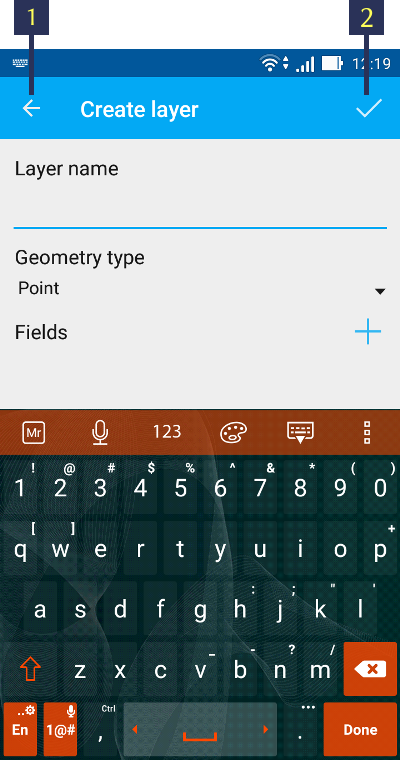

.. sectionauthor:: Дмитрий Барышников <dmitry.baryshnikov@nextgis.ru>

.. _ngmobile_load_geodata:

Load layer
============

NextGIS Mobile has the ability to load data from local storage, cloud storage and 
mobile devices storage and also to create new empty vector layer. There are following 
types of storage local data: GeoJSON, cached tiles, custom forms.

New layer
---------

.. versionadded:: 2.3

The next steps to create an empty vector layer are:

1. Open options menu and select "New Layer", then select "Create Layer" (see :numref:`ngmobile_options_menu_new_layer_pic`)

.. figure:: _static/options_menu_new_layer.png
   :name: ngmobile_options_menu_new_layer_pic
   :align: center
   :height: 10cm
 
   Options menu.

2. In the window of attributes you must fill the fields of standard form for new vector layer (see :numref:`ngmobile_input_form_attributes_new_layer_pic`) 

   
   Entry form of attributes for new vector layer.

The standard attributes form of new vector layer has the following field to fill:

1. Name of layer - enter the name of layer which will be displayed in layers tree.
2. Geometry type - choose the geometry (point, linestring, polygon, multypoint, multilinestring or multipolygon).
3. Fields - list of fields which can be added, edited or deleted.

New dialog will be opened for each created field in the menu of standard attributes form (see :numref:`ngmobile_dialogue_create_new_field_pic`) 

.. figure:: _static/dialogue_create_new_field.png
   :name: ngmobile_dialogue_create_new_field_pic
   :align: center
   :height: 10cm

   Dialog of the new field creation.

New dialog consists of following fields for fill:

1. Field name – the name of the field.

.. note:: 
	The field name can only be entered in Latin characters (letters and numbers!) without spaces. It should also be different from the official words of SQL.

2. Field type - select field type (string, integer, real, date&time, date, time)

GeoJSON
-------

To open JSON format in the app perform following steps:

1. Open options menu, select "New layer" and choose option "Open local" (see :numref:`ngmobile_add_ngw_layer_geo_pic`)

.. figure:: _static/add_layer1.png
   :name: ngmobile_add_ngw_layer_geo_pic
   :align: center
   :height: 10cm
    
    Adding local layer.

2. Select the GeoJSON format file stored on your mobile device drive that you want to open (see :numref:`ngmobile_saved_files_on_the_drive_unit_pic`): 

.. figure:: _static/saved_files_on_the_drive_unit.png
   :name: ngmobile_saved_files_on_the_drive_unit_pic
   :align: center
   :height: 10cm
   
   Android file listing.

3. After selecting the file a dialog with creating layer settings will open. There you can specify a layer name. (see :numref:`ngmobile_layer_settings_geo_pic`): 

.. figure:: _static/layer_settings_geo.png
   :name: ngmobile_layer_settings_geo_pic
   :align: center
   :height: 10cm

   Settings of created layer.

4. When you press on "Create", starts the process of creation and processing new layer (see :numref:`ngmobile_processing_and_creation_layer_pic`): 

.. figure:: _static/processing_and_creation_layer.png
   :name: ngmobile_processing_and_creation_layer_pic
   :align: center
   :height: 10cm  

   Creation and processing of layer.

.. note::  
	In the case of loading GeoJSON format file in the app new geodata layer type will be a vector always!

You can check a presence or absence of the layer in the layers tree. In case of successful process of creation and processing new layer it will be placed first in the layers tree (see :numref:`ngmobile_tree_layers_geo_pic`):

.. figure:: _static/tree_layers_geo.png
   :name: ngmobile_tree_layers_geo_pic
   :align: center
   :height: 10cm  

   Layers tree.

*GeoJSON: format requirements*

* :term:`Coordinate system` of geometry can be WGS 84 (EPSG:4326) or Web Mercator (EPSG:3857) only. If input file will have different coordinate system you will see the massage about unsupporting coordinate system.
* Geometry in the file must be only the same type. If input file contained a different types of geometry, in output you have a file with geometry which coincides with the first record only, because geometry of first entry determines the type of layer geometry.
* Text strings must be encoded in UTF-8 format.

.. note::
	You can read more about the GeoJSON format can in its `specification <http://geojson.org/>`_.
	GeoJSON based on the format JSON (see `RFC 4627 <https://www.ietf.org/rfc/rfc4627.txt>`_).

A feature of vector layer editing while loading GeoJSON format is a procedure of filling the standard form of attributes. It contains following fields:

1. Text field for enter a text or digits.
2. Dialog of enter and time.
3. Add pictures and recording button.

An example of standard form editing of attributes layer submitted on :numref:`ngmobile_standard_form_layer_attributes_pic`: 

.. figure:: _static/standard_form_layer_attributes.png
   :name: ngmobile_standard_form_layer_attributes_pic
   :align: center
   :height: 10cm  
    
    Standard form editing of layer attributes.

For more information about editing a GeoJSON file, see section :ref:`ngmobile_editing`.

Tile cache
----------

Tile cache is a zip file format with folders and tiles in accordance with "cutting" (for example, folder_z/folder_x/y.png). Folders of level Z can be located in the root or in the one of the root folder (name of the folder can be any but the folder has to be one). Deeper nesting is not allowed.

To open zip archive with tiles perform following steps:

1. Open options  menu and select "New layer", than choose "Open local"  (see :numref:`ngmobile_add_ngw_layer_geo_pic`) 

2. In the opened window select the zip format file stored on your mobile device drive that you want to open (see :numref:`ngmobile_files_on_the_drive_unit_tms_pic`): 

.. figure:: _static/files_on_the_drive_unit_tms.png
   :name: ngmobile_files_on_the_drive_unit_tms_pic
   :align: center
   :height: 10cm
   
   Android file listing.

3. After selecting zip file the settings dialog of new layer will be opened where you can choose a type of tile layer (tile coding system) - XYZ (OSM) or TMS (OSGeo) (see :numref:`ngmobile_layer_setting_tms_pic`):

.. figure:: _static/layer_setting_tms.png
   :name: ngmobile_layer_setting_tms_pic
   :align: center
   :height: 10cm

   Tile layer settings

4. If you press button "Create" new layer starts to create (see :numref:`ngmobile_processing_and_creation_layer_tms_pic`): 

.. figure:: _static/processing_and_creation_layer_tms.png
   :name: ngmobile_processing_and_creation_layer_tms_pic
   :align: center
   :height: 10cm  

Processing and creation of layer.

You can check the presence or absence of a tile layer in layers tree (see :numref:`ngmobile_tree_layers_tms_pic`):  

.. figure:: _static/tree_layers_tms.png
   :name: ngmobile_tree_layers_tms_pic
   :align: center
   :height: 10cm  

   Layers tree menu.

Custom forms
------------

.. versionadded:: 2.2

ngfp file format obtained in a result of the program NextGIS FormBuilder work and it is a :term:`GeoJSON` file with additional information (JSON) which is packaged in zip archive but with ngfp extension.

Perform following steps to load ngfp file into NextGIS Mobile:

1. Select "New layer" in options menu and choose "Open local" (see :numref:`ngmobile_add_ngw_layer_geo_pic`) 

2. In the opened window select the ngfp format file stored on your mobile device drive that you want to open (see :numref:`ngmobile_files_on_the_drive_unit_tms_pic`)

3. After selecting ngfp file the settings dialog of new layer will open. There you can type a name of the layer (see :numref:`ngmobile_settind_layer_form_pic`): 

.. figure:: _static/settind_layer_form.png
   :name: ngmobile_settind_layer_form_pic
   :align: center
   :height: 10cm

   Settings of new layer.

4. If you press button "Create" new layer starts to create (see :numref:`ngmobile_loading_layer_form_pic`): 

.. figure:: _static/loading_layer_form.png
   :name: ngmobile_loading_layer_form_pic
   :align: center
   :height: 10cm  

   New layer’s creation.

A feature of editing layers based on ngfp file format is a filling of user form edit of attributes. This user form contains different fields which available for filling or selection from dropdown list.

An example of a user form layer attributes editor submitted on :numref:`ngmobile_non-standard_form_pic`: 

.. figure:: _static/non-standard_form.png
   :name: ngmobile_non-standard_form_pic
   :align: center
   :height: 10cm  
    
    User form of layer attributes editor.

More information about editing ngfp file format you can find in section :ref:`ngmobile_editing`.

Adding tile service
-------------------

If you select "Add web" from new layer menu (see :numref:`ngmobile_main_activity_pic` Рї. 3) the dialog as shown on :numref:`ngmobile_add_tms_pic` opens.

.. figure:: _static/ngmobile_addtms.png
   :name: ngmobile_add_tms_pic
   :align: center
   :height: 11cm
   
   Dialog of adding tile geodata source.

   The numbers indicate: 1 - layer name; 2 - layer URL; 3 - tile layer type; 4 - login; 5 - password; 6 - create new layer button; 7- cancel.

During forming of address of tile server you must specify location in the address for X value (number of tile by horizontal), Y (nomber of tile by vertical) and Z (zoom level). To do this in the address bar in place appropriative X it is necessary to put the wildcard code **{x}**, for Y - **{y}**, for Z - **{z}**. Additionally you can specify subdomains (eg, for subdomains a.tileopenstreetmap.org, b.tileopenstreetmap.org, c.tileopenstreetmap.org address will look like this: **{a,b,c}.tile.openstreetmap.org**).

.. note::

	Application makes a request, while loading tiles for each address (subdomain) in two streams. In this way, for address {a,b,c}.tile.openstreetmap.org app will download tiles in 6 streams.

All tiles received from Internet/Intranet are cached on memory card. When you request a specific tile, local cache is checked at the beginning. If there is a tile in the local cache and its creation time at least seven days, then it will be displayed on the map. Also the cached tile will be displayed when there is no connection to the Internet/Intranet, or if there was a failure during upload. Obtained from the Internet/Intranet tiles will overlap available tiles in the cache.

In the list of tile layer selection (see :numref:`ngmobile_add_tms_pic`, Рї. 3) are available following choices:

* XYZ (OSM) - standard type of tile service;
* TMS (OSGeo) - in accordance with OSGeo standard.

If the tile access authentication is required, you can specify a username and password.

.. note::

	Available `Basic access authentication <http://en.wikipedia.org/wiki/Basic_access_authentication>`_ only.

Caching of tile service data 
----------------------------

.. versionadded:: 2.2

To create an image are using :term:`tiles <tile>`, received from Internet, which cached on memory card of the device. Cached tile will be available without Internet connection.
To load tiles to current map extent select "Download tiles" (see :numref:`ngmobile_levels_of_zoom_pic`):

.. figure:: _static/levels_of_zoom.png
   :name: ngmobile_levels_of_zoom_pic
   :align: center
   :height: 10cm
 
 	Selecting zoom levels to download tiles.

The lower selected zoom level for loading of tiles, the smaller amount of tiles get into area of interests and faster downloading of whole image will be.

.. note::
	If the list of downloading tiles for a given range of zoom is greater than 1000, only first 1000 of tiles will be downloaded. The rest of tiles will not be downloaded due to limits for memory overflow.

After setting up required zoom range in a scale bar you can start to download of tiles by pressing "Start" button. Download process will be moved to the status bar of your phone. You can stop downloading of tiles by pressing button "Stop" in the menu of status bar (see :numref:`ngmobile_loading_tiles_in_the_status_bar_pic`):

.. figure:: _static/loading_tiles_in_the_status_bar.png
   :name: ngmobile_loading_tiles_in_the_status_bar_pic
   :align: center
   :height: 10cm

   Loading tiles in the status bar.

