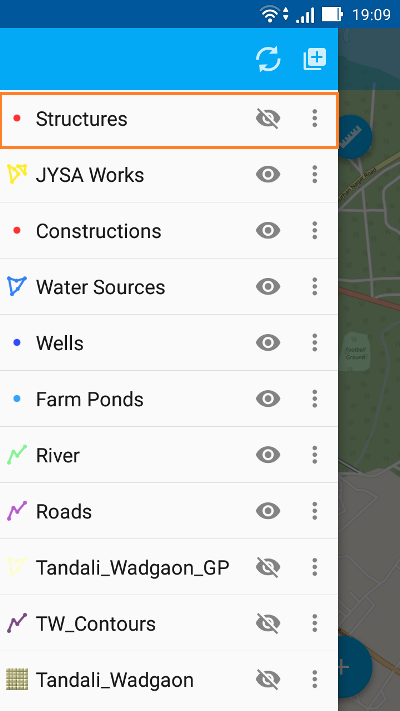

.. sectionauthor:: Dmitry Baryshnikov <dmitry.baryshnikov@nextgis.ru>

.. _ngmobile_load_geodata:

Adding layers
==============

Gramrekha Mobile has the ability to create new empty vector layers or by importing vector as well as raster data from cloud storage or mobile device storage. The supported data types are GeoJSON, cached tiles in a special format and custom forms with vector in a special format.

.. _ngmobile_create_vector:

Creating new vector layer
---------------------------
  
Here are the steps to create an empty vector layer:

1. First tap on "Layers tree menu" (item 1 in :numref:`ngmobile_main_activity_pic_1`). Then tap on "Add geodata" (item 4 in :numref:`ngmobile_layer_tree_pic`). It will pop up a panel as shown below in see :numref:`ngmobile_options_menu_new_layer_pic`. Tap on "Create layer".

.. figure:: _static/options_menu_new_layer.png
   :name: ngmobile_options_menu_new_layer_pic
   :align: center
   :height: 10cm
 
   Add geodata Contextual menu.

2. In the opened dialog enter the parameters of new vector layer (see :numref:`ngmobile_input_form_attributes_new_layer_pic`) 

.. figure:: _static/input_form_attributes_new_layer.png
   :name: ngmobile_input_form_attributes_new_layer_pic
   :align: center
   :height: 10cm
   
   Parameters of the new vector layer.

The standard form for the creation of new vector layer contains the following parameters:

1. Layer name - enter the name of layer which will be displayed in the layers tree.
2. Geometry type - select layer geometry type (point, linestring, polygon).
3. Fields - list of fields which can be added, edited or deleted. These are attribute values of the layer.

You can add many attributes to a layer. For each attribute creation just tap on "+" button next to Fields. This will open new dialog every time for creation of each field (see :numref:`ngmobile_dialogue_create_new_field_pic`) below.

.. figure:: _static/dialogue_create_new_field.png
   :name: ngmobile_dialogue_create_new_field_pic
   :align: center
   :height: 10cm

   Dialog for creation of a new field.

Dialog for creation of a new field contains the following parameters:

1. Field name – enter the name of the field.

.. note:: 
	The field name can only be entered in Latin characters (letters and numbers!) without spaces. It should also differ from SQL reserved keywords.

2. Field type - select field type from one of the (string, integer, real, date&time, date, time)

.. _ngmobile_import_vector:

Creating vector layer from GeoJSON data
-----------------------------------------

We can create a vector layer by importing an existing GeoJSON file. To open data in GeoJSON format:

1. First tap on "Layers tree menu" (item 1 in :numref:`ngmobile_main_activity_pic_1`). Then tap on "Add geodata" (item 4 in :numref:`ngmobile_layer_tree_pic`). It will pop up a panel as shown in :numref:`ngmobile_options_menu_new_layer_pic` above. Tap on "Open local".

2. Select the GeoJSON dataset from your mobile device storage (see :numref:`ngmobile_saved_files_on_the_drive_pic_1`). E.g. tap on the file "Roads.geojson" to import the "Roads" vector data file.

.. figure:: _static/saved_files_on_the_drive_unit.png
   :name: ngmobile_saved_files_on_the_drive_pic_1
   :align: center
   :height: 10cm
   
   Android local storage.
   
3. When the file is selected a layer settings dialog opens. Here you can specify your own layer name or keep the name as it is. (see :numref:`ngmobile_layer_settings_geo_pic`). E.g. "Roads". 

.. figure:: _static/layer_settings_geo.png
   :name: ngmobile_layer_settings_geo_pic
   :align: center
   :height: 10cm

   Layer settings dialogue.

4. Pressing "Create" button starts data processing for creation of a new layer. 

.. note::  
	In case of GeoJSON data importing the new layer will always be a vector layer!

You can check if the new layer was created successfully in the layers tree panel. The newly created layer will show up in the layers tree (see :numref:`ngmobile_tree_layers_geo_pic`). The "Roads" layer is shown in orange rectangle.

.. figure:: _static/tree_layers_geo.png
   :name: ngmobile_tree_layers_geo_pic
   :align: center
   :height: 10cm  

   Layers tree panel.

*GeoJSON: format requirements*

* :term:`Coordinate system` of input geometries can be WGS 84 (EPSG:4326) or Web Mercator (EPSG:3857) only. If input file has different coordinate system you will see a warning message about unsupported coordinate system.
* All geometries in the file must be of the same type. If input file contains varying types of geometry in the output you will have a file with geometries type that coincides with the type of first record, i.e. geometry of first entry will determine the type of layer geometry.
* Text strings must be encoded in UTF-8 format.

.. note::
	You can read more about the GeoJSON format in its `specification <http://geojson.org/>`_.
	GeoJSON is based on the format JSON (see `RFC 4627 <https://www.ietf.org/rfc/rfc4627.txt>`_).

You can only use standard attributes form for editing GeoJSON layer. 

It contains the following fields:

1. Text field for entering characters or digits.
2. Dialog for entering date time.
3. "Add pictures" button.

A sample standard attributes form is shown below in :numref:`ngmobile_standard_input_form_attributes_pic`.

.. figure:: _static/input_form_attributes.png
   :name: ngmobile_standard_input_form_attributes_pic
   :align: center
   :height: 10cm
   
   Standard attributes form.
   
   The numbers indicate: 1 - Back to previous screen; 2 - Apply changes; 3 - Camera.

You can further perform standard edit operations like Add, Modify or Delete operations for this layer. For more information about GeoJSON layer editing see :ref:`ngmobile_edit_geometry`.

.. _ngmobile_import_ngrc:

Creating new raster layer from Tile cache (NGRC)
------------------------------------------------

Tile cache is a zip-archive with folders and tiles stored in accordance with a tiling scheme (for example, folder_z/folder_x/y.png) and compressed in a file having an extension ".ngrc". Folders of level Z can be located in the root or in a folder in the root folder (name of the folder doesn't matter, but there have to be only one folder). Deeper nesting of level Z folders is not allowed.

Follow these steps to open tile cached raster file in ngrc format:

1. First tap on "Layers tree menu" (item 1 in :numref:`ngmobile_main_activity_pic_1`). Then tap on "Add geodata" (item 4 in :numref:`ngmobile_layer_tree_pic`). It will pop up a panel as shown in :numref:`ngmobile_options_menu_new_layer_pic` above. Select "Open local" (see :numref:`ngmobile_options_menu_new_layer_pic`) 

2. Select ngrc file from your mobile device storage (see :numref:`ngmobile_saved_files_on_the_drive_pic_2`). E.g. tap on the file "Tandali_Wadgaon.ngrc" to import the "Tandali Wadgaon" raster satellite image. 

.. figure:: _static/saved_files_on_the_drive_unit.png
   :name: ngmobile_saved_files_on_the_drive_pic_2
   :align: center
   :height: 10cm
   
   Android local storage.

It will start importing tiles to create new raster layer. You can check if the new layer was created successfully in the layers tree panel. The newly created layer will show up in the layers tree as shown in (see :numref:`ngmobile_tree_layers_ngrc_pic`). The "Tandali_Wadgaon" layer is shown in orange rectangle.

.. figure:: _static/tree_layers_ngrc.png
   :name: ngmobile_tree_layers_ngrc_pic
   :align: center
   :height: 10cm  

   Layers tree panel.

.. _ngmobile_add_geoservice:

Adding Geoservice layer
-----------------------

If you don't have any raster layer in tiled cache format file, it is still possible to add raster data hosted on external servers. Here, e.g. you can import tiles from existing services like Google, Bing, Mapbox, ESRI etc. as a new raster layer.

For this, first tap on "Layers tree menue" (item 1 in :numref:`ngmobile_main_activity_pic_1`). Then tap on "Add geodata" (item 4 in :numref:`ngmobile_layer_tree_pic`) and select "Open local" (see :numref:`ngmobile_options_menu_new_layer_pic`). Then tap on "Add geoservice" and you will be provided a screen as shown in :numref:`ngmobile_ngmobile_add_geoservice_pic` below.

.. figure:: _static/ngmobile_add_geoservice.png
   :name: ngmobile_ngmobile_add_geoservice_pic
   :align: center
   :height: 10cm

   Add Geoservice.
   
Select your service provider and tap "Add" to create layer for that service. It will be shown in the Layer tree.
   
If you have your own hosting service or have an valid account from private service provider, you can create that layer by tapping "New" in above :numref:`ngmobile_ngmobile_add_geoservice_pic`. It will open up a configuration panel for that layer as shown in :numref:`ngmobile_ngmobile_new_geoservice_pic` below.

   New Geoservice.
   
Here you can specify the Layer name & Layer URL, The Tile layer type, from XYZ or TMS and the user credentials like Login & Password. This will create a new layer and import tiles from that service into layer.

.. note::
   You need to be **Online** while adding or creating Geoservice. It will consume your data pack & apply standard Internet charges from the Internet service provider.
   
.. note::
   Once you created Geoservice layer, you can work in the field **Offline**, without any Internet or mobile connectivity. But you need to make sure about browsing your area under intervention completely, for all required zoom levels.

.. _ngmobile_import_ngfp:

Creating new vector layer from Custom forms (NGFP)
--------------------------------------------------

NGFP files can be generated using NextGIS FormBuilder. NGFP is a :term:`GeoJSON` file with additional information (JSON) which is packaged in zip archive and has .ngfp extension.

Perform the following steps to add NGFP file to NextGIS Mobile:

1. First tap on "Layers tree menu" (item 1 in :numref:`ngmobile_main_activity_pic_1`). Then tap on "Add geodata" (item 4 in :numref:`ngmobile_layer_tree_pic`). It will pop up a panel as shown in :numref:`ngmobile_options_menu_new_layer_pic` above. Select "Open local" (see :numref:`ngmobile_options_menu_new_layer_pic`) 

2. Select NGFP file from your mobile device storage (see :numref:`ngmobile_saved_files_on_the_drive_pic_3`). E.g. tap on the file "Structures.geojson" to import the "Structures" vector data file. 

.. figure:: _static/saved_files_on_the_drive_unit.png
   :name: ngmobile_saved_files_on_the_drive_pic_3
   :align: center
   :height: 10cm
   
   Android local storage.

3. When the file is selected a layer settings dialog opens. Here you can specify a layer name (see :numref:`ngmobile_settind_layer_form_pic`): 

.. figure:: _static/settind_layer_form.png
   :name: ngmobile_settind_layer_form_pic
   :align: center
   :height: 10cm

   Layer settings dialogue.

4. Pressing "Create" button starts data processing for creation of a new layer.

You can check if the new layer was created successfully in the layers tree panel. The newly created layer will show up in the layers tree (see :numref:`ngmobile_tree_layers_geo_pic`). The "Structures" layer is shown in orange rectangle.

   Layers tree panel.

NGFP layers use custom (not standard) attributes form optimized for attributes viewing and editing. Custom form contains special controls for editing, such as dropdown lists, radio buttons or linked lists.

.. figure:: _static/custom_form.png
   :name: ngmobile_custom_form_pic
   :align: center
   :height: 10cm
   
   Custom attributes form.
   
   The numbers indicate: 1 - Back to previous screen; 2 - Apply changes; 3 - Settings; 4 - Text or Integer; 5 - Dropdown list; 6 - Date & Datetime; 7 - Radio buttons.

You can further perform standard edit operations like Add, Modify or Delete operations for this layer. For more information about NGFP layer editing see :ref:`ngmobile_edit_geometry`.
