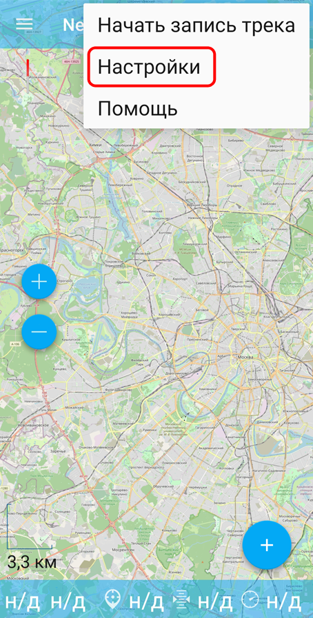
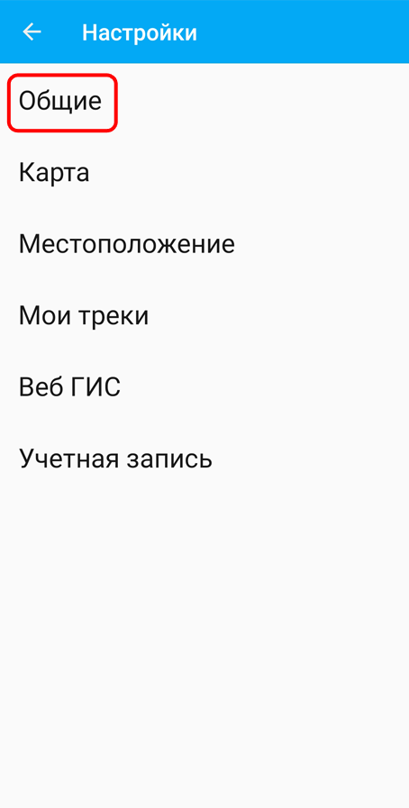
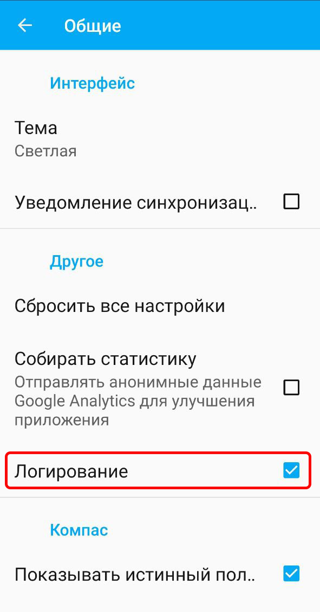
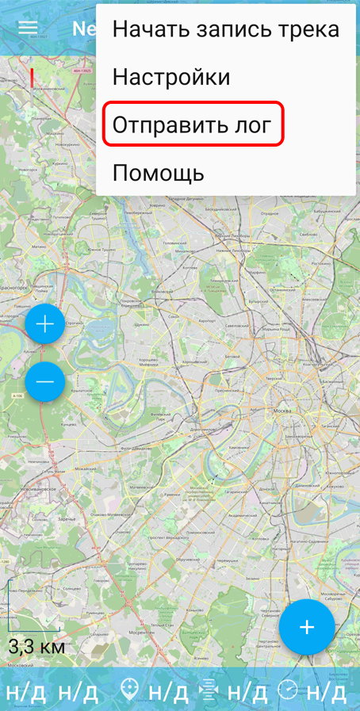
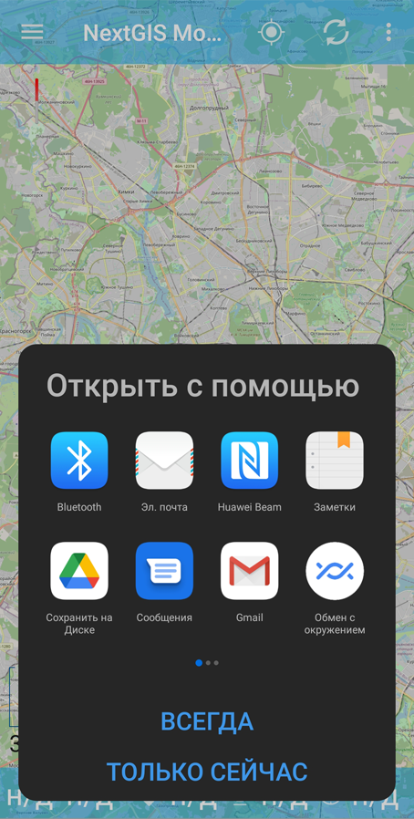

.. _ngmobile_logs:

Логирование
===========

NextGIS Mobile позволяет вести лог, в котором будет записываться техническая информация о работе приложения. Это помогает прояснить, что происходит при возникновении проблем в работе. 

.. _ngmobile_logs_steps:

Как получить информативный лог
--------------------------------

1. `Включите логирование <https://docs.nextgis.ru/docs_ngmobile/source/log.html#ngmobile-logs-enable>`_.
2. Повторите свои действия, чтобы воспроизвести проблему.
3. После того, как ошибка воспроизведена, `отправьте логи <https://docs.nextgis.ru/docs_ngmobile/source/log.html#ngmobile-logs-share>`_ в техподдержку.
4. Выключите логирование.

.. _ngmobile_logs_enable:

Включить логирование
-----------------------

Нажмите три точки в правом верхнем углу и в выпавшем меню выберите «Настройки».

   
   Контекстное меню приложения

Далее перейдите в "Общие настройки"

   
   Окно настроек

В общих настройках поставьте галку в пункте «Логирование».

   
   Запись лога включена

.. _ngmobile_logs_share:

Отправить лог
---------------

Логом также можно поделиться. Для этого вызовите из верхней панели контекстное меню и нажмите «Отправить лог».

   
   Выбор действия "Отправить лог" в контекстном меню

Далее выберите приложение, с помощью которого вы хотите отправить лог или сохранить его в облаке или на своем устройстве.

   
   Выбор приложения для сохранения или пересылки лога
