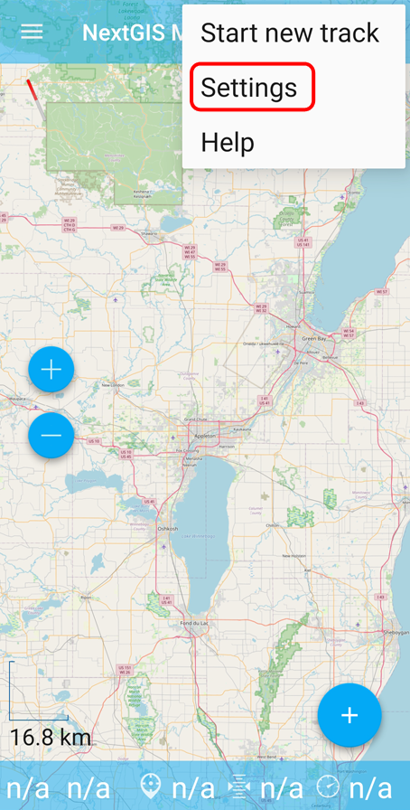
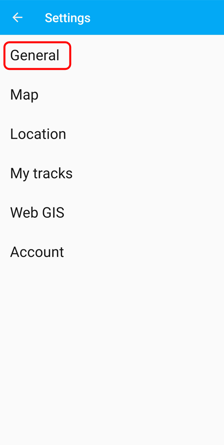
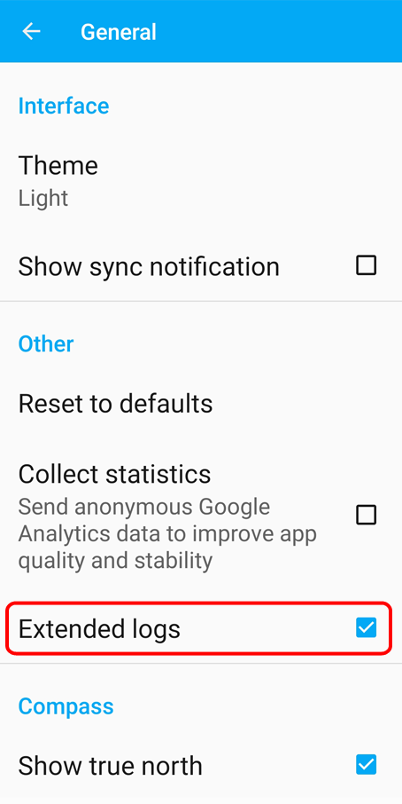
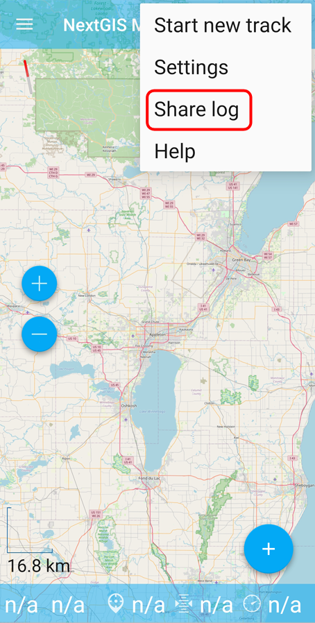
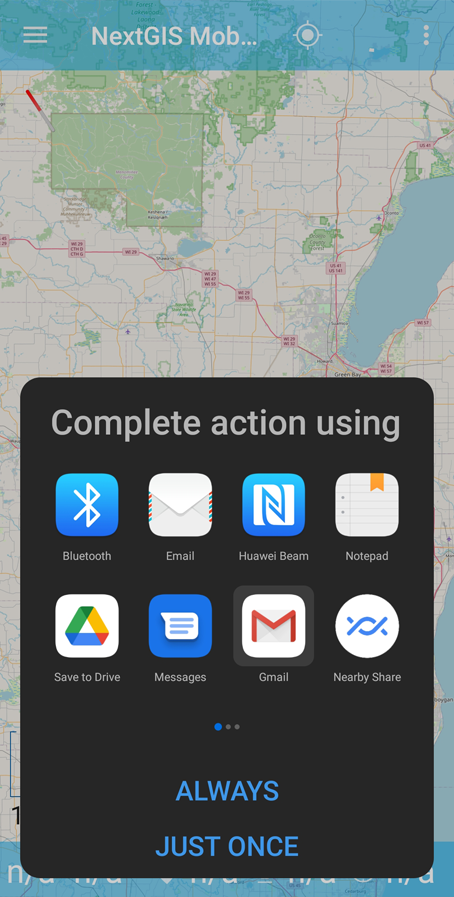

.. _ngmobile_logs:

Logging
=======

In NextGIS Mobile you can have a log of technical information about the functioning of the app.

.. _ngmobile_logs_steps:

How to get useful logs
-----------------------

1. Turn on logging.
2. Repeat your actions until the issue arises again.
3. Send the logs to support.
4. Turn off logging.

.. _ngmobile_logs_enable:

Enable logging
--------------

Tap three dots in the top right corner and select "Settings" in the drop-down menu.

   
   Context menu

Then select "General"

   
   General settings

In General Settings tick "Extended logs".

   
   Logging enabled

.. _ngmobile_logs_share:

Send log or save as file
--------------------------

You can also share your log. Open the contextual menu from the top panel and tap "Share log".

   
   Selecting "Share log" in the context menu

Next step is to select the app to send the log or save it to a cloud or to your device.

   
   Selecting app to send or save the log
