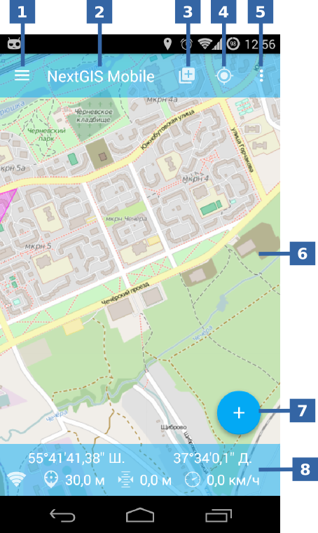

.. sectionauthor:: Дмитрий Барышников <dmitry.baryshnikov@nextgis.ru>

.. _ngmobile_gui:

User interface
==========================

There are 3 major elements in application interface:

* main window;
* sliding panel of layers tree;
* settings.

Application interface is designed in accordance with the guidelines `Google Material design <http://www.google.com/design/spec/material-design/introduction.html>`_.

.. _ngmobile_main_activity:

Main Window
------------

Main window is shown on :numref:`ngmobile_main_activity_pic`.

   
   Main Window.

   The numbers indicate: 1 - open sliding panel of layers tree; 2 - application title; 3 – add geodata; 4 - my position; 5 - options; 6 - map screen; 7 - list of main operations; 8 - information bar.

The amount of  buttons on the top toolbar depends on the size of screen. If the buttons do not fit on the toolbar, they will be moved to menu (see :numref:`ngmobile_main_activity_pic` p. 5).

Toolbar consists from:

* Start new track
* add :term:`geodata`;
* settings;
* about.

Map (see :numref:`ngmobile_main_activity_pic` Рї. 6) is a set of raster and vector layers. Order and visibility of layers can be configured in the layers tree (see :ref:`ngmobile_layer_tree`).

Button "add geodata" (see :numref:`ngmobile_main_activity_pic` p. 3) opens the next menu:

* open local
* add web
* add from NGW

Selecting "local" menu will open dialog of choosing path of :term:`geodata` from SD card or from cloud storage as well. NextGIS allows to upload next geodata formats:

* :term:`GeoJSON` file;
* ZIP file with cached tiles;
* *.ngfp format.

More information about geodata loading you can find in chapter ":ref:`ngmobile_load_geodata`".     New layer

While holding finger on the geometry of vector layer the map screen switches into action mode selection (see :numref:`ngmobile_selectmode_pic`).

.. figure:: _static/ngmobile_selectmode.png
   :name: ngmobile_selectmode_pic
   :align: center
   :height: 11cm

   Map screen in selection mode.

   The numbers indicate: 1 - selected geometry; 2 - attribute view; 3 - delete geometry; 4 - edit geometry; 5 - finish selection mode.
   
If information bar is open, it is hidden and replaced by bottom toolbar with next content:

* cancel the mode;
* start the edit of selected geometry (see :ref:`ngmobile_editing`);
* remove selected geometry;
* show attributes of selected geometry.

Attributes are displayed in separate panel by choosing show attributes mode. Panel can be opened in fullscreen mode or be placed in the right side of screen, depending on the size of the screen of your device (in the left side displays a map with highlighted geometry which is currently selected). Attributes panel is shown on :numref:`ngmobile_attributes_pic`.

.. figure:: _static/ngmobile_attributes.png
   :name: ngmobile_attributes_pic
   :align: center
   :height: 10cm
   
   Attributes panel.

There are following buttons in the bottom of attributes panel: stop displaying attributes and switching between entries (if the information bar was active, it is hidden).

In the bottom of screen the information bar can be placed (when the appropriate option in the settings is on).
In the information bar the next information is displaying (if this place is fixed):

* coordinates (latitude and longitude);
* positioning signal source (mobile networks/Wi-Fi or satellite) and number of captured satellites (if positioning is carried out with help of :term:`GPS`/:term:`GLONASS`);
* altitude (meters);
* speed (km/h)

Depending on the size of the screen the information bar can occupy one or two rows.

.. _ngmobile_layer_tree:

Layers tree
-----------

Layers tree is designed to show the content of map and to control the visibility and order of layers in the map. Additional operations over the layers are placed into a separate menu layer. Layers tree is shown on: numref: `ngmobile_layer_tree_pic`.

.. figure:: _static/ngmobile_layertree.png
   :name: ngmobile_layer_tree_pic
   :align: center
   :height: 11cm
   
   Layers tree of map.

   The numbers indicate: 1 - icon of the layer; 2 - name of the layer; 3 - visibility switch button 4 - button of the context layer menu display; 5 - context layer menu.

To change the order of layers hold your finger on the device screen on the layer which have to be moved. After that a list will be switched to the mode of changing layers order. Then, holding finger on screen, just move the layer to the new position.

For turning on/turning off layer visibility push on the corresponding icon (see :numref:`ngmobile_layer_tree_pic`, p. 3).

The context layer menu depends on its type. Vector layer menu has the following composition:

* zoom to extent
* share
* delete
* settings

If you select "Delete" layer would be removed from the map, and all its data would be erased  from a memory card.

.. _ngmobile_settings:

Settings
--------

Depending on the screen size the settings window consisted of one or two panels. Settings window is shown on :numref:`ngmobile_settings_pic` (one panel mode).

.. figure:: _static/ngmobile_settings.png
   :name: ngmobile_settings_pic
   :align: center
   :height: 10cm
   
   Settings.

There are following settings blocks on the main panel:

*general
*map
*location
*my tracks
*NextGIS Web

Settings block "Map" contains basic settings of the map (see :numref:`ngmobile_settings_map_pic`).

.. figure:: _static/ngmobile_settings1.png
   :name: ngmobile_settings_map_pic
   :align: center
   :height: 10cm
   
   Map settings.

Map settings have the following composition:

* show/hide status bar (information bar);
* the way current location displays (show position and accuracy, only position, do not show position);
* show mini compass;
* do not turn off the screen when map displays (works only in the map window);
* show/hide zoom control buttons;
* coordinates format (actual for coordinates in status bar and another dialogs and windows);
* map background;
* map path (you can specify a path for storage map data and geodata layers).

.. note::
	In the case of devices with several SD cards and operating system Android 4.4 (KitKat) and above, the path to the map not on the main SD card may only be specified in the application home directory and its subdirectories (for example: Android/data/com.nextgis.mobile). This is true for some devices without root access.
Folders forbidden for record will not have mark for their choice in dialog of selection.

"Location" settings block contains location settings (see :numref:`ngmobile_settings_place_pic`).

.. figure:: _static/ngmobile_settings2.png
   :name: ngmobile_settings_place_pic
   :align: center
   :height: 10cm
   
   Location settings.

Settings of location have the following composition:

* coordinate source (mobile networks/Wi-Fi + :term:`GPS` or only GPS);
* minimum update time
* minimum update distance
* count of GPS measures

Tracks settings are similar to the location settings, but they influence on tracks recording.

.. Note::

   If you put the value of the minimum update distance more than 5 m, the operating system starts to smooth the track (removes runouts).
