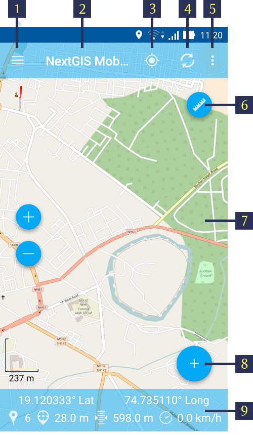
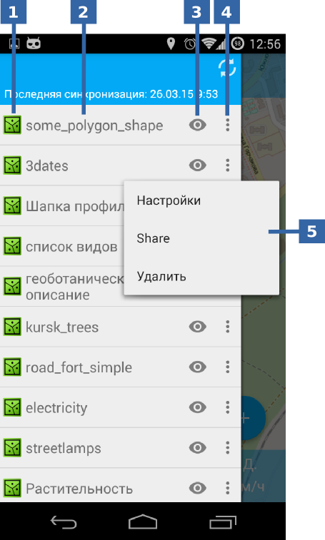
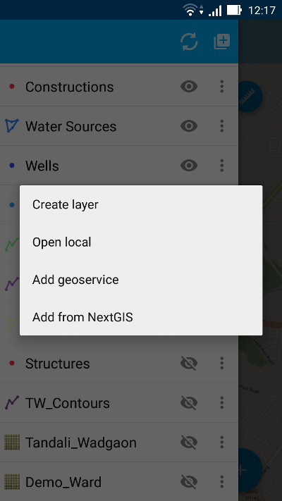
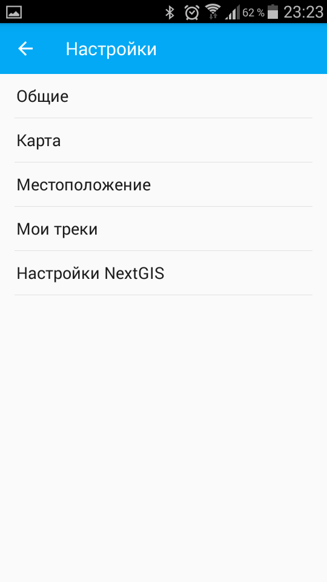
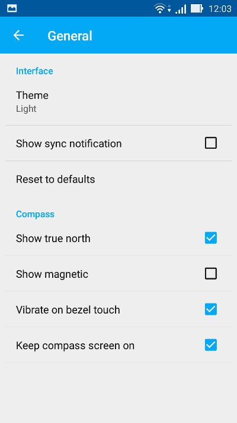
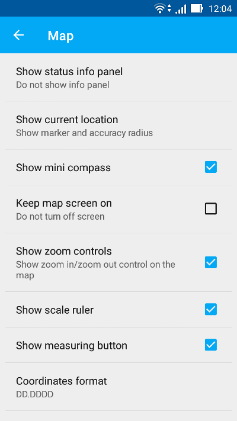
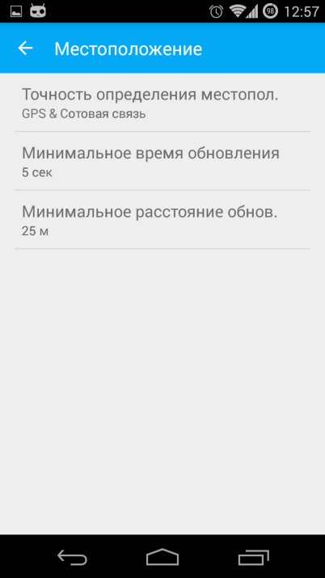

.. sectionauthor:: Dmitry Baryshnikov <dmitry.baryshnikov@nextgis.ru>

.. _ngmobile_gui:

User interface (UI)
==========================

There are 3 major elements of NextGIS Mobile UI:

* Main Screen
* Layers Tree Panel
* Settings Dialog

UI is designed in accordance with `Google Material design <http://www.google.com/design/spec/material-design/introduction.html>`_ guidelines.

.. _ngmobile_main_activity:

Main screen
------------

Main screen is shown on :numref:`ngmobile_main_activity_pic_1`.

   
   Main screen.

   The numbers indicate: 1 - Layers tree panel icon; 2 - Application title; 3 – "Show my location" button; 4 - Load/Refresh geodata; 5 - Contextual menu icon; 6 - Measure button; 7 - Map screen; 8 - Action menu button; 9 - Status info panel.

The number of buttons in top toolbar depends on your device screen size. If the buttons don't fit into the toolbar they are moved to the contextual menu (item 5 in :numref:`ngmobile_main_activity_pic_1`).

**Top toolbar** contains the following buttons:

* Show my location
* Load or refresh geodata
* Start new track
* Settings
* About

**Status info panel** (item 8 in :numref:`ngmobile_main_activity_pic_1`) can be shown at the bottom of the Main screen (if it is activated in the Settings). Status info panel shows:

* Device coordinates (latitude and longitude);
* Positioning signal source (mobile networks/Wi-Fi or satellite) and number of captured satellites (if positioning is carried out with help of :term:`GPS`/:term:`GLONASS`);
* Device altitude (meters);
* Device speed (kmph)

Depending on the size of the screen Status info panel can occupy one or two rows.

.. _ngmobile_layer_tree:

Layers tree
------------

Layers tree panel is designed to show the content of a map and to control the visibility and hierarchy of map layers. Additional operations with layers are available from a separate layer contextual menu. Layers tree panel is shown on :numref:`ngmobile_layer_tree_pic`.

   
   Layers tree panel.

   The numbers indicate: 1 - Layer type; 2 - Layer name; 3 - Layer visibility button; 4 - Add geodata; 5 - Layer contextual menu icon; 6 - Layer contextual menu items.
   
To change the hierarchy of map layers long-press the layer which is to be moved up or down. Layers tree panel will switch to Edit mode. Keep pressing and move the selected layer to its new position.

For turning  layer visibility on/off tap on Layer visibility button (item 3 in :numref:`ngmobile_layer_tree_pic`).

"Add geodata" button (item 4 in :numref:`ngmobile_layer_tree_pic`), apart from facilitating :Create Layer", allows you to select the data source using the following menu, as shown below:

   
   Add geodata options

By using "Open local" menu item you can upload :term:`geodata` from SD card or cloud storage, in one of the following formats:

* :term:`GeoJSON` file;
* ZIP file with cached tiles;
* *.ngrc file
* *.ngfp format.

More information about geodata upload can be found in ":ref:`ngmobile_load_geodata`" section.

Layer contextual menu depends on layer's type, whether it is Vector or raster. When you tap the Contextual menu button (item 5 in :numref:`ngmobile_layer_tree_pic`), contextual menue items pop up as shown by item 6 in :numref:`ngmobile_layer_tree_pic`

* Zoom to extent
* Attributes
* Share
* Edit
* Delete
* Settings

**By pressing "Delete" you not only remove layer from the map but also erase all its data from the memory card.**

.. _ngmobile_settings:

Settings dialog
-------------------

Depending on the screen size Settings dialog can fit into one or two panels. Settings dialog is shown on :numref:`ngmobile_settings_pic` (one panel mode).

   
   Settings.

There are following Settings on the main panel:

* General
* Map
* Location
* My tracks
* NextGIS Settings

"General" settings allow to change basic settings of the map (see :numref:`ngmobile_settings_general_pic`).

   
   General settings.
   
Here you can select one of the themes from Light & Dark and select for compass settings.

"Map" settings allow to change basic settings of the map (see :numref:`ngmobile_settings_map_pic`).

   
   Map settings.

Map settings include:

* Show/hide Status info panel
* The way current location displays (show current location, show marker, how marker & accuracy radius)
* Show mini compass
* Do not turn off the screen when map displays - works only on the map screen
* Show/hide zoom control buttons
* Show scale ruler
* Show measuring button
* Coordinates format (for coordinates in Status bar and other dialogs and screens)
* Map background (light, dark, neutral)
* Map path (here you can specify a path where map and layers data will be stored)

.. note::
	For devices with several SD cards and Android 4.4 and higher, map path not on the main SD card can only be specified in the application home directory and its subdirectories (for example: Android/data/com.nextgis.mobile). This is also true for some devices without root access. Read-only folders won't show up in path selection dialog.

"Location" settings contain location settings (see :numref:`ngmobile_settings_place_pic`).

   
   Location settings.

Location settings include:

* Coordinate source (mobile networks/Wi-Fi + :term:`GPS`, Other networks or only GPS)
* Minimum update time
* Minimum update distance
* Count of GPS fixes

"Tracks" settings are similar to the location settings, but they are applied only for track recording.

.. Note::

   If you set value of the minimum update distance at more than 5 m, the operating system will start to smooth the track (remove outliers).
