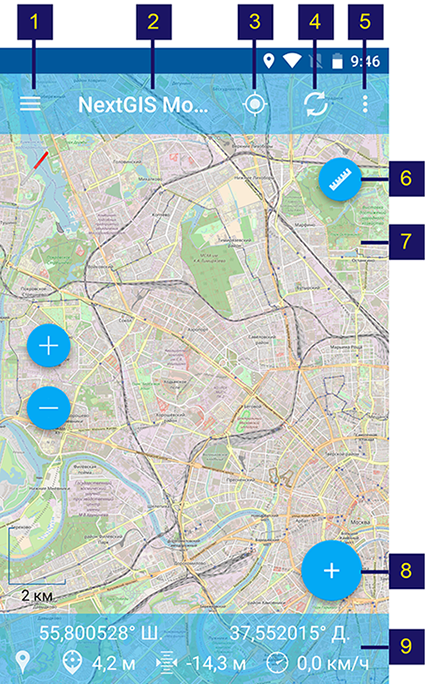
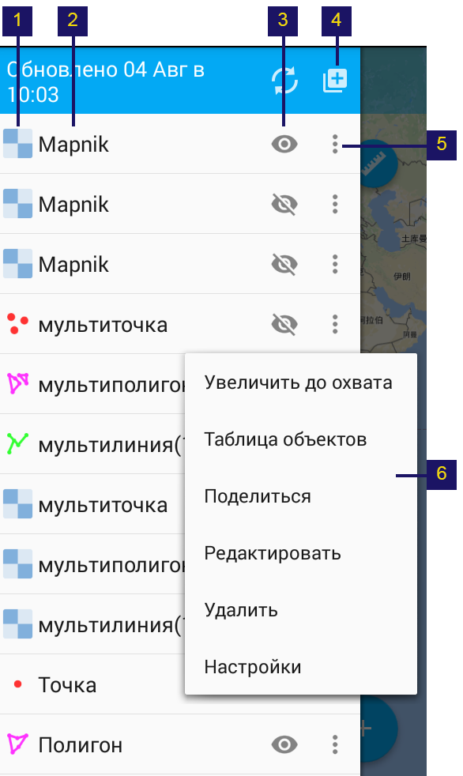
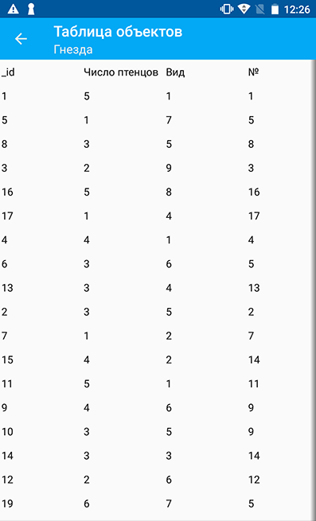
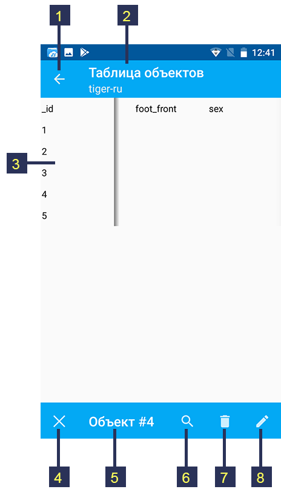
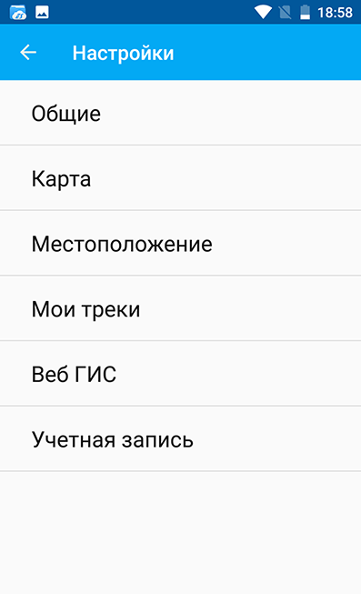
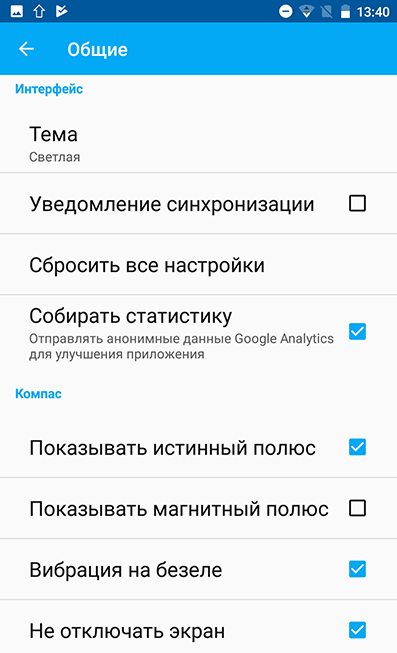
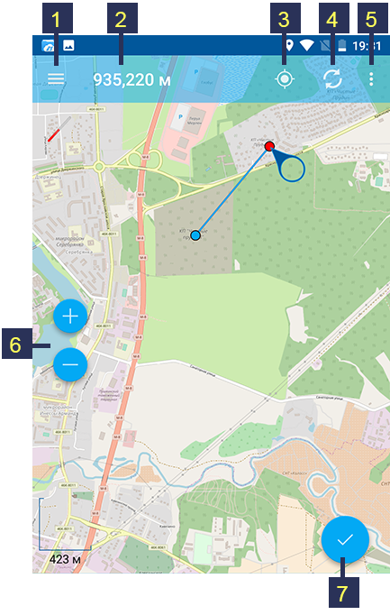

.. sectionauthor:: Дмитрий Барышников <dmitry.baryshnikov@nextgis.ru>

.. _ngmobile_gui:

Пользовательский интерфейс
==========================

Пользовательский интерфейс "NextGIS Mobile" включает в себя четыре основных элемента:

* Главное окно приложения;
* Дерево слоев;
* Таблица объектов;
* Окно настроек.

Интерфейс приложения разработан в соответствии с принципами `Google Material design <http://www.google.com/design/spec/material-design/introduction.html>`_.

.. _ngmobile_main_activity:

Главное окно
------------

Главное окно приложения представлено на :numref:`ngmobile_main_activity_pic`

   
   Главное окно приложения.
   
   Цифрами обозначены: 1 - кнопка вызова панели дерева слоев; 2 - заголовок приложения; 3 – кнопка "Показать текущее местоположение"; 4 - кнопка "Загрузить/обновить геоданные"; 5 - кнопка вызова контекстного меню; 6 - линейка измерений; 7 - карта; 8 - кнопка меню основных операций; 9 - панель статуса.
   
В зависимости от ширины экрана в верхней панели инструментов может быть больше или меньше кнопок. 
Кнопки, которые не помещаются в панель инструментов, переносятся в контекстное меню (см. :numref:`ngmobile_main_activity_pic` п. 5).

**Панель инструментов** в верхней части Главного окна приложения позволяет выполнить следующие действия:

* Показать текущее местоположение;
* Загрузить или обновить геоданные;
* Начать запись трека;
* Перейти в окно настроек;
* Перейти в раздел "Помощь".

Основную часть Главного окна приложения занимает **Карта** (см. :numref:`ngmobile_main_activity_pic` п. 7), представляющая собой набор растровых и векторных слоев. 
Порядок и видимость слоев Карты настраиваются при помощи Дерева слоев (см. :ref:`ngmobile_layer_tree`).

В нижней части Главного окна приложения может размещаться **Панель статуса** (см. :numref:`ngmobile_main_activity_pic` п. 9) (если включена соответствующая опция: Настройки -> Карта -> Показать панель статуса). В зависимости от размера экрана Панель статуса может занимать одну или две строки.

В Панели статуса отображается следующая информация (при наличии зафиксированного местоположения):

* координаты (широта и долгота);
* источник сигнала позиционирования (сотовые сети/Wi-Fi или спутник), а также количество спутников, 
  которые фиксируют местоположение (если позиционирование осуществляется при помощи :term:`GPS`/:term:`ГЛОНАСС`);
* высота в метрах;
* скорость движения в км/ч.

.. _ngmobile_layer_tree:

Дерево слоев
------------

Дерево слоев предназначено для просмотра состава карты и управлением видимостью и порядком слоев на карте. 
Дополнительные операции над слоями вынесены в отдельное меню слоя. 

Внешний вид выезжающей панели Дерева слоев представлен на :numref:`ngmobile_layer_tree_pic`

   
   Дерево слоев карты.
   
   Цифрами обозначены: 1 - тип слоя; 2 - название слоя; 3 - кнопка управления видимостью слоя; 4 - кнопка "Добавить геоданные"; 5 - кнопка вызова контекстного меню слоя; 6 - контекстное меню слоя. 
      
Для изменения порядка слоев нужно выполнить долгое нажатие на экран устройства на слое, который необходимо переместить. Слой, на котором выполняется долгое нажатие, выделится синей рамкой. При этом список перейдет в режим Редактирования. Далее, не отнимая пальца от экрана и удерживая на слое, который необходимо переместить, перетащите слой в новую позицию на экране.

Для включения/выключения видимости слоя достаточно нажать на соответствующую кнопку (см. :numref:`ngmobile_layer_tree_pic`, п. 3).

Нажатие на кнопку "Добавить геоданные" в верхней части панели Дерева слоев (см. :numref:`ngmobile_layer_tree_pic`, п. 4) 
позволяет создавать новые векторные слои, а также загружать векторные и растровые слои из локального хранилища Android, `каталога QuickMapServices <https://qms.nextgis.com/>`_, облачного сервиса `nextgis.com <https://my.nextgis.com/signup/?next=/webgis/>`_ или серверной Веб ГИС `NextGIS Web <http://nextgis.ru/nextgis-web/>`_. 

По нажатию на кнопку "Добавить геоданные" открывается следующий диалог (см. :numref:`ngmobile_the_menu_button_Add_data_pic`):

* Создать слой;
* Открыть локальный;
* Добавить геосервис;
* Добавить из Веб ГИС.

.. figure:: _static/ngmobile_the_menu_button_Add_data.png
   :name: ngmobile_the_menu_button_Add_data_pic
   :align: center
   :height: 10cm
  
   Диалог "Добавить геоданные".

Выбор пункта диалога "Открыть локальный" открывает системный диалог выбора данных, в котором можно выбрать как локальные :term:`геоданные` (на карте памяти), так и с облачных хранилищ. Приложение позволяет загружать следующие геоданные:

* файл формата :term:`GeoJSON`;
* файл формата ZIP с тайловым кэшем;
* файл формата *.ngrc
* файл формата *.ngfp.

Подробнее загрузка геоданных описана в разделе ":ref:`ngmobile_load_geodata`".

Контекстное меню слоя зависит от типа слоя (векторный или растровый). По нажатию на кнопку вызова контекстного меню (см. :numref:`ngmobile_layer_tree_pic`, п. 5) открывается контекстное меню слоя, внешний вид которого приведен на :numref:`ngmobile_layer_tree_pic`, п.6:

* Увеличить до охвата;
* Таблица объектов;
* Поделиться;
* Отправить в NextGIS;
* Редактировать;
* Удалить;
* Настройки.
 
.. warning::

   При выборе пункта "Удалить", слой удаляется с карты, а также удаляются все его данные с карты памяти.

.. _ngmobile_attributes_table:

Таблица объектов
-----------------

Таблица объектов предназначена для отображения и редактирования содержания векторного слоя в формате таблицы.

Для того чтобы открыть Таблицу объектов, необходимо открыть панель Дерева слоев и нажать на кнопку вызова контекстного меню векторного слоя (см. :numref:`ngmobile_layer_tree_pic`, п. 5). Это приведет к открытию контекстного меню, показаннного в п.6 :numref:`ngmobile_layer_tree_pic`. Далее необходимо выбрать пункт меню "Таблица объектов". 

Внешний вид таблицы объектов показан на :numref:`ngmobile_attributes_pic`.

   
   Таблица объектов.
   
При нажатии на любую запись (строку) в таблице в нижней части экрана появится панель инструментов. 
Данная панель позволяет выполнить команды, показанные на :numref:`ngmobile_attribute_table_toolbar_pic`.

   
   Панель инструментов таблицы объектов.
   
   Цифрами обозначены: 1 - закрыть таблицу объектов; 2 - название слоя; 3 - атрибуты объектов;  4 - закрыть панель инструментов; 5 - ID текущего объекта; 6 - показать текущий объект на карте; 7 - удалить текущий объект; 8 - открыть форму редактирования атрибутов объекта.

Можно открыть стандартную форму редактирования атрибутов объекта, как показано на :numref:`ngmobile_input_form_attributes_pic`, выбрав опцию "Открыть форму редактирования атрибутов объекта" (см. :numref:`ngmobile_attribute_table_toolbar_pic`, п.8), 
   
.. warning::

   При выборе пункта "Удалить" (см. :numref:`ngmobile_attribute_table_toolbar_pic`, п.7) объект сразу же удаляется. Отмена удаления возможна только в течение 5 секунд после удаления, после этого объект будет удален безвозвратно.   

.. _ngmobile_settings:

Окно настроек
-------------

В зависимости от размера экрана окно настроек может быть однопанельным и двупанельным. 
Внешний вид окна настроек представлен на :numref:`ngmobile_settings_pic` (однопанельный режим). 

   
   Окно настроек.
   
Доступны следующие блоки настроек:

* Общие;
* Карта;
* Местоположение;
* Мои треки;
* Веб ГИС;
* Учетная запись.

Блок настроек "Общие" позволяет изменять основные настройки приложения (см. :numref:`ngmobile_settings_general_pic`):

   Блок настроек "Общие".
  
Например, с их помощью можно выбрать тему (Светлую или Темную) и настроить компас.

Блок настроек "Карта" содержит основные настройки карты (см. :numref:`ngmobile_settings_map_pic`).

.. figure:: _static/ngmobile_settings_map.png
   :name: ngmobile_settings_map_pic
   :align: center
   :height: 10cm
   
   Окно настроек карты.
   
Настройки карты имеют следующий состав:

* способ показа панели статуса (не показывать панель, показывать только вне редактирования, показывать всегда);
* способ показа текущего местоположения (не показывать текущее местоположение, показывать только маркер, показывать маркер и радиус точности);
* отображать/скрывать мини компас;
* при показе карты отключать/не отключать экран;
* отображать/скрывать кнопки управления масштабом (показывать кнопки +/- на карте); 
* отображать/скрывать шкалу масштаба;
* отображать/скрывать линейку измерений;
* формат вывода координат (применяется для отображения координат в панели статуса и других диалогах и окнах);
* настройка количества разрядов после запятой (количество разрядов можно изменить);
* настройка фона карты (светлый, нейтральный, темный);
* путь к картам (можно настроить путь к своей папке для хранения данных карты и слоев геоданных). 

.. note::

   В случае наличия устройства с несколькими SD-картами и ОС Android 4.4 (KitKat) и выше, путь к карте 
   на неосновной SD-карте может быть указан только в домашнюю директорию приложения и ее подпапки 
   (например, Android/data/com.nextgis.mobile). Это справедливо для некоторых устройств без root прав.
   При отображении диалога выбора пути папки, в которые запрещена запись, не будут иметь отметки для их выбора.

Блок настроек "Местоположение" содержит настройки определения местоположения устройства (см. :numref:`ngmobile_settings_place_pic`).

.. figure:: _static/ngmobile_settings_place.png
   :name: ngmobile_settings_place_pic
   :align: center
   :height: 10cm
   
   Окно настроек местоположения.
  
Настройки местоположения имеют следующий состав:
  
* точность определения местоположения/источник координат (:term:`GPS`, другие сети, GPS и другие сети);
* минимальное время обновления координат;
* минимальное расстояние обновления координат;
* количество замеров GPS.

Настройка треков аналогична настройкам местоположения, но влияет только на запись треков.

.. note::

   Если установить значение минимального расстояния обновления координат более 5 м, то операционная система начинает сглаживать трек (убирает выбросы).
   
.. _ngmobile_useful_facilities:

Полезные опции
-----------------

В Главном окне приложения можно воспользоваться некоторыми опциями, полезными при работе в поле.

.. _ngmobile_show_my_location:

Показать мое местоположение
^^^^^^^^^^^^^^^^^^^^^^^^^^^

Для того, чтобы узнать свое текущее местоположение, нужно нажать на кнопку "Показать текущее местоположение" (см. :numref:`ngmobile_main_activity_pic`, п. 3). При этом на карте будет маркером отмечено текущее местоположение. Если панель статуса (см. :numref:`ngmobile_main_activity_pic`, п. 9) активирована в соответствующем разделе окна настроек (см. :numref:`ngmobile_settings_map_pic`), то информация о текущем местоположении будет доступна и там тоже.

.. note::
   Чтобы воспользоваться этой опцией, необходимо сначала разрешить приложению запрашивать доступ к местоположению устройства в настройках устройства ("Настройки" -> "Конфиденциальность" -> "Местоположение").
   
Измерение расстояния
^^^^^^^^^^^^^^^^^^^^

Можно измерить расстояние между двумя точками на карте. Для этого нужно нажать на кнопку "Линейка измерений" на экране карты (см. :numref:`ngmobile_main_activity_pic`, п. 6). Затем нажать на первую точку (в режиме редактирования на экране появится новая точка) и на вторую точку (в режиме редактирования на экране появится вторая точка и линия, соединяющая две точки). Расстояние между этими точками будет отображено на панели инструментов в верхней части экрана (см. :numref:`ngmobile_measure_distance_pic`).

   
   Измерение расстояния.

Можно добавить большее количество точек, чтобы измерить расстояние, образуемое сложными линиями и кривыми, а также измерить площадь образующихся полигонов.

Положение любой точки может быть изменено нажатием на нее и перемещением в нужную позицию.

Для того чтобы выйти из режима измерения, нажмите на синюю галочку в правом нижнем углу экрана.

.. note::
   Для того чтобы воспользоваться этой опцией, в блоке настроек "Карта" должна быть включена "Линейка измерений" (см. :numref:`ngmobile_settings_map_pic`).
