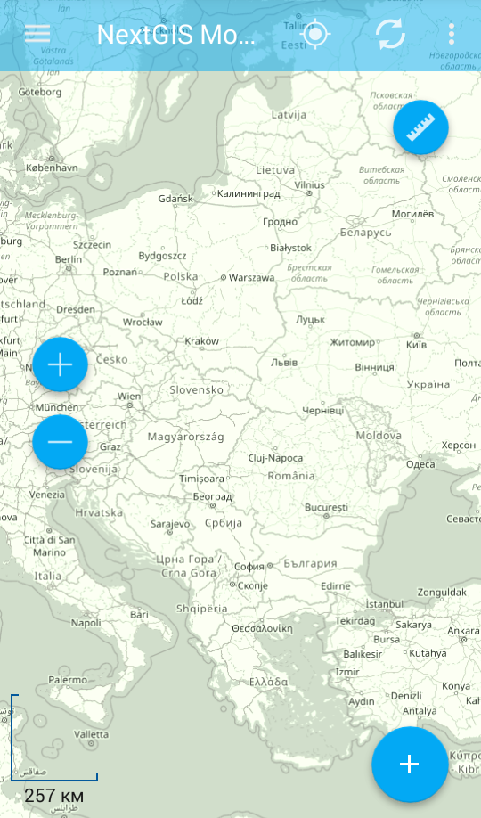
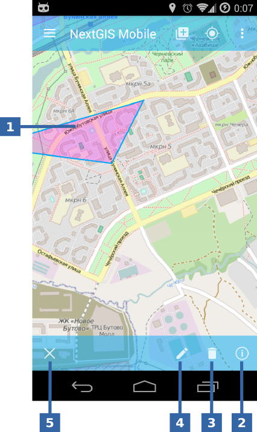
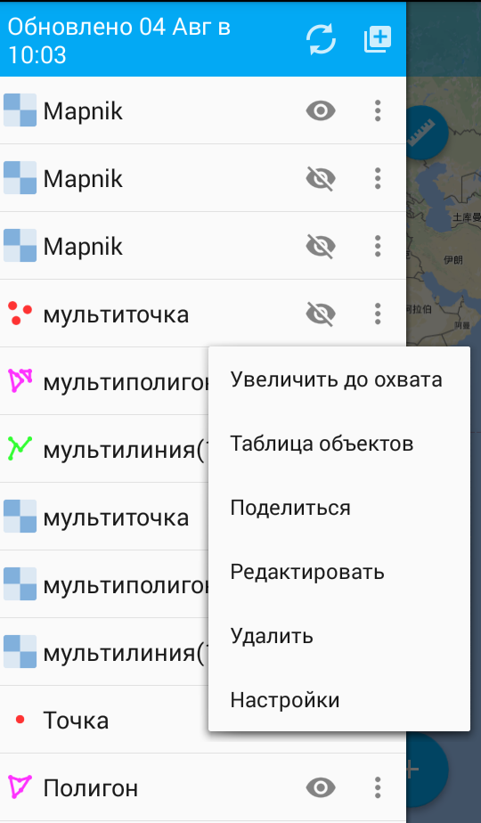
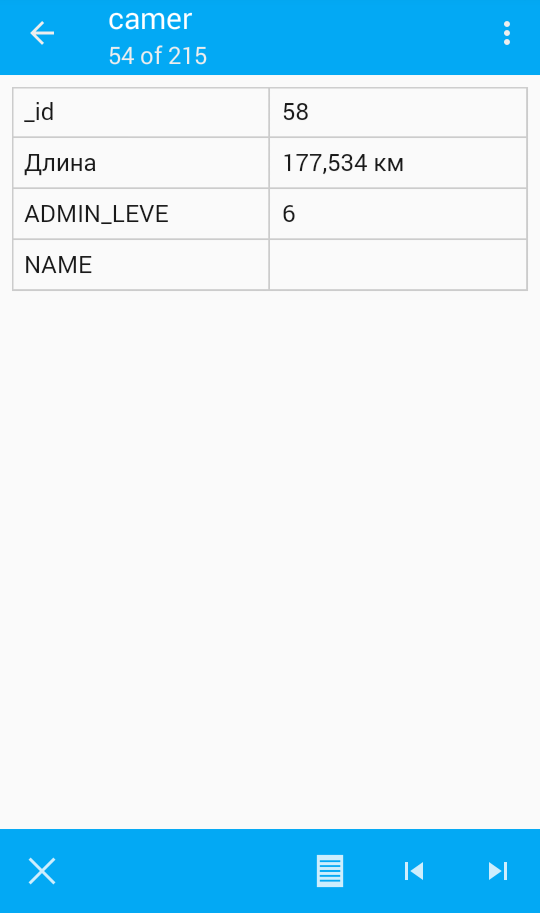
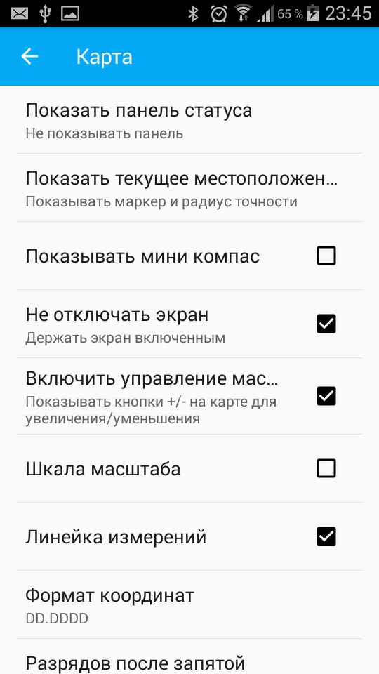
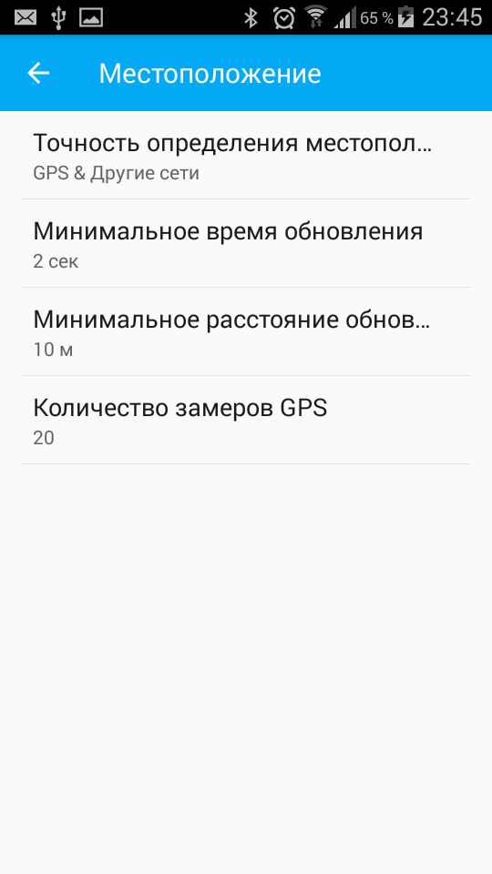

.. sectionauthor:: Дмитрий Барышников <dmitry.baryshnikov@nextgis.ru>

.. _ngmobile_gui:

Пользовательский интерфейс
==========================

В пользовательском интерфейсе имеется четыре основных элемента:

* главное окно приложения;
* выезжающая панель дерева слоев;
* таблица объектов;
* окно настроек.

Интерфейс приложения выполнен в соответствии с руководством `Google Material design <http://www.google.com/design/spec/material-design/introduction.html>`_.

.. _ngmobile_main_activity:

Главное окно
------------

Главное окно приложения представлено на :numref:`ngmobile_main_activity_pic`.

   
   Главное окно приложения.
   
   Слева направо обозначено: 1 - кнопка открытия дерева слоев; 2 - заголовок приложения; 
   3 - кнопка позиционирования окна карты в текущих координатах; 4 - кнопка Обновить;
   5 - кнопка меню.

   Сверху вниз обозначено: 6 - кнопка измерения площади и длины (в виде линейки); 7 - карта; 
   8 - кнопка меню основных операций; 9 - +/- кнопки для масштабирования карты (приближение и отдаление), 
   10 - шкала масштаба.
   
В зависимости от размера экрана в верхней панели инструментов может быть больше или меньше кнопок. 
Все, что не помещается на панель инструментов, переносится в меню (см. :numref:`ngmobile_main_activity_pic` п. 5).

Панель инструментов имеет следующий состав:

* Показать мое местоположение;
* Загрузить или обновить геоданные;
* Начать запись трека;
* Настройки;
* Помощь.

В нижней части экрана может размещаться панель статуса (если включена соответствующая опция: 
Настройки - Карта - Показать панель статуса). В панели статуса отображается следующая информация 
(при наличии зафиксированного местоположения):

* координаты (широта и долгота);
* источник сигнала позиционирования (сотовые сети/Wi-Fi или спутник), а также количество спутников, 
  которые фиксируют местоположение (если позиционирование осуществляется при помощи :term:`GPS`/:term:`ГЛОНАСС`);
* высота в метрах;
* скорость движения в км/ч.

В зависимости от размера экрана панель может занимать одну или две строки.

Карта (см. :numref:`ngmobile_main_activity_pic` п. 7) представляет собой набор растровых и векторных слоев. 
Порядок и видимость слоев настраивается при помощи дерева слоев (см. :ref:`ngmobile_layer_tree`).

При долгом удержании пальца на геометрии векторного слоя окно карты переходит в режим 
выбора действия (см. :numref:`ngmobile_selectmode_pic`). 

   
   Окно карты в режиме выделения.
   
   1 - выделенная геометрия на карте; 
   на нижней панели инструментов слева направо обозначено: 
   2 - завершение режима редактирования; 3 - добавление нового объекта на карту; 
   4 - редактирование геометрии; 5 - удаление геометрии; 6 - просмотр атрибутов. 
   

Если открыта информационная панель, то она будет скрыта, и на ее месте будет выведена 
нижняя панель инструментов, которая имеет следующий состав команд:

* завершить режим редактирования;
* добавление новой геометрии на карту;
* перейти к редактированию выбранной геометрии (см. :ref:`ngmobile_editing`);
* удалить выделенную геометрию;
* показать панель с атрибутами выбранной геометрии.

.. _ngmobile_layer_tree:

Дерево слоев
------------

Дерево слоев предназначено для просмотра состава карты и управлением видимостью и порядком слоев на карте. 
Дополнительные операции над слоями вынесены в отдельное меню слоя. Дерево слоев представлено 
на :numref:`ngmobile_layer_tree_pic`.

   
   Дерево слоев карты.
   
   Слева направо в верхней панели инструментов: 1 - дата и время последнего обновления программы;
   2 - кнопка Обновить; 3 - кнопка "Добавить геоданные".
   
   Слева направо обозначено: 1 - иконка слоя; 2 - название слоя; 3 - кнопка переключения видимости слоя; 
   4 - кнопка вызова контекстного меню слоя; 5 - контекстное меню слоя.
   
Для изменения порядка слоев нужно выполнить долгое нажатие на экран устройства на слое, 
который необходимо переместить. Слой, на котором выполняется долгое нажатие, выделится 
синей рамкой. При этом список перейдет в режим Редактирования. Далее, не отнимая пальца 
от экрана и удерживая на слое, который необходимо переместить, перетащите слой в новую позицию на экране.

Для включения/выключения видимости слоя достаточно нажать на соответствующую кнопку (см. :numref:`ngmobile_layer_tree_pic`, п. 3).

Нажатие на кнопку "Добавить геоданные" на верхней панели инструментов (см. :numref:`ngmobile_layer_tree_pic`, п. 4) 
позволяет создавать векторные слои и импортировать векторные и растровые слои из локального хранилища Android, `каталога QuickMapServices <https://qms.nextgis.com/>`_, `nextgis.ru <https://my.nextgis.ru/signup/?next=/webgis/>`_ или `NextGIS Web <http://nextgis.ru/nextgis-web/>`_. Эта кнопка содержит меню следующего состава (см. :numref:`ngmobile_the_menu_button_Add_data_pic`):

* Создать слой;
* Открыть локальный;
* Добавить геосервис;
* Добавить из Веб ГИС.

.. figure:: _static/ngmobile_the_menu_button_Add_data.png
   :name: ngmobile_the_menu_button_Add_data_pic
   :align: center
   :height: 10cm
  
   Меню кнопки "Добавить геоданные".

Выбор пункта меню "Открыть локальный" открывает системный диалог выбора данных, в 
котором можно выбрать как локальные :term:`геоданные` (на карте памяти), так и с 
облачных хранилищ. Приложение позволяет загружать следующие геоданные:

* файл формата :term:`GeoJSON`;
* файл формата ZIP с тайловым кэшем;
* файл формата *.ngrc
* файл формата *.ngfp.

Подробнее о загрузке геоданных описано в разделе ":ref:`ngmobile_load_geodata`".

Контекстное меню слоя зависит от его типа (векторный или растровый). Нажатие кнопки 
Контекстное меню (см.: :numref:`ngmobile_layer_tree_pic`, п. 5) открывает контекстное меню, 
которое приведено в п.6 :numref:`ngmobile_layer_tree_pic`:

* Увеличить до охвата;
* Таблица объектов;
* Поделиться;
* Отправить в NextGIS;
* Редактировать;
* Удалить;
* Настройки.
 
.. warning::
   При выборе пункта "Удалить", слой удаляется с карты, а также удаляются все его данные с карты памяти.

.. _ngmobile_attributes_table:

Таблица объектов
-----------------

Таблица объектов предназначена для того, чтобы показывать содержимое каждого векторного слоя в формате таблицы и управлять им.

Для того чтобы открыть Таблицу объектов, необходимо активировать панель Дерева слоев и нажать на кнопку контекстного меню рядом с названием векторного слоя (см :numref:`ngmobile_layer_tree_pic`, п. 5). Это приведет к открытию контекстного меню, показаннного в п.6 :numref:`ngmobile_layer_tree_pic`. Далее необходимо выбрать пункт "Таблица объектов". В зависимости 
от размера экрана панель может раскрываться на весь экран или занимать правую часть экрана (слева отображается карта с подсвеченной геометрией текущего набора атрибутов).

Таблица объектов показана на :numref:`ngmobile_attributes_pic`.

   
   Таблица объектов.
   
При нажатии любой записи (строки) в таблице в нижней части экрана появится панель инструментов. Данная панель позволяет управлять опциями, показанными ниже на ...

Можно открыть стандартную форму редактирования объектов, выбрав опцию "Открыть форму редактирования объектов" (см. п.8 :numref:`ngmobile_attributes_pic`), как показано на :numref:`ngmobile_input_form_attributes_pic`.
   
.. warning::
   При выборе пункта "Удалить" (см. :numref:`ngmobile_attributes_pic` п.7) объект сразу же удаляется. Отмена удаления возможна только в течение 5 секунд после удаления, после этого объект будет удален безвозвратно.   

.. _ngmobile_settings:

Окно настроек
-------------

В зависимости от размера экрана окно настроек может быть однопанельным и двупанельным. 
Окно настроек представлено на :numref:`ngmobile_settings_pic` (однопанельный режим). 

.. figure:: _static/ngmobile_settings.png
   :name: ngmobile_settings_pic
   :align: center
   :height: 10cm
   
   Окно настроек.
   
На основной панели имеются следующие блоки настроек:

* Общие;
* Карта;
* Местоположение;
* Мои треки;
* Веб ГИС;
* Учетная запись;
* Проверить обновления.

Блок настроек "Карта" содержит основные настройки карты (см. :numref:`ngmobile_settings_map_pic`).

   
   Окно настроек карты.
   
Настройки карты имеют следующий состав:

* отображать/скрыть панель статуса (информационную панель)/показывать всегда;
* каким образом показывать текущее местоположения (не показывать текущее местоположение, 
  показывать только маркер, показывать маркер и радиус точности);
* показывать мини компас;
* при показе карты не выключать экран (работает только в окне карты);
* отображать/скрыть кнопки управления масштабом (показывать кнопки +/- на карте для 
  увеличения/уменьшения, отображать шкалу масштаба);
* отображать/скрыть линейку измерений;
* формат вывода координат (действует на отображение координат в панели статуса и других диалогах и окнах);
* отображает количество разрядов после запятой (количество разрядов можно изменить);
* отображает фон карты (светлый, нейтральный, темный);
* путь к картам (можно указать свой путь к папки для хранения данных карты и слоев геоданных). 

.. note::
   В случае наличия устройства с несколькими SD карточками и ОС Android 4.4 (KitKat) и выше, путь к карте 
   на не основной SD карточке может быть указан только в домашнюю директорию приложения и ее подпапки 
   (например, Android/data/com.nextgis.mobile). Это справедливо для некоторых устройств без root прав.
   При отображении диалога выбора, папки, в которые запрещена запись, не будут иметь отметки для их выбора.

Блок настроек "Местоположения" содержит настройки местоположения (см. :numref:`ngmobile_settings_place_pic`).

   
   Окно настроек местоположения.
  
Настройки местоположения имеют следующий состав:
  
* точность определения местоположения/источник координат (:term:`GPS`, другие сети, GPS & другие сети);
* минимальное время обновления координат;
* минимальное расстояние обновления для снятия координат;
* количество замеров GPS.

Настройка треков аналогична настройкам местоположения, но влияет на запись треков.

.. note::

   Если поставить значение минимального расстояния получения координат более 5 м, то операционная система начинает сглаживать трек (убирает выбросы).
   
