.. _ngmobile_gui:

Пользовательский интерфейс
==========================

Пользовательский интерфейс "NextGIS Mobile" включает в себя четыре основных элемента:

* `Главное окно приложения <https://docs.nextgis.ru/docs_ngmobile/source/main.html#ngmobile-main-activity>`_;
* `Дерево слоев <https://docs.nextgis.ru/docs_ngmobile/source/main.html#ngmobile-layer-tree>`_;
* `Таблица объектов <https://docs.nextgis.ru/docs_ngmobile/source/main.html#ngmobile-attributes-table>`_;
* `Настройки <https://docs.nextgis.ru/docs_ngmobile/source/settings.html>`_.

Интерфейс приложения разработан в соответствии с принципами `Google Material design <http://www.google.com/design/spec/material-design/introduction.html>`_.

.. _ngmobile_main_activity:

Главное окно
------------

Главное окно приложения представлено на :numref:`ngmobile_main_activity_pic`

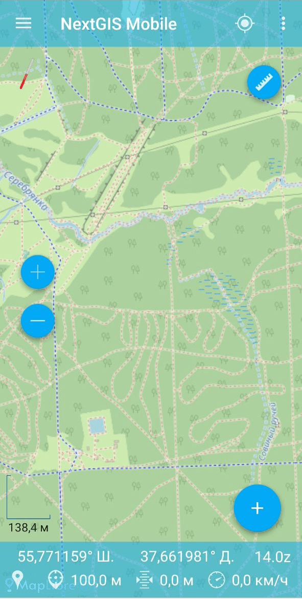
   
   Главное окно приложения
   
В верхней части экрана находится **Панель инструментов** (кнопки, которые не помещаются в панель инструментов, переносятся в контекстное меню |ic_menu|):

* |ic_layer_tree| `Дерево слоёв <https://docs.nextgis.ru/docs_ngmobile/source/main.html#ngmobile-layer-tree>`_;
* Заголовок приложения NextGIS Moblie;
* |ic_location| `Текущее местоположение <https://docs.nextgis.ru/docs_ngmobile/source/main.html#ngmobile-show-my-location>`_;
* |ic_walk| `Начать запись трека <https://docs.nextgis.ru/docs_ngmobile/source/tracks.html#ngmobile-record-tracks>`_;
* `Настройки <https://docs.nextgis.ru/docs_ngmobile/source/settings.html>`_;
* Помощь - здесь можно посмотреть текущую версию приложения, а также перейти в документацию;

Основную часть Главного окна приложения занимает **Карта**, представляющая собой набор растровых и векторных слоев. 
Порядок и видимость слоев Карты настраиваются при помощи Дерева слоев (подробнее см. :ref:`ngmobile_layer_tree`).

На карте размещаются следующие элементы:

* |ic_zoom_in| |ic_zoom_out| Кнопки управления масштабом;
* Меню основных операций - |ic_big_plus| большая синяя кнопка с плюсом внизу экрана.

Также на карте может отображаться:

* |ic_ruler_round| Кнопка линейки измерений (включается: Настройки --> Карта --> Линейка измерений);
* Шкала масштаба (в левом нижнем углу, включается: Настройки --> Карта --> Шкала масштаба).

В нижней части Главного окна приложения может размещаться **Панель статуса** (настроить отображение панели статуса можно в: Настройки -> Карта -> Показать панель статуса). В зависимости от размера экрана Панель статуса может занимать одну или две строки.

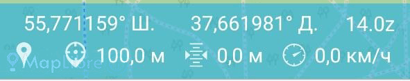

   Панель статуса

В Панели статуса отображается следующая информация (при наличии зафиксированного местоположения):

* координаты (широта и долгота);
* текущий уровень приближения (включается в Настройки --> Карта --> Показывать уровень зума)
* |ic_accuracy| источник сигнала позиционирования (сотовые сети/Wi-Fi или спутник), а также количество спутников, которые фиксируют местоположение (если позиционирование осуществляется при помощи :term:`GPS`/:term:`ГЛОНАСС`);
* |ic_altitude| высота в метрах;
* |ic_speed| скорость движения в км/ч.

.. _ngmobile_layer_tree:

Дерево слоев
------------

Дерево слоев предназначено для просмотра состава карты и управления видимостью и порядком слоев на карте. 

Операции над слоями вынесены в `контекстное меню слоя <https://docs.nextgis.ru/docs_ngmobile/source/main.html#ngmob-layer-menu>`_. 

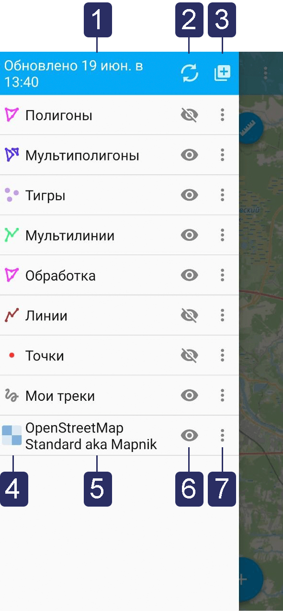
   
   Дерево слоев карты
   
Цифрами обозначены: 

1. время последней синхронизации с сервером; 
2. индикатор синхронизации; 
3. меню `"Добавить данные" <https://docs.nextgis.ru/docs_ngmobile/source/main.html#layer-tree-menu>`_; 
4. тип слоя; 
5. название слоя; 
6. кнопка управления видимостью слоя; 
7. кнопка вызова `контекстного меню <https://docs.nextgis.ru/docs_ngmobile/source/main.html#ngmob-layer-menu>`_ слоя. 

Слои отображаются в том порядке, в котором они находятся в дереве слоёв, верхние перекрывают нижние. Для того, чтобы изменить порядок слоёв, зажмите нужный слой и перетащите на новое место.

Для включения/выключения видимости слоя достаточно нажать на иконку глаза |ic_eye| рядом с ним.

.. _layer_tree_menu

Меню "Добавить данные"
----------------------

В верхней части дерева слоёв находится кнопка меню "Добавить данные" (см. :numref:`ngmobile_layer_tree_pic`, п. 3), которая позволяет:

* `Создать слой <https://docs.nextgis.ru/docs_ngmobile/source/load_geodata.html#ngmobile-create-vector>`_;
* `Открыть локальный из файла <https://docs.nextgis.ru/docs_ngmobile/source/load_geodata.html#ngmobile-import-vector>`_, сохранённого на устройстве;
* Открыть по ссылке на ресурс Веб ГИС;
* `Добавить геосервис <https://docs.nextgis.ru/docs_ngmobile/source/load_geodata.html#ngmobile-add-geoservice>`_ из `каталога QuickMapServices <https://qms.nextgis.com/>`_ или `частного тайлового сервиса <https://docs.nextgis.ru/docs_ngmobile/source/load_geodata.html#ngmobile-tile-service>`_;
* `Добавить слой из Веб ГИС <https://docs.nextgis.ru/docs_ngmobile/source/ngw_load.html#ngmobile-add-layer-webgis>`_ в облаке или на своём сервере.

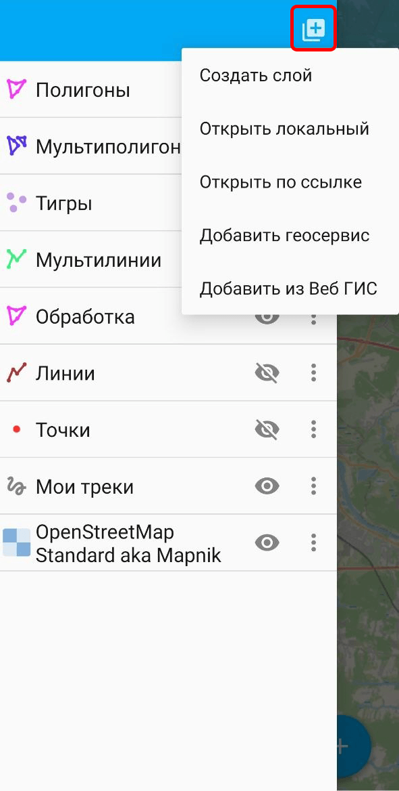
  
   Диалог "Добавить геоданные"

.. _ngmob_layer_menu:

Контекстное меню слоя
-----------------------

Контекстное меню слоя зависит от типа слоя (векторный или растровый).

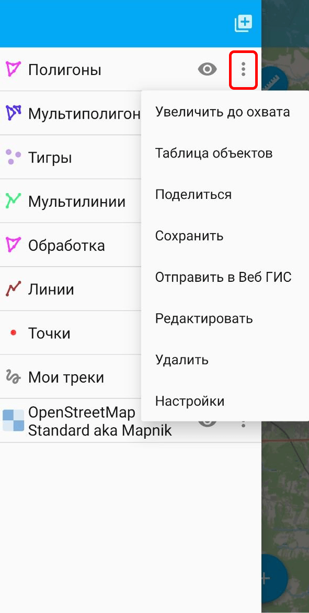

   Контекстное меню локального векторного слоя

В меню слоя доступны следующие операции:

* Увеличить до охвата;
* `Таблица объектов <https://docs.nextgis.ru/docs_ngmobile/source/main.html#ngmobile-attributes-table>`_ - для векторных слоёв;
* Поделиться;
* `Отправить в Веб ГИС <https://docs.nextgis.ru/docs_ngmobile/source/ngw_load.html#ngmobile-upload>`_ - для локальных слоёв;
* `Редактировать <https://docs.nextgis.ru/docs_ngmobile/source/editing.html>`_ - для векторных слоёв;
* Удалить;
* Настройки - переход к `настройкам выбранного слоя <https://docs.nextgis.ru/docs_ngmobile/source/layer_settings.html>`_.
 
.. warning::

   При выборе пункта "Удалить", слой удаляется с карты, а также удаляются все его данные с карты памяти.

.. _ngmobile_attributes_table:

Таблица объектов
-----------------

Таблица объектов предназначена для отображения и редактирования содержания векторного слоя в формате таблицы.

Для того чтобы открыть Таблицу объектов, откройте панель Дерева слоев |ic_layer_tree|, вызовите контекстное меню нужного слоя и выберите"Таблица объектов". 

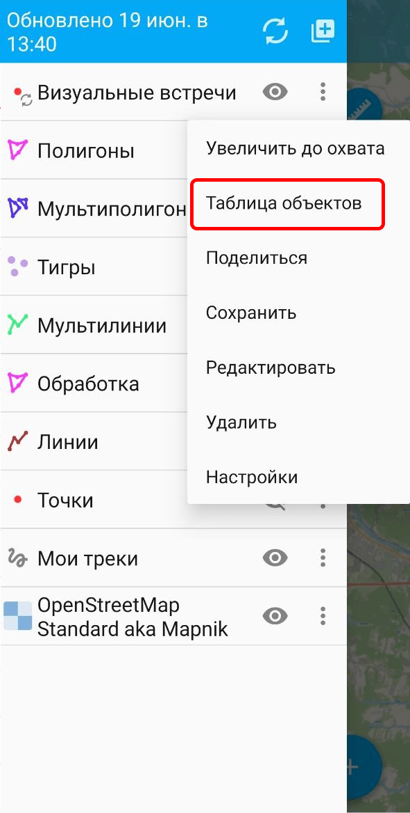
   
   Открытие таблицы объектов

Внешний вид таблицы объектов показан на :numref:`ngmobile_attributes_pic`.

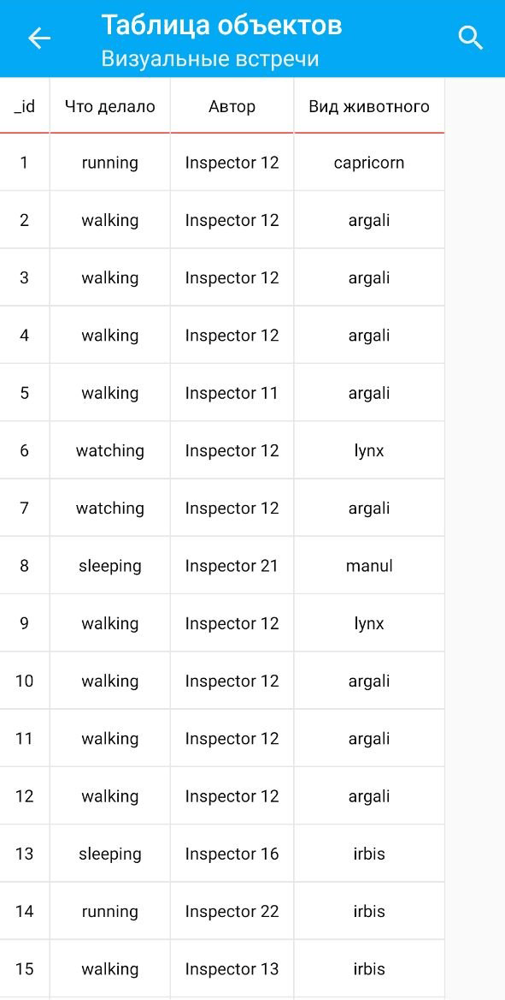
   
   Таблица объектов
   
Нажмите на строку в таблице, чтобы выбрать объект. В нижней части экрана появится панель инструментов. 

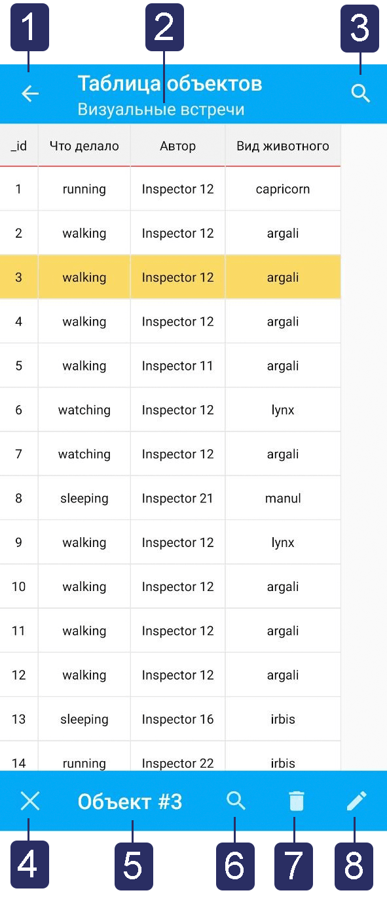
   
   Панель инструментов таблицы объектов
   
Цифрами обозначены: 

1. вернуться на главный экран;
2. название слоя; 
3. поиск;  
4. снять выделение; 
5. ID текущего объекта; 
6. показать выделенный объект на карте; 
7. удалить выделенный объект; 
8. открыть форму редактирования атрибутов объекта.

   
.. warning::

   При выборе пункта "Удалить" (см. :numref:`ngmobile_attribute_table_toolbar_pic`, п.7) объект сразу же удаляется. Отмена удаления возможна только в течение 5 секунд после удаления, после этого объект будет удален безвозвратно.   

В таблице объектов доступен поиск. Вы можете посмотреть на его работу в видео:

.. raw:: html

   <iframe width="560" height="315" src="https://rutube.ru/play/embed/8169ee33d4e137cf659f8015a552f1c4/" frameBorder="0" allow="clipboard-write; autoplay" webkitAllowFullScreen mozallowfullscreen allowFullScreen></iframe>

Посмотреть видео на `youtube <https://youtu.be/yPNAIxG9g3o>`_, `rutube <https://rutube.ru/video/8169ee33d4e137cf659f8015a552f1c4/>`_.

.. _ngmobile_useful_facilities:

Полезные опции
-----------------

В Главном окне приложения можно воспользоваться некоторыми опциями, полезными при работе в поле.

.. _ngmobile_show_my_location:

Показать мое местоположение
~~~~~~~~~~~~~~~~~~~~~~~~~~~

Для того, чтобы узнать свое текущее местоположение, нужно нажать на кнопку "Показать текущее местоположение" |ic_location| в правом верхнем углу. При этом на карте будет маркером |ic_location_standing| отмечено текущее местоположение, оно будет перемещно в центр экрана.

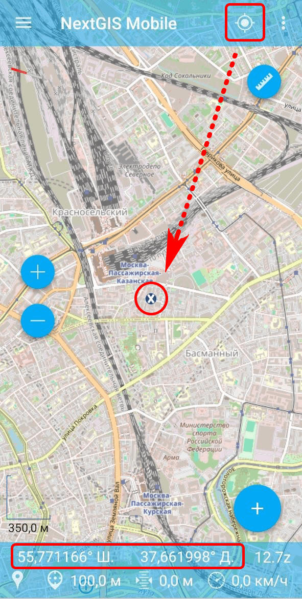

   Отображение текущего местоположения

Если панель статуса `активирована в соответствующем разделе настроек <https://docs.nextgis.ru/docs_ngmobile/source/settings.html#ngmobile-settings-map>`_, то информация о текущем местоположении будет доступна и в ней тоже.

.. note::
   Чтобы воспользоваться этой опцией, необходимо сначала разрешить приложению запрашивать доступ к местоположению устройства в настройках устройства ("Настройки" -> "Конфиденциальность" -> "Местоположение") и включить определение местоположения.

.. _ngmobile_measure:

Измерение расстояния и площади
~~~~~~~~~~~~~~~~~~~~~~~~~~~~~~~~

Можно измерить расстояние между двумя точками на карте. 

Для этого нужно нажать на кнопку |ic_ruler_round| "Линейка измерений" на экране карты. 

На экране появится первая точка. С помощью курсора |ic_action_anchor| её можно передвинуть в нужное место. Затем нажмите на экран, чтобы поставитть вторую точку, появится вторая точка и линия, соединяющая две точки. Расстояние между этими точками будет отображено на верхней панели.

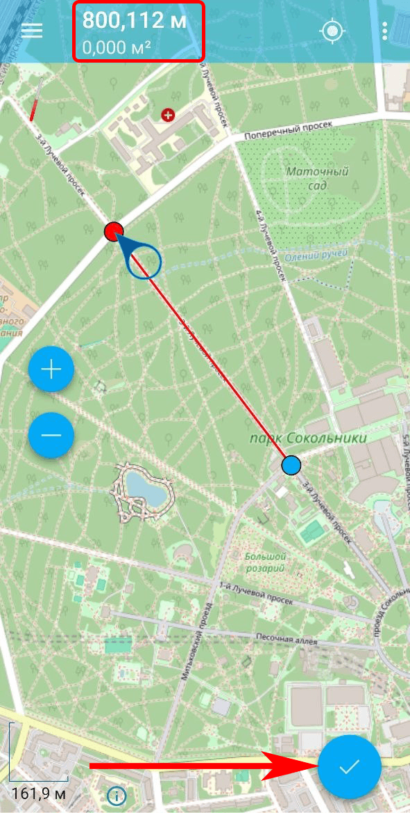
   
   Измерение расстояния. В правом нижнем углу - выход из режима измерения.

Для того чтобы выйти из режима измерения, нажмите на синюю галочку в правом нижнем углу экрана.

Положение любой точки может быть изменено, для этого нажмите на нее и переместите в нужную позицию с помощью курсора.

Можно добавить большее количество точек, чтобы измерить расстояние, образуемое ломаными линиями, а также измерить площадь образующихся полигонов.

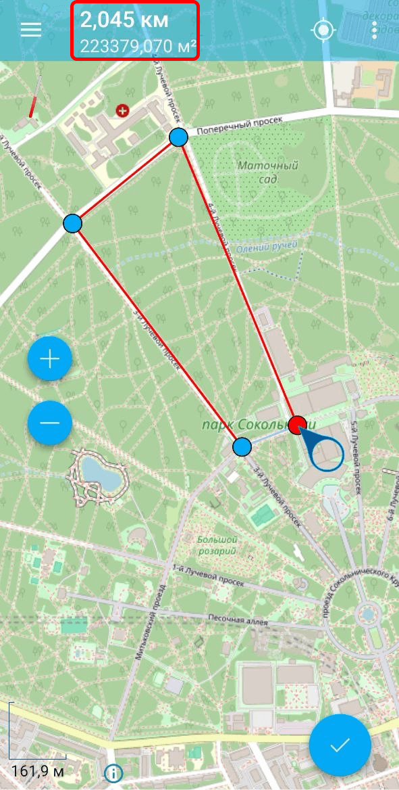

   Измерение площади ломаной линии и образуемого ею полигона (замыкающая сторона полигона рассчитывается автоматически, в измерении расстояния не учитывается)

.. note::
   Для того чтобы воспользоваться этой опцией, в `блоке настроек "Карта" <https://docs.nextgis.ru/docs_ngmobile/source/settings.html#ngmobile-settings-map>`_ должна быть включена "Линейка измерений".

.. _ngmobile_feature_info:

Показать информацию об объекте
~~~~~~~~~~~~~~~~~~~~~~~~~~~~~~~

Короткое нажатие на объект открывает меню внизу экрана, где единственным активном инструментом будет i в кружочке. Нажмите его, чтобы посмотреть значения атрибутов объекта и его вложения. 

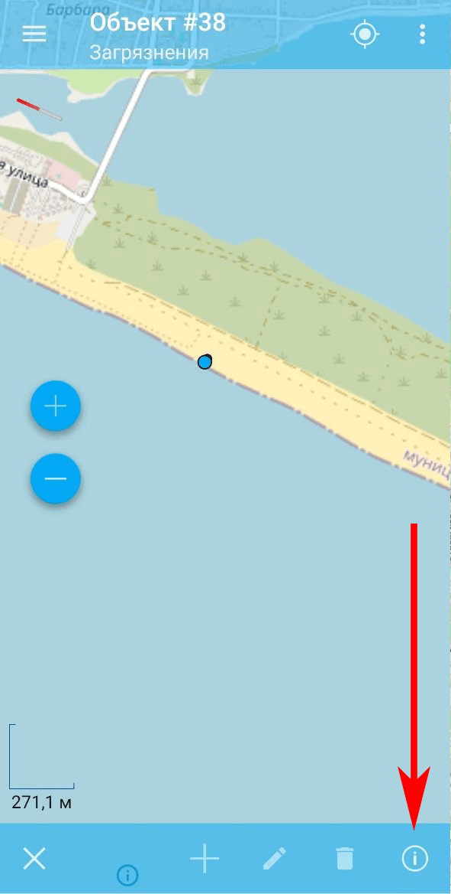

   Объект выбран на карте, активна кнопка перехода к информации об объекте

Фотографии, прикреплённые к этому объекту, таже доступны к просмотру.

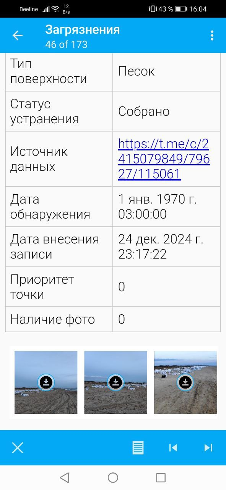

   Просмотр объекта с фотографиями

Если в точке нажатия несколько объектов, будет предложен список для выбора.

.. |ic_walk| image:: _static/ic_walk.png
   :width: 7mm
   :alt: человечек

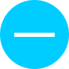

.. |ic_action_anchor| image:: _static/ic_action_anchor.png
   :width: 7mm
   :alt: синяя стрелка с кружком