.. _ngmobile_gui:

User interface
==========================

NextGIS Mobile app has four main elements:

* `Main screen of the app <https://docs.nextgis.com/docs_ngmobile/source/main.html#ngmobile-main-activity>`_;
* `Layer tree <https://docs.nextgis.com/docs_ngmobile/source/main.html#ngmobile-layer-tree>`_;
* `Feature table <https://docs.nextgis.com/docs_ngmobile/source/main.html#ngmobile-attributes-table>`_;
* `Settings <https://docs.nextgis.com/docs_ngmobile/source/settings.html>`_.

The app interface is developed according to `Google Material design <http://www.google.com/design/spec/material-design/introduction.html>`_ guidelines.

.. _ngmobile_main_activity:

Main screen
------------

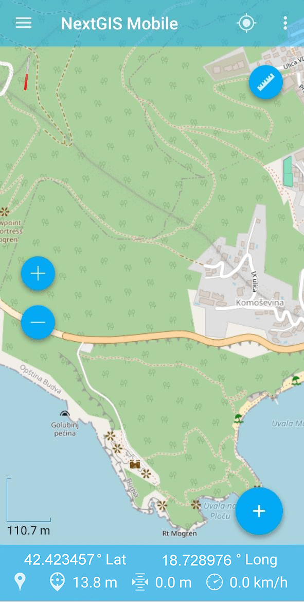
   
   Main screen of the app
   
On the top of the screen you can find the **Toolbar** (controls that don't fit into the bar are moved to the menu |ic_menu|):

* |ic_layer_tree| `Layer tree <https://docs.nextgis.com/docs_ngmobile/source/main.html#ngmobile-layer-tree>`_;
* Title of the app;
* |ic_location| `Current location <https://docs.nextgis.com/docs_ngmobile/source/main.html#ngmobile-show-my-location>`_;
* |ic_walk| `Start track <https://docs.nextgis.com/docs_ngmobile/source/tracks.html#ngmobile-record-tracks>`_;
* `Settings <https://docs.nextgis.com/docs_ngmobile/source/settings.html>`_;
* Help - you can view the current version of the app and open this documentation.

The majority of the main screen is occupied by the **Map** containing raster and vector layers. 
You can change the order and visibility of the map in the Layer tree.

The map has the following controls:

* |ic_zoom_in| |ic_zoom_out| Zoom;
* Main actions button - |ic_big_plus| big round blue button with a + in the bottom right corner.

Also you can enable:

* |ic_ruler_round| Ruler to activate measuring (enable: :menuselection:`Settings --> Map --> Ruler`);
* Scale ruler (shown in the bottom left corner, enable: :menuselection:`Settings --> Map --> Show scale ruler`).

At the bottom of the main window the **Status panel** can be displayed (configured in :menuselection:`Settings -> Map -> Show status info panel`). Depending on the screen size the Status panel can be one or two rows.

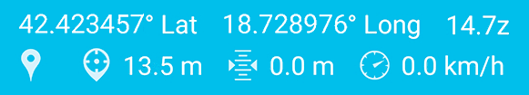

   Status panel

The Status panel displays the following information, if geolocation is on:

* coordinates (latitude and longitude);
* current zoom level (enabled in `Settings --> Map --> Show zoom level`);
* |ic_accuracy| Positioning signal source (mobile networks/Wi-Fi or satellite) and number of captured satellites (if positioning is carried out with help of :term:`GPS`/:term:`GLONASS`);
* |ic_altitude| altitude in meters;
* |ic_speed| speed in kmph.

.. _ngmobile_layer_tree:

Layer tree
------------

Layer tree is used to display and manage the contents of the map, the order of the layers and their visibility.  Tap |ic_layer_tree| in the top left corner to open it.

Action on layers can be found in the `layer menu <https://docs.nextgis.com/docs_ngmobile/source/main.html#ngmob-layer-menu>`_ |ic_menu_grey|. 

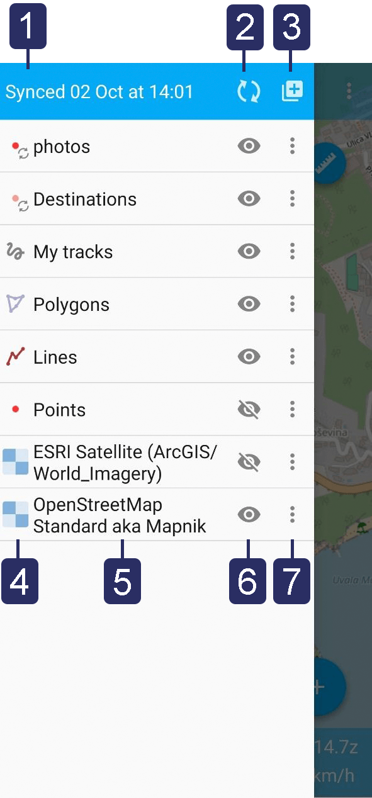
   
   Layer tree
   
The numbers indicate: 

1. time of the last synchronizations; 
2. |ic_sync| sync indicator; 
3. |button_add_layer| `"Add data" <https://docs.nextgis.com/docs_ngmobile/source/main.html#layer-tree-menu>`_ menu; 
4. layer type; 
5. layer name; 
6. |ic_eye| layer visibility control; 
7. |ic_menu_grey| `layer menu <https://docs.nextgis.com/docs_ngmobile/source/main.html#ngmob-layer-menu>`_ . 

Layers are displayed in the order they are in the layer tree, higher layers covering the lower layers. To change the order, hold a layer and drag it to the new place.

To toggle layer visibility tap on the eye icon |ic_eye| next to its name.

.. _layer_tree_menu

Add data
---------

The button "Add data" |button_add_layer| at the top of the layer tree panel allows to:

* `Create a new layer from scratch <https://docs.nextgis.com/docs_ngmobile/source/load_geodata.html#ngmobile-create-vector>`_;
* `Open a local file <https://docs.nextgis.com/docs_ngmobile/source/load_geodata.html#ngmobile-import-vector>`_ stored on your device;
* `Open link to a Web GIS layer to add it <https://docs.nextgis.com/docs_ngmobile/source/ngw_load.html#ngmob-url>`_;
* `Add geoservice <https://docs.nextgis.com/docs_ngmobile/source/load_geodata.html#ngmobile-add-geoservice>`_ from the `QuickMapServices catalog <https://qms.nextgis.com/>`_ or `a custom tile service <https://docs.nextgis.com/docs_ngmobile/source/load_geodata.html#ngmobile-tile-service>`_;
* `Add layer from Web GIS <https://docs.nextgis.ru/docs_ngmobile/source/ngw_load.html#ngmobile-add-layer-webgis>`_, cloud or on-premise.

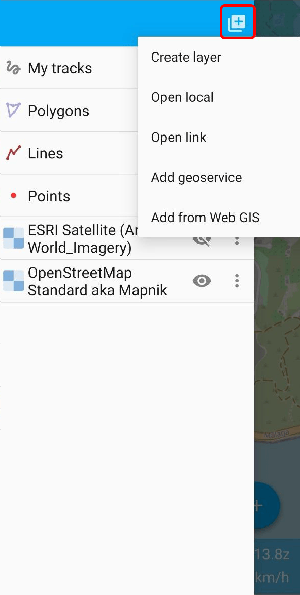
  
   "Add data" menu

.. _ngmob_layer_menu:

Layer menu
-----------------------

To open the layer menu, open the Layer tree panel |ic_layer_tree| and click on the tree dots |ic_menu_grey| next to the layer.

The contents of the menu depend on the layer type (vector or raster).

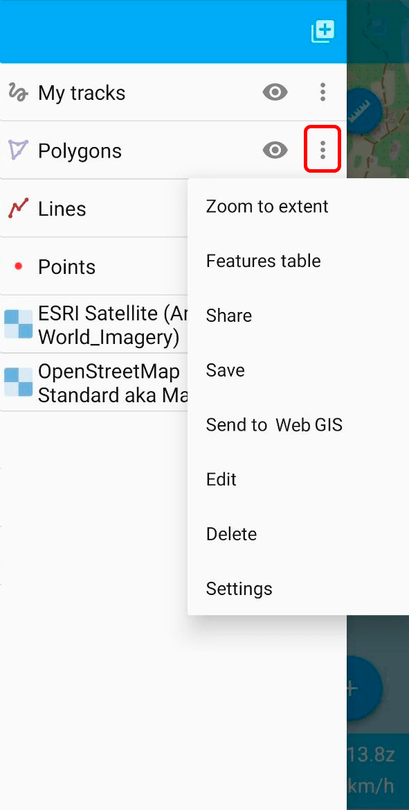

   Vector layer menu

In the layer menu there are the following actions:

* Zoom to extent;
* `Feature table <https://docs.nextgis.com/docs_ngmobile/source/main.html#ngmobile-attributes-table>`_ - for vector layers;
* `Share <https://docs.nextgis.com/docs_ngmobile/source/share.html>`_;
* `Send to WebGIS <https://docs.nextgis.com/docs_ngmobile/source/ngw_load.html#ngmobile-upload>`_ - for local layers;
* `Edit <https://docs.nextgis.com/docs_ngmobile/source/editing.html>`_ - for vector layers;
* Delete;
* Settings - opens the `layer settings <https://docs.nextgis.com/docs_ngmobile/source/layer_settings.html>`_.
 
.. warning::

   When you click **Delete**, the layer is removed from the map and all its data is wiped from the device memory.

.. _ngmobile_attributes_table:

Feature table
-----------------

Features table is designed for displaying and managing the contents of a vector layer in table format.

To open the Feature table, open the Layer tree panel вызовите контекстное меню |ic_menu_grey|, open the menu |ic_menu_grey| of the layer and select **Feature table**. 

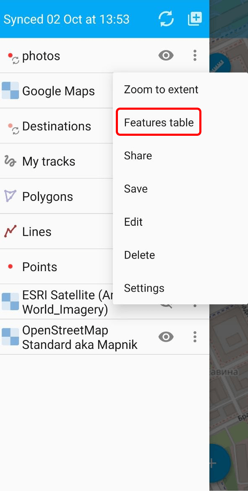
   
   Opening feature table

.

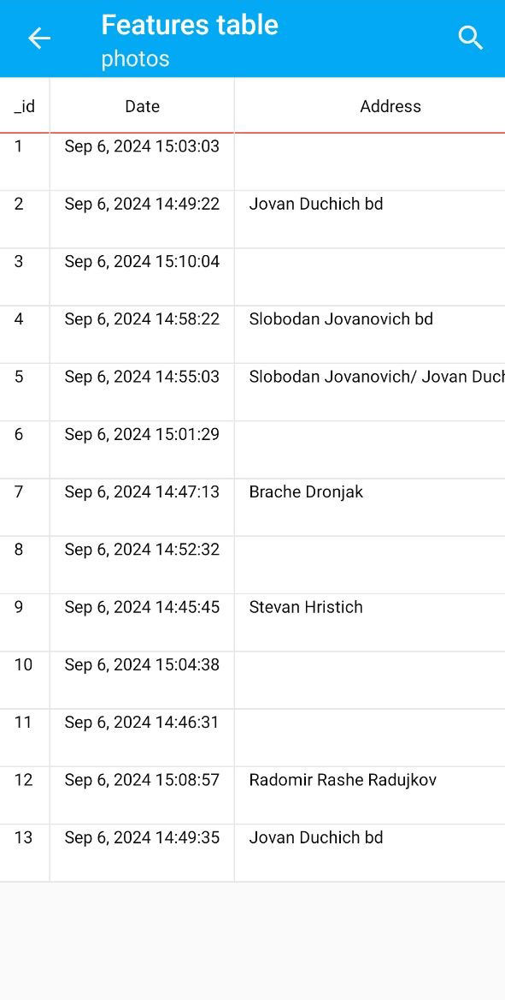
   
   Feature table
   
Tap on a row to select a feature. A toolbar appears at the bottom of the screen. 

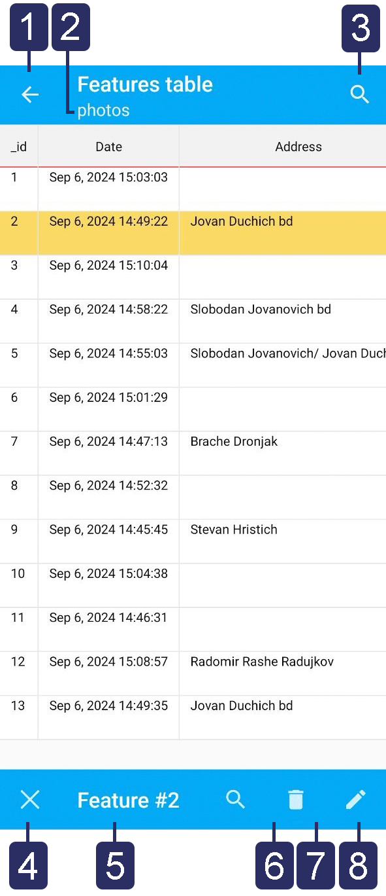
   
   Feature table tools
   
The numbers indicate: 

1. |ic_back| go back to the main screen;
2. layer name; 
3. |ic_search| search;  
4. |ic_cancel| clear selection; 
5. ID of the selected feature; 
6. |ic_search| show the feature on the map (if you have many features close together, firt zoom in so that only few of them are visible at a time, then select the feature in the feature table and click this icon. The map will pan to the feature staying on the same zoom level); 
7. |ic_delete| delete selected feature; 
8. |ic_edit| open attribute editing form.

   
.. warning::

   When you tap "Delete" |ic_delete|, a confirmation pop-up appears. Double-check if you've selected the correct feature before confirming. You cannot undo deleting a feature!   

Feature table has a search bar. See it in action in our video:

.. raw:: html

   <iframe width="560" height="315" src="https://www.youtube.com/embed/9zKwvKlQWyg?si=S6WIzdLE6PRndbV3" title="YouTube video player" frameborder="0" allow="accelerometer; autoplay; clipboard-write; encrypted-media; gyroscope; picture-in-picture; web-share" referrerpolicy="strict-origin-when-cross-origin" allowfullscreen></iframe>

Watch on `YouTube <https://youtu.be/9zKwvKlQWyg?si=DVXos2s3V1Jn4-Oe>`_.

.. _ngmobile_useful_facilities:

Useful features
-----------------

The main screen has some useful tools, especially handy for fieldwork.

.. _ngmobile_show_my_location:

Show my location
~~~~~~~~~~~~~~~~~~~~~~~~~~~

To view your current location, tap on |ic_location| button in the top right corner. The map is panned to the device location which is marked by |ic_location_standing|.

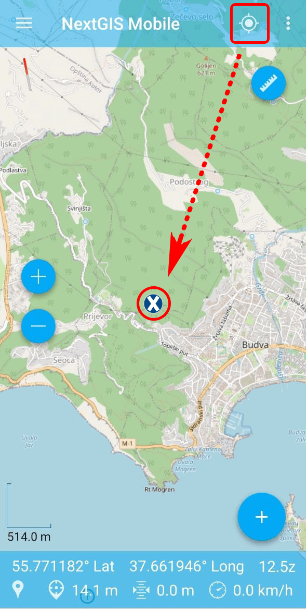

   Showing current location

If the Status panel is `enabled in the settings <https://docs.nextgis.com/docs_ngmobile/source/settings.html#ngmobile-settings-map>`_, it too shows information on current location.

.. note::
   To use this option, make sure the app has permission to access your device location (check in your device settings, the exact place depends on the model) and the geolocation is on.

.. _ngmobile_measure:

Measure distance and area
~~~~~~~~~~~~~~~~~~~~~~~~~~~~~~~~

You can measure distance between two points on the map. 

Tap on the ruler button |ic_ruler_round| in the top right corner. 

Starting point appears on the screen. Use the cursor |ic_action_anchor| to move the point to where you need it. Then tap on the screen to add the second point. A line connecting the two points appears, its length is displayed in the top panel.

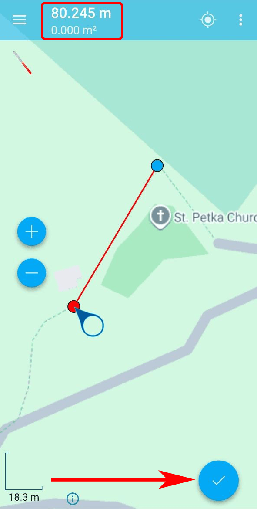
   
   Measuring distance. Tap the tick button in bottom right corner to exit

To exit the measuring mode tap the blue tick in the bottom right corner of the screen.

You can adjust the position of any of the points. Tap on it and move it using the cursor.

Add more points to measure the length of a string of lines as well as the area of the resulting polygon.

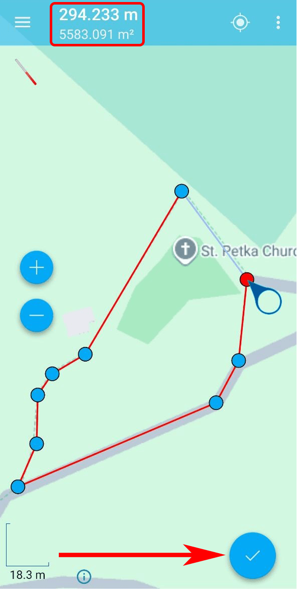

   Measuring length of a line and area of the polygon it makes (the last side of the polygon is calculated automatically, it is not included in the length measurement)

.. note::
   To use this tool, enable it in :menuselect:`Settings -> Map -> Show measuring button`.

.. _ngmobile_feature_info:

View feature info
~~~~~~~~~~~~~~~~~~~~~~~~~~~~~~~

Short tap on a feature opens a panel at the bottom of the screen with only one active tool - information |ic_info|. Tap it to view the attribute values and attachments of the feature. 

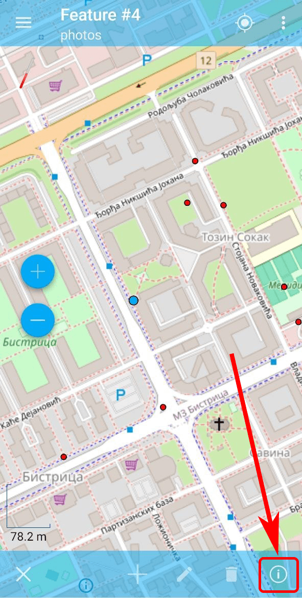

   A feature is selected, information button is active

Photos attached to the feature also can be viewed.

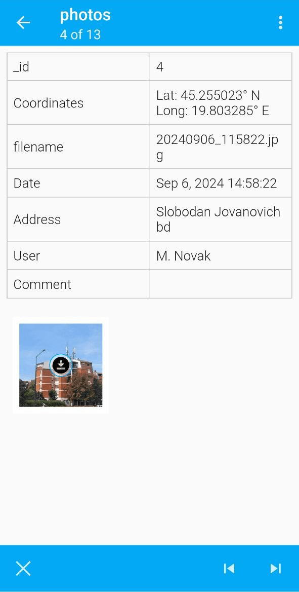

   Viewing a feature with attachments

If there are multiple features in the area of your tap, select the one you need from the list.

.. |ic_menu| image:: _static/ic_menu.png
   :width: 7mm
   :alt: tree dots

.. |ic_menu_grey| image:: _static/ic_menu_grey.png
   :width: 3mm
   :alt: tree dots

.. |ic_layer_tree| image:: _static/ic_layer_tree.png
   :width: 7mm
   :alt: three lines

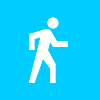

.. |button_add_layer| image:: _static/button_add_layer.png
   :width: 6mm
   :alt: double squares with "+"

