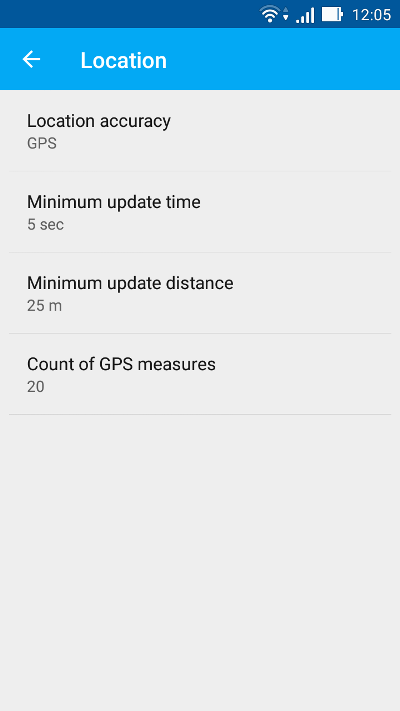
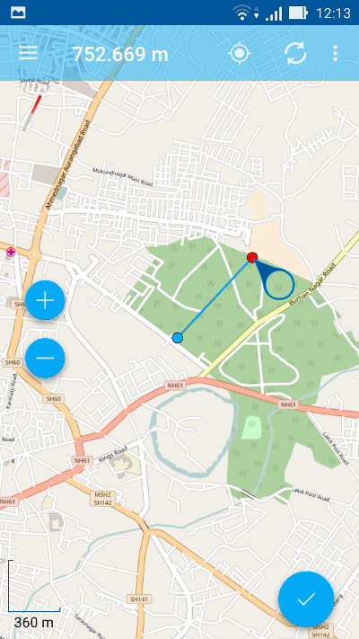

.. sectionauthor:: Dmitry Baryshnikov <dmitry.baryshnikov@nextgis.ru>, Abhay Kulkarni <praxisnfp@gmail.com>

.. _ngmobile_gui:

User interface (UI)
==========================

There are 4 major elements of NextGIS Mobile UI:

* Main screen
* Layers tree panel
* Attributes table
* Settings dialogue

UI is designed in accordance with `Google Material design <http://www.google.com/design/spec/material-design/introduction.html>`_ guidelines.

.. _ngmobile_main_activity:

Main screen
------------

Main screen is shown on :numref:`ngmobile_main_activity_pic_1`.

.. figure:: _static/ngmobile_mainscreen_1.png
   :name: ngmobile_main_activity_pic_1
   :align: center
   :height: 10cm
   
   Main screen.

   The numbers indicate: 1 - Layers tree panel icon; 2 - Application title; 3 – "Show my location" button; 4 - "Load/Refresh geodata" button; 5 - Contextual menu icon; 6 - Measuring button; 7 - Map screen; 8 - Main actions button
   ; 9 - Status info panel.

The number of buttons in top toolbar depends on your device screen size. If the buttons don't fit into the toolbar they are moved to the contextual menu (item 5 in :numref:`ngmobile_main_activity_pic_1`).

**Top toolbar** contains the following buttons:

* Show my location
* Load or refresh geodata
* Start new track
* Settings
* About

**Status info panel** (item 9 in :numref:`ngmobile_main_activity_pic_1`) can be shown at the bottom of the Main screen (if it is activated in the Settings - Map - Show status info panel). Status info panel shows (if there is the fixed location):

* Device coordinates (latitude and longitude);
* Positioning signal source (mobile networks/Wi-Fi or satellite) and number of captured satellites (if positioning is carried out with help of :term:`GPS`/:term:`GLONASS`);
* Device altitude (meters);
* Device speed (kmph)

Depending on the size of the screen Status info panel can occupy one or two rows.

A map (item 7 in :numref:`ngmobile_main_activity_pic_1`) is a set of raster and vector layers. 
The order and the visibility of layers are under control of layers tree (:ref:`ngmobile_layer_tree`).

After a long hold of your finger on the vector layer's geometry the map window 
turns to the select mode. 

.. _ngmobile_layer_tree:

Layers tree
------------

Layers tree panel is designed to display the content of a map and to control visibility and hierarchy of map layers. Additional operations with layers are available from a separate layer contextual menu. Layers tree panel is shown on :numref:`ngmobile_layer_tree_pic`.

.. figure:: _static/ngmobile_layertree.png
   :name: ngmobile_layer_tree_pic
   :align: center
   :height: 10cm
   
   Layers tree panel.

   The numbers indicate: 1 - Layer type; 2 - Layer name; 3 - Layer visibility button; 4 - Add geodata; 5 - Layer contextual menu icon; 6 - Layer contextual menu items.
   
To change the hierarchy of map layers long-press the layer which is to be moved up or down. Layers tree panel will switch to Edit mode. Keep pressing and move the selected layer to its new position.

For turning layer visibility on/off tap on Layer visibility button (item 3 in :numref:`ngmobile_layer_tree_pic`).

"Add geodata" button (item 4 in :numref:`ngmobile_layer_tree_pic`) allows you to create vector layers and import vector and raster layers from Android local storage, `QuickMapServices catalog <https://qms.nextgis.com/>`_, `nextgis.com <https://my.nextgis.com/signup/?next=/webgis/>`_ or `NextGIS Web <http://nextgis.com/nextgis-web/>`_. This button contains the next menu (:numref:`options_menu_new_layer`):

* Create layer;
* Open local;
* Add geoservice;
* Add from NextGIS.

   
   Add geodata dialogue.

By using "Open local" menu item you can upload :term:`geodata` from local storage in one of the following formats:

* :term:`GeoJSON` file;
* ZIP file with cached tiles;
* *.ngrc file
* *.ngfp file.

More information about geodata upload can be found in ":ref:`ngmobile_load_geodata`" section.

Layer contextual menu depends on layer's type (whether it is vector or raster layer). When you tap the Contextual menu button (item 5 in :numref:`ngmobile_layer_tree_pic`) contextual menu items pop up as shown by item 6 in :numref:`ngmobile_layer_tree_pic`

* Zoom to extent
* Attributes
* Share
* Edit
* Delete
* Settings

.. warning::
   By pressing "Delete" you not only remove layer from the map but also erase all its data from the local storage.

.. _ngmobile_attributes_table:

Attributes table
-----------------

Attributes table is designed to show and manage the contents of each vector layer in table format.

To open Attributes table activate Layers tree panel and tap on the Contextual menu button next to the vector layer name (item 5 in :numref:`ngmobile_layer_tree_pic`). This will pop up the contextual menu items as shown by item 6 in :numref:`ngmobile_layer_tree_pic`. There you need to select "Attributes". Depending on the screen size the panel could occupy the whole screen or just the right side (in this case there is a map with a highlighted geometry of the current attributes on the left side). 

Attributes table opens as shown in :numref:`ngmobile_attribute_table_pic` below.

.. figure:: _static/attribute_table.png
   :name: ngmobile_attribute_table_pic
   :align: center
   :height: 10cm
   
   Attributes Table.

If you tap any record (row) in the table, the Attributes table toolbar appears at the bottom of the screen. This toolbar allows to manage features as shown below in :numref:`ngmobile_attribute_table_toolbar_pic`.

.. figure:: _static/attribute_table_toolbar.png
   :name: ngmobile_attribute_table_toolbar_pic
   :align: center
   :height: 10cm
   
   Attributes table toolbar.
   
   The numbers indicate: 1 - Close Attributes table; 2 - Layer name; 3 - Features attributes;  4 - Close toolbar; 5 - Selected feature ID; 6 - Show selected feature on the map; 7 - Delete selected feature; 8 - Open Attributes editing form.
   
You can open the standard Attributes editing form as shown in :numref:`ngmobile_input_form_attributes_pic` by selecting "Open Attributes editing form" (see item 8 in :numref:`ngmobile_attribute_table_toolbar_pic`)  
   
.. warning::
   If you tap on "Delete" button (see item 7 in :numref:`ngmobile_attribute_table_toolbar_pic`), the system will delete the selected feature immediately. You will be able to undo the removal, but if undo action is not applied in 5 seconds after removal, the feature gets deleted permanently.   

.. _ngmobile_settings:

Settings dialogue
------------------

Depending on the screen size Settings dialogue can fit into one or two panels. Settings dialogue is shown on :numref:`ngmobile_settings_pic` (one panel mode).

.. figure:: _static/ngmobile_settings.png
   :name: ngmobile_settings_pic
   :align: center
   :height: 10cm
   
   Settings.

There are following Settings on the main panel:

* General
* Map
* Location
* My tracks
* NextGIS Settings

"General" settings allow to change basic settings of the map (see :numref:`ngmobile_settings_general_pic`).

   
   General settings.
   
Here you can select the theme (Light or Dark) and tune up compass settings.

"Map" settings allow to change basic settings of the map (see :numref:`ngmobile_settings_map_pic`).

.. figure:: _static/ngmobile_settings1.png
   :name: ngmobile_settings_map_pic
   :align: center
   :height: 10cm
   
   Map settings.

Map settings include:

* Show/hide Status info panel
* The way current location displays (show current location, show marker, how marker & accuracy radius)
* Show mini compass
* Do not turn off the screen when map displays - works only on the map screen
* Show/hide zoom control buttons
* Show scale ruler
* Show measuring button
* Coordinates format (for coordinates in Status bar and other dialogs and screens)
* Map background (light, dark, neutral)
* Map path (here you can specify a path where map and layers data will be stored)

.. note::
	For devices with several SD cards and Android 4.4 and higher, map path not on the main SD card can only be specified in the application home directory and its subdirectories (for example: Android/data/com.nextgis.mobile). This is also true for some devices without root access. Read-only folders won't show up in path selection dialog.

"Location" settings offer a few location specific settings (see :numref:`ngmobile_settings_place_pic`).

   
   Location settings.

Location settings include:

* Coordinate source (mobile networks/Wi-Fi + :term:`GPS`, Other networks or only GPS)
* Minimum update time
* Minimum update distance
* Count of GPS fixes

"Tracks" settings are similar to the location settings, but they are applied only for track recording.

.. note::
   If you set value of the minimum update distance at more than 5 m, the operating system will start to smooth the track (remove outliers).

.. _ngmobile_useful_facilities:

Useful features
-----------------

From the Main screen itself you can access a couple of features useful in the field.

.. _ngmobile_show_my_location:

Show my location
^^^^^^^^^^^^^^^^

To know your current location, just tap on the "Show my location" button (see item 3 in :numref:`ngmobile_main_activity_pic_1` above). This will show your current location on the map screen with a marker. If your Status info panel (see item 9 in :numref:`ngmobile_main_activity_pic_1` above) is switched on via appropriate Map settings (see :numref:`ngmobile_settings_map_pic`) you'll also be able to view the relevant information there.

.. note::
   Your "Location" settings must be switched ON in your Android mobile settings.
   
Measure distance
^^^^^^^^^^^^^^^^

It is possible to measure the distance between two points directly on the map screen. Just tap on the Measuring button on Map screen (see item 6 in :numref:`ngmobile_main_activity_pic_1` above). Tap on your starting point (a new point in Edit mode will appear on the screen). Then tap on your finishing point (a second point in Edit mode and line between the points will appear on the screen). The distance between two points will be shown in Top toolbar. See :numref:`ngmobile_measure_distance_pic` below for illustration.

   
   Measure distance.

You can add further points, to measure distance of complex lines and smooth curves, as well as measure areas of the formed polygons. 

Position of any point may be edited by tapping on it and dragging it to the correct location.

To exit Measure mode tap the blue tick button in the corner of the screen.

.. note::
   To use this feature "Show measuring button" checkbox must be switched ON in Map settings (see :numref:`ngmobile_settings_map_pic`).
