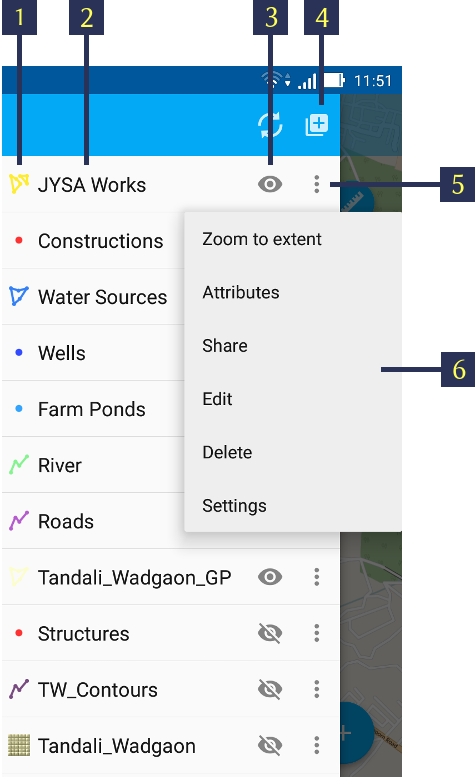

.. sectionauthor:: Дмитрий Барышников <dmitry.baryshnikov@nextgis.ru>

.. _ngmobile_gui:

Пользовательский интерфейс
==========================

В пользовательском интерфейсе имеется ряд основных экранов:

* главное окно приложения;
* выезжающая панель дерева слоев;
* окно настроек.

Интерфейс приложения выполнен в соответствии с руководством `Google Material design <http://www.google.com/design/spec/material-design/introduction.html>`_.

.. _ngmobile_main_activity:

Главное окно
------------

Главное окно приложения представлено на :numref:`ngmobile_main_activity_pic`.

.. figure:: _static/ngmobile_mainscreen.png
   :name: ngmobile_main_activity_pic
   :align: center
   :height: 11cm
   
   Главное окно приложения.
   
   Цифрами обозначено: 1 - кнопка открытия дерева слоев; 2 - заголовок приложения; 3 - кнопка добавления новых геоданных; 4 - кнопка позиционирования окна карты в текущих координатах; 5 - кнопка меню; 6 - карта; 7 - кнопка меню основных операций; 8 - информационная панель.
   
В зависимости от размера экрана в верхней панели инструментов может быть больше или меньше кнопок. Все что не помещается на панель инструментов, переносится в меню (см. :numref:`ngmobile_main_activity_pic` п. 5).

Панель инструментов имеет следующий состав:

* добавить :term:`геоданные`;
* переместить карту в текущее местоположение;
* начать запись трека;
* настройки;
* о программе.

Карта (см. :numref:`ngmobile_main_activity_pic` п. 6) представляет собой набор растровых и векторных слоев. Порядок и видимость слоев настраивается при помощи дерева слоев (см. :ref:`ngmobile_layer_tree`).

При нажатии на кнопку панели инструментов "добавить геоданные" (см. :numref:`ngmobile_main_activity_pic` п. 3) открывается меню следующего состава:

* локальный
* веб
* NGW

Выбор пункта меню "локальный" открывает системный диалог выбора данных, в котором можно выбрать как локальные :term:`геоданные` (на карте памяти), так и с облачных хранилищ. Приложение позволяет загружать следующие геоданные:

* файл формата :term:`GeoJSON`;
* файл формата ZIP с тайловым кэшем;
* файл формата ngfb.

Подробнее о загрузке геоданных описано в разделе ":ref:`ngmobile_load_geodata`".
   
При долгом удержании пальца на геометрии векторного слоя окно карты переходит в режим выбора действия (см. :numref:`ngmobile_selectmode_pic`). 

.. figure:: _static/ngmobile_selectmode.png
   :name: ngmobile_selectmode_pic
   :align: center
   :height: 11cm
   
   Окно карты в режиме выделения.
   
   Цифрами обозначено: 1 - выделенная геометрия; 2 - просмотр атрибутов; 3 - удаление геометрии; 4 - редактирование геометрии; 5 - завершение режима выделения.

Если открыта информационная панель, то она будет скрыта, и на ее месте будет выведена нижняя панель инструментов, которая имеет следующий состав команд:

* отменить режим;
* перейти к редактированию выбранной геометрии (см. :ref:`ngmobile_editing`);
* удалить выделенную геометрию;
* показать панель с атрибутами выбранной геометрии.

При выборе режима показа атрибутов открывается отдельная панель с атрибутами. В зависимости от размера экрана панель может раскрываться на весь экран или занимать правую часть экрана (слева отображается карта с подсвеченной геометрией текущего набора атрибутов). Панель атрибутов показана на :numref:`ngmobile_attributes_pic`.

.. figure:: _static/ngmobile_attributes.png
   :name: ngmobile_attributes_pic
   :align: center
   :height: 10cm
   
   Панель атрибутов.
   
В режиме показа атрибутов в нижней панели инструментов отображаются кнопка завершения просмотра атрибутов и кнопки перехода между записями (если информационная панель была активна, то она скрывается). 

В нижней части экрана может размещаться панель информации (если включена соответсвующая опция в настройках). 
В панели информации отображается следующая информация (при наличии зафиксированного местоположения):

* координаты (широта и долгота);
* источник сигнала позиционирования (сотовые сети/Wi-Fi или спутник), а также количество спутников, которые фиксируют местоположение (если позиционирование осуществляется при помощи :term:`GPS`/:term:`ГЛОНАСС`);
* высота в метрах;
* скорость движения в км/ч.

В зависимости от размера экрана панель может занимать одну или две строки.    

.. _ngmobile_layer_tree:

Дерево слоев
------------

Дерево слоев предназначено для просмотра состава карты и управлением видимостью и порядком слоев на карте. Дополнительные операции над слоями вынесены в отдельное меню слоя. Дерево слоев представлено на :numref:`ngmobile_layer_tree_pic`.

   
   Дерево слоев карты.
   
   Цифрами обозначено: 1 - иконка слоя; 2 - название слоя; 3 - кнопка переключения видимости слоя; 4 - кнопка вызова контекстного меню слоя; 5 - контекстное меню слоя.
   
Для изменения порядка слоев нужно на слое, который необходимо переместить, выполнить долгое нажатие на экран устройства. При этом список перейдет в режим изменения порядка слоев. Далее, не отнимая пальца от экрана, необходимо переместить слой в новую позицию.

Для включения/выключения видимости слоя достаточно нажать на соответствующую иконку (см. :numref:`ngmobile_layer_tree_pic`, п. 3).

Контекстное меню слоя зависит от его типа. Для векторного слоя меню имеет следующий состав:

* настройки слоя;
* экспорт слоя (см. :ref:`ngmobile_share`);
* удаление слоя.

При выборе пункта "удаление слоя", слой удаляется с карты, а также удаляются все его данные с карты памяти.

.. _ngmobile_settings:

Окно настроек
-------------

В зависимости от размера экрана окно настроек может быть однопанельным и двупанельным. Окно настроек представлено на :numref:`ngmobile_settings_pic` (однопанельный режим). 

.. figure:: _static/ngmobile_settings.png
   :name: ngmobile_settings_pic
   :align: center
   :height: 10cm
   
   Окно настроек.
   
На основной панели имеются следующие блоки настроек:

* карта
* местоположение
* треки
* NextGIS Web

Блок настроек "Карта" содержит основные настройки карты (см. :numref:`ngmobile_settings_map_pic`).

.. figure:: _static/ngmobile_settings1.png
   :name: ngmobile_settings_map_pic
   :align: center
   :height: 10cm
   
   Окно настроек карты.
   
Настройки карты имеют следующий состав:

* отображать/скрыть панель статуса (информационную панель);
* каким образом показывать текущее местоположения (показывать местоположение и точность, только местоположение, не показывать местоположение);
* при показе карты не выключать экран (работает только в окне карты);
* отображать/скрыть кнопки управления масштабом;
* формат вывода координат (действует на отображение координат в панели статуса и других диалогах и окнах);
* путь к карте (можно указать свой путь для хранения данных карты и слоев геоданных). 

.. note::
   В случае наличия устройства с несколькими SD карточками и ОС Android 4.4 (KitKat) и выше, путь к карте 
   на не основной SD карточке может быть указан только в домашнюю директорию приложения и ее подпапки 
   (например, Android/data/com.nextgis.mobile). Это справедливо для некоторых устройств без root прав.
   При отображении диалога выбора, папки, в которые запрещена запись, не будут иметь отметки для их выбора.

Блок настроек "Местоположения" содержит настройки карты (см. :numref:`ngmobile_settings_place_pic`).

.. figure:: _static/ngmobile_settings2.png
   :name: ngmobile_settings_place_pic
   :align: center
   :height: 10cm
   
   Окно настроек местоположения.
  
Настройки местоположения имеют следующий состав:
  
* источник координат (Сотовая сеть/Wi-Fi + :term:`GPS` или только GPS);
* минимальное время для снятия координат;
* минимальное расстояние для снятия координат.

Настройка треков аналогична настройкам местоположения, но влияет на запись треков.

.. note::

   Если поставить значение минимального расстояния получения координат более 5 м, то операционная система начинает сглаживать трек (убирает выбросы).
   
