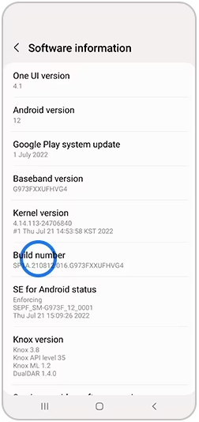
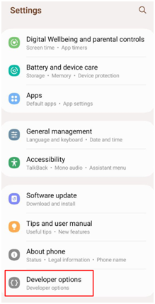
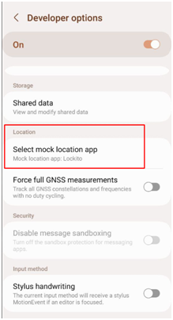
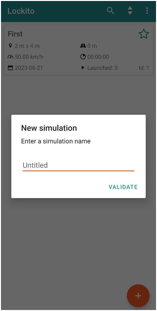
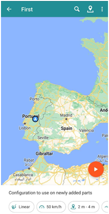
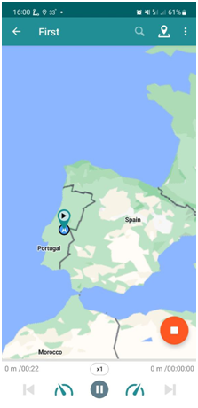

Подключение внешнего источника координат
=============================================

Как использовать стороннее приложение в качестве источника текущего местоположения устройства.

Установите приложение, которое умеет подменять координаты. Например, `такое <https://lockito-app.com/>`_.

Включите режим разработчика на своем смартфоне.
Для этого нажмите **7** раз на **номер сборки** (Раздел Об устройстве).

   
   Включение режима разработчика

В настройках Режима разработчика выберите приложение для подмены координат, установленное в пункте 1.

   
   Открытие настроек режима разработчика

   
   Выбор внешнего приложения-источника координат

Включите приложение для подмены координат.
Создайте первую подмену, назовите ее.

   
   Создание подмены координат

Выберите точку на карте (или воспользуйтесь текущим), нажмите иконку Play.

   
   Выбор точки на карте

   
   Симуляция запущена

С этого момента ваш смартфон принимает координаты вашего текущего местоположения от запущенного приложения. Запустите NextGIS Mobile, чтобы в этом убедиться.

.. figure:: _static/ngm_simulated_location_en.png
   :name: ngm_simulated_location_pic
   :align: center
   :width: 6cm
   
   Координаты из внешнего источника в NextGIS Mobile
