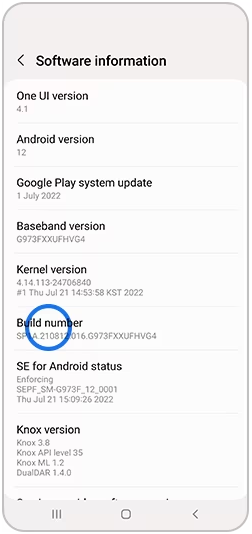
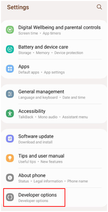
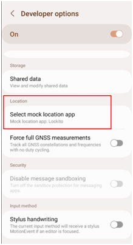
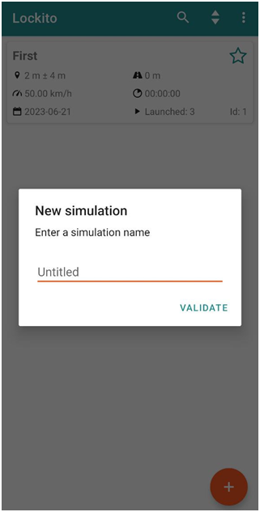
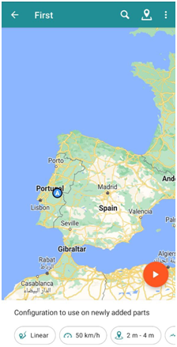
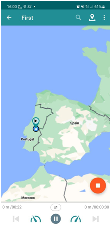
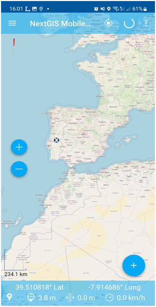

.. _ngmobile_mock_location:

Подключение внешнего источника координат
=============================================

Как использовать стороннее приложение в качестве источника координат для текущего местоположения устройства. Для чего может быть нужно:

1. Использование внешнего источника координат. Нужно подключить внешнюю GPS/GLONASS антенну или другое устройство улучшающее прием координат.
2. Разработка приложений. Внешнего источника координат нет, но вам нужно имитировать локацию для отладки тех или иных функций своих приложений.

Это инструкция описывает одну из возможных конфигураций. У вас могут быть другие приложения и настройки, но схема подключения остается та же.

1. Включите устройство - источник координат.
2. Подключитесь к нему, например по Bluetooth (подключение зависит от типа устройства).
3. Установите и настройте приложение для подмены координат, для Android такие ищутся по "Bluetooth GPS provider"
4. Разрешите в настройках телефона фиктивные источники координат (Mock location).
5. Включите режим трансляции координат в приложении для подмены координат
6. Используйте любое привычное ПО для работы.

**Рассмотрим конкретный рабочий сценарий**

Установите приложение для подмены координаты. Например, `Bluetooth GNSS <https://play.google.com/store/apps/details?id=com.clearevo.bluetooth_gnss&hl=en>`_ или `Lokito <https://lockito-app.com/>`_.

Включите режим разработчика на своем смартфоне.
Для этого нажмите **7** раз на **номер сборки** (Раздел Об устройстве).

   
   Включение режима разработчика

В настройках Режима разработчика выберите приложение для подмены координат, установленное в пункте 1.

   
   Открытие настроек режима разработчика

   
   Выбор внешнего приложения-источника координат

Включите приложение для подмены координат.
Создайте первую подмену, назовите ее.

   
   Создание подмены координат

Выберите точку на карте (или воспользуйтесь текущим), нажмите иконку Play.

   
   Выбор точки на карте

   
   Симуляция запущена

С этого момента ваш смартфон принимает координаты вашего текущего местоположения от запущенного приложения. Запустите NextGIS Mobile, чтобы в этом убедиться.

   
   Координаты из внешнего источника в NextGIS Mobile
